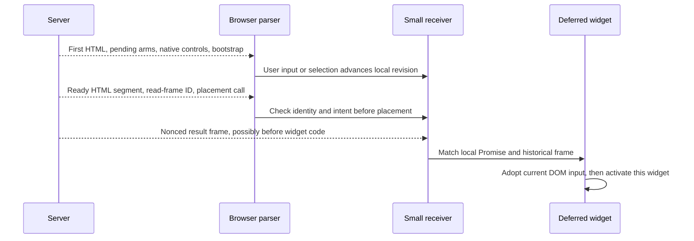

# RFC: Async Signals Across Streaming SSR and Hydration in Octane

Status: accepted September 11 design; implementation is tracked in the
[acceptance checklist](./async-signals-implementation.md). The integrated RFC
remains in scope. Trusted Types implementation/enforcement tests are excluded;
the future-integration discussion remains below.

## Accepted author model

- `signal$(initial)` is writable state, including function-valued data.
  `derived$(compute)` is read-only sync, Promise, or async-iterable computation.
  `query$(select, load)` is a read-only keyed source. No writable-derived
  override behavior is introduced; existing scoped/hook APIs remain compatible.
- `createScope` is optional. Global/module declarations are valid; server cells
  are request-isolated, browser cells are document-owned, and local declarations
  have stable instance identity. The compiler supplies serializable IDs.
  Explicit keys and host prepare/adopt integrations below are optional.
- Direct `value={draft$}` uses branded writable capability for native two-way
  binding. Read-only handles and `value={draft$.get()}` are one-way, without
  setting HTML `readOnly`. Text, attributes, and per-property styles (including
  spreads) subscribe directly; custom component props retain handles.
- Pre-flush bootstrap initializes live browser cells. Early native listeners
  update them and advance edit revisions, including clear. Delayed SSR/storage
  candidates cannot overwrite newer edits. Handoff preserves node/focus/caret/
  selection/IME without a duplicate write.
- Explicit independent activation fails with a targeted diagnostic if extraction
  cannot preserve ownership/captures. Lexical nesting alone is not a dependency;
  a parent-created lifecycle resource is. Ordinary parent-first hydration stays.
- Replaceable selection intents retain the latest selection. Distinct actions
  deliver once each unless explicitly deduplicated. Immediate feedback requires
  a proven descriptor/eager handler; queued events cannot restore user activation.
- Server-owned HTML with behavior-only activation is a first-class target.
  Global signals, initial SSR values, async/streamed results, early controls, and
  document lifetime must work without importing or starting the client renderer.
  `createScope` is optional here too; a native island is a separate opt-in.

### Renderer-free hosts and early delivery

A lightweight host can keep its existing server-owned shell, streamed regions,
and ordinary browser controllers. Adopting this RFC must not require converting
those regions into reconciled roots, importing `octane/internal/client`, or
fetching the full runtime through a shared bootstrap chunk. A signals-only export
passing tree-shaking is insufficient: test the **compiled author module**, actual
split production graph, and fetched/evaluated assets before and after activation.

The early path has two deliberately separate costs:

- `earlySignalBootstrapScript({ nonce })` from `octane/server` emits the existing
  inline input/result capture without importing any client module. An envelope
  owner places it before exposing bound controls or result frames and passes
  `earlySignalBootstrap: 'external'` to its fragment renderers to omit duplicates.
  `independentHydration: true` additionally captures independent-island intent.
  The host remains responsible for arranging that parser order and CSP policy.
- Live `get`, `set`, subscriptions, derivations, and async computations require
  the renderer-free signal engine. A host needing synchronous reactive behavior
  before an island or interaction delivers that engine and the required small
  handler early. The tiny capture script alone is **not** a complete reactive
  runtime. Report both byte costs and the time each becomes usable. All later
  consumers must share the same engine/owner, not separately bundled copies.

Before evaluating behavior modules that read state, the host upgrades the early
mailboxes with `bootstrapStreamedSignalHydration` from
`octane/hydration/streamed-signals`, supplying its build/document identity and the
initial response's `initialSignals` manifest. This does not require app-core's
private document envelope or `hydrateRoot`. Initial document seeds initialize
unread live state once; a conflicting or late installation fails clearly. Early
user edits win over those seeds. Instance read frames and later cached/streamed
historical frames remain presentation evidence, never unconditional live writes.

For server-owned native controls, `bindSignalControl(control, 'value', draft$)`
joins the same writable cell without reconciling its HTML; `checked` and readonly
handles follow their capability. This is an optional host adapter, not a new
author state model: templates still use `value={draft$}`. The adapter's cleanup
ends its property/listener ownership before a host replaces that range or an
optional native island takes ownership. Controllers and behavior roots may be
installed early; deferring their code does not magically provide synchronous
navigation cancellation or trusted user activation.

Integration should replace the host's bespoke state carrier, early-control
handoff, and stream receiver where these primitives cover the same responsibility,
not mirror state through old and new stores. Storage keys, draft recovery policy,
authentication, cache freshness, URL actions, and accepted server-operation
receipts stay application-owned. A never-hydrated transcript may remain opaque
server HTML plus compact control/cursor state; it need not serialize its entire
body merely to manufacture an unused component hydration frame.

## Conversation switching, cache, and server work

`currentConversation$` and per-conversation `draft$` are writable client intent;
`conversation$` is a read-only query and `title$` a read-only derivation.
Switching A to B may immediately display eligible cached B while fetching
progressive SSR HTML/data. Fresh server revisions reconcile by stable item IDs,
without duplicating history or resetting the composer. The host owns cache,
authority, source revisions, and supersession policy.

Client selection generation authorizes presentation; server content revision
proves freshness; attempt/sequence orders transport; the historical frame explains
the exact displayed HTML. Arrival order is not freshness. A to B to A creates a
new selection generation. Cached revision-10 HTML uses its revision-10 frame even
if the live graph has advanced to revision 11.

Dormant regions retain early input and native focus; validated placement preserves
them. After native activation the renderer alone owns its DOM range; behavior-only
activation leaves the host in charge of structure and claims only explicit
properties/listeners. Data updates need
not re-SSR each yield; neither full reload nor whole-conversation remount is
required. Leaving a view ends its subscription, not accepted server generation.
The host owns completion, timeout, explicit Stop, durable receipts, and reconnect.
Uncertain actions retain their original operation ID and selection, without
automatic duplicate submission.

## Motivation and relation to Octane today

Hybrid SSR lets a page paint useful HTML and accept native input while optional requests or browser modules remain pending. Octane already has pieces: a renderer-independent [scoped signal engine](https://github.com/octanejs/octane/blob/main/docs/signals.md), native TSRX reads, first accepted [streaming pending boundaries](https://github.com/octanejs/octane), and [deferred hydration](https://github.com/octanejs/octane/blob/main/docs/deferred-hydration.md). Today an application still assembles owner lifetime, independent HTML/data delivery, early intent, and safe adoption. This RFC makes those pieces one author model, with explicit guarantees under concurrent input and transport failure.

The extension builds on four existing contracts:

- **Signals:** `createScope`, writable `signal$`, synchronous `derived$`, `asyncSignal$`/keyed `query` resources, `get`/`latest`/`snapshot`, and historical seed leases.
    - **Proposed:** A direct owner-bound author facade, unified sync/async/iterable computed signals, `query$` selection, and attempt-bound reads after `await`.
- **Native reads:** TSRX subscriptions and Strong-mode diagnostics, with explicit scopes for non-renderer hosts.
    - **Proposed:** Proven compiler lowering of asynchronous producer reads, graph interning across islands, and commit/version checks spanning late reads.
- **Deferred hydration:** `<Hydrate>` splits generated client code and captures/replays interactions; `attachBehaviorRoot` attaches behavior to externally owned DOM.
    - **Proposed:** Independently activated SSR widgets whose browser modules/styles remain cold until needed, with a historical read-frame lease per widget.
- **SSR stream:** `renderToReadableStream` emits pending boundaries and accepted HTML, with nonce-aware inline swap scripts and an ordered `injection` source for complete external chunks.
    - **Proposed:** Correlated result frames, early-intent-aware placement, and progressive fetched-region delivery with backpressure and recovery.

The [original signals RFC](https://github.com/octanejs/RFCs/discussions/2) made `createScope({ scopeKey })` explicit because a data producer may outlive a view. That lifetime still matters when two widgets share a query and one unmounts.

- In an Octane document, the request or retained document already supplies an owner. Normal renderer and behavior-only code can declare signals without repeating `scope`. The lower-level engine still exposes `createScope` for deliberately independent lifetimes.
- A boundary leases a historical read frame; it does not necessarily create another data owner. Account transition, document retirement, or an independent feature lifetime retires the relevant owner and work.
- Module-level declarations are valid without an active request. Server reads/writes require the corresponding request owner; there is no process-global mutable fallback. Explicit standalone scopes remain supported.

This proposal adds capabilities beyond the upstream mainline inspected for this revision:

- Native reads are enabled through imports from `octane/signals`, `octane/signals/client`, or `octane/signals/server`. The `$` naming convention identifies capabilities but does not itself opt a module in; the old `nativeReads` compiler option is gone.
- Existing derived callbacks are synchronous; `scope.isPending(() => handle$.get())` includes initial suspension; `latest` carries complete-result provenance. The async producer and direct author facade are **additions**, not reinterpretations.
- Compiler support after `await` must preserve Strong-mode read diagnostics, including opaque/imported helpers.

## Proposed author experience

An author declares state, reads, and pending boundaries. A value may be immediately available, arrive from a Promise, or update from an async iterable; consumers use the same `get()` and `snapshot()` contract. A keyed `query$` adds request selection, deduplication, and refetch. An action owns writes and their uncertain acknowledgments. The API in this section is **proposed**, except where the existing Octane API is identified below.

```typescript
// todos.tsrx — proposed compiler-owned author module.
"use strong";
module server {
  import type { ServerCallContext } from "octane/server";
  import { readTodo, readPreview, saveTodo } from "./store.server";

  export async function getTodo(id: string, context: ServerCallContext) {
    return readTodo(id, { signal: context.signal, viewer: context.viewer });
  }
  export async function getPreview(id: string, context: ServerCallContext) {
    return readPreview(id, { signal: context.signal, viewer: context.viewer });
  }
  export async function updateTodo(input: { id: string; text: string; operationId: string },
    context: ServerCallContext) {
    return saveTodo(input, { viewer: context.viewer }); // Authoritative Todo + revision.
  }
}

import { getTodo, getPreview, updateTodo } from "server";
import { signal$, derived$, query$, optimistic$, action$ } from "octane/signals";
import { isAmbiguousTransportFailure } from "./errors";

export function createTodos(initialId: string) {
  const selectedId$ = signal$("selected-id", initialId);
  const draft$ = signal$("draft", "");
  const todo$ = query$("todo", () => selectedId$.get(),
    (id: string, { signal }) => getTodo(id, { signal }));
  const heading$ = derived$("heading", () => todo$.get().title);
  const preview$ = derived$("preview", async ({ signal }) => {
    const id = todo$.get().id;
    const preview = await getPreview(id, { signal });
    return { ...preview, selectedId: selectedId$.get() }; // Tracked after await.
  });
  const visibleTodo$ = optimistic$(todo$);

  const save = action$("todo.save", async (op) => {
    const id = selectedId$.get();
    const text = draft$.get();
    const base = todo$.snapshot();
    if (base.status !== "ready" || base.value.id !== id)
      throw new Error("The selected Todo is not ready");
    visibleTodo$.set((todo) => ({ ...todo, title: text }));
    try {
      const authoritative = await updateTodo({ id, text, operationId: op.id });
      op.adopt(authoritative); // Includes selected id and committed revision.
    } catch (error) {
      if (isAmbiguousTransportFailure(error)) return op.uncertain();
      throw error;
    }
  });

  return { selectedId$, draft$, todo$, heading$, preview$, visibleTodo$, save };
}
```

The author API separates writable state from read-only computation:

- **`signal$(initial)`** is writable state; functions are data. Existing setter updater semantics remain: `set(() => fn)` stores a function. **`derived$(compute)`** is read-only and returns `T`, `Promise<T>`, or `AsyncIterable<T>`. Synchronous computation stays immediate, without an unconditional Promise or microtask. Explicit keyed forms are supported but not required.
- **`query$(select, load)`**, with an optional explicit key, is read-only. Its synchronous tracked selector must succeed before `load(selected, { signal, previous })` starts. Pending or failed upstream reads propagate without starting the downstream loader. A dedicated `skip` sentinel means no selection; `undefined` remains a valid encoded key.
- **Streaming and identity.** A stream loader opts in with `{ kind: "stream" }`, publishes complete yields, then terminates. Keys are stable within a feature instance; canonical argument encoding distinguishes selections. Neither a key nor browser-supplied arguments grant authority.

Reads and controls keep their existing strict semantics:

- `get()` returns a ready value, suspends an initial pending read in a rendering boundary, or throws a source error. `snapshot()` names idle, pending, ready, refreshing, partial stream, complete, and error states.
- `latest(fallback)` retains one **whole previous successful calculation with its owner and request provenance**, never old fields mixed with new controls. `refetch()` starts a quiet same-selection attempt when a usable result exists; `reset()` deliberately asks for pending presentation. A renderer error-boundary reset is separate.
- The shipped `scope.isPending(() => handle$.get())` reports an initial strict pending read as pending. This proposal preserves that behavior; it does not redefine `isPending` as “only a transition is pending.”

For example, `snapshot()` returns:

- `{ status: "pending" }` before the first value; `{ status: "idle" }` when no key is selected; or `{ status: "error", error }` on failure.
- `{ status: "ready", value, refreshing: true }` during a quiet refetch; `{ status: "ready", value, complete: false }` after a stream yield; and `{ status: "ready", value, complete: true }` after normal completion. A one-shot Promise result is ready and complete.

The ready value exists while a stream remains open. `latest()` may return a previous completed calculation during a changed-key pending state, but strict `get()` still suspends there.

The identities used below are distinct:

- **Owner:** data lifetime tied to a server request or retained browser document.
- **Selection:** query key plus encoded arguments.
- **Attempt:** one revocable execution of that selection.
- **Read frame:** exact values presented by one HTML range. A widget leases its read frame during adoption, independently of current live signal values.

Templates use ordinary pending and error arms; the graph is created under a stable owner, not during a speculative render. The example keeps a native input in the first HTML so typing need not await the widget's JavaScript.

```typescript
// todo-widget.tsrx — server-rendered, independently activated on the browser.
"use strong";
"use octane";
import { createTodos } from "./todos";

export function TodoWidget({ todos }: { todos: ReturnType<typeof createTodos> }) @{
  <section>
    <textarea value={todos.draft$} />
    @try {
      <>
        <h2>{todos.heading$.get()}</h2>
        <button type="button" onClick={() => todos.save()}>Save</button>
      </>
    } @pending {
      <p role="status">Loading Todo…</p>
    } @catch (error, reset) {
      <button type="button" onClick={() => { todos.todo$.reset(); reset(); }}>
        Retry
      </button>
    }
    @try {
      <p>{todos.preview$.get().summary}</p>
    } @pending {
      <p role="status">Loading preview…</p>
    } @catch (_error) {
      <p>Preview unavailable.</p>
    }
  </section>
}
```

The host authorizes a private document **before emitting private bytes**. It creates one graph per request/document owner; the renderer emits a useful frame and streams independently ready regions. The early receiver initializes the live cells before widget code; the widget later joins them. The explicit `prepare`/`adopt.input` example below is an optional host integration, not required normal authoring. Direct bindings generate equivalent descriptors.

```typescript
// Server host.
import { renderDocument } from "octane/server";
import { createTodos } from "./todos";
import { TodoWidget } from "./todo-widget";

export async function handle(request: Request) {
  const viewer = await authorize(request);
  const initialId = validateId(new URL(request.url).searchParams.get("id"));
  return renderDocument(request, {
    prepare: () => ({
      component: TodoWidget,
      instanceKey: "todos.main",
      props: { todos: createTodos(initialId) },
      bootstrap: { initialId }, // Public to this viewer; never a credential.
    }),
    nonce: cspNonce(request),
    headers: privateResponseHeaders(viewer),
  });
}
```

```typescript
// Deferred browser entry for the Todo widget.
import { hydrateIsland } from "octane/client/island";
import { createTodos } from "./todos";
import { TodoWidget } from "./todo-widget";

hydrateIsland("todos.main", {
  prepare: ({ initialId }, adopt) => {
    const todos = createTodos(initialId);
    adopt.input("draft", todos.draft$); // DOM value, revision, caret, IME handoff.
    return { component: TodoWidget, props: { todos } };
  },
});
```

The compiler and receiver split rendering from activation:

- The compiler records a widget's module and style dependencies in a manifest. The server evaluates `TodoWidget` for HTML and marks its SSR range `todos.main`; the browser targets that exact component and range without evaluating the module until activation.
- The tiny document receiver runs before streamed placement. It can record input and discrete intent without importing the widget. It validates instance and bootstrap arguments, interns one graph per document/account/instance/version, and adopts the **presented read frame** for each rendered region. Two islands using `todos.main` share a graph but keep separate presentation leases; a conflicting second bootstrap is an error.
- HTML, serialized model, read frame, and code share a compatible version envelope. Activation is independent: interacting with one widget should not evaluate parent or sibling browser modules merely to attach it.

Direct writable bindings perform an atomic handoff; explicit `adopt.input("draft", todos.draft$)` follows the same contract:

- The server emits a compiler-owned binding identity. Early listeners already publish edits into the live cell. Before queued handlers run, handoff validates current DOM value/revision, installs the full binding, and retires the early listener without a duplicate write. It preserves node, focus, caret, and composition.
- A queued Save therefore sees what the user typed, rather than the factory's empty initial value. Save only renders in a ready arm and rechecks the selected authoritative base at dispatch. A pending base cannot become an optimistic Todo. Other early actions need a tiny explicit descriptor and their own receipt policy.

These samples describe a destination API; they cannot be copied into today's Octane unchanged. The server-function boundary works as follows:

- The proposed compiler erases the trusted final `ServerCallContext` from the browser type and stub, injects it on the server, and treats a browser's `{ signal }` as local cancellation options, never a serialized credential. For example, server `getTodo(id, context: ServerCallContext)` becomes browser `getTodo(id, options?: { signal?: AbortSignal })`.
- An in-process SSR `from "server"` call needs the same generated wrapper: its `{ signal }` remains a local option and only trusted request context becomes `ServerCallContext`. Current compilation binds that import directly, so this lowering is core work.
- Existing `module server` compilation lacks this context overload; ordinary arguments and results use devalue, and its RPC request-body limit is separate from a streamed response budget. This proposal has no `"use server"` directive: `module server` defines the boundary, and the host authorizes every call. Without server functions, a site can still use the signal graph and render protocol with host loaders.

### A dependent request and a URL action

Read dependencies are ordinary JavaScript reads. If a second request needs the first result, express the dependency; independent siblings should start without waiting for it.

```typescript
const user$ = query$("user", () => sessionId$.get(), loadUser);
const items$ = query$("items", () => user$.get().id, loadItems);
const help$ = query$("help", () => locale$.get(), loadHelp); // Independent sibling.
```

A host can accept an initial URL action such as `?q=<text>`:

- Validate and authorize it, assign a stable operation ID, and perform required prerequisites on the server. Dispatch the action **once outside speculative rendering** while unrelated reads start in parallel.
- Acceptance, subsequent output, and HTML can stream independently. The browser adopts the receipt; hydration never replays the URL action.
- Reconcile a lost acknowledgement by operation ID rather than guessing from a canceled fetch. This needs neither a Promise as an RPC argument nor an implicit mutation during render.

### Actions and optimistic acknowledgment

Optimistic writes are pinned to the owner and selected query key at their first tentative write:

- The projection observes a read-only source. A network action has a stable operation ID. Purely local same-turn writes may batch, but unrelated POSTs do not share an implicit transaction.
- Definitive rejection removes only that operation's overlay. Definitive success adopts an authoritative response or waits until the pinned source covers the write. An uncertain outcome retains its intent and ID for explicit reconciliation.
- A refetch for another selection cannot move an old overlay there. The host provides idempotency and durable receipts when reload or offline continuity matters.

If added, `op.until(() => source$.get())` has a narrow contract:

- It checks a synchronous predicate against **pinned authority without its own overlay**, immediately and after each authority update, and stops on timeout, retirement, or a definitive response. A tentative value cannot confirm itself.
- The compiler may bind provably local optimistic `set` calls to `op` across `await`; opaque helpers take `op` explicitly. Read computations can restart; dependency changes alone never retry a write.

This draws from [Solid's actions and optimistic proposal](https://github.com/solidjs/solid/blob/next/documentation/solid-2.0/06-actions-optimistic.md), with explicit operation identity for uncertain network writes. It does not assume `until` has shipped in Solid.

## Hybrid SSR: ordinary recursive phases

The page is a dependency graph, not a fixed shell followed by a fixed set of slots:

```text
Fast data → user data → first list page → older pages
Help data (independent sibling)
```

Ordinary `@try/@pending/@catch` arms describe what paints now and what replaces it when a read settles:

- The first phase may be static, cached, quickly fetched, or pending. Children can remain pending after parents resolve; an independent sibling can finish first. There is no special cached-shell component, `Slot` type, or maximum phase count.
- A dependent query waits for its selected key. The renderer adds no barrier between independent ready regions.
- A server may SSR a full list or conversation newest-to-oldest while the source protocol requests independently available older pages. Explicitly opaque HTML with a compact control model need not duplicate its entire body as serialized data.
- Native hydration instead requires enough state to reproduce **every tracked read** that rendered its range; otherwise HTML and hydrated values would diverge.

Cache hits and misses keep the **same component and boundary semantics**. Cacheability is host policy, not an author-facing phase:

- A host may cache eligible source data or invariant compiled template work by build, route, variant, authority, and source revision. Shared HTML cannot contain private values, a previous document ID, CSP nonce, or another request's result frame.
- Rebinding segment IDs and style ownership in cached rendered HTML needs separate proof. Initially, the host may cache inputs/templates and render a cheap request-specific frame.
- When a feature is off, its optional code must leave the eager import closure as well as the conditional HTML. Deferred CSS must be reachable before a late reveal. Atomic CSS reduces duplication, but does not remove ordering, transfer, or missing-style risk.

## One request, two complementary streams

One navigation carries two logical streams:

- **HTML** controls visibility; **resource frames** update browser signal values. A JavaScript Promise does not cross the wire.
- The server evaluates under its owner and keys frames by document, owner, feature instance, node, selected query arguments, attempt, build/protocol version, and sequence. The browser creates a *local* pending Promise for that selection. A small receiver can buffer a server result before the island graph exists, then settle its local Promise when the island joins; first adoption avoids a duplicate browser fetch.
- A later selection, refetch, or reset uses the compiled server-function stub or host loader. An `AsyncIterable` emits zero or more complete value frames and a terminal frame; each accepted yield updates the live signal. A one-shot Promise settles once.

```text
document d, instance todos.main, query todo("42"), attempt 1
open(1, "promise")
value(2, { id: "42", title: "Draft" })
complete(3)

boundary todo, presented selection "42", revision 1
HTML segment + matching read-frame identity + placement instruction
```

The example abbreviates a versioned tagged codec, not raw object interpolation into a script:

- The receiver checks identity and sequence, accepts each complete frame once, and turns a malformed, missing-terminal, cross-owner, or incompatible stream into a recoverable error. It never exposes an exception stack as a public error value.
- The codec accepts defined JSON-shaped values plus explicit `undefined` and negative zero, with canonical plain-object keys. Unsupported prototypes, cycles, functions, DOM nodes, and accessors fail. Host validation and authorization still govern request arguments and private results.

**Wire mechanism.** A bootstrap runs before any placement or result script. A CSP-nonced inline result call to a tiny `resolveFrame(encodedFrame)` receiver writes a frame to the browser's local mailbox or resolves its waiting Promise.

- Encoding escapes script termination, HTML-sensitive characters, and the surrounding JavaScript context; data is never evaluated as source. This extends Octane's inline placement script with an independent result channel.
- Inert JSON data tags plus an observer are an alternative where policy forbids executable result scripts, at a scanning and queueing cost. The proposal favors the inline resolver **if** strict CSP and measured parser/byte behavior support it; either transport preserves the author API.
- Bootstrap order prevents a first frame from being lost. A bounded mailbox and per-channel deadline keep an unactivated island from retaining unbounded data.

**Trusted Types compatibility (future integration; implementation/enforcement tests excluded from this PR).** This is renderer/CSP work, separate from the async-signal author API:

- Browser parsing of response bytes is not a client DOM injection sink. Octane's streamed boundary swap, compiled templates, hydration raw-HTML path, and dynamic script URLs are. Under [Trusted Types](https://developer.mozilla.org/en-US/docs/Web/API/Trusted_Types_API) enforcement, the core needs narrowly named, allowlisted policies for its generated markup and approved URLs, created once per realm.
- Applications own sanitation of authored raw HTML. The result codec must still escape HTML and script delimiters, and server HTML injection still needs trusted provenance and escaping; Trusted Types does not sanitize response bytes. A CSP nonce allows an inline script to execute but does not satisfy a Trusted Types sink.
- Verify report-only then enforced `require-trusted-types-for 'script'` without a permissive default policy, including table/SVG boundary placement, hydration, and deferred activation. Policy-free `trusted-types 'none'` is outside initial scope.

```typescript
// Generated into the HTML stream; not application-authored markup.
emitNoncedInlineScript(nonce, call("__octane.resolveFrame", encodeForScript(frame)));
// The emitted inline call runs as the parser encounters its result chunk.
```

```typescript
// Illustrative receiver internals, not a public author API.
const firstValue = receiver.expect(documentId, instanceKey, queryKey, attempt);
// The generated inline call accepts a complete matching frame and settles
// this browser-local Promise; the server Promise was never serialized.
const value = await firstValue;
```

The initial navigation interleaves two kinds of chunks on one HTTP response:

- Octane's `injection` source can emit complete result scripts **after the shell** in push order, holding the document tail until injection ends. HTML placement and data settlement remain logically independent.
- A later browser-initiated region fetch uses a separate HTTP response with the same identity, sequence, and recovery rules. It should reveal accepted chunks progressively rather than wait for the whole body.
- Nonce support and backpressure exist in the renderer today. Frame production, independent result adoption, and intent guards are additions.

Placement and data adoption can happen in either order:

- The renderer emits a fallback and a resolved segment with its own presented read frame. The parser may place that segment before the feature bundle evaluates. **Before changing the DOM**, placement checks document/owner/selection revision and required styles. A late Todo 42 segment cannot replace the user's new Todo 43 selection.
- The historical frame lets hydration read what produced the placed HTML while the live graph advances. A pending or error arm without a complete serializable seed recovers within its owned range. The renderer validates dependencies before committing a segment and releases provisional subscriptions on abandonment without disposing committed ones.
- Later stream values update live subscribers; server HTML does not replace the region on every yield. A separately fetched region follows the same identity and stream rules, with progressive placement rather than whole-response buffering.



Flow control covers the **entire** path:

- When an output queue reaches its high-water mark, the producer pauses `iterator.next()`; the renderer waits for writable pressure before emitting accepted HTML or data. The client bounds frames awaiting code and reports overflow.
- Abrupt close, abort, throw, timeout, and connection loss terminate affected channels exactly once. There is no universal 1 MiB cap: a deliberately large stream needs an explicit resource policy, a tested memory bound, and suitable paging/checkpoints.
- Large responses must avoid quadratic callbacks, repeated unchanged CSS/head serialization, and per-wave allocation spikes. An independent ready channel must reach the parser even while its sibling is slow.

## Early interaction and independent hydration

Before hydration, the DOM carries text, focus, caret, selection, and IME composition:

- A small receiver starts before streamed placement, records an edit revision for **every** input including clear, and observes selection and discrete intent. An IndexedDB or other restoration candidate applies only under the same owner and unchanged revision; a late read cannot overwrite a new edit.
- At handoff, the island reads the actual DOM value and revision, installs subscriptions, checks the revision again, and retires the early listener. It preserves the node and does not synthesize an input event.
- The server's historical frame explains the HTML; it never rewinds the live draft.

Octane has useful starting points, but independent activation needs more proof:

- Octane's [deferred hydration](https://github.com/octanejs/octane/blob/main/docs/deferred-hydration.md) provides `<Hydrate>` interaction capture and replay. Initialize it with `initializeHydrationEventCapture()` before `hydrateRoot`. `attachBehaviorRoot` attaches behavior to externally owned DOM.
- Existing `<Hydrate>` activates parent-first and keeps a persistent wrapper. It does not establish that a nested SSR widget can activate without evaluating a parent or sibling module. The [independent static-shell/island plan](https://github.com/octanejs/octane/blob/main/docs/hydration-islands-plan.md) remains a plan.
- Compiler and bundler must prove stable widget IDs and hook seeds, an immutable SSR range, serializable captures, lazy module evaluation, reachable CSS, and a local recovery boundary. A widget may contain many components, but activates as one independently owned unit.
- `<Hydrate independent ...>` explicitly requests that proof. Ordinary
  `<Hydrate>` retains parent-first behavior; a split or dynamic import alone does
  not opt in. Unsupported independent extraction is a compile-time error.
- A recent [compiler change](https://github.com/octanejs/octane/pull/1050) preserves `import defer` syntax. Actual lazy evaluation still depends on the loader and bundler; verify it with an executable example.

The receiver hands off an event only to its matching widget:

- An event contract maps the HTML target to a stable handler, owner, and widget. The receiver queues supported discrete intent, prioritizes **that widget's** code, and delivers it once if target, owner, and selection still match.
- The behavior-root path can retain the original `Event` in the same document while deferred. Queued replay cannot restore expired transient user activation. Handlers needing synchronous `preventDefault`, navigation policy, or trusted activation must be available early; native links and text keep native behavior.
- A compiler-proven tiny descriptor may perform simple local selection or essential action before the widget loads; arbitrary closures cannot. The host dispatches a URL action rather than reconstructing one from queued events.
- Measure first-click delay on a real slow connection. Use selective prefetch or a tiny eager handler if an urgent import is too slow. Optional controllers and transitive code remain unevaluated until needed.

After activation, a signal changing one attribute or style property should update its owned DOM slot without component-wide reconciliation or a duplicated stylesheet:

- Build on [fixed-key style lowering](https://github.com/octanejs/octane/pull/1051), preserving scalar fast paths. [Direct signal style binding](https://github.com/octanejs/octane/issues/1049), including `style={{ ...props.style, left: left$ }}`, is in scope along with text, attributes, and writable native controls.
- Any direct-binding syntax must preserve static CSS extraction, specificity/order, cleanup, and hydration ownership. `universalHostBinding` is opt-in for host properties, not proof of general native DOM binding.

## Core and signals work

The public author API should stay small because these are integrated runtime responsibilities rather than feature-specific adapters:

1. **Owned unified graph.** Add writable `signal$` and async-capable read-only `derived$` with a sync fast path and stream completion state; add `query$`'s tracked synchronous selector, canonical selection, sharing, `skip`, `refetch`, and `reset`. Preserve current strict `get`, initial `isPending`, whole-result `latest`, snapshots, cross-scope provenance, and disposal. The document/instance owner can be implicit for native renderer authors while explicit `createScope` remains for standalone clients.
2. **Attempt-bound continuations.** After `await`, ordinary JavaScript no longer has the synchronous active-node stack.
    - Each attempt gets a revocable `read(handle)`. It records dependency versions and awaits a pending value without rejecting the outer producer Promise. Before publishing a result or yield, it checks versions and aborts/restarts an obsolete idempotent read.
    - The compiler may lower proven `get()` calls, including those after `await`, to that reader. Ready dependencies keep the synchronous path.
    - Unsupported escapes, dynamic aliases, and opaque imported helpers use explicit `read` with clear diagnostics. There is no ambient async context or blanket Promise instrumentation. Uncompiled raw `get()` after `await` is outside the implicit contract.
    - Strong mode can prove local call graphs; it does not make every imported or effectful helper pure. Generic effects with post-`await` reads need their own analysis and lifecycle, not accidental render tracking.
3. **Render and transport identity.** Intern prepared graphs by document/account/feature instance/build, with exact bootstrap validation and deterministic repeated-instance paths. Carry selected arguments, attempt, owner, codec/protocol version, and presented read-frame revision across data and HTML. A boundary owns its historical lease, while the live graph may advance. Reveal requires a matching identity and styles; commit revalidates reads. Missing or incompatible channels recover inside their widget rather than cross-pairing by traversal order.
4. **Actions and server functions.** An optimistic projection observes authority; an action pins operation/selection/owner, distinguishes definitive and uncertain outcomes, and never restarts a write because a read invalidated. Server-function compilation separates serializable arguments and browser-local cancellation options from the trusted server-injected context. Each invocation reauthorizes, even when transported in a batch.
5. **Independent delivery and activation.** Emit HTML and result frames independently, apply backpressure, install a minimal early receiver before placement, preserve native input and once-only intent, and activate only the interacted widget. Compiler and bundler must prove independent module evaluation, capture and style reachability; a dynamic import textually present in source is insufficient. Keep signals-only imports free of the DOM renderer. Runtime binding updates targeted DOM properties without broad rerendering.

This division is intentional: the signal graph owns reads and attempts; the renderer owns placement and historical presentation; actions own write receipts; the host owns authorization and cache policy. It keeps both renderer code and a small standalone presenter viable. Core changes should deepen these owners rather than add a second app-specific session manager.

### Batching without a slow-result barrier

Calling two server functions need not force two connection setups or a slowest-member await. An optional transport coalescer groups compatible calls by endpoint, authority, account/document version, priority, and cancellation policy, with a bounded coalescing window. The server establishes shared request context, **authorizes each member**, starts independent eligible work, and emits each member's result as soon as it is ready:

```typescript
const detail = getTodo("42");
const preferences = getPreferences();
show(await detail); // Independent of preferences settling.
```

```text
request: batch { detail: getTodo("42"), preferences: getPreferences() }
response: detail value + complete
response: preferences value + complete (possibly much later)
```

Batching does not erase dependencies or write semantics:

- A genuine dependency stays ordered inside a server function or tracked query. A write joins unrelated speculative reads only with explicit order, idempotency, and cancellation.
- A slow channel cannot buffer every other result; a never-ending one has a deadline and independent terminal outcome. Canceling one member cannot abort another.
- [Cap'n Web](https://github.com/cloudflare/capnweb) demonstrates batching and pipelined RPC. This initial protocol coalesces calls and streams independent results; it does **not** serialize unresolved browser Promises as RPC arguments. Pipelining would need its own authority and dependency rules.
- Fewer requests alone do not prove a faster useful result; measure both.

The initial executable transport uses
`batchServerCalls({ kind: "independent-reads", authority, document }, callback)`.
Only finite contextual calls made synchronously inside that callback coalesce,
up to 32 per request. Nested scopes, different documents, explicit per-call
budgets, and calls after an `await` do not silently join another group. The keys
are local compatibility labels, never server credentials. Each server member
crosses ordinary authorization with its own request state and deadline.
Multi-yield subscriptions stay on separate demand-driven requests; joining one
to a finite batch fails without replay. Canceling a dispatched finite member
detaches that caller, not its siblings or accepted server work. Mutations remain
outside this read-only batching opt-in, with explicit host operation receipts.

## Caching, paging, and performance

A source may return the first page and a real continuation token. The first request uses `null`; only a completed page advances using `nextBefore` from that page. A new query key selects the next page. The renderer can stream the newest completed HTML while older pages arrive, preserving stable item IDs and order. A partial stream value and a complete page are different states; an interrupted stream cannot invent a next cursor or silently mark a page complete. Opaque server HTML may carry a compact control model and cursor, whereas a natively hydrated list must include the read data used by its template. Choose between those modes explicitly to avoid doubling large content.

```typescript
import { signal$, derived$, query$ } from "octane/signals";
import type { Todo } from "./model";
type Page<T> = { items: T[]; nextBefore: string | null };
type SavedPage<T> = { before: string | null; items: T[] };
declare function fetchPage(before: string | null, options: { signal: AbortSignal }): Promise<Page<Todo>>;
declare function dedupeById(items: Todo[]): Todo[]; // Keep the first occurrence in page order.
export function createPagedTodos() { // Called under the document/feature owner.
  const before$ = signal$("before", null as string | null);
  const completedPages$ = signal$("completed-pages", [] as SavedPage<Todo>[]);
  const page$ = query$("items.page", () => before$.get(),
    (before, { signal }) => fetchPage(before, { signal }));
  const visibleItems$ = derived$("visible-items", () => dedupeById([
    ...completedPages$.get().flatMap((page) => page.items),
    ...page$.latest({ items: [], nextBefore: null }).items,
  ]));
  function older() {
    const page = page$.snapshot();
    if (page.status !== "ready" || !page.complete || page.value.nextBefore === null) return;
    const before = before$.get();
    completedPages$.set((pages) => pages.some((entry) => entry.before === before)
      ? pages : [...pages, { before, items: page.value.items }]);
    before$.set(page.value.nextBefore);
  }
  return { visibleItems$, older };
}
```

Caching is host policy at any eligible read or phase:

- Keys account for build, route, locale, authority, variant, source revision, and privacy. Cached data never carries another request's document identity, nonce, or private frame. Storage may supply completed data or a candidate local draft, but never replaces server authorization.
- A miss follows the same pending and hydration path. With the feature off, comparable production manifests must show that optional JS, CSS, and HTML stay out of the eager closure.
- Load styles for a late region **before** reveal. Atomic CSS still needs order and budget accounting.

Measure useful output and total cost under the same route and build conditions:

- Compare cold/warm data, fast/slow independent reads, delayed/no JavaScript, first/later selection, mobile CPU/network, and interrupted streams. Report first byte, first useful region, native input readiness, each result, first handler execution, final hydration, server work, allocations, and transport bytes.
- Report initial HTML (including inline frames), critical CSS, eager JS, deferred JS/CSS, and serialization separately. Moving bytes to another asset does not remove them.
- The upstream [streaming pressure investigation](https://github.com/octanejs/octane/issues/967) and [per-wave work investigation](https://github.com/octanejs/octane/issues/981) motivate scaled tests for accepted-frame loss, exact terminal settlement, callback growth, and CSS/head duplication. Test 32 staggered thenables and a deliberately large stream for bounded work, alongside a normal small page.

The target is faster useful output and interaction at acceptable total cost, not an unmeasured SSR or batching claim.

## Edge case handling

- **Connection loss or moving networks.** A complete ready region remains usable. An incomplete frame is discarded, its channel terminates once, and a new idempotent read may restart from a validated cursor/checkpoint. The original Promise and server iterator do not survive the connection. A write with no authoritative receipt stays uncertain; reconciliation checks its operation ID before any retry.
- **Concurrent early input and hydration.** The current DOM value, edit revision, owner, focus, caret, selection, and IME state outrank a stale server seed or storage result. A late server segment is checked before placement. Handoff is atomic with respect to input events; it never sends an extra write or replays a cleared draft.
- **Navigation, BFCache, and account change.** Persisted pages freeze work and revalidate identity and pending channels on `pageshow`; ordinary navigation retires the document owner. An account or feature-owner change invalidates frames, subscriptions, caches, and optimistic receipts associated with the old authority. A late source that ignores `AbortSignal` is fenced by attempt generation.
- **Deployment and model version change.** HTML, read frame, serialized model, codec, styles, and client code carry a compatible version envelope. A retained document can adopt unchanged content, migrate a supported schema, keep compatible old assets, or re-render an owned widget while preserving recoverable local intent. It must not combine a new handler with incompatible old markup or silently recompute all previously rendered content. A follow-up while older history is streaming starts under the retained compatible owner or an explicitly reconciled upgraded one.
- **Truncation, overflow, and security.** A frame is accepted only when complete and escaped. Unexpected EOF, invalid sequence, unavailable style, mailbox limit, timeout, or stream error leaves coherent content and a retry path. The server sends public error metadata, not raw exceptions; authorization precedes private HTML or data and repeats for later RPCs. Never treat cancellation as proof a mutation was rejected.

## Scope, tradeoffs, and acceptance

This RFC proposes the integrated model, including after-`await` dependency tracking and independently activated islands. Its limits are explicit:

- Live Promises/iterators do not transfer across processes; arbitrary closures do not run before hydration; not every class is serializable; a lost write is not safe to replay.
- An initial implementation may restrict implicit tracking to compiler-proven call graphs and require explicit `read` elsewhere. That is an API contract, not a reason to abandon general async computations.
- A first delivery may cache data/templates instead of shared output HTML and may support a narrow set of early controls while preserving native behavior. These limits need diagnostics and recovery paths.

The acceptance bar is observable:

1. A result arriving before widget code is adopted once, without a duplicate initial fetch. A changed key, refetch, or retry starts exactly its selected attempt; old-owner and ignored-abort results never publish.
2. A dependency first read after `await` is tracked in compiled and explicit-reader paths. On invalidation, no mixed-version result or yield publishes. Synchronous derived reads keep their immediate fast path. Initial `isPending`, whole `latest`, stream `complete`, and cross-owner provenance preserve their established meaning.
3. Fast and independent regions reach the parser before a slow sibling. Each placed HTML segment has its exact historical frame, styles, and selection; a superseded segment fails **before DOM mutation**. Fetched later regions can progress without an await-all barrier.
4. Typing, clearing, selection, composition, and focus before hydration survive storage restore, late HTML, and handoff. A captured discrete event executes once in its matching widget; activating it does not evaluate unrelated widgets. Native link behavior and synchronous activation limits remain explicit.
5. Concurrent optimistic writes remain pinned to their selections. A definitive rejection removes only its overlay; uncertain acknowledgement remains identifiable across reconnect and does not trigger a second POST. A URL action dispatches once, even when its prerequisites and document rendering overlap.
6. A slow batch member does not delay a ready member. Large and aborted streams respect producer/receiver bounds, release a terminal error or completion once, and show no accidental quadratic callbacks or unchanged CSS/head copying.
7. Comparable production builds and browser traces show eager/deferred bytes and import closures, first useful paint, first native input, first-click latency, server work, and result latency. A disabled optional feature emits no feature-specific eager HTML, JS, or CSS; CSS is present before each enabled region reveals.
8. A production behavior-only shell adopts initial SSR state, early edits and
   streamed async results with no renderer import, fetch or evaluation—even after
   behavior activation. Body/history share one authorization prerequisite and
   reveal independently. The host emits the early bootstrap before interactive
   HTML and does not pay duplicate legacy/new state-carrier costs. Measure inline
   capture, live signal/behavior support, later islands, HTML/data, and CSS
   separately; a generic hydration fixture does not establish this acceptance.

## Engineering decisions to verify

1. How much local, imported, and effectful Strong-mode code can the compiler prove safe for implicit post-`await` reads? Which unsupported paths receive an explicit-reader requirement, and how do we explain this boundary to authors without implying ambient async tracking?
2. What is the smallest independent widget manifest and model ABI that proves code, CSS, stable IDs/hook seeds, captures, historical reads, and version compatibility? Which native vs opaque HTML ranges can avoid duplicating large serialized data?
3. Which discrete events and early descriptors justify the receiver's eager bytes? Where must an actual handler run immediately because replay cannot provide synchronous cancellation or trusted activation? What is an acceptable first-click delay on mobile?
4. Should results use nonced inline resolver calls, inert data tags, or a policy-selected pair after measured parser cost and CSP/escaping tests? How are receiver mailbox and large-response budgets negotiated without an arbitrary fixed ceiling?
5. What is the minimum batching/coalescing contract and per-member backpressure policy? When is full pipelined RPC worth adding beyond independent result release?
6. Which cache products are worth supporting first: data, invariant templates, or safely rebased rendered HTML? What host proof covers auth, variants, invalidation, and version changes while keeping one recursive rendering model?
7. Verify that direct DOM bindings compose with fixed-key style lowering, CSS extraction, Strong-mode diagnostics, and independent widget ownership without broad component rerenders.

## Previous considerations

**2026-09-11:** This version separates upstream Octane contracts from proposed additions and treats independent widget activation, post-`await` reads, streamed result transport, and actions as one design target. Earlier alternatives are summarized below.

**2026-09-09:** An earlier design exposed a `scope` argument in every renderer author call and introduced a dedicated cached shell/`Slot` API. The engine still needs precise owner lifetime; normal renderer code can inherit its document/instance owner, and caching remains a policy of ordinary phases. Another draft split `asyncSignal$` and `query` from the author-facing read model and deferred general async computations; the unified model here is a proposal, not an assertion about existing exports.

## References

- [Original Octane signals RFC](https://github.com/octanejs/RFCs/discussions/2), [current signals guide](https://github.com/octanejs/octane/blob/main/docs/signals.md), [deferred hydration](https://github.com/octanejs/octane/blob/main/docs/deferred-hydration.md), and [independent islands plan](https://github.com/octanejs/octane/blob/main/docs/hydration-islands-plan.md).
- [Solid 2 RC discussion](https://github.com/solidjs/solid/discussions/2995), [Solid actions and optimistic RFC](https://github.com/solidjs/solid/blob/next/documentation/solid-2.0/06-actions-optimistic.md), [Angular resource contract](https://angular.dev/guide/signals/resource), [Angular event-dispatch pattern](https://blog.angular.dev/event-dispatch-in-angular-89d868d2351c), and [Cap'n Web](https://github.com/cloudflare/capnweb).
- Relevant Octane changes and investigations: [native import activation](https://github.com/octanejs/octane/pull/1039), [Strong-mode diagnostics](https://github.com/octanejs/octane/issues/1027), [lazy module syntax](https://github.com/octanejs/octane/pull/1050), [style specialization](https://github.com/octanejs/octane/pull/1051), [direct binding design](https://github.com/octanejs/octane/issues/1049), [streaming pressure](https://github.com/octanejs/octane/issues/967), and [per-wave work](https://github.com/octanejs/octane/issues/981).
