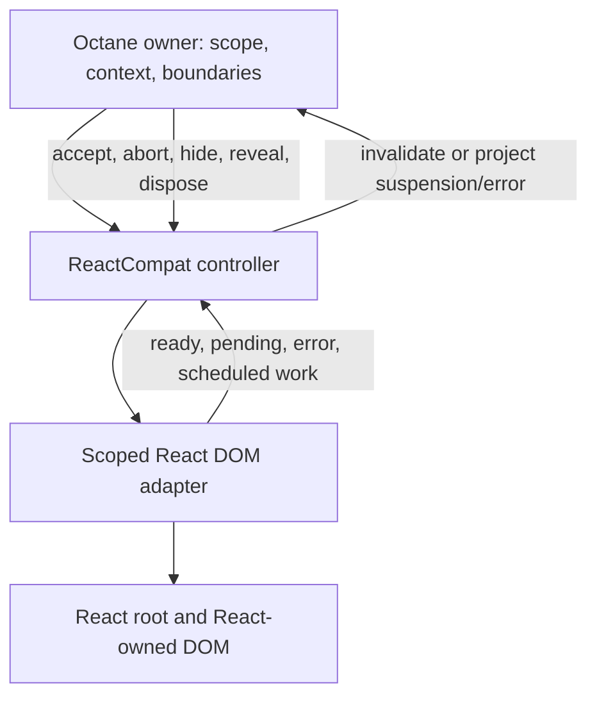

# ReactCompat: real React islands inside Octane

Status: proposed contract with an initial Phase 0 prototype. The private
[feasibility experiments](../experiments/react-compat/README.md) establish child
transport and single-root completed-work admission, and reproduce a multiple-root
commit-ordering counterexample. The full Phase 0 gates have **not** passed; no
public `ReactCompat` API is exported. Investigated on 2026-08-28 against Octane
[`874178645e8b3398e8898359f0537f7345b62234`](https://github.com/octanejs/octane/tree/874178645e8b3398e8898359f0537f7345b62234),
on the dedicated `codex/react-compat` branch. The default dependency catalog
resolves React and React DOM to **19.2.7** in this snapshot; some isolated package
catalogs use other versions. React implementation references below use
[`6117d7cca4906492c51fe6a03381e35adfd86e7d`](https://github.com/facebook/react/tree/6117d7cca4906492c51fe6a03381e35adfd86e7d),
the source commit for v19.2.7. These are investigation baselines, not a promised
support range.

## 1. Recommended direction

Build `ReactCompat` as an Octane component that owns a real React DOM island.
React executes the island's components, hooks, classes, synthetic events, context,
and reconciliation. Octane owns the surrounding application and the island's
logical position, lifetime, and enclosing boundaries. Existing React packages
continue importing real `react` and `react-dom`.

The intended result is the inverse of `OctaneCompat`: an application can place a
React library inside an Octane tree without manually wiring its loading states,
errors, or provider values into every island. Preserve the stronger goal of
coordinated Suspense and transitions; do not quietly redefine it as an effect
that calls `ReactDOM.createRoot()`.

**Full integration is not established by the current public React root API.**
The first implementation work must be a bounded feasibility prototype that can
observe arbitrary React updates and hold or discard their commits. Until that
passes, this document describes a target and a decision process, not a claim
that a thin wrapper can deliver it.

Recommended defaults:

- One explicitly owned host element and one React root per island initially.
- The existing optional `octane/react` subpath exports both `OctaneCompat` and
  `ReactCompat`; keep both outside the default Octane graph. Use the existing
  `octane/react/server` entry for their server counterparts.
- Children syntax is the primary API from the first client milestone:
  `<ReactCompat><Counter start={3} /></ReactCompat>`.
- A small Octane foreign-child ownership protocol, informed by the existing
  universal boundary transaction model. Keep React-specific state in the adapter.
- A version-pinned React DOM integration prototype for the full contract. Begin
  with the smallest scoped renderer hooks; evaluate a maintained React DOM patch
  only if required. Do not assume private fields supply missing lifecycle hooks.
- A stock-public-API implementation only as the prototype's comparison/control.
  Shipping that as a reduced feature requires an explicit product decision; it
  does not satisfy this plan's completion criteria.
- Buffered, hydratable React SSR before progressive mixed-renderer streaming.

The implementation should start with Phase 0 in §11, not public API polish.

## 2. Prior work and current foundations

### The closed PRs

[#23, “feat: add React runtime compatibility for Octane”](https://github.com/octanejs/octane/pull/23)
and its follow-up
[#110, “Bi-directional React bridge…”](https://github.com/octanejs/octane/pull/110)
are the early related proposals. Both closed without merging.

Their React-in-Octane direction aliases `react`, the JSX runtimes, and `react-dom`
to Octane facades. Hooks use Octane slots; context, Suspense, transitions, and
class boundaries are adapted to Octane. That is a different architecture from
retaining React's renderer. See the immutable
[alias implementation](https://github.com/octanejs/octane/blob/eb4802092c2e46b9f222fde1507d46d942753f45/packages/react-compat/src/vite.js#L5-L67)
and
[compatibility surface](https://github.com/octanejs/octane/blob/eb4802092c2e46b9f222fde1507d46d942753f45/packages/react-compat/src/shim.ts#L1-L93).

The recorded reason for deferring #23 was core stability: trueadm
[asked to hold off](https://github.com/octanejs/octane/pull/23#issuecomment-4911104936),
and the author later
[closed it while retaining the branch](https://github.com/octanejs/octane/pull/23#issuecomment-4979511193).
No explanatory maintainer comment was found for #110's closure. Do not present
either closure as proof that real React islands were rejected or impossible.

Reuse the questions and scenarios, not the React emulation:

- Optional compatibility state rather than fields on every native scope.
- Explicit ownership of foreign DOM. #110's
  [stable child-slot descriptor](https://github.com/octanejs/octane/blob/eb4802092c2e46b9f222fde1507d46d942753f45/packages/react-wrapper/src/use-child-slot.ts#L16-L33)
  illustrates why both renderers must not reconcile the same children.
- Tests with published React libraries and nested failures, refs, stores, keys,
  and hydration. Rebuild them against real React.
- Distinguish SSR suspension from failure, including a fallback that suspends.
  The [archived review](https://github.com/octanejs/octane/pull/110#discussion_r3597005604)
  identified a catch-all handler that confused those states. This is historical
  evidence, not a reproduced defect in current Octane.

Do not reuse the alias scheme, slotless hook cursor, class emulation, or
SyntheticEvent implementation. The porting of React bindings to native Octane
remains a separate project described in
[react-library-compat-plan.md](./react-library-compat-plan.md).

### What current Octane can contribute

Source is authoritative; some older comments and plans describe earlier stages.
In particular, current `OctaneCompat` has client, context, server, and hydration
implementations. Its plan explicitly excluded exact cross-renderer transition
entanglement from the initial milestone. See the
[existing plan](./react-hosted-octane-compat-plan.md) and its executable
[transition divergence case](../packages/octane/tests/react-hosted/octane-compat-failure-matrix.test.ts).

| Existing owner | Useful foundation | Limit for the inverse |
| --- | --- | --- |
| [`src/react/index.ts`](../packages/octane/src/react/index.ts), [`shared.ts`](../packages/octane/src/react/shared.ts) | Island identity, an opaque host, controller generations, error/suspension escape, typed component/props transport. | Hosts Octane, whose runtime we control. Does not provide a React child transaction. |
| [`src/react/server.ts`](../packages/octane/src/react/server.ts) | Request-local sessions, retries, prefixes, and server/client ownership precedents. | The serializer and hydration direction must be reversed; inverse stream abort is new work, not an existing hosted-server guarantee. |
| [`RendererRegionOwnerBridge`](../packages/octane/src/runtime.ts) | Parent context reads, error/suspension routing, disposal, and foreign-context resolution. | This is a parent bridge attached to a hosted Octane root, not an API for hosting React. |
| [`src/universal-dom-boundary.ts`](../packages/octane/src/universal-dom-boundary.ts) | Prepare/commit/abort integration, authoritative retry thenables, insertion-lifetime cleanup, and abandoned-attempt cleanup. | Its child root already implements transactions; `ReactDOM.Root` does not. |
| [`src/universal-core.ts`](../packages/octane/src/universal-core.ts) | `UniversalPreparedAttempt` and separation of prepared work from host commit. | Do not manufacture a `UniversalRoot` by wrapping `root.render()` and calling it `prepare()`. |
| [`readContextFromScope`, `useRendererThenable`, `scheduleRenderCleanup`](../packages/octane/src/runtime.ts) | Nearest-owner lookup, sequential suspension replay, and cleanup of work that never commits. | Live scope reads are not committed snapshots safe for asynchronous React consumption. |
| [`src/react/fiber-adapter.ts`](../packages/octane/src/react/fiber-adapter.ts) | Isolation of version-sensitive reads with a safe public fallback. | Its committed-provider bootstrap walk is not a scheduler or pre-commit hook. |
| [`src/compiler/bundler.js`](../packages/octane/src/compiler/bundler.js), [`renderers.js`](../packages/octane/src/compiler/renderers.js) | Mixed-toolchain ownership and declarative boundary metadata. | Existing targets are not a React JSX emission backend. |
| [`descriptorChildren`](../packages/octane/src/runtime.ts), [`descriptor-children tests`](../packages/octane/tests/descriptor-children.test.ts) | Existing compiler marker preserves inspectable child descriptors instead of compiled child render functions, with client/server lowering. | Prove conversion to React element transport and import/re-export discovery; do not assume every Octane renderable is a React node. |
| [`tests/react-hosted`](../packages/octane/tests/react-hosted), [`benchmarks/react-hosted-islands`](../benchmarks/react-hosted-islands/README.md) | Existing mixed-renderer harness patterns, browser cases, and structural metrics. | Opposite-direction passing tests are not evidence for ReactCompat. |

Preserve [Octane's deliberate differences](./differences-from-react.md). Inside
React islands, real React's rules apply, including hook ordering and explicit
dependency behavior. Outside them, Octane's slot keys, inferred dependencies,
native events, synchronous first root mount, and parallel `use()` behavior remain
unchanged.

## 3. Consumer contract

The following table is the intended complete contract. “Gate” identifies work
that must be proved before it is advertised; it does not mean implemented.

| Area | Required observable behavior | Proof / gate |
| --- | --- | --- |
| React execution | Unmodified React components and packages run on real React, including classes, `memo`, `lazy`, refs, stores, and local boundaries. | Published-package fixtures; real module identity. |
| DOM ownership | Octane owns the host and its siblings; React owns its descendants and its registered portal/resource output. Neither reconciler repairs the other's live tree. | Mount, updates, moves, deletion, and hydration identity. |
| Local Suspense | A nearer React boundary handles React suspension. An Octane boundary inside a nested OctaneCompat island gets its normal first chance. | Mixed nesting and fallback-that-suspends matrix. |
| Escaped Suspense | Suspension escaping the React island reaches the nearest eligible Octane pending boundary, on mount and autonomous React updates. | Pre-commit suspension observation gate. |
| Transitions | Bridged work preserves eligible visible content, propagates pending state, survives interruption, and publishes an accepted version without exposing discarded work. | Both directions and autonomous library transitions; commit-control gate. |
| Errors | The nearest logical eligible boundary handles escaped errors; local catches stay local. Recovery and teardown do not leave a live orphan root. | Render, commit, fallback, rejection, and cleanup matrix. |
| Context | Provider values remain scoped and current through memoization, suspension, portals, SSR, and nested compatibility boundaries. | Identity mapping and committed-snapshot gate. |
| Visibility | Outer Octane Suspense/Activity hide and reveal preserve the promised state, effects, refs, and portal visibility. | Separate visibility-lifecycle gate; CSS alone is insufficient. |
| SSR/hydration | React produces its HTML; React hydrates it; Octane adopts the enclosing host without claiming the interior. | Buffered SSR first; node adoption, pre-hydration state, and mismatch recovery. |
| Optional cost | Native-only Octane applications do not load React or allocate island coordination state. | Bundle reachability and native performance controls. |

Boundaries integrate capabilities; they do not turn the two frameworks into one
implementation. No guarantee of identical render counts, Fiber lanes, physical
DOM move sets, or a total effect order across unrelated roots is needed. Commit
visibility, effect safety, state preservation, and pending-state semantics do
need explicit guarantees.

React Server Components/Flight, React Native/custom renderers, legacy roots,
cross-document islands, automatic conversion of arbitrary Octane children to
React nodes, and progressive interleaving of both SSR stream protocols are
outside the first complete release. Ordinary React components whose code uses
class components or StrictMode remain React's responsibility, not exclusions.

## 4. Provisional authoring and package surface

Use the same `octane/react` entry for both directions. The component name
identifies what it hosts: `OctaneCompat` hosts Octane inside React;
`ReactCompat` hosts React inside Octane. `ReactCompat` is proposed, not currently
exported by that entry. Do not introduce a separate public `octane/react-compat`
import for this API.

The primary API is:

```tsx
import { ReactCompat } from 'octane/react';
import { Counter } from './Counter'; // A real React component.

// Within an Octane-owned template:
<ReactCompat>
	<Counter start={3} />
</ReactCompat>
```

Model the boundary like OctaneCompat: consume the child's component identity,
props, and key as transport; let the destination renderer execute the component.
For the first milestone, require one React component element child. That React
component may render null, a fragment, or multiple nodes normally. Octane must
never call `Counter` as an Octane component.

First reuse the existing `descriptorChildren` marker. Ordinary `.tsrx` template
children normally become Octane render functions; marking the exported
ReactCompat binding instead keeps its authored children as inspectable Octane
element descriptors. The adapter can translate the accepted root descriptor to
a real React element without executing the child. This already supplies a
plausible transport for the example; do not require a new React JSX backend
before trying the existing mechanism.

The descriptor is transport data, not itself a React element. Prove key/ref
handling, dynamic props, default props, lazy/memo/class component types, and
deferred/scoped descriptors. Restore the transported key separately from props;
leave the ref under React ownership. Snapshot descriptor getters within the
valid Octane render scope, never during asynchronous React work. Octane currently
applies `defaultProps` while constructing descriptors, so prove that this path
does not impose Octane normalization where React's chosen element type differs.
Resolve the marker through imports and re-exports
in both client and server pipelines; do not recognize a boundary by its local
name alone. Broader nested children, JSX-valued props, render props, and Octane
directives need an explicit conversion/ownership policy. Extend the generic
compiler seam only where this transport is insufficient, using copy-on-write
AST construction. Do not render compiled Octane child functions to discover what
they would produce.

Keep prop checking at `<Counter start={3} />`, including required props and
React 19 refs, without casts or declarations per component. Test function,
class, memoized, lazy, and forwarded-ref JSX types through Octane's language
tooling rather than accepting them as `any`. `hostRef` refers to the
Octane-owned element; the child element's ref belongs to React. Keep those two
contracts distinct. The boundary consumes `children` as transport and never
mounts that prop through Octane's ordinary children renderer.

Use one stable wrapper identity. Changing props updates the existing React
root. Changing the React component type follows React's own state-reset rules
inside that root. Changing the Octane boundary's key ends the old root lifetime.
A keyed move preserves the root, DOM, state, and refs. Changing host tag or
namespace requires a defined remount or a diagnostic; do not quietly transplant
a live root to a new container.

The default host can be `div`; support a small, validated `as` surface for legal
HTML containers. The host is a real layout/accessibility node. Do not default to
`display: contents` or claim wrapper-free semantics. Reject invalid nesting and
unsupported SVG/MathML/table placement until specifically covered. `hostProps`
must not accept `children` or inner HTML that competes with React ownership.

An `element` form may accept a genuine React node constructed in React-owned
code, and a typed `component`/`props` form may be useful for dynamic or non-JSX
callers. These are optional escape hatches, not prerequisites or substitutes for
the primary children API. If added, make authoring forms mutually exclusive.
Do not make every Octane renderable accept `React.ReactNode` to enable this one
boundary.

Keep implementations in separate internal modules even though the public entry
is shared. Importing only OctaneCompat must not initialize a ReactCompat root,
install its hooks, or enforce its stricter renderer-version requirements. Test
tree shaking and quantify any added shared-entry cost; a native-only `octane`
import must still retain neither adapter nor React.

### Context authoring

Two distinct identities need different treatment:

1. **Existing React contexts used by an unmodified library.** Propose a
   `bridgeReactContext(ReactContext)` helper returning a typed Octane provider
   facade. Register the mapping once by object identity.
   Its providers establish owner-scoped frames. ReactCompat automatically
   projects the enclosing frames into real React providers; applications do not
   enumerate contexts on each island. A native React provider inside the island
   shadows the projected value normally. If native Octane consumers also need a
   readable context, supply explicit default metadata or first prove a scoped
   adapter capability for reading the original default.
2. **Existing native Octane contexts read by React-authored application code.**
   Propose `useOctaneContext(OctaneContext)` from the adapter, backed by the
   current island owner. React's `useContext` cannot consume Octane's callable
   context identity directly. This hook must observe owner updates through
   memoized React ancestors. A stable `asReactContext` facade can be considered
   later if a real library API needs a React context object.

The first helper should support creating the mapping around a third-party
context without modifying that package. A single exported facade per context
also makes its Octane provider usable independently of any React island.
React provides no public default-value getter: when no Octane provider frame
exists, leave the React context unprovided so React supplies its own default.
Do not infer a facade default from `_currentValue`, and preserve the original
default's identity when explicit metadata is supplied. See
[React context defaults](https://react.dev/reference/react/createContext).
Identity/default metadata may be weakly held at module scope; provider values,
subscriptions, precedence, and mutable snapshots remain root/request-local.

Raw `<ReactContext value={...}>` in Octane is not supported by the current runtime
just because React accepts that syntax. Making it work requires a compiler and
provider-dispatch change, with types and SSR support. Defer it until the explicit
facade is correct. Do not decorate an Octane function with React symbols or
mutate `context._currentValue` to pretend the identity problem is solved.

## 5. Architecture choices and the React feasibility boundary

React's public [`createRoot`](https://react.dev/reference/react-dom/client/createRoot)
returns `render` and `unmount`, not a transaction. A render request is not a
completion signal. React-local state, stores, and event handlers can schedule
work without a new call from the outer wrapper. This is the central asymmetry
with hosting Octane.

| Candidate | What it gives us | Decision |
| --- | --- | --- |
| Stock `createRoot` / `hydrateRoot` per island | Real React behavior, clear DOM ownership, explicit provider injection, and error callbacks. | Necessary control prototype; insufficient evidence for full integration. |
| One shared React root with portals | Shared React root bookkeeping and a place to model many island entries. | Compare after correctness. Couples lifetimes and scheduling; still lacks Octane commit control. |
| Scoped, pinned React DOM integration | A possible route to work observation, commit admission, cancellation, and lifecycle coordination while retaining React DOM behavior. | Recommended full-contract feasibility candidate; availability of every required hook remains unproved. |
| Custom DOM host using `react-reconciler` | More control over host operations. | High maintenance alternative, not the default: would need to reproduce React DOM's events, forms, hydration, resources, and accessibility behavior. |
| Alias React to Octane | One renderer and scheduler. | Rejected for this task; changes what runs the React library. |

Do not assume a shared root removes per-island event cost. React DOM also calls
its event-listener installation for each portal destination. See
[preparePortalMount](https://github.com/facebook/react/blob/6117d7cca4906492c51fe6a03381e35adfd86e7d/packages/react-dom-bindings/src/client/ReactFiberConfigDOM.js)
and the container-level deduplication in
[DOMPluginEventSystem](https://github.com/facebook/react/blob/6117d7cca4906492c51fe6a03381e35adfd86e7d/packages/react-dom-bindings/src/events/DOMPluginEventSystem.js).
Measure root bookkeeping and listener cost separately.

The following shortcuts do not prove the target contract:

- Catching around `root.render()` does not capture asynchronous React render
  suspension.
- A component in a React Suspense fallback can observe its own commit. It cannot
  report suspended transitions that retain previously visible content without
  committing that fallback. See React's
  [Suspense behavior](https://react.dev/reference/react/Suspense).
- `flushSync` is not a prepare API. It can force work and fallbacks to commit and
  cannot retroactively discard refs or effects.
- Rendering into a detached container may still run effects, mutate external
  state, create portals, or hoist resources. Moving its DOM later does not undo
  those effects.
- React Activity can hide/pre-render content; it is not an abortable foreign
  transaction and does not establish Octane Suspense's lifecycle semantics.
- Observing committed Fibers or using a global DevTools hook is too late to
  prevent a commit and must not become a production scheduling dependency.
- React reconciler's resource-related `waitForCommitToBeReady` hook is not a
  general public React DOM transaction interface. Inspect all paths, including
  urgent work and hydration, before treating it as an adapter seam.

The current React source disables the experimental Suspense callback and
transition tracing features in its ordinary configuration
([feature flags](https://github.com/facebook/react/blob/6117d7cca4906492c51fe6a03381e35adfd86e7d/packages/shared/ReactFeatureFlags.js)).
Even an observer would not alone supply commit control. Also inspect development
`act` handling: it can take a different commit path from production scheduling.
Production-browser evidence is mandatory for the prototype.

If a React DOM patch is necessary, Phase 0 must describe its exact upstream
commit, patch, build provenance, license notices, dependency identity, and upgrade
procedure. Never silently replace an application's React installation or patch
global React dispatchers. The application must deliberately select the supported
integration. An unknown version or missing capability fails with a useful
diagnostic before root creation, hydration, or renderer mutation; it must not
silently downgrade. Keep the exact supported React/React DOM pair matrix
isolated from the existing OctaneCompat support range. Split packaging if
necessary rather than narrowing the older entry's peer contract accidentally.

## 6. Ownership and coordination protocol

Treat the following as requirements for a small internal API, not a final
exported interface. Reuse the universal boundary's model only where its
invariants apply; do not make every renderer implement speculative React
capabilities.



The controller needs:

- An island identity, owner identity, root generation, and monotonic attempt ID.
- A committed snapshot of props, bridged context, visibility, and the relevant
  owner transaction; a separate candidate snapshot while work is staged.
- A status distinguishing preparing, suspended, ready, committed, failed,
  superseded, and disposed. A suspension signal must not share the error arm.
- A stable completion/readiness signal for each attempt, or a stable aggregate
  signal when dependencies change within that attempt. A sequential A-then-B
  suspension must not briefly report readiness after A alone resolves.
- Adapter notifications for work initiated inside React, not just changes to
  boundary props. Notifications must identify which owner/version may accept
  them and must not recursively publish into an active foreign commit.
- Acceptance and abandonment of prepared work, plus visibility and final
  disposal operations. A readiness observation is never permission to commit.

Recommended sequence:

1. Octane creates or reuses the controller and captures candidate inputs in its
   legitimate owner scope. No live scope is exposed as an asynchronous getter.
2. The adapter prepares the React update without publishing candidate UI, refs,
   committed effects, or portal output. Preparation may be asynchronous; do not
   force all work into a synchronous return shape. Resource hints/downloads may
   be speculative; stylesheet activation, script execution, and other observable
   resource work need the explicit policy below.
3. If the React attempt has an escaped suspension, the controller exposes the
   authoritative signal through Octane's renderer-thenable path. An unresolved
   preparation may also need an internal scheduling wait; distinguish that from
   a user resource suspension in policy and diagnostics.
4. Once ready, the owner revalidates props/context/visibility and the transaction
   generation. The candidate is accepted only if all still match. Otherwise it
   is abandoned and the latest work is prepared.
5. Commit coordinates before-mutation, mutation, and layout work. Establish
   what React class `getSnapshotBeforeUpdate` observes, when old layout cleanups
   and ref detaches occur, and when new ref attachments, layout setups, and
   `componentDidUpdate` can observe the accepted DOM. Merely committing React
   from a parent layout effect is insufficient if an earlier Octane sibling
   layout effect saw a mixed version. Preserve React's documented
   [`useInsertionEffect` timing](https://react.dev/reference/react/useInsertionEffect),
   which does not promise a consistent old/new DOM view for that hook.
6. React-local invalidation requests another owner-coordinated attempt. Disposal
   or supersession makes late readiness, rejection, and transition callbacks
   inert without cancelling unrelated user-owned resources.

The stronger transition target is **no paint, newly attached ref callback,
layout-effect setup, or did-update callback observes a partially accepted
transaction across participating owners**. Old-value snapshots and cleanup have
their separately specified phase rules; insertion effects are not universal
DOM-observation barriers. Participation is explicit: a transaction belongs to
the smallest Octane boundary enclosing the registered native regions and React
islands affected by that action. An unrelated root does not join automatically.

This is proposed new coordination, not an existing Octane guarantee. Octane's
current same-identity structural rendering remains per-swap rather than using a
global work-in-progress tree. Phase 0 must identify any additional Octane staging
needed alongside React changes. Do not broaden the promise to arbitrary native
structural deletion or unrelated roots. Once commit begins, user-effect errors
follow recovery policy; there is no general rollback of arbitrary effects. If
either renderer cannot stage the required work, record the failing guarantee
instead of claiming atomicity from batching callbacks in one tick.

Resource speculation needs a separate rule. Normal
[React preload hints](https://react.dev/reference/react-dom/preload) may start
downloads for work later abandoned; that is not a committed UI leak. Candidate
style activation or executable `preinit` work cannot be rolled back in general.
The prototype must either stage those renderer-mediated operations, classify
explicit application-owned effects outside transaction guarantees, or reject an
unsupported case. Do not promise rollback of arbitrary impure component code.
Likewise, React may intentionally
[retain stylesheet resources](https://react.dev/reference/react-dom/components/link)
after unmount. Retention tests must distinguish those semantics from leaked
island owners, subscriptions, or portal output.

Synchronous entry points also need proof. Target ready, non-suspending initial
React content being available before the outer Octane first render returns and
before ancestor layout effects observe it. Target `Octane.flushSync()` draining
ready participating updates while leaving Octane-owned passive effects
asynchronous, as its native contract requires. React-owned effects retain
React's supported timing: React's
[`flushSync` caveats](https://react.dev/reference/react-dom/flushSync) allow it to
flush pending effects and their updates synchronously. Do not promise that all
passive effects in the mixed tree remain asynchronous. An internal scheduling
wait must not itself cause an authored loading fallback to flash. Actual
suspension follows the normal hold
policy; flush does not make an unresolved resource ready. Test reentrant flushes
from React callbacks for convergence. If the adapter cannot preserve these
entry-point guarantees, that is a Phase 0 decision, not an undocumented timing
change to Octane roots.

Keep the deletion lifetime separate from effect visibility. The existing
universal boundary uses insertion-lifetime cleanup because a hidden subtree may
not have a connected layout effect. Cover initial suspension before the first
host commit, a prepared child abandoned because a sibling suspends, and deletion
of retained hidden work. Each path must release registrations and pending work.
Final disposal must continue through remaining cleanup tasks if one throws.

## 7. Suspense, transitions, errors, and context semantics

### Suspense and visibility

The nearest authored boundary with the appropriate capability wins. A local
React Suspense fallback is legitimate island output, not automatically an outer
Octane suspension. An escaped root suspension must enter the Octane owner path.
A fallback that suspends or throws continues to the next eligible owner.

Without an enclosing Suspense/`@pending` boundary, preserve Octane's root policy:
keep committed content, remain empty on a suspended initial client mount, and
retry the latest inputs. Initially suspended hydration retains server DOM until
adoption is possible. Root-level suspension must not become an unhandled error
or reveal an obsolete attempt.

Prove both initial suspension and re-suspension after content has committed.
Urgent updates and transitions may require different visibility policies.
While an Octane transition retains old content, the island must retain the
matching accepted React version, not commit new React content under an old
Octane sibling. Multiple islands under one boundary must not clear the owner's
pending state when only one is ready.

When outer Octane Suspense or Activity hides the island, define separately:
state retention, DOM visibility, focus handling, refs, layout effects, passive
effects, and hidden updates. Native Octane currently disconnects its own effect
slots; it does not automatically disconnect React's. React Activity and React
Suspense are not interchangeable lifecycle tools. The correct mapping is a
feasibility gate, not a CSS implementation detail.

Include React portals outside the host and hoisted document resources. Hiding
the host alone cannot hide portal output. Do not mutate arbitrary shared portal
containers or the whole document head. The adapter needs ownership-aware behavior
or an explicit rejection of an unsupported case before release.

For an already committed island, use this target lifecycle matrix:

| Outer owner operation | State/DOM | Refs and layout effects | Connected passive effects | Insertion lifetime |
| --- | --- | --- | --- | --- |
| Suspense hides primary | Retain, hide visual output. | Disconnect; reconnect on reveal. | Stay connected. Never run a not-yet-committed setup merely because the island is hidden. | Retain. |
| Activity becomes hidden | Retain, hide visual output. | Disconnect; reconnect on reveal. | Disconnect; reconnect on reveal. | Retain. |
| Actual deletion | Release owned tree and registrations. | Final cleanup without duplicate detaches. | Final cleanup according to the renderer's phase. | Release. |

A nested Activity hide takes precedence over a Suspense hide for passive
connectivity. Revealing one ancestor does not reconnect while another still
hides the island. React may schedule hidden work differently from Octane's
synchronous hidden Activity work; preserve React's internal scheduling where
possible, but require the latest accepted version before reveal and no visible
effects from hidden work. The matrix is a target for the adapter to prove.

### Transitions and actions

Use an owner transaction token rather than translating React lane numbers into
Octane scheduler internals. Keep readiness, visibility, and transition completion
separate. Cover these entry paths independently:

| Entry path | Required behavior |
| --- | --- |
| Octane `startTransition` changes island props/context | React work participates before the owner completes; urgent Octane updates can interrupt it. |
| React `useTransition` changes island state | React retains its normal local behavior; escaped pending work reaches the Octane owner even if wrapper props did not change. |
| A React callback updates Octane state inside a React transition | The owner transaction is propagated through the supported scoped callback path; it is not inferred after the callback commits. |
| An Octane callback updates React state | The active transaction reaches React without wrapping or replacing all React setters. |
| Async actions, errors, supersession, and unmount | Pending state completes or cancels deterministically; late callbacks cannot commit into a replacement island. |

React documents limitations around updates after `await` and simultaneous
transitions in [`startTransition`](https://react.dev/reference/react/startTransition).
Preserve supported React behavior rather than claiming more precise transaction
identity than it exposes. If the full adapter supplies additional cross-renderer
identity, specify its lifetime and prove it for nested and overlapping actions.

Do not route all React updates as urgent, infer priority only at `root.render`,
or define completion as “the callback returned.” Do not make applications use a
special transition API for every third-party library update and then claim
transparent integration. Explicit bridge actions may be useful, but autonomous
library updates are a separate required case.

React's [`useSyncExternalStore`](https://react.dev/reference/react/useSyncExternalStore)
has blocking update semantics that constrain transition behavior. It can expose
committed diagnostics or genuinely external state; it is not a substitute for
versioned, transition-aware provider/prop transport. Test its interaction with
Suspense without weakening the library's own external-store contract.

### Error boundaries and recovery

Use a private React boundary to receive errors escaping authored React
boundaries, and React root callbacks for uncaught/recoverable error reporting.
`onCaughtError` is diagnostic; it must not escalate a locally handled error.
Route an escaped failure through an owner invalidation and legitimate Octane
error path, not by throwing from an arbitrary React callback and expecting a
previous Octane call stack to catch it.

| Failure | Ownership rule |
| --- | --- |
| React render/lazy rejection caught locally | Keep the local React fallback; do not also fail the outer owner. |
| Unhandled React render/commit failure | Report once through the ReactCompat owner to the nearest Octane error boundary. Preserve error identity and available React component stack. |
| React error fallback fails | Escalate to the next eligible logical boundary. |
| Recoverable hydration issue | Report with island identity; recover the island according to hydration policy, not the entire Octane application. |
| Event handler or unrelated async callback throws | Preserve the framework's ordinary error-reporting behavior. Distinguish these from React `useTransition` action failures, whose boundary behavior must also be tested. |
| Cleanup throws while disposing | Finish remaining cleanup, skip the disposing owner, and route once to the nearest surviving Octane catch/root reporter; do not resurrect the island. |

Specify how an Octane boundary reset clears the controller error and restarts
the React tree. Distinguish a live root whose children were cleared by fatal
error recovery from a root explicitly disposed with `root.unmount()`. Only the
latter requires creating a new root; test both paths. Do not retry a failed
island forever from an effect. Define reset keys/identity and verify that
recovery does not duplicate reports. Include deletion of the enclosing error
boundary and whole-root deletion: scheduling an already-deleted wrapper cannot
deliver their cleanup errors.

### Context consistency

Capture provider snapshots while Octane can read the correct owner scope, and
publish accepted versions into React's own context mechanism. Octane provider
values can be speculative during render and rolled back; an asynchronous React
read must not see those values from an abandoned attempt.

Required cases include defaults, explicit `undefined`, nested shadowing,
provider-only updates through memo, conditionally introduced contexts, lazy
modules, and multiple roots with different values. Provider topology changes
must not remount stable React children merely because a generated provider chain
grew. A dynamic list of provider wrappers is not accepted without that proof.
If a stable topology cannot be achieved with public providers, identify the
needed adapter capability or explicit restriction before claiming transparent
context support.

For `Octane -> React -> Octane` nesting, preserve the logical owner chain and
reuse existing OctaneCompat context behavior where valid. For
`React -> Octane -> React`, an outer React context must not silently become its
default merely because a new React root was created. Define automatic discovery
or inherited provider-frame transport for that case; a Fiber read of a
committed value without a subscription is not sufficient. Detect forwarding
cycles, retain local shadowing, and keep provider values request-local on SSR.

Nested context, visibility, deletion, and transition support need a capability
handshake too. Current OctaneCompat intentionally surfaces some transition
suspensions only after its React host commits, returns the default for an
unprovided native Octane context, and discriminates disposal through a microtask.
Full coordination cannot pass through those legacy paths by assumption. Phase
0 must establish whether the existing adapter needs an opt-in coordinated owner
protocol, with explicit version/capability negotiation.
Preserve the legacy contract on legacy paths; add tests for the stronger path
instead of silently changing an existing divergence test. A chain containing
an unsupported owner must be diagnosed or documented as a separate limited mode,
not advertised as fully coordinated nesting.

Test `Octane Provider -> ReactCompat -> OctaneCompat -> Octane useContext`
explicitly: native context lookup must delegate to the outer Octane owner when
there is no nearer provider, rather than returning the default. Also prove that
nested hide/delete releases portals and subscriptions on the promised lifetime;
the existing delayed-disposal discriminator is not evidence of that stronger
contract by itself.

## 8. Events, refs, forms, and lifecycle

React-owned elements keep React's synthetic events and controlled-input
semantics. Octane-owned elements keep native delegated events, including native
`change` and `onInput` for text edits. Do not translate all events at the bridge
or add a synthetic layer to Octane.

Build a browser-observed contract for events crossing the host. At minimum,
capture/bubble order, propagation stopping, default prevention, disabled
controls, focus/blur, text input/IME, submit/reset, and events from portals must
not be duplicated or dropped. A synthetic React portal event follows the React
tree; a native Octane listener follows the DOM. Define that difference rather
than inventing logical cross-framework bubbling. If explicit portal ownership
hooks are needed, keep them separate from ordinary in-host events.

Refs and layout effects must run only for accepted work, when their DOM is in
the correct document. Cover callback-ref cleanup, imperative handles, StrictMode
replay inside React, a React effect scheduling Octane work, and disposal while
React is rendering/committing. Never use a generic delayed unmount that leaves
document listeners or portals active after Octane has deleted the island.

External stores, query clients, routers, and form providers remain live objects
passed as props/context. The adapter does not clone or serialize them on every
render. Cancellation of an island's subscription or attempt does not abort a
shared application resource it does not own.

## 9. Server rendering and hydration

Export the server counterpart from the existing `octane/react/server` entry.
Its children transport and context facade contract must match the client entry,
including descriptor-marker discovery through server re-exports. Do not
accidentally include React DOM client code in server bundles or require React
types in ordinary Octane consumers.

First support **buffered React islands inside Octane SSR**:

1. Create a request-local island session keyed by logical island identity stable
   across SSR retries. Keep input/attempt revisions beneath that session; do not
   restart React rendering just because Octane retries. Derive an identifier
   prefix from the Octane request/root and island position, reproduced by the
   corresponding client identity.
2. Render with React's Node or Web streaming server API, collecting the completed
   island output. Resolve the session's stable readiness promise only after the
   selected all-ready policy is satisfied. Feed that promise through the Octane
   server boundary so other Octane content can progress.
3. Emit a dedicated host and opaque interior using the existing ownership/range
   model where applicable. React markup is renderer output, not arbitrary
   unsanitized user HTML. Avoid source-string concatenation of unescaped props
   or metadata, and do not expose arbitrary raw-HTML props as the bridge.
4. During hydration, Octane adopts the host, skips the exact React-owned interior,
   and lets `ReactDOM.hydrateRoot` adopt it with matching inputs and prefix.
5. Prop/context updates arriving before hydration is complete must be versioned
   and scheduled according to React hydration semantics. Do not call an eager
   replacement render that destroys server DOM and call that hydration.

React [`renderToString`](https://react.dev/reference/react-dom/server/renderToString)
does not wait for suspending content, so it is not the buffered-completion
implementation. Use the lifecycle of
[`renderToPipeableStream`](https://react.dev/reference/react-dom/server/renderToPipeableStream)
or [`renderToReadableStream`](https://react.dev/reference/react-dom/server/renderToReadableStream),
and preserve [`hydrateRoot`](https://react.dev/reference/react-dom/client/hydrateRoot)
requirements.

The prototype must prove the exact emitted output is adoptable, including
Suspense markers, `useId`, React resources, escaping, and context snapshots.
Never strip or parse private React markers to manufacture an apparently clean
buffer. Buffered output needs bounded memory, timeout/abort, and release of
request-local caches on success, error, disconnection, or cancelled Octane work.
Server errors have different boundary behavior from client React; use server
callbacks and an explicit outer Octane policy rather than assuming a client
class boundary catches SSR failures.

Define every terminal server result. `onAllReady` means rendering finished, not
that every boundary produced successful primary content. Handle shell failure
that never reaches all-ready, recoverable descendant failure that leaves React
fallback HTML, abort, and timeout. Each session settles its readiness signal
exactly once and releases its resources. Specify which errors escape into
Octane and which remain React client recovery; never leave a rejected or aborted
request waiting for a callback that will not run.

Nested buffering can deadlock: a React SSR attempt may contain OctaneCompat
which encounters another ReactCompat boundary. Prove request/session reentrancy,
ownership, cancellation, and absence of a wait cycle. A nested case is either
supported by evidence or rejected explicitly before shipping.

Hydration tests must preserve actual DOM identity, typed text, selection, focus,
refs, and event behavior; matching HTML alone is inadequate. React-internal
hydration mismatch recovery must not delete an Octane sibling. Verify CSP nonce
handling, unique IDs across islands, deferred hydration/`Hydrate`, and event
delivery before and during island activation. Server-only use must not retain a
client root. A client-only escape mode, if needed, must explicitly emit fallback
and mount rather than pretend to hydrate nonexistent React HTML.

Progressive React stream segments inside Octane's stream are a later milestone.
It needs a separate protocol for host availability, chunk ordering, backpressure,
abort, scripts/nonces, styles/head resources, and hydration readiness. Do not
splice two independently generated streaming protocols into the same range.

## 10. Compiler, types, build ownership, and diagnostics

Use the existing mixed-toolchain gate: `.tsrx` stays Octane-owned; under
`requireDirective: true`, application `.tsx`/`.ts`/`.js` is Octane-owned only when
marked with its leading pragma. Real React modules go through the React
toolchain, without Octane slot injection or inferred dependencies. Installed
Octane packages retain manifest-based ownership.

Audit Vite, Rspack, and Rsbuild rather than assuming the Vite example proves
every integration. Keep React Refresh and Octane HMR on their own module
boundaries. TypeScript, Volar, SSR compilation, production compilation, package
re-exports, and dependency optimization must agree on ownership. A foreign React
pragma alone should not be assumed to protect a module when the ownership gate
is disabled.

Implementation owners should be narrow:

| Proposed change | Owning area |
| --- | --- |
| Boundary component, controller, context facade, React callbacks, version checks | New `packages/octane/src/react-compat/` modules. |
| Owner attempt, deletion/visibility hooks, committed-snapshot access | `runtime.ts` and the existing renderer-boundary helpers, only for missing generic behavior. |
| Server sessions and opaque adoption | Adapter server modules plus the owning server/hydration runtime, not app-level DOM repair. |
| Primary children transport and source ownership | Existing descriptor-children marker/discovery first; narrowly extend compiler AST/boundary paths where needed, with Vite/Rspack/Rsbuild integration tests. |
| Public API and types | Extend `octane/react` and `octane/react/server`, adapter-only React types, strict consumer fixtures, docs. |
| Behavioral and browser evidence | New `tests/octane-hosted-react/` group and targeted browser/SSR fixtures. |
| Structural/timing evidence | New `benchmarks/octane-hosted-react-islands/` suite registered with the existing benchmark runner. |

Source and publish export maps both need validation. Follow the current authored
source publishing policy for any new published adapter modules; do not copy old
generated-output packaging merely because the existing core has legacy export
entries. Check package tooling before selecting the exact layout. No ambient
`declare module '*.tsrx'` workaround and no default-runtime React re-export.

Required diagnostics include unsupported/mismatched React and React DOM versions,
duplicate React identity, unavailable coordination capability, a React component
accidentally compiled as Octane, an Octane descriptor passed as a React node,
conflicting authoring forms, invalid host placement, incompatible server/client
entry selection, and unsupported nesting/visibility modes. Development and
production must fail safely; development can add detailed guidance.

## 11. Implementation sequence and exit criteria

These are proposed review slices, not commits or PRs created by this planning
task. Each slice must keep the existing OctaneCompat direction passing.

### Phase 0 — prove the hard contract before committing to an adapter

Deliver a small real-browser fixture using the proposed children API, with an
Octane sibling, two React islands, outer Octane Suspense/error boundaries, a
local React boundary, and shared
provider inputs. Run the same interactions against a stock-root control and the
candidate full adapter. Keep the prototype isolated from production exports.

| Gate | Adversarial scenario | Required evidence |
| --- | --- | --- |
| P0.1 Prepare/abort | Stage new React content; a later Octane sibling suspends or the update is superseded. Include refs, effects, a portal, and a head resource. | No forbidden candidate UI/effect/resource publication from abandoned work; permitted preload speculation is identified separately. |
| P0.2 Autonomous suspension and synchronous entry | Ready initial mount, `Octane.flushSync`, then a mounted React child suspending from its own update. Repeat inside a transition, with and without an outer pending boundary. | Ready content obeys synchronous entry guarantees; internal scheduling causes no fallback flash; real pending/readiness is observed without relying on fallback effects. |
| P0.3 Transaction composition | Transition updates an Octane label and both islands; one suspends, an urgent edit interrupts, then an older promise resolves. Include class snapshots/did-update, insertion effects, old layout cleanup, refs, and Octane sibling/ancestor layout readers. | Phase-specific old/new observations hold across registered participants; no stale or mixed accepted version at paint/new layout observation. Required Octane staging changes are identified. |
| P0.4 Context | Provider-only update through memo, an abandoned provider update, explicit `undefined`, and a newly discovered context. | Correct nearest accepted value; no provider leakage or unintended state reset. |
| P0.5 Visibility | Hide/reveal from outer Octane Suspense and Activity; update while hidden; delete before reveal. | Defined effect/ref/state/focus behavior and no visible orphan portal. |
| P0.6 Error/reentrancy | Render error, failing fallback, effect scheduling Octane work, cleanup error while deleting its boundary/root, and a nested compatibility chain. | Nearest surviving recovery/reporting, no duplicate handling, complete teardown, and explicit legacy/coordinated owner capability behavior. |
| P0.7 Hydration | Buffer one suspended React island, hydrate it, then update; test shell error, recoverable fallback, abort, timeout, and SSR replay. | Real adoption and preserved pre-hydration input; each stable session terminates once without restarting on every replay. |
| P0.8 Version/build | Production browser, development browser, incompatible renderer version, duplicated React, and integration disabled. | Correct capability detection and safe diagnostics; no false success caused only by `act`. |

Exit: write a decision record naming the exact adapter mechanism, supported
builds, observable ordering, limitations, packaging burden, and measured
structural cost. Each advertised gate has executable evidence. If a gate fails,
record whether a narrow React DOM patch can supply it. If not, stop promotion
to public API and present the concrete choice between reduced scope and a
maintained renderer integration. Do not leave a fake transaction API in core.

### Phase 1 — ownership, client shell, and typed transport

Extend the existing optional entries with ReactCompat, stable host/root identity,
the selected controller, descriptor-children transport, strict JSX types,
cleanup, diagnostics, and source ownership fixtures. The public example with
`import { ReactCompat } from 'octane/react'` must work in this milestone.
Extract only the generic Octane seams justified by Phase 0.
Cover React component types, normal updates, keys/moves, refs, events, reentrancy,
StrictMode, deletion, and abandoned initial mounts. Add bundle controls proving
that an application without ReactCompat pays no React dependency cost.

Exit: client shell works and disposes correctly in dev/prod. Keep it experimental
and explicitly incomplete until Phases 2–5 pass; shell rendering is not the full
integration milestone.

### Phase 2 — context and errors

Implement scoped context mappings, accepted snapshots, memo invalidation,
provider topology behavior, owner error routing, and reset/recovery. Add mixed
OctaneCompat nesting and duplicate-root/request isolation cases. Preserve local
React boundaries and the original error object/stack information.

Exit: the context/error portions of §12 pass, including provider-only updates,
failed updates, late callbacks after disposal, and errors during cleanup.

### Phase 3 — Suspense, transitions, and visibility

Implement autonomous child invalidation, escaped suspension, prepared commit
admission, transaction/pending composition, interruption, and hide/reveal.
Exercise both React-initiated and Octane-initiated work; include local boundaries,
multiple islands, nested compat boundaries, portals, and async actions.

Exit: every advertised client coordination guarantee passes in a production
browser as well as the unit harness. Validate core scheduler/effect changes
against native Octane and the existing React-hosted integration. No skipped
autonomous-update or visibility cases disguised as follow-ups.

### Phase 4 — buffered SSR and hydration

Implement request-local sessions, server providers, identifier prefixes, opaque
host output, hydration ownership, abort/backpressure limits, mismatch recovery,
and pre-hydration updates. Verify Node and Web server targets separately, with
real development and production app builds. If a target cannot be supported,
make its package entry/diagnostic explicit rather than silently rendering empty
HTML.

Exit: adoption, request isolation, CSP, cleanup, deferred activation, and mixed
nesting tests pass. Document progressive interleaving as not yet supported.

### Phase 5 — library and performance qualification

Run real package fixtures, memory/lifecycle stress, structural benchmarks,
native-only bundle controls, strict packaged-consumer tests, and all relevant CI.
Write usage and support documentation, publish a tested React/React DOM version
matrix, and document the adapter upgrade procedure. Add a patch changeset for
user-facing package work while Octane is 0.x.

Exit: completion criteria in §14 are met. Exact React version support is earned
per matrix entry, not inferred from a permissive peer dependency.

### Follow-ups — ergonomics and progressive streaming

After the runtime is qualified, extend children transport beyond its initial
single-component contract, add richer legal host/namespace placement, and compare
shared roots if measurements justify it. Progressive mixed SSR streaming gets
its own design and proof. These are separate from the full initial client
coordination and buffered SSR contract.

## 12. Validation matrix and representative applications

Use public entry points and real components. Tests should assert DOM/state,
effect/ref lifetime, focus, errors, and accepted values, not private Fiber fields
or exact generated helper names. A test must fail under a realistic broken
implementation: deliberately disable the relevant behavior, observe failure,
then restore it. Keep internal counts in the benchmark/ratio system.

| Group | Required cases |
| --- | --- |
| Identity/lifetime | Empty/null/fragment output; function/class/memo/lazy/ref components; repeated updates; key change and move; initial abandonment; hidden deletion; repeated mount/unmount; reentrant updates. |
| Suspense | Initial pending; urgent re-suspension; transition retention; sequential and parallel promises; rejection; fallback suspension/error; local versus escaped boundaries; multiple islands; unmount before resolve. |
| Transitions/actions | Both initiation directions; arbitrary library setters; overlapping and nested actions; update after await; urgent interruption; stale success/error; latest pending completion; no committed speculative effects. |
| Errors | Render, lazy import, layout/passive, fallback, cleanup, root callback, reset; locally caught versus escaped; unhandled event/async diagnostics; no double-reporting. |
| Context | Default versus undefined; nested providers; memoized consumers/parents; provider-only updates; late discovery; topology changes; abandoned versions; two roots; request concurrency; both alternating compat nesting directions. |
| Events/forms | Capture/bubble; stopping/default prevention; portal events; text input/IME; checkbox/select; focus/selection; submit/reset; controlled/uncontrolled state; no duplicate dispatch. |
| Visibility | Outer Suspense versus Activity; local React Suspense/Activity; nested hides; hidden updates; refs/effects/focus; portals/resources; teardown without reveal. |
| SSR/hydration | Node/Web; dev/prod; successful and suspended output; correct IDs; adoption; early input; early update; mismatches; CSS/head resources; nonce; abort; timeout; concurrent requests; deferred hydration; nested compatibility. |
| Toolchain | Primary children transport; descriptor marker across aliases/re-exports; React JSX; Octane TSRX; React and Octane HMR; Vite/Rspack/Rsbuild; strict types; shared server/client exports; production tree shaking; unsupported versions. |

At least four published-library scenarios should qualify the bridge:

- **React Query or SWR:** unmodified provider, internal observer/store update,
  Suspense, rejection/retry, and a provider-only input change.
- **React Hook Form:** refs, uncontrolled fields, native form submission, and
  typing/selection preserved through an Octane sibling update.
- **Radix or Floating UI:** portals, layout measurement, focus restoration,
  dismissal, and hide/delete while open.
- **An editor such as Lexical:** imperative root/ref lifecycle, selection,
  external subscriptions, and repeated mount/unmount.

Pin package versions when creating those fixtures. Use their real React
packages, not `@octanejs/*` ports or test aliases. Prefer the same real component
and interactions in a pure-React control and a mixed tree; record where outer
Octane's intentional contract differs. Include a nested React provider and an
OctaneCompat child in at least one fixture.

Reuse the compiler/hydration harness and add focused browser coverage instead of
copying generated-module loaders. Name proposed Vitest projects explicitly when
implementing so they actually run in CI. Candidate commands after those files
exist:

```sh
pnpm exec vitest run packages/octane/tests/octane-hosted-react --silent=passed-only
pnpm exec vitest run packages/octane/tests/react-hosted --silent=passed-only
pnpm typecheck:files packages/octane/src/react-compat packages/octane/typetests
pnpm tsrx-decls:check
pnpm format:files:check packages/octane/src/react-compat
```

Use `tsrx-tsc --noEmit` for any program containing `.tsrx`. Browser execution,
production compilation, server integration, package exports, and benchmarks are
additional gates, not replaced by those commands. Core runtime changes require
the relevant broader tests and native controls.
Markdown is intentionally excluded from Prettier in this repository; review this
plan's prose, links, tables, and whitespace directly rather than reporting a
skipped formatting command as a passed document check.

## 13. Performance and maintenance budget

No performance result is claimed by this plan. Establish baseline and candidate
measurements using the same commits, dependencies, machine, warmup, and runner
options. Do not compare a smoke run to a full benchmark or advertise differences
inside observed variance.

| Workload | Measure | Semantic control |
| --- | --- | --- |
| Native Octane with no adapter import | Bundle reachability, generated output, native mount/update and SSR throughput. | Same native application; React and compatibility state absent. |
| 1, 100, 1,000 empty/stateful islands | Root/controller allocations, listener registrations, retained bytes, teardown retention. | Same output, root lifetime, state preservation, and interactions. |
| Stable parent rerender and one dirty island | Scheduling hops, unaffected work, props/context delivery. | Only intended public state changes; no lost updates. |
| Context fan-out and topology change | Subscription work, allocation, propagation cost. | Correct nearest provider through memo without state reset. |
| Suspense/transition interruption | Time to urgent response, queued work, discarded work, pending duration, memory. | Same retained visible content and accepted versions. |
| Portal-heavy library | Listener/resource cost, layout work, cleanup retention. | Working focus/dismissal/visibility and no orphan output. |
| Buffered SSR and hydration | Throughput, first-byte effect, peak memory, payload, adoption/activation cost. | Same completed React content and preserved DOM/user input. |

Compare native Octane, direct React roots, the candidate adapter, and the shared
React-root/portal variant where useful. The current React-hosted benchmark is a
methodology reference, not the reverse adapter's baseline. Keep each suite in
the repository's deterministic result/ratio system, with budgets chosen from
measurements rather than invented percentage targets.

Avoid per-component/per-node bridge fields, global provider-value scans,
periodic polling of roots, and repeated Fiber walks after subscription. Optional
state should scale with active islands, contexts actually bridged, and in-flight
attempts. Root/container listener lifetime must be measured honestly; React's
container registration is not equivalent to a leaked document listener.

A private React adapter needs a named maintainer role and a repeatable upgrade
checklist: pin upstream source and artifact integrity, review the changed hooks,
run all capability gates in dev/prod, run package/browser/SSR matrices, and only
then expand supported versions. Unknown versions must not be allowed to fail
later with silent scheduling corruption.

## 14. Completion and unresolved decisions

This planning task produces the design, evidence, and next implementation gates.
It does not resolve feasibility by assertion. The next task should tackle Phase
0 and return evidence before production implementation proceeds.

Decisions proposed here:

| Decision | Proposed default | Revisit when |
| --- | --- | --- |
| What executes the island? | Real React DOM. | Not negotiable without changing the task's scope. |
| Ownership unit | One legal host and one React root per island. | A measured alternative preserves isolation and every semantic gate. |
| Integration level | Full coordinated target, version-pinned if necessary. | Phase 0 proves a capability needs a maintained patch or cannot be achieved. |
| Public import and primary authoring | `import { ReactCompat } from 'octane/react'` with `<ReactCompat><Counter start={3} /></ReactCompat>`. | Add optional escape hatches or broader children support only without displacing this API. |
| Context | One-time identity facade plus owner-scoped automatic delivery; explicit hook for native Octane context in React-authored code. | A stronger transparent identity mechanism is proved without globals or remounts. |
| SSR | Buffered hydratable React islands. | A separate streaming protocol is designed and tested. |
| Unsupported environment | Targeted diagnostic, no silent semantic downgrade. | Another supported mode is explicitly designed and documented. |

Before calling the feature complete:

- All mandatory Phase 0 gates have evidence and their production equivalents
  pass; remaining limitations are declared as supported-surface restrictions,
  not hidden fallback behavior.
- Autonomous React suspension/transitions, context propagation, owner error
  routing, visibility, cleanup, and buffered SSR/hydration work together.
- Existing OctaneCompat and native Octane behavior remain correct; no framework
  defect is hidden behind a sample-app workaround.
- Public types, source ownership, package exports, docs, version diagnostics,
  and real-library fixtures pass across the advertised environments.
- Performance and retention evidence exist for the final implementation,
  including the native-only cost control.
- Each implementation PR runs `pnpm sync` before push, includes relevant
  generated changes and a patch changeset when appropriate, and has green
  relevant CI on its current head. Draft/skipped CI is not completion.

The largest remaining decision is whether the React DOM coordination hooks can
remain a small supported integration or require a maintained renderer patch.
Phase 0 must answer that with working and failing cases. A pleasant wrapper API
cannot answer it.
