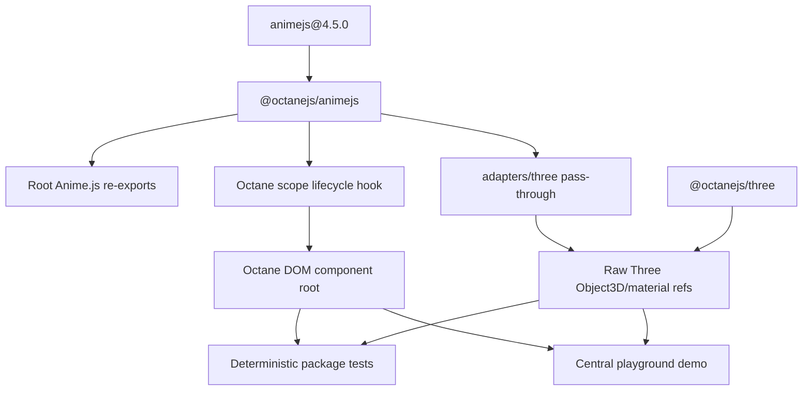
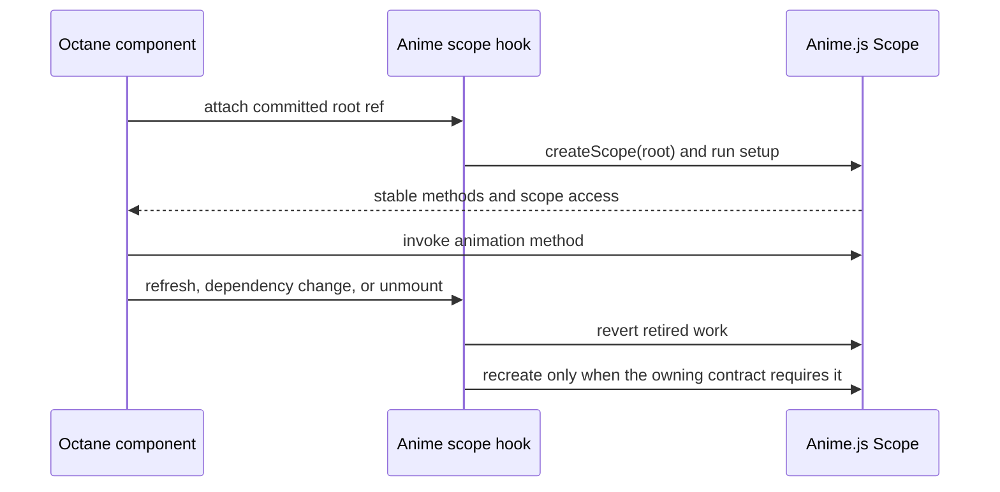
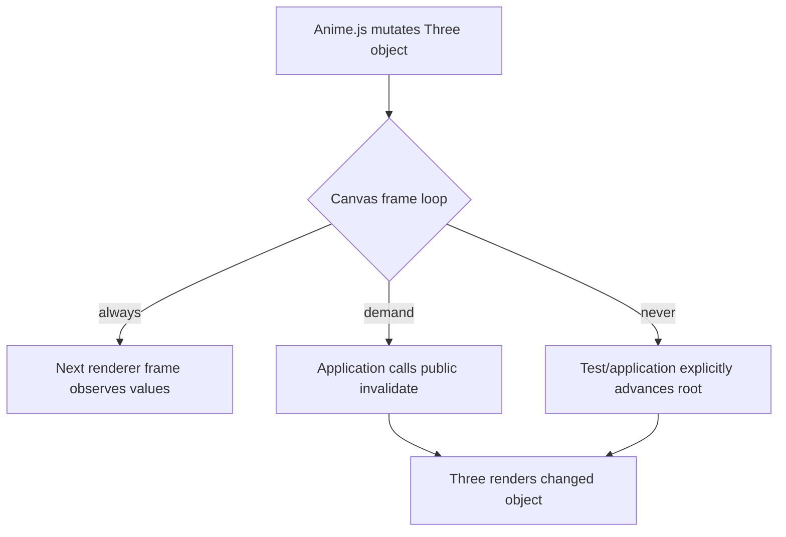

# feat: Add Anime.js binding

## Goal Capsule

- **Objective:** Ship `@octanejs/animejs` against Anime.js 4.5.0, preserving its framework-neutral animation API while adding Octane-native scope lifecycle support, verified interoperability with `@octanejs/three`, and a central-playground showcase.
- **Authority:** This plan and Octane repository guidance define the binding; Anime.js 4.5.0 documentation, package exports, and source define upstream behavior; current Octane public contracts override React-specific example mechanics.
- **Execution profile:** Work in the existing `feat/animejs-binding` worktree. Open the pull request as draft and keep it draft until required checks are green and the branch is current with the base branch.
- **Stop conditions:** Stop and surface a blocker if parity requires changing Anime.js internals, if the Three adapter cannot operate on real `Object3D` refs from `@octanejs/three`, or if required integration behavior needs a private Octane runtime/compiler API.
- **Tail ownership:** The binding change owns the package, tests, playground demo, generated catalogs, changeset, draft PR, and final green-and-current readiness evidence.

---

## Product Contract

### Summary

Add a first-party Octane binding for Anime.js 4.5.0.
Reuse Anime.js unchanged, add a small Octane lifecycle hook around `createScope()`, expose the official Three.js adapter through the binding, and prove both DOM and `@octanejs/three` use through package tests and the central playground.

### Problem Frame

Anime.js is framework-neutral, but its documented component-framework integration requires a component-owned root, effect setup, callable scope methods, and deterministic `revert()` cleanup.
Octane users can assemble those pieces manually, yet an official binding should provide the safe lifecycle seam, document frame-loop behavior for Three scenes, and participate in Octane's package, status, CLI, website, and playground contracts.

### Requirements

**Package and upstream contract**

- R1. Publish `@octanejs/animejs` against the exact Anime.js 4.5.0 release and record source, version, license, exports, and supported-surface provenance.
- R2. Re-export the supported Anime.js root API without forking its animation engine or copying framework-neutral modules.
- R3. Provide `useAnimeScope(setup, dependencies?)`, returning stable named `root` and `scope` refs while owning setup, registered methods, refresh access, and `revert()` cleanup without requiring React.
- R4. Preserve Anime.js instance, callback, promise, engine, selector, and tree-shaking semantics within the supported surface.

**Three.js interoperability**

- R5. Expose the official Anime.js Three.js adapter through `@octanejs/animejs/adapters/three`.
- R6. Verify the adapter against real `three` objects created and exposed by `@octanejs/three`, including transforms and material-routed properties.
- R7. Document and test how Anime.js updates become visible under `@octanejs/three` `always`, `demand`, and `never` frame loops without introducing a second Three binding or a private renderer bridge.
- R8. Preserve the adapter subpath's side-effect registration through package metadata and optional compatible `three` and `@types/three` peer declarations.

**Evidence and release integration**

- R9. Add deterministic tests for lifecycle, cleanup, selectors, callable methods, animation completion, server import/render safety, and error/unmount behavior at public observation boundaries.
- R10. Add a central-playground demo that consumes only public binding APIs and exercises DOM scope cleanup plus the Three adapter in a real browser.
- R11. Update package discovery, typecheck/test configuration, binding status, website directory, CLI/MCP data, generated inventories, and release metadata through existing repository generators.
- R12. Open the pull request as draft and keep it draft until targeted and repository-required checks are green and GitHub reports the branch current with its base.

### Key Flows

- F1. **Run a scoped DOM animation**
  - **Trigger:** An Octane component mounts a root ref and configures Anime.js work within that root.
  - **Actors:** Application developer, Octane component, Anime.js engine.
  - **Steps:** The binding attaches the root, creates a scope, runs setup, exposes registered methods, and reverts all scope-owned work when the component unmounts or the scope is replaced.
  - **Outcome:** Animations and listeners remain component-owned and do not escape or survive their Octane owner.
  - **Covered by:** R2-R4, R9-R10.
- F2. **Animate an Octane-managed Three object**
  - **Trigger:** A `.three.tsrx` scene supplies a committed `Object3D` ref to Anime.js.
  - **Actors:** Application developer, `@octanejs/three`, Anime.js Three adapter.
  - **Steps:** The official adapter registers, Anime.js mutates mapped Three properties, and the scene's configured frame-loop policy renders or explicitly advances those changes.
  - **Outcome:** The same Three object remains renderer-owned while Anime.js controls its animatable values.
  - **Covered by:** R5-R8, R10.

### Acceptance Examples

- AE1. **Scoped cleanup:** Given a component creates an animation and a callable scope method, when the component unmounts, then `revert()` restores the affected DOM state, removes scope-owned callbacks/listeners, and later method calls cannot mutate the retired root. Covers F1, R3-R4, R9.
- AE2. **Selector isolation:** Given two component roots contain matching selectors, when one scope animates its selector, then only descendants of that root change. Covers F1, R3-R4, R9.
- AE3. **Three adapter interoperability:** Given an `@octanejs/three` scene exposes a mesh ref, when the binding's Three adapter animates position, rotation, scale, color, or material opacity and the scene advances, then the same mesh/material instances contain the expected values and render through the configured frame loop. Covers F2, R5-R8.
- AE4. **Playground proof:** Given the central playground opens the Anime.js demo, when the user starts, reverses, refreshes, and resets DOM and Three animations, then the visible state follows the controls, navigating away cleans up work, and returning starts from a clean state. Covers R9-R11.
- AE5. **Draft readiness:** Given implementation and review are complete, when any required check fails or the branch is behind base, then the PR remains draft; it becomes ready only after the updated head is green. Covers R12.

### Success Criteria

- Root runtime and type exports match the supported Anime.js 4.5.0 surface, with every omission or additional lifecycle API documented.
- Lifecycle tests prove root isolation, registered methods, refresh/reconfiguration, completion, and cleanup.
- A real `@octanejs/three` integration test proves the official adapter receives renderer-created objects without modifying `packages/three`.
- The central playground builds and visibly demonstrates both DOM and Three animation paths through public imports.
- Package, binding-status, parity-gap, website, CLI/MCP, inventory, lockfile, and changeset checks are current.
- The draft PR is green and current with its base before it is marked ready.

### Scope Boundaries

**In scope**

- Anime.js 4.5.0 root API reuse, one Octane scope lifecycle hook, and the official `adapters/three` subpath.
- Real `@octanejs/three` interoperability for objects reachable through refs.
- Browser-visible playground evidence and deterministic package/Three integration tests.

### Deferred to Follow-Up Work

- Octane-specific wrappers for every Anime.js subpath module.
- Higher-level declarative animation components or a Framer Motion-style prop DSL.
- Automatic invalidation policy that changes `@octanejs/three` frame-loop ownership.
- Dedicated adapters beyond Anime.js's shipped Three.js adapter.

**Outside this product's identity**

- Forking Anime.js, reimplementing its engine, or running React.
- Replacing `@octanejs/motion`; the packages expose different upstream APIs.
- Claiming that a jsdom mutation test proves browser timing, WebGL rendering, or animation smoothness.

---

## Planning Contract

### Key Technical Decisions

- KTD1. **Reuse Anime.js as the runtime dependency.** Anime.js 4.5.0 is framework-neutral and has no required runtime dependencies; `@octanejs/animejs` adds lifecycle integration and re-exports rather than a ported engine.
- KTD2. **Expose one lifecycle primitive first.** `useAnimeScope(setup, dependencies?)` returns a stable `UseAnimeScopeResult` object with `root` and `scope` refs; setup receives the upstream `Scope`, and explicit dependencies govern replacement. Additional convenience hooks require demonstrated consumer need.
- KTD3. **Pass through the official Three adapter.** `@octanejs/three` refs expose real `three` instances, and Anime.js's adapter is written for those raw objects. The binding adds a subpath export and integration evidence, not a second adapter implementation.
- KTD4. **Protect adapter registration from tree-shaking.** The binding's package metadata marks only the adapter subpath as side-effectful and declares Anime.js-compatible optional `three` and `@types/three` peers, so DOM-only consumers do not acquire Three while adapter consumers retain registration.
- KTD5. **Keep frame-loop ownership explicit.** Anime.js mutates objects; `@octanejs/three` decides when scenes render. `always` renders continuously, while `demand` requires invalidation and `never` requires explicit advancement. The binding documents these contracts and does not silently toggle the global Anime.js engine or the Three root.
- KTD6. **Use deterministic clocks for correctness and a real browser for visibility.** Package tests disable uncontrolled scheduling and advance Anime.js/Three through public controls; the playground proves bundling, renderer configuration, controls, cleanup, and visible behavior.
- KTD7. **Use the central playground.** (session-settled: user-directed — chosen over package tests alone: the migration must use the playground where it adds realistic evidence.) The demo joins the existing catalog and uses a `.three.tsrx` child scene after enabling the existing Three renderer preset.
- KTD8. **Hold draft readiness to green and current.** (session-settled: user-directed — chosen over marking implementation-complete work ready: the PR stays draft until checks pass on a head current with base.) Updating from base invalidates prior readiness evidence until checks rerun.

### High-Level Technical Design

#### Package and integration topology

#### Scope lifecycle

#### Three frame-loop decision

### Implementation Constraints

- Read `AGENTS.md`, `.claude/skills/octane-react-library-port/SKILL.md`, `.agents/memories/testing.md`, and `.agents/memories/tsrx-authoring.md` before implementation.
- Do not edit generated package, binding-status, CLI, MCP, or website artifacts directly when an owning generator exists.
- Keep `animejs@4.5.0` exact in the catalog for reproducible surface and adapter behavior, and mark the adapter export as side-effectful.
- Use manual hook-slot forwarding for plain TypeScript hook source according to the existing `packages/motion` and `packages/usehooks-ts` patterns.
- Do not add a published ambient `declare module '*.tsrx'`.
- Tests must assert public DOM, animation, scope, and Three-object outcomes rather than internal scheduler fields or helper calls.
- If the binding exposes an Octane runtime/compiler defect, add a regression and fix it in the owning package rather than adding a binding workaround.

### Sequencing and Pull Request Strategy

1. Implement the package and DOM lifecycle contract before Three/playground integration.
2. Add Three adapter evidence only after root exports and deterministic Anime.js controls are stable.
3. Add the central playground after its package dependencies and Three renderer configuration are available.
4. Open one focused PR as draft from `feat/animejs-binding`; keep commits reviewable by implementation unit.
5. Before marking ready, update from the current base, rerun required validation on the updated head, wait for GitHub checks to pass, and confirm the PR is not behind base.

### Risks and Dependencies

- **Upstream novelty:** Anime.js 4.5.0 introduced adapters in June 2026. Pin the exact release and test the shipped adapter instead of following `master`.
- **Global engine state:** Anime.js exposes a singleton engine. Tests and hooks must restore any changed engine configuration so roots and suites cannot contaminate one another.
- **Effect timing:** Scope creation requires a committed root. The hook must not animate during render or leak work across dependency changes and unmount.
- **Frame-loop mismatch:** Anime.js's RAF does not itself make a `demand` or `never` Three root render. Document public invalidation/advance responsibility and cover each mode without hidden global coordination.
- **jsdom limits:** CSS interpolation, requestAnimationFrame timing, and WebGL output need browser evidence; deterministic tests should assert bounded values and cleanup, not smoothness.
- **Playground compiler expansion:** Adding `.three.tsrx` requires the existing serializable Three renderer preset and corresponding optimize-dependency exclusions. Verify all existing demos still build and route.

### System-Wide Impact

- **Package graph:** Adds one publishable framework binding, an Anime.js catalog pin, optional compatible Three peers, and central-playground workspace dependencies.
- **Compiler and typecheck:** Adds a plain-TypeScript custom hook with manual slot forwarding plus a `.three.tsrx` playground scene that uses the existing Three renderer ABI.
- **Generated surfaces:** Changes binding status, package inventory, CLI/MCP data, website directory/LLM content, parity-gap inventory, and lockfile.
- **Runtime ownership:** Anime.js owns animation instances and scope cleanup; Octane owns component/effect lifecycle; `@octanejs/three` owns object creation, disposal, and frame rendering.

### Sources and Research

- `AGENTS.md` and `.claude/skills/octane-react-library-port/SKILL.md` — binding-port and root-cause rules.
- `.agents/memories/testing.md` — behavioral observation boundaries.
- `docs/react-library-compat-plan.md` — framework-neutral core reuse, divergence classification, and test methodology.
- `packages/motion/src/useAnimate.ts` and `packages/motion/tests/conformance/useAnimate.test.ts` — closest scoped-animation hook and cleanup precedent.
- `packages/three/README.md`, `packages/three/src/testing.ts`, and `packages/three/tests/testing.test.ts` — real object refs, renderer ownership, deterministic frame advancement, and public testing harness.
- `playground/octane/src/catalog.ts` and `playground/octane/vite.config.ts` — central demo registration and compiler configuration.
- [Anime.js 4.5.0 release](https://github.com/juliangarnier/anime/releases/tag/v4.5.0) — pinned release and adapter introduction.
- [Anime.js 4.5.0 manifest](https://raw.githubusercontent.com/juliangarnier/anime/v4.5.0/package.json) — exports and optional Three peer contract.
- [Anime.js installation and module imports](https://animejs.com/documentation/getting-started/module-imports/) — root and subpath import contracts.
- [Anime.js React integration](https://animejs.com/documentation/getting-started/using-with-react/) — upstream scope/effect/ref lifecycle behavior to adapt.
- [Anime.js Three adapter source](https://raw.githubusercontent.com/juliangarnier/anime/v4.5.0/src/adapters/three/index.js) — raw-object mapping and adapter caveats.

---

## Implementation Units

### U1. Pin upstream and scaffold the package

- **Goal:** Establish the publishable package, supported export contract, typecheck/test project, and reproducible upstream ledger.
- **Requirements:** R1-R2, R4, R9, R11-R12; KTD1, KTD8.
- **Dependencies:** None.
- **Files:**
  - `packages/animejs/package.json`
  - `packages/animejs/tsconfig.json`
  - `packages/animejs/status.json`
  - `packages/animejs/README.md`
  - `packages/animejs/src/index.ts`
  - `packages/animejs/tests/exports.test.ts`
  - `packages/animejs/tests/types/public-api.test-d.ts`
  - `package.json`
  - `pnpm-workspace.yaml`
  - `vitest.config.js`
- **Approach:**
  1. Pin Anime.js 4.5.0 in the workspace catalog and create `@octanejs/animejs` with Octane as a peer.
  2. Re-export the supported root surface directly from Anime.js and record the Octane-only additions and unsupported subpaths.
  3. Add runtime/type export inventory tests, package-local scripts, and a root typecheck entry following current binding conventions.
- **Execution note:** Begin with export and type inventory tests so the package boundary is fixed before lifecycle helpers are added.
- **Patterns to follow:** `packages/usehooks-ts/package.json`, `packages/motion/package.json`, `scripts/workspace-packages.mjs`, `vitest.config.js`.
- **Test scenarios:**
  - Import the expected Anime.js 4.5.0 root symbols through `@octanejs/animejs`; every supported upstream symbol resolves and no React package is loaded.
  - Typecheck representative animation, timeline, scope, utility, SVG, text, WAAPI, and engine calls through the binding; accepted and rejected inputs match upstream declarations.
  - Inspect the package manifest through workspace validation; name, engine, repository directory, peer, files, exports, and publish configuration satisfy repository rules.
- **Verification:** Targeted export/type tests pass and repository package discovery recognizes the package as a framework binding.

### U2. Add the Octane scope lifecycle hook

- **Goal:** Provide stable component-owned Anime.js scope setup, methods, refresh, and cleanup.
- **Requirements:** R3-R4, R9; F1; AE1-AE2; KTD2, KTD6.
- **Dependencies:** U1.
- **Files:**
  - `packages/animejs/src/useAnimeScope.ts`
  - `packages/animejs/src/index.ts`
  - `packages/animejs/tests/_fixtures/scope.tsrx`
  - `packages/animejs/tests/scope.test.ts`
  - `packages/animejs/tests/ssr.test.ts`
  - `packages/animejs/tests/types/public-api.test-d.ts`
- **Approach:**
  1. Return a stable `UseAnimeScopeResult` object containing `root` and `scope` refs so setup can register methods consumed by event handlers without changing the result identity.
  2. Create the scope only after the root commits, forward hook slots in plain TypeScript, and make dependency-driven recreation explicit.
  3. Revert the retired scope before replacement and on unmount; restore any test-modified global engine settings.
- **Patterns to follow:** `packages/motion/src/useAnimate.ts`, `packages/motion/tests/_fixtures/animate.tsrx`, `packages/usehooks-ts/src`.
- **Test scenarios:**
  - Mount a root with setup that animates a descendant; after deterministic advancement, only the scoped descendant reaches the expected value.
  - Mount two roots with identical selectors; invoking one scope's registered method changes only that root.
  - Refresh the scope after DOM membership changes; subsequent selector work includes current descendants without retaining retired nodes.
  - Change a declared setup dependency; the previous scope reverts before one replacement scope starts.
  - Unmount during a running animation; styles/properties revert, callbacks do not fire afterward, and registered methods cannot mutate the retired root.
  - Throw during setup; partial scope-owned work is reverted and the component error remains observable.
  - Server-render a fixture using the hook; setup and animation work do not run, browser globals are not read, and the rendered root remains hydratable.
- **Verification:** Scope tests pass with deterministic timing, types expose no React symbols, and cleanup behavior has a consumer-visible oracle.

### U3. Expose and verify the Three.js adapter

- **Goal:** Prove Anime.js 4.5.0 animates real objects owned by `@octanejs/three` without changing that binding.
- **Requirements:** R5-R9; F2; AE3; KTD3-KTD6.
- **Dependencies:** U1-U2.
- **Files:**
  - `packages/animejs/package.json`
  - `packages/animejs/src/adapters/three.ts`
  - `packages/animejs/tests/_fixtures/three-scene.three.tsrx`
  - `packages/animejs/tests/three-adapter.test.ts`
  - `packages/animejs/tests/types/three-adapter.test-d.ts`
  - `vitest.config.js`
- **Approach:**
  1. Add `@octanejs/animejs/adapters/three` as a typed pass-through to Anime.js's shipped adapter, retain its registration through `sideEffects`, and mirror its optional compatible Three peers.
  2. Use `@octanejs/three/testing` to mount a scene that exposes renderer-created mesh, material, camera, light, and instanced-object refs.
  3. Advance Anime.js and the Three root through public deterministic controls, keeping engine configuration isolated per test.
  4. Use the deterministic testing harness for `never`; use a minimal public `createRoot` integration harness for `demand`; reserve continuous `always` visibility for the real-browser playground. Do not add automatic root invalidation to the binding.
- **Patterns to follow:** `packages/three/src/testing.ts`, `packages/three/tests/testing.test.ts`, `packages/three/tests/_fixtures/testing.three.tsrx`.
- **Test scenarios:**
  - Import the adapter subpath, animate a renderer-created mesh's position, degree-based rotation, and uniform scale, advance deterministically, and observe expected values on the same mesh instance.
  - Animate mesh-routed material color, roughness, and opacity with a transparent material; expected material values and visibility semantics match the official adapter.
  - Animate a camera or light property supported by the adapter; the existing root continues to own and render the same object.
  - In `demand` mode, mutation alone does not claim a render; public invalidation causes the next render to observe the values.
  - In `never` mode, explicit root advancement renders the current Anime.js-mutated values deterministically.
  - Unmount the scene while animation is active; Octane disposes owned objects once, Anime.js callbacks cannot revive them, and engine state is restored for the next test.
  - Typecheck adapter imports with compatible `three` and `@octanejs/three` refs; the optional peer range overlaps the existing binding's `three >=0.156.0` contract.
- **Verification:** The Anime.js project and `@octanejs/three` deterministic integration suite pass without modifying `packages/three`.

### U4. Add the central playground showcase

- **Goal:** Demonstrate scoped DOM animation and Three adapter interoperability through public APIs in a real browser application.
- **Requirements:** R3-R10; F1-F2; AE4; KTD5-KTD7.
- **Dependencies:** U2-U3.
- **Files:**
  - `playground/octane/package.json`
  - `playground/octane/vite.config.ts`
  - `playground/octane/octane.config.ts`
  - `playground/octane/src/catalog.ts`
  - `playground/octane/src/demos/AnimeJs.tsrx`
  - `playground/octane/src/demos/AnimeJsScene.three.tsrx`
  - `playground/octane/src/styles/playground.css`
  - `playground/octane/tests/animejs.e2e.test.ts`
- **Approach:**
  1. Enable the existing `threeRenderers` compiler preset for the playground and exclude the new raw-source bindings from dependency pre-bundling.
  2. Register one catalog demo with DOM stagger/timeline controls and an `@octanejs/three` Canvas scene animated through the official adapter.
  3. Use public reset/revert controls and reduced-motion-aware defaults. Run the Three scene in `demand` mode and connect Anime.js `onRender` to the public `invalidate()` function so the demo teaches the explicit integration contract.
  4. Add a browser journey that verifies controls, visible state, route-away cleanup, return-to-demo reset, and production build compatibility.
- **Execution note:** Treat the browser demo as integration evidence after deterministic package tests are green.
- **Patterns to follow:** `playground/octane/src/catalog.ts`, `playground/octane/src/demos/UseHooksTs.tsrx`, `website/src/pages/home/sections/SpinScene.three.tsrx`, `packages/three/tests/browser`.
- **Test scenarios:**
  - Open the Anime.js route; the DOM timeline and Three scene initialize without console, compiler, or WebGL errors.
  - Start, pause/reverse, refresh, and reset the DOM animation; visible values and control state settle as documented.
  - Trigger the Three animation; the visible object changes transform/material state while remaining interactive.
  - Switch away during active work and return; no old callback, listener, animation, or transformed state leaks into the new mount.
  - Emulate reduced motion; the demo avoids unsolicited looping motion while explicit controls still work.
  - Build the playground for production with existing demos; raw source, `.three.tsrx`, and adapter subpath imports resolve.
- **Verification:** Playground typecheck/build and the real-browser Anime.js journey pass, with source view showing the actual demo file.

### U5. Finish catalogs, documentation, release metadata, and PR readiness

- **Goal:** Complete repository-wide discovery and release evidence, then take the draft PR through the green-and-current gate.
- **Requirements:** R1-R12; AE5; KTD7-KTD8.
- **Dependencies:** U1-U4.
- **Files:**
  - `packages/animejs/README.md`
  - `packages/animejs/status.json`
  - `website/src/content/bindings.json`
  - `docs/bindings-status.md`
  - `docs/binding-parity-gaps.md`
  - `docs/packages.md`
  - `packages/cli/src/data/octane-data.json`
  - `website-mcp/src/content/bindings.ts`
  - `website/public/llms.txt`
  - `pnpm-lock.yaml`
  - `.changeset/<generated-animejs-binding>.md`
- **Approach:**
  1. Document installation, scope lifecycle, cleanup, direct upstream reuse, Three adapter imports, frame-loop responsibilities, SSR limitations, and intentional divergences.
  2. Add the binding to the UI/interaction directory and regenerate every derived package/binding/CLI/MCP surface through its owning script.
  3. Add a patch changeset and run package pack/consumer validation for root and adapter subpaths.
  4. Open or update the PR as draft, record exact validation, update it with base, and wait for checks on the updated head before marking ready.
- **Patterns to follow:** `packages/motion/README.md`, `packages/three/README.md`, `scripts/generate-bindings-status.mjs`, `scripts/workspace-packages.mjs`, `.changeset/`.
- **Test scenarios:**
  - Run binding status, parity-gap, package inventory, CLI data, and website/MCP generators in check mode; all generated outputs are current and list the package exactly once.
  - Pack the package and install it in a consumer with Octane and Anime.js peers but no React; root and adapter subpath imports build and typecheck.
  - Install with a compatible Three version; the adapter subpath resolves without forcing `@octanejs/three` on DOM-only consumers.
  - Omit required Octane peer or use an incompatible Three peer; package-manager/consumer checks produce the repository's expected diagnostics.
  - Inspect the PR after its final base update; required checks are green on that head, the mergeability state is current, and only then is draft status removed.
- **Verification:** Generated checks, package validation, repository quality gates, and GitHub readiness evidence all pass on the final current head.

---

## Verification Contract

| Gate | Applies to | Required outcome |
| --- | --- | --- |
| Anime.js targeted tests | U1-U3 | Root exports, types, scope lifecycle, cleanup, deterministic timing, and Three adapter scenarios pass. |
| `@octanejs/three` integration tests | U3 | Existing deterministic renderer creates the animated instances and frame-loop cases pass without a Three binding change. |
| Playground typecheck/build/browser journey | U4 | Existing demos plus the Anime.js DOM/Three showcase compile, render, interact, clean up, and rebuild in production mode. |
| `pnpm bindings:typecheck` and `pnpm typecheck` | U1-U5 | New source/types and the full workspace type graph pass. |
| `pnpm test` | U1-U5 | Full Vitest projects and package prechecks pass with no committed failure pins. |
| `pnpm format:check` | U1-U5 | Source, fixtures, generated baselines, and plan-related implementation output are formatted. |
| Generated artifact checks | U5 | Binding status, parity gaps, package inventory, CLI/MCP, and website data match their sources. |
| Package pack/canary validation | U5 | Published root and Three-adapter contracts work without React and with declared peers only. |
| GitHub draft readiness | U5 | PR remains draft until checks are green on a head current with base; any base update reruns the gate. |

---

## Definition of Done

- `@octanejs/animejs` publishes the supported Anime.js 4.5.0 root surface and an Octane-native scope lifecycle hook.
- `@octanejs/animejs/adapters/three` exposes the official adapter and passes against real `@octanejs/three` objects.
- Frame-loop responsibilities for `always`, `demand`, and `never` are documented and verified without hidden global coordination.
- Deterministic tests cover scoped selection, methods, refresh/reconfiguration, completion, error cleanup, unmount cleanup, and Three adapter mappings.
- The central playground demonstrates DOM and Three flows through public imports, passes browser/build checks, and cleans up on navigation.
- Documentation, status, generated inventories, CLI/MCP/website data, lockfile, package validation, and a patch changeset are current.
- No React runtime/type dependency, private Octane API, copied Anime.js engine code, active failure pin, or abandoned experimental code remains.
- Required targeted and repository-wide verification is green.
- The PR is still draft until its final updated head is green and current with base; readiness is changed only after that evidence is confirmed.
