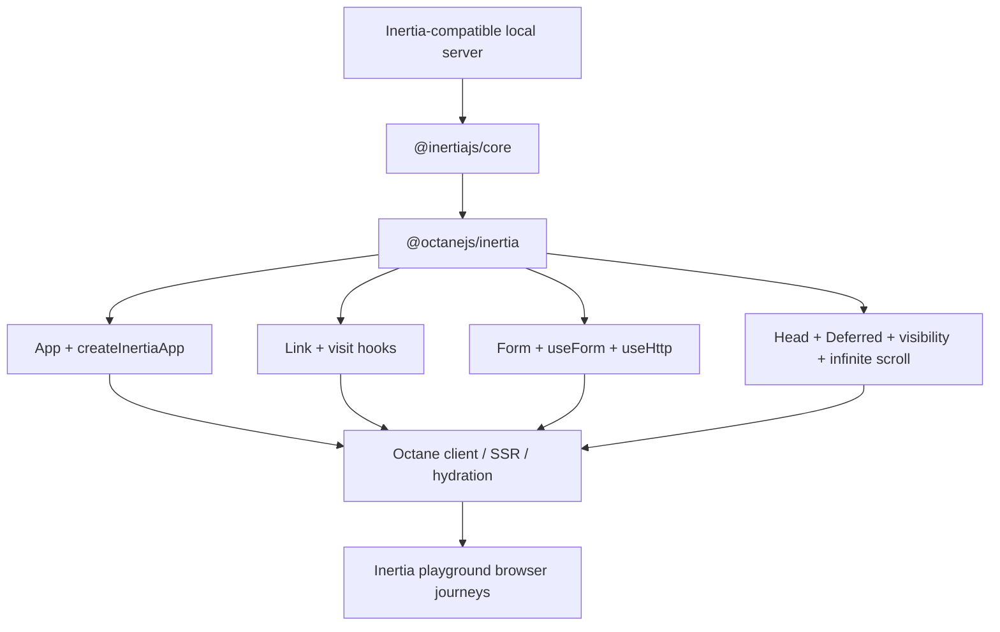
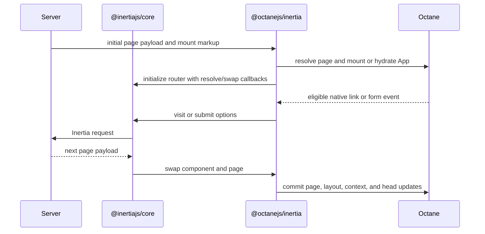
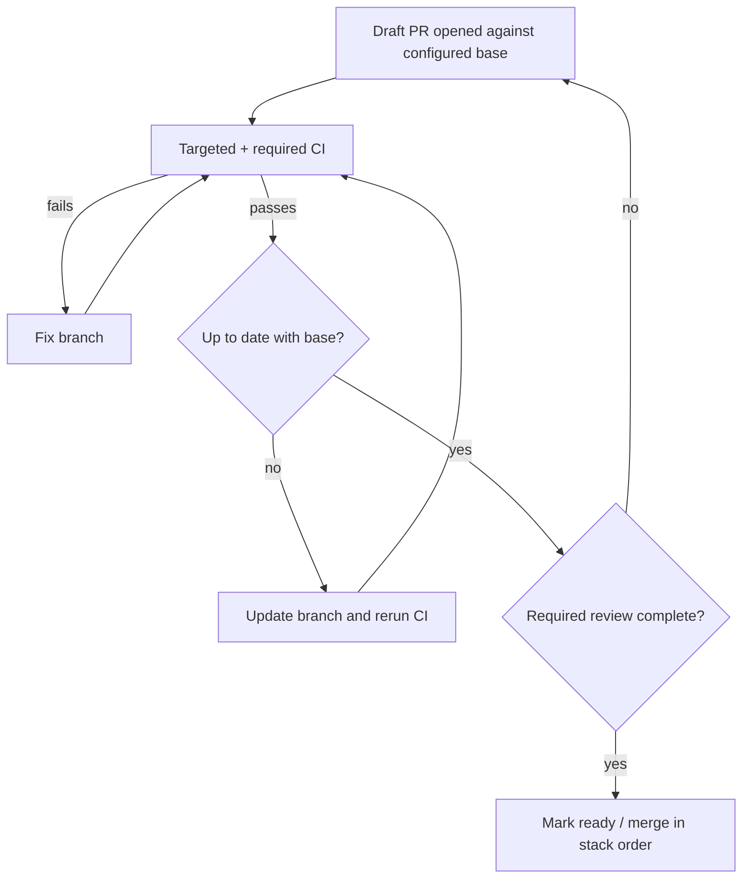

# feat: Add Inertia.js binding

## Goal Capsule

- **Objective:** Ship an `@octanejs/inertia` binding that matches the supported public surface and observable behavior of `@inertiajs/react@3.6.1`, reuses `@inertiajs/core`, and proves client navigation, forms, SSR, hydration, and representative advanced features in a real protocol-aware playground.
- **Authority:** This plan and repository guidance define the Octane port; the exact pinned Inertia 3.x source defines adapter behavior; current Octane public contracts override React implementation details.
- **Execution profile:** Implement in dependency order through stacked draft pull requests. A PR becomes ready only after its own required verification is green and its head is up to date with its configured base branch.
- **Stop conditions:** Stop and surface a blocker if the pinned adapter requires an unsupported public Octane capability, if parity would require a React-specific compatibility layer, or if the playground cannot verify the Inertia protocol without adding an out-of-scope production server adapter.
- **Tail ownership:** The final binding PR owns release metadata, generated inventories, the standalone playground, the complete verification matrix, and readiness of all prerequisite draft PRs.

---

## Product Contract

### Summary

Add a first-party Octane client adapter for Inertia.js 3.x.
The binding reuses the published framework-neutral core and ports only the React-owned hooks, providers, components, root lifecycle, and SSR integration.
The work includes an isolated playground because Inertia is a server-driven navigation protocol whose important behavior cannot be proven by the static central playground.

### Problem Frame

Inertia provides a broad React adapter over a framework-neutral core, but React component code cannot execute unchanged on Octane.
The adapter coordinates page swaps, contexts, head management, links, visits, forms, visibility, polling, prefetching, SSR, and hydration.
A credible Octane port must preserve those consumer contracts without copying React's `createElement`, `forwardRef`, synthetic-event, StrictMode, or ReactDOM assumptions.

### Requirements

**Upstream and package contract**

- R1. The implementation pins `@inertiajs/react@3.6.1` to an exact 3.x commit and records the source provenance used for runtime exports, public types, tests, and later upgrades.
- R2. The binding is published as `@octanejs/inertia` and reuses `@inertiajs/core` rather than forking or rebranding the framework-neutral core.
- R3. The binding preserves the supported `@inertiajs/react` root and `./server` export contracts, with bidirectional runtime-export and public-type checks.
- R4. React-only behavior that has no Octane equivalent is omitted or adapted through documented Octane contracts, never emulated with a React compatibility runtime.

**Application lifecycle**

- R5. `createInertiaApp` supports manual client setup and the adapter contract consumed by Inertia's optional Vite automation, including page resolution, initial mount, hydration, defaults, HTTP configuration, progress, application wrapping, and page-specific layout configuration.
- R6. The root `App` initializes the Inertia router, swaps resolved page components, preserves or resets state as directed, updates flash and server-head state, provides page/head contexts, and renders persistent layouts.
- R7. `usePage`, `useRemember`, layout-prop state, and related contexts update consumers and clean up subscriptions without leaking state across roots or SSR requests.

**Navigation and data behavior**

- R8. `Link` preserves Inertia visit, prefetch, pending, cancellation, method, data, component, and instant-visit behavior while using native Octane events and refs-as-props.
- R9. `Head`, `Deferred`, `WhenVisible`, and `InfiniteScroll` preserve their consumer-visible rendering, registration, reload, trigger, URL, and cleanup behavior.
- R10. `usePoll` and `usePrefetch` preserve timing, lifecycle, caching, cancellation, and manual-control behavior against the framework-neutral router.

**Forms and HTTP**

- R11. `useForm`, `useHttp`, and their shared state layer preserve data, defaults, dirty state, errors, progress, success timing, cancellation, optimistic updates, remembering, and precognition behavior.
- R12. `Form` and `useFormContext` preserve submission serialization, context, slot/render props, reset/default policies, progress, errors, cancellation, and imperative ref behavior using native form events.
- R13. Public library callbacks keep their upstream `onChange` spelling; only standard text-host wiring that means per-edit input uses Octane's native `onInput`.

**SSR, playground, and release evidence**

- R14. Server rendering returns Inertia head/body output with per-request isolation, and client hydration adopts server markup without duplicate initialization or requests.
- R15. A standalone Inertia playground exercises a minimal protocol-aware application with initial load, client navigation, form errors/success, deferred data, history, and an SSR/hydration lane.
- R16. The package includes upstream-derived conformance coverage, focused Octane integration tests, public type tests, packed-consumer smoke coverage without React, compatibility documentation, status metadata, and a patch changeset.
- R17. Each implementation pull request remains draft until its targeted and repository-required checks are green and its branch is up to date with its configured base branch.

### Key Flow

- F1. **Render and navigate an Inertia application**
  - **Trigger:** An Inertia-compatible server returns an initial page payload and mount element.
  - **Actors:** Application developer, application user, Inertia server adapter.
  - **Steps:** The Octane adapter resolves and mounts the page, provides contexts and layouts, intercepts an eligible link or form event, delegates the visit to `@inertiajs/core`, swaps the returned page, and synchronizes history, head, scroll, and preserved state.
  - **Outcome:** The server-driven application behaves as a client-side navigation experience without a React runtime.
  - **Covered by:** R2-R15.

### Acceptance Examples

- AE1. **Core reuse:** Given an application installs `@octanejs/inertia` with compatible `@inertiajs/core`, when it imports `router`, `http`, or `progress`, then those exports are the upstream core objects and React is absent from the installed runtime graph. Covers R2-R4.
- AE2. **Preserved visit:** Given a rendered page with local state and a `Link` requesting state preservation, when the mocked Inertia endpoint returns a second page, then the new page renders, the requested state survives, history/head state updates, and no native navigation occurs. Covers R5-R10.
- AE3. **Form validation:** Given a form with text and file-capable fields, when the server returns validation errors and a later success, then native submit is intercepted, data and progress callbacks follow the upstream contract, errors display and clear, and success/default state settles correctly. Covers R11-R13.
- AE4. **Visibility-driven data:** Given deferred and infinite data regions, when their observers cross the configured thresholds, then only the required props reload, duplicate triggers are controlled, URL preservation follows options, and unmount cancels observers/listeners. Covers R9-R10.
- AE5. **SSR adoption:** Given an Inertia page is rendered on the server, when the client hydrates it, then head/body output matches, existing DOM is adopted, the page becomes interactive, and initialization does not issue a duplicate visit. Covers R5-R7, R14-R15.
- AE6. **Draft readiness:** Given a stacked migration PR depends on an earlier binding PR, when its implementation and review are complete, then it remains draft until checks pass and GitHub reports it current with that PR's base; the final PR is not readied before every prerequisite is ready or merged. Covers R17.

### Success Criteria

- The supported runtime export surface matches the pinned `@inertiajs/react` surface in both directions, with every omission listed as an intentional divergence.
- Representative upstream scenarios pass for root lifecycle, layouts, links, head, forms, visibility, polling, prefetching, infinite scroll, SSR, and hydration.
- The standalone playground passes development, production build, client navigation, form, history, SSR, hydration, and unmount journeys.
- Packed installation and build verification succeed without `react`, `react-dom`, or `@types/react`.
- Package, binding-status, parity-gap, example-catalog, and changeset metadata are current.
- Every migration PR satisfies the green-and-current draft readiness gate.

### Scope Boundaries

**In scope**

- The public `@inertiajs/react@3.6.1` adapter surface that maps to Octane's documented client, SSR, hydration, context, hooks, refs, native events, and head-management contracts.
- Direct reuse of `@inertiajs/core`, `es-toolkit`, and `laravel-precognition` where the pinned React adapter uses them.
- A protocol-aware local playground server sufficient to test the client adapter.

### Deferred to Follow-Up Work

- An `@octanejs/inertia-vite` port or automatic page-resolution integration for `@inertiajs/vite`.
- Production server adapters for Laravel, Rails, Phoenix, Django, or another backend.
- Browser coverage for every page in Inertia's large upstream framework test application.
- Support for a newer Inertia 3.x release after the pinned baseline lands.

**Outside this product's identity**

- Running unmodified React adapter component source on Octane.
- Shipping React, ReactDOM, synthetic events, StrictMode double-invoke, or a React compatibility layer.
- Forking `@inertiajs/core` when its public package can be reused.

---

## Planning Contract

### Key Technical Decisions

- KTD1. **Reuse `@inertiajs/core`; do not migrate a core binding first.** The 3.6.1 React package declares `@inertiajs/core` as its only Inertia runtime dependency, and the core package has no framework peer dependency. This follows `packages/apollo-client` and `packages/tanstack-router`, which retain framework-neutral upstream cores.
- KTD2. **Pin one reproducible upstream baseline.** Start from `@inertiajs/react@3.6.1` and record the exact 3.x commit selected at implementation start; the branch head observed during planning was `68b13b662d7a6ecdd504026ee18733192b0c7d73`. Do not chase branch movement inside an active PR stack, and do not mix files from the release tag and a later branch head without an explicit provenance entry.
- KTD3. **Port framework bindings; preserve framework-neutral imports.** Re-author components in `.tsrx` and hooks in the package's chosen slotted-source form, copying or vendoring adapter-private logic only when it is not exported by core and its provenance remains reviewable.
- KTD4. **Adapt React constructs through Octane contracts.** Rewrite `forwardRef` as a `ref` prop, use native events, replace React element inspection with explicit Octane renderable/component rules, use Octane root/SSR APIs, and omit StrictMode behavior.
- KTD5. **Prove behavior at three observation boundaries.** Use upstream-derived unit/conformance tests for adapter state machines, real-browser journeys for protocol/history/visibility/focus behavior, and SSR/hydration tests for request isolation and DOM adoption.
- KTD6. **Use an isolated playground instead of the central static demo shell.** `playground/octane` uses hash navigation and no protocol server; an `examples/inertia-playground` workspace can own deterministic Inertia responses, history navigation, SSR, and hydration without corrupting the central playground's routing model.
- KTD7. **Land as a stack of draft PRs.** (session-settled: user-directed — chosen over marking partially verified work ready: each PR stays draft until green and current with its base.) The stack separates dependency/pure-hook work, UI/root lifecycle work, and SSR/playground/release evidence while keeping every intermediate branch testable.
- KTD8. **Use the playground as release evidence, not as a substitute for package tests.** (session-settled: user-directed — chosen over relying only on isolated tests: realistic protocol journeys are required where they add evidence.) The final playground consumes the workspace package through public exports and must not import package internals.
- KTD9. **Keep Vite automation outside the first binding release.** The adapter exposes the setup contract that `@inertiajs/vite` can consume, but the playground uses an explicit resolver and setup path. This prevents a second external package migration from becoming an undeclared prerequisite while leaving a focused Vite-plugin follow-up.
- KTD10. **Treat upstream module globals as behavior to validate, not architecture to copy.** The React adapter's module-level pending swap and initialization flags satisfy early reloads but can couple roots and tests. The Octane port should preserve early-swap behavior through root-scoped ownership unless tests prove the upstream singleton is a required public constraint.

### High-Level Technical Design

#### Component topology

#### Page and visit lifecycle

#### Draft PR readiness gate

### Implementation Constraints

- Read `AGENTS.md`, `.agents/skills/octane-react-library-port/SKILL.md`, `.agents/memories/testing.md`, and `.agents/memories/tsrx-authoring.md` before implementation.
- Components authored in `.tsrx` require corresponding public declaration coverage; never add a published ambient `declare module '*.tsrx'`.
- Tests assert observable contracts rather than React internals, Fiber timing, synthetic events, or private Inertia implementation fields.
- Genuine Octane runtime/compiler defects get regression coverage and root-cause fixes in the owning package; do not hide them in the binding.
- Every upstream-derived test or source fragment records its exact source path and pinned commit.
- The local playground server is test infrastructure, not a production backend adapter.
- Generated binding/package/example inventories are regenerated through repository scripts rather than edited directly.

### Sequencing and Pull Request Strategy

1. **PR A — core reuse and hook foundation:** U1-U2. Base branch is the repository default branch.
2. **PR B — root, navigation, forms, and data components:** U3-U4. Base branch is PR A's branch until PR A merges, then retarget/update against the default branch.
3. **PR C — SSR, playground, documentation, and release proof:** U5-U6. Base branch is PR B's branch until earlier PRs merge.
4. Open each PR as draft as soon as its reviewable scope exists. Record targeted validation in the PR body.
5. Before marking any PR ready, require its checks to pass and update it with its current base. A base update invalidates the prior green result until checks pass again.
6. Merge in dependency order. After each merge, retarget and update the next PR, wait for green CI, and only then consider it ready.

### Risks and Mitigations

- **Adapter breadth:** The React package has hooks, providers, root lifecycle, forms, visibility observers, infinite scrolling, and SSR. Mitigate with a bidirectional export ledger, explicit source provenance, and phased PRs.
- **Global router state:** The upstream adapter uses module-level initialization/swap state. Verify multi-root, remount, test-isolation, and SSR-request behavior before preserving that shape.
- **React element/layout assumptions:** Upstream detects React elements and render functions. Define equivalent Octane component/layout inputs explicitly and lock them with type and runtime tests.
- **Browser-only APIs:** IntersectionObserver, history, scroll, file upload, progress, and focus are weakly modeled in jsdom. Use real-browser playground journeys for those contracts.
- **SSR false positives:** Inertia can fall back to client rendering when SSR fails. Tests must assert server head/body content and hydration adoption, not merely eventual client success.
- **Upstream churn:** Inertia 3.x is active. Pin the baseline and defer upgrades until the initial port is complete.

### System-Wide Impact

- **Runtime/compiler:** The binding is expected to use existing public Octane hooks, contexts, roots, native events, refs, SSR, and hydration. Any newly exposed defect must be fixed and regression-tested in `packages/octane`; adding binding-only runtime behavior is prohibited.
- **Build and types:** A source-published `.tsrx` package affects hook-slot configuration, declaration generation, the root typecheck chain, Vitest projects, and packed-consumer verification.
- **Package discovery:** Adding a publishable `@octanejs/*` package changes package inventory, binding status, CLI binding data, website directory data, parity-gap indexing, and example-catalog validation.
- **Examples and CI:** The protocol playground adds a server-backed example with build and browser gates. Its deterministic fixtures must not depend on a user's Laravel installation or an external service.
- **Support posture:** The initial release supports the client adapter and its server rendering contract, not a production backend adapter or automatic Vite integration. Documentation must make that boundary visible during installation.

### Sources and Research

- `AGENTS.md` and `.agents/skills/octane-react-library-port/SKILL.md` — repository binding-port contract.
- `docs/react-library-compat-plan.md` — core-reuse, differential-test, and divergence methodology.
- `packages/apollo-client` and `docs/apollo-client-port-plan.md` — full adapter surface, SSR, public type, and packed-consumer precedent.
- `packages/tanstack-router` and `docs/tanstack-parity-audit.md` — router, link, layouts, SSR, and native-event precedent.
- `packages/hook-form` and `docs/octanejs-hook-form-plan.md` — form state, native input, upstream-test, and typetest precedent.
- `playground/octane` and `examples/cinebase` — central static playground boundary and standalone system-fixture precedent.
- [Inertia React 3.x source](https://github.com/inertiajs/inertia/tree/3.x/packages/react) — authoritative adapter implementation and test application.
- [Inertia React 3.6.1 manifest](https://raw.githubusercontent.com/inertiajs/inertia/3.x/packages/react/package.json) and [core manifest](https://raw.githubusercontent.com/inertiajs/inertia/3.x/packages/core/package.json) — dependency and export boundaries.
- [Inertia v3 client setup](https://inertiajs.com/docs/v3/installation/client-side-setup), [SSR](https://inertiajs.com/docs/v3/advanced/server-side-rendering), and [testing](https://inertiajs.com/docs/v3/advanced/testing) — current initialization, server-rendering, and verification contracts.

---

## Implementation Units

### U1. Pin upstream and scaffold the binding package

- **Goal:** Establish a reproducible package, dependency, export, type, and test foundation around the framework-neutral core.
- **Requirements:** R1-R4, R16-R17; AE1; KTD1-KTD3, KTD7.
- **Dependencies:** None.
- **Files:**
  - `packages/inertia/package.json`
  - `packages/inertia/tsconfig.json`
  - `packages/inertia/status.json`
  - `packages/inertia/README.md`
  - `packages/inertia/src/index.ts`
  - `packages/inertia/src/server.ts`
  - `packages/inertia/tests/conformance/exports.test.ts`
  - `packages/inertia/typetests/public-api.test-d.ts`
  - `packages/inertia/typetests/react-types-must-not-be-imported.d.ts`
  - `packages/inertia/typetests/tsconfig.json`
  - `vitest.config.js`
  - `package.json`
- **Approach:**
  1. Record the package version, exact commit, source paths, runtime exports, type exports, and explicit exclusions in a parity ledger.
  2. Add `@inertiajs/core`, `es-toolkit`, and `laravel-precognition` at versions compatible with the pinned adapter; keep Octane as the renderer peer.
  3. Re-export framework-neutral `router`, `http`, and `progress`, and expose the upstream core server entry through the binding's `./server` contract.
  4. Configure package-local test and typecheck projects without React as a runtime dependency.
- **Patterns to follow:** `packages/apollo-client/package.json`, `packages/apollo-client/status.json`, `packages/tanstack-router/package.json`, `scripts/workspace-packages.mjs`.
- **Test scenarios:**
  - Import every expected root and server runtime export and verify no expected symbol is missing or unintended symbol added.
  - Resolve the binding in a type program without `@types/react`; public declarations must not import React or ReactDOM types.
  - Import `router`, `http`, and `progress` from the binding and core; each binding export must preserve the upstream object identity.
  - Inspect the packed manifest and install it in a canary consumer; the declared core/runtime boundaries and missing-Octane peer behavior must match repository package conventions.
- **Verification:** The package is discoverable as a framework binding, its targeted tests/type tests pass, and PR A can open in draft with an explicit pinned-upstream ledger.

### U2. Port hooks, contexts, layout state, and form state

- **Goal:** Recreate the adapter's non-rendering reactive layer on Octane hooks before component and root integration.
- **Requirements:** R6-R7, R10-R13, R16; AE3; KTD3-KTD5.
- **Dependencies:** U1.
- **Files:**
  - `packages/inertia/src/PageContext.ts`
  - `packages/inertia/src/HeadContext.ts`
  - `packages/inertia/src/layoutProps.ts`
  - `packages/inertia/src/usePage.ts`
  - `packages/inertia/src/useRemember.ts`
  - `packages/inertia/src/usePoll.ts`
  - `packages/inertia/src/usePrefetch.ts`
  - `packages/inertia/src/useFormState.ts`
  - `packages/inertia/src/useForm.ts`
  - `packages/inertia/src/useHttp.ts`
  - `packages/inertia/tests/conformance/hooks.test.tsx`
  - `packages/inertia/tests/conformance/forms-state.test.tsx`
  - `packages/inertia/tests/ssr/hooks.server.test.tsx`
- **Approach:**
  1. Port framework hooks against Octane primitives while preserving explicit dependency arrays and public return-object stability where upstream guarantees it.
  2. Keep `UseFormUtils`, precognition, cloning, router, and HTTP behavior in their upstream framework-neutral dependencies.
  3. Audit module-level stores and timers for test, unmount, multi-root, and SSR isolation.
  4. Cite and adapt representative upstream hook/form tests, classifying every mismatch before changing Octane or the adapter.
- **Execution note:** Start with export/type pins and upstream-derived failing behavioral cases for each hook family.
- **Patterns to follow:** `packages/hook-form/src`, `packages/nuqs/src`, `packages/tanstack-router/src/useStore.ts`.
- **Test scenarios:**
  - `usePage` outside a provider throws the documented adapter error; inside a provider it returns current props and reacts to a page swap.
  - `useRemember` restores keyed state, writes updates, honors excluded fields, supports multiple keys, and stops writing after unmount.
  - Polling starts/stops manually, respects visibility options and interval changes, avoids overlapping requests, and cleans up on unmount.
  - Prefetch exposes pending/cached state, honors cache timing/tags, cancels or cleans up correctly, and does not duplicate subscriptions after rerender.
  - Form state tracks nested data, defaults, dirtiness, errors, progress, recent success timers, reset, and unmount-safe async callbacks.
  - Form and HTTP helpers serialize GET/query, JSON, and file-capable payloads correctly; cancellation, optimistic rollback, validation errors, network errors, and success update the public state/callbacks as specified.
  - Server execution creates request-local context/form state and does not retain browser listeners, timers, or prior request data.
- **Verification:** Hook and state suites pass in client and server projects, public return types match the pinned declarations, and no React imports enter the runtime/type graph.

### U3. Port App, createInertiaApp, contexts, and layouts

- **Goal:** Mount, hydrate, initialize, swap, and render page components and persistent layouts through Octane.
- **Requirements:** R5-R7, R14, R16; F1; AE2, AE5; KTD2-KTD5.
- **Dependencies:** U1-U2.
- **Files:**
  - `packages/inertia/src/App.tsrx`
  - `packages/inertia/src/App.tsrx.d.ts`
  - `packages/inertia/src/createInertiaApp.ts`
  - `packages/inertia/src/layoutProps.ts`
  - `packages/inertia/src/types.ts`
  - `packages/inertia/tests/_fixtures/app.tsrx`
  - `packages/inertia/tests/conformance/app.test.ts`
  - `packages/inertia/tests/hydration/app.test.ts`
  - `packages/inertia/tests/ssr/app.server.test.ts`
- **Approach:**
  1. Define Octane-native component, renderable, child-render, and layout types instead of preserving React element introspection.
  2. Initialize the core router at the earliest point needed for mount-time reloads, but contain mutable initialization/swap state so remounts, multiple roots, and server requests cannot cross-contaminate.
  3. Render page, head, and layout providers with Octane contexts; translate persistent/nested layout reduction into Octane-renderable composition.
  4. Map manual setup and the Vite-automation-compatible adapter contract to `createRoot`/`hydrateRoot`; map server setup to Octane rendering without StrictMode.
- **Patterns to follow:** `packages/tanstack-router/src/RouterProvider.tsrx`, `packages/apollo-client/src/react/context`, `packages/octane/src/index.ts`, `packages/octane/src/server`.
- **Test scenarios:**
  - Initial mount resolves the named component, supplies page props/context, renders the configured default layout, and initializes the router once for that root.
  - A swap without preservation resets page-local state/layout props; a preserved swap retains the expected component state and key behavior.
  - Page-owned static, callback, named, nested, and default layouts receive the correct page and dynamic layout props.
  - A router swap arriving before effects are installed is replayed rather than dropped.
  - Flash and server-head navigation events update current context/head state and detach listeners on unmount.
  - Two sequential mounts and two server requests do not reuse component, page, head-manager, or pending-swap state.
  - Manual setup receives the public Octane `App` and props contract; a Vite-generated-style caller can use the same contract to mount or hydrate according to the existing marker without importing React.
- **Verification:** Root lifecycle tests pass across client, SSR, and hydration projects, including multi-root/request-isolation cases.

### U4. Port links, forms, head, and data-loading components

- **Goal:** Complete the consumer-facing component surface using native events, refs-as-props, observers, and upstream core behavior.
- **Requirements:** R8-R13, R16; F1; AE2-AE4; KTD3-KTD5.
- **Dependencies:** U2-U3.
- **Files:**
  - `packages/inertia/src/Link.tsrx`
  - `packages/inertia/src/Form.tsrx`
  - `packages/inertia/src/Head.tsrx`
  - `packages/inertia/src/Deferred.tsrx`
  - `packages/inertia/src/WhenVisible.tsrx`
  - `packages/inertia/src/InfiniteScroll.tsrx`
  - `packages/inertia/src/*.tsrx.d.ts`
  - `packages/inertia/tests/_fixtures/components.tsrx`
  - `packages/inertia/tests/conformance/link.test.ts`
  - `packages/inertia/tests/conformance/form.test.ts`
  - `packages/inertia/tests/conformance/head.test.ts`
  - `packages/inertia/tests/conformance/data-components.test.ts`
  - `packages/inertia/tests/browser/components.test.ts`
- **Approach:**
  1. Port each component as `.tsrx`; preserve public callback names and map only host event wiring to native Octane semantics.
  2. Replace `forwardRef` with a normal `ref` prop and define custom-component/as-prop behavior through Octane's dynamic component/element contracts.
  3. Delegate visit, prefetch, head, form, infinite-scroll, and observer state machines to core wherever public helpers exist.
  4. Run jsdom conformance for deterministic state and browser tests for history, observer, focus, native-event, and scroll behavior.
- **Execution note:** Add representative upstream-derived failing tests component by component; do not port the upstream test app wholesale.
- **Patterns to follow:** `packages/tanstack-router/src/Link.tsrx`, `packages/hook-form/src/form.tsrx`, `packages/remix-router/src`, repository browser-test fixtures.
- **Test scenarios:**
  - Eligible primary-button link clicks are intercepted; modified, external, target, download, and prevented clicks retain native behavior.
  - Non-GET links render the safe default host, merge data/query options, forward refs, report pending state, and execute lifecycle callbacks once.
  - Hover/mount/click prefetch modes honor delay/cache options and do not leak timers or duplicate visits after rerender/unmount.
  - Form submission serializes named, nested, dotted, checkbox/radio, select, button, and file values; reset/default/success/error options and context/render props match the pinned contract.
  - Public `onChange` callbacks remain named `onChange`, while standard text hosts use `onInput` for per-edit behavior without double firing.
  - Head instances merge, update, remove, escape titles/content, honor nonce/server-head inputs, and clean up independently.
  - Deferred renders fallback until all configured props resolve and handles rescued/missing props according to core page metadata.
  - Visibility and infinite-scroll components observe the intended element/root/buffer, avoid duplicate concurrent reloads, preserve or update URLs as configured, handle empty/short/reverse lists, and cancel observers on unmount.
- **Verification:** Component conformance and real-browser tests pass, and PR B is green and current with PR A before it can leave draft.

### U5. Complete SSR and hydration integration

- **Goal:** Prove server head/body generation, request isolation, hydration adoption, and interactive post-hydration visits.
- **Requirements:** R5-R7, R9, R14, R16; AE5; KTD4-KTD5.
- **Dependencies:** U3-U4.
- **Files:**
  - `packages/inertia/src/createInertiaApp.ts`
  - `packages/inertia/src/server.ts`
  - `packages/inertia/tests/ssr/create-inertia-app.server.test.ts`
  - `packages/inertia/tests/ssr/request-isolation.server.test.ts`
  - `packages/inertia/tests/hydration/create-inertia-app.test.ts`
  - `scripts/check-package-packs.mjs`
  - `scripts/package-pack-canaries.test.mjs`
- **Approach:**
  1. Implement the server render-function factory and direct render path using Octane's server result while preserving Inertia's `head` and `body` response contract.
  2. Prove fresh head manager, router-facing state, and page resolution per request.
  3. Hydrate the generated mount element, assert node adoption and live events, then execute a real Inertia visit.
  4. Extend packed-consumer verification to exercise root/server exports without React packages installed.
- **Patterns to follow:** `packages/apollo-client/tests/ssr`, `packages/apollo-client/tests/hydration.test.ts`, `scripts/check-package-packs.mjs`.
- **Test scenarios:**
  - Server rendering resolves a page, layouts, title/head entries, and scoped CSS into the expected Inertia response body without browser globals.
  - Concurrent and sequential SSR requests with different pages/heads never share output or mutable state.
  - A resolver rejection or render error propagates through the documented server failure path rather than silently returning successful empty output.
  - Hydration adopts the existing root/page DOM, preserves user-modified input state where Octane promises it, attaches events, and avoids duplicate initialization/network work.
  - A post-hydration link visit updates page/head/history and unmount removes router/head listeners.
  - A packed consumer installs Octane, core, and the binding without React or React types; client/server builds, typechecking, and representative SSR execution succeed.
- **Verification:** SSR, hydration, packed-install, and package-canary gates pass in isolation and as part of repository validation.

### U6. Add the protocol playground, documentation, and release gates

- **Goal:** Demonstrate the binding through public APIs in a real application and finish all package/repository release evidence.
- **Requirements:** R15-R17; F1; AE2-AE6; KTD6-KTD8.
- **Dependencies:** U1-U5.
- **Files:**
  - `examples/inertia-playground/package.json`
  - `examples/inertia-playground/example.json`
  - `examples/inertia-playground/README.md`
  - `examples/inertia-playground/vite.config.ts`
  - `examples/inertia-playground/src/entry-client.ts`
  - `examples/inertia-playground/src/entry-server.ts`
  - `examples/inertia-playground/src/Pages/*.tsrx`
  - `examples/inertia-playground/src/server.ts`
  - `examples/inertia-playground/e2e/*.test.ts`
  - `examples/inertia-playground/e2e/fixtures/*`
  - `packages/inertia/README.md`
  - `packages/inertia/status.json`
  - `website/src/content/bindings.json`
  - `.changeset/*-inertia-binding.md`
  - `docs/packages.md`
  - `docs/bindings-status.md`
  - `docs/binding-parity-gaps.md`
  - `examples/catalog.json`
  - `packages/cli/src/data/octane-data.json`
- **Approach:**
  1. Build a deterministic local server that emits initial HTML and Inertia protocol responses for a small page set; keep it isolated inside the example.
  2. Exercise initial render, navigation/history, preserved state, forms, validation, deferred/visible data, head changes, SSR, hydration, and unmount through public package exports.
  3. Document supported surface, intentional divergences, upstream provenance, server-adapter requirements, playground usage, and upgrade procedure.
  4. Regenerate status, package, parity-gap, CLI, and example catalogs; add a patch changeset.
  5. Complete the stacked draft-PR readiness loop after each earlier merge or base retarget.
- **Patterns to follow:** `examples/cinebase`, `examples/hacker-news`, `examples/lexical-playground`, `scripts/examples-catalog.mjs`, `scripts/generate-bindings-status.mjs`.
- **Test scenarios:**
  - Development and production-preview journeys load the initial server page and navigate forward/back without full document reloads.
  - A preserved-state visit retains local page state; a non-preserved visit resets it.
  - Form submission displays server validation errors, then succeeds and updates page/head state; cancellation/unmount prevents stale updates.
  - Deferred and visibility-driven content loads through real observer/network behavior, and infinite navigation/history remain stable.
  - SSR output includes page content/head and hydration adopts it before an interactive visit.
  - Example/catalog checks reject missing binding declarations, stale generated metadata, or a playground that imports package internals.
  - Covers AE6. Every PR remains draft while failing, behind its base, or awaiting required review; after a base update, CI reruns before readiness.
- **Verification:** The example's typecheck/build/E2E gates, package tests, repository generated-file checks, full required CI, and draft-readiness audit all pass.

---

## Verification Contract

| Gate | Applies to | Done signal |
|---|---|---|
| Package Vitest project | U1-U5 | All Inertia conformance, hook, component, SSR, and hydration tests pass with no skipped or expected-failure parity cases. |
| Package and public typetests | U1-U6 | Public types compile, match the supported pinned surface, and import no React types. |
| Real-browser playground journeys | U4, U6 | Development and production-preview protocol, history, form, visibility, SSR, and hydration journeys pass. |
| Packed-consumer canary | U1, U5-U6 | Installation, client/server builds, types, and SSR execution pass without React packages. |
| Generated contracts | U1, U6 | Package, binding status, parity gaps, CLI data, and example catalogs are current. |
| Repository quality gates | All | `pnpm format:check`, `pnpm typecheck`, and `pnpm test` pass at the final integration boundary; targeted gates are recorded on each PR. |
| Draft PR readiness | All | Each PR is green, reviewed as required, and current with its configured base before it is marked ready; dependent PRs are retargeted and revalidated after prerequisite merges. |

---

## Definition of Done

- `@octanejs/inertia` exposes the supported pinned adapter and server surfaces with documented intentional divergences.
- `@inertiajs/core` is reused directly; no unnecessary core binding or fork exists.
- U1-U6 test scenarios pass at their specified observation boundaries.
- The standalone playground proves the Inertia protocol, forms, history, SSR, and hydration through public package APIs.
- Packed consumers require neither React runtime packages nor React type packages.
- README, status metadata, changeset, package inventory, binding status, parity-gap index, CLI data, and example catalog are current.
- Every PR in the stack is green and up to date with its base before readiness or merge, and the final integration branch is green against the repository default branch.
- Genuine Octane defects found during the port have owning-package regression tests and root-cause fixes; no binding-local workaround masks them.
- Dead-end experiments, stale compatibility shims, skipped tests, temporary fixtures, and abandoned generated output are removed from the final diff.
