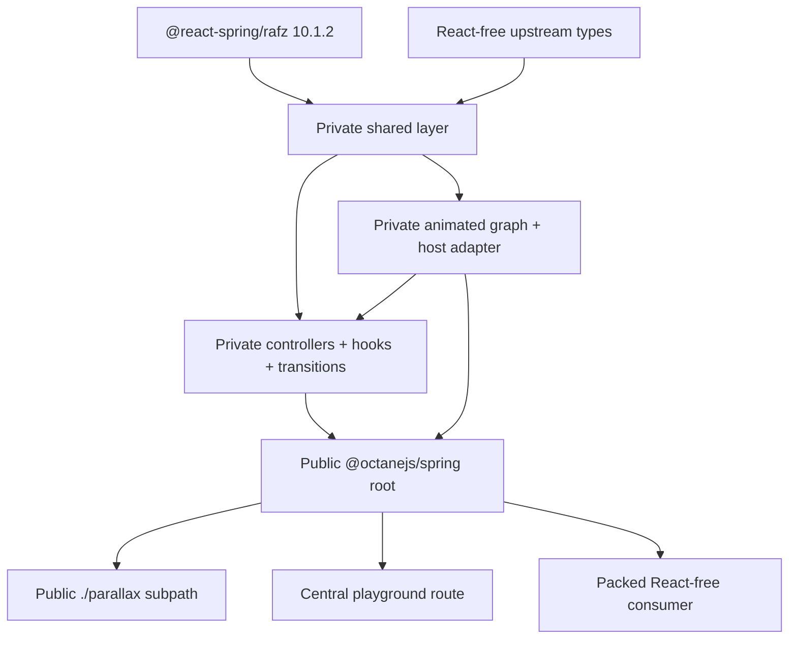
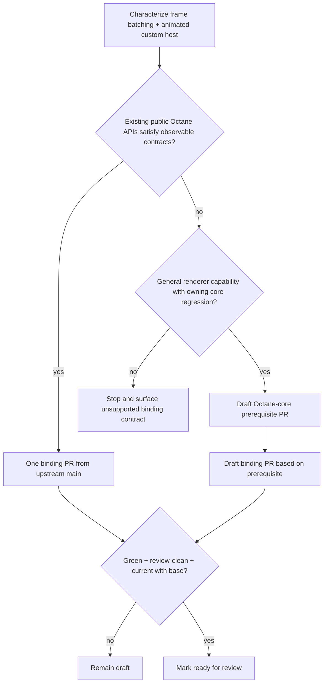
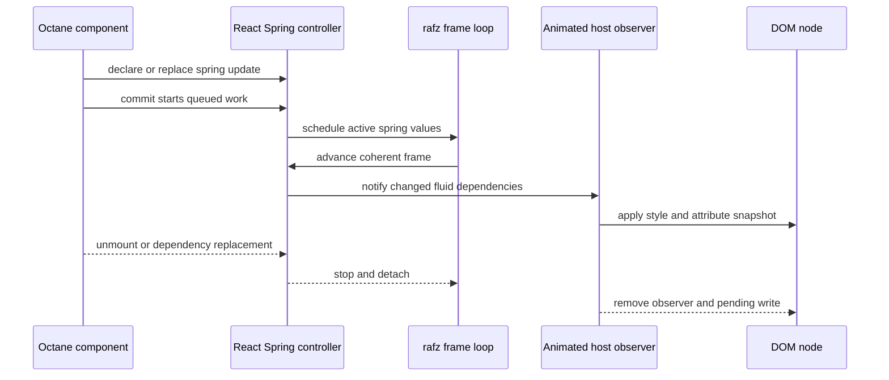

# React Spring web binding - Plan

## Goal Capsule

- **Objective:** Ship an `@octanejs/spring` binding for the stable React Spring 10.1.2 web and Parallax surfaces, preserving spring physics, imperative control, animated hosts, transitions, SSR, hydration, and public types without a React runtime dependency.
- **Authority:** This plan and repository guidance define the Octane package contract; React Spring tag `v10.1.2` at commit `59b1e5306402d3039120e2da464b66e10b1a1aa1` defines upstream behavior and types; current Octane public contracts override React implementation details.
- **Execution profile:** Work in the dedicated `feat/react-spring-binding` worktree. Use one binding PR unless a characterization gate proves an Octane-core prerequisite is necessary. Every opened PR remains draft until its required checks are green and its head is current with its configured base branch.
- **Stop conditions:** Stop and surface a blocker if the stable upstream contract requires unsupported React element behavior that cannot be adapted through public Octane APIs, if source provenance cannot be preserved, or if a proposed core change serves only this binding.
- **Tail ownership:** The binding PR owns the supported package surface, upstream provenance, tests, playground proof, generated inventories, compatibility documentation, packed-consumer verification, and patch changeset.

---

## Product Contract

### Summary

Add one Octane binding for React Spring's stable web target.
The package keeps upstream's controller, spring-value, interpolation, and frame-loop model while replacing React hooks and animated components with Octane equivalents.
The first release includes Parallax as a subpath and excludes renderer targets Octane does not own.

### Problem Frame

React Spring presents a compact `@react-spring/web` API, but its internal package names do not mark clean framework boundaries.
At 10.1.2, `@react-spring/core`, `@react-spring/shared`, and `@react-spring/animated` still import React hooks, contexts, element types, or `forwardRef`.
Only lower layers such as `@react-spring/rafz` and the runtime-free type package can be consumed unchanged.

The existing `@octanejs/motion` package proves Octane can drive host nodes from frame-based values through public `hostComponent`, context, ref, and effect primitives.
React Spring adds a different lifecycle surface: declarative and imperative controllers, spring-value dependency graphs, transition retention, async animation queues, reduced motion, resize and visibility observers, server rendering, and Parallax scroll coordination.
A credible port must preserve those contracts rather than substituting Motion's engine or the deterministic interpolator currently used inside `@octanejs/visx`.

### Actors

- A1. **Octane application developer:** replaces `@react-spring/web` or `@react-spring/parallax` with the documented Octane package and retains the supported API.
- A2. **Binding maintainer:** audits a pinned upstream release, ports framework-bound layers, and expands parity from recorded evidence.
- A3. **Octane reviewer:** evaluates one complete binding PR or a narrowly justified core-prerequisite stack.

### Requirements

**Upstream and package contract**

- R1. The implementation targets React Spring `v10.1.2` at commit `59b1e5306402d3039120e2da464b66e10b1a1aa1` and records file-level provenance for adapted source and tests.
- R2. The public package is `@octanejs/spring`, with the stable web API at the root and Parallax at `@octanejs/spring/parallax`.
- R3. Runtime source contains no `react`, `react-dom`, or React type dependency; `@react-spring/rafz` may remain an exact upstream runtime dependency and upstream React packages may appear only as development or differential oracles.
- R4. The package preserves the supported runtime exports and public type contracts of `@react-spring/web@10.1.2` and `@react-spring/parallax@10.1.2` in both directions, with every omission recorded as an intentional divergence.

**Spring engine and lifecycle**

- R5. `SpringValue`, `Controller`, `SpringRef`, `Interpolation`, frame-loop scheduling, string and color interpolation, async animation, delays, loops, pause, resume, cancel, immediate mode, and event callbacks preserve upstream observable behavior.
- R6. `useSpring`, `useSpringValue`, `useSprings`, `useTrail`, `useChain`, and `useSpringRef` preserve stable identities, dependency behavior, commit-time starts, imperative refs, cleanup, and result shapes.
- R7. `SpringContext`, `Spring`, `Trail`, and `Transition` preserve configuration inheritance and render-prop behavior using Octane renderables and context.
- R8. `useTransition` preserves keyed enter, update, leave, expiration, trail, sorting, `exitBeforeEnter`, cancellation, and interruption behavior without relying on React fragments or React-owned keys.
- R9. `useScroll`, `useResize`, `useInView`, `useReducedMotion`, and isomorphic layout behavior use browser capabilities only when available and clean up every observer, listener, timer, and controller on replacement or unmount.

**Animated web host**

- R10. `animated`, `a`, and `animated(Component)` preserve supported host props, style interpolation, transforms, attributes, scroll properties, refs-as-props, custom components, and direct frame updates through Octane public rendering primitives.
- R11. Frame updates do not trigger component renders when direct host mutation succeeds; a safe component update path is used when a wrapped custom component cannot accept direct host mutation.
- R12. Multiple spring changes delivered in one frame produce one coherent observable commit, whether existing Octane scheduling is sufficient or a reusable batching primitive is proven necessary.
- R13. Initial and immediate values render deterministically on the server, hydration adopts matching markup, and post-hydration animation begins without replacing nodes or replaying completed lifecycle callbacks.

**Parallax, playground, and release evidence**

- R14. `Parallax` and `ParallaxLayer` preserve vertical and horizontal scrolling, imperative control, layer registration, sticky ranges, resize updates, enabled state, and teardown.
- R15. The central Octane playground includes a React Spring route that demonstrates declarative and imperative springs, interruption, keyed transitions, reduced motion, Parallax or scroll-linked behavior, and cleanup after route changes.
- R16. The package includes upstream-derived engine and hook tests, Octane host integration tests, real-browser animation journeys, SSR/hydration checks, public type tests, bidirectional export checks, and packed-consumer verification without React.
- R17. Binding discovery, CLI/MCP mappings, generated package and status inventories, documentation, and a patch changeset ship in the binding PR.
- R18. A PR may leave draft status only when its targeted and repository-required checks are green, review-blocking findings are resolved, and GitHub reports the head branch current with its configured base branch.

### Key Flows

- F1. **Run a declarative web spring**
  - **Trigger:** A1 renders an animated host with values returned by `useSpring`.
  - **Actors:** A1, browser user.
  - **Steps:** The hook creates or updates a controller, commit starts the animation, the frame loop advances spring values, the animated host applies coherent DOM updates, and unmount detaches observers and controllers.
  - **Outcome:** The element follows upstream spring physics without per-frame component rendering or leaked work.
  - **Covered by:** R5-R13.

- F2. **Interrupt and replace a keyed transition**
  - **Trigger:** A1 changes a keyed item set while enter or leave animations are active.
  - **Actors:** A1, browser user.
  - **Steps:** The transition state reuses surviving keys, retains leaving items, interrupts superseded controllers, orders replacements, and removes expired items after their leave result settles.
  - **Outcome:** DOM identity and visible enter/leave behavior remain stable across rapid updates.
  - **Covered by:** R6-R8, R11-R13.

- F3. **Navigate a Parallax scene**
  - **Trigger:** A browser user scrolls or calls the Parallax imperative API.
  - **Actors:** A1, browser user.
  - **Steps:** The container measures its viewport, registers layers, advances the scroll controller, positions normal and sticky layers, and reacts to resize or orientation changes.
  - **Outcome:** Layers move and settle consistently, then release listeners and animation work when removed.
  - **Covered by:** R5, R9, R14-R15.

- F4. **Review and ready the migration**
  - **Trigger:** A3 reviews the draft binding PR or conditional prerequisite stack.
  - **Actors:** A2, A3.
  - **Steps:** The branch is updated from its base, targeted and repository gates pass, packed output is inspected, generated artifacts are current, and no review-blocking findings remain.
  - **Outcome:** Only green, current, evidence-backed PRs become ready for review.
  - **Covered by:** R1-R4, R16-R18.

### Acceptance Examples

- AE1. **Engine without React:** Given a packed consumer installs `@octanejs/spring`, when it imports `SpringValue`, `Controller`, `config`, and `animated`, then the program installs, typechecks, and builds without React packages in the runtime graph. Covers R1-R5, R16.
- AE2. **Coherent animated host:** Given two related spring values update during the same frame, when an `animated.div` consumes both, then the visible style reflects one coherent frame and the component does not render once per property. Covers R10-R12.
- AE3. **Imperative interruption:** Given an active async or looping spring, when the caller pauses, resumes, replaces, or cancels it through the imperative API, then promises and lifecycle callbacks settle with the same finished or cancelled result as upstream. Covers R5-R6.
- AE4. **Keyed leave and re-entry:** Given an item begins leaving and the same key re-enters before expiration, when the transition updates, then the existing item identity is reused, stale removal is cancelled, and the new phase continues from the current spring state. Covers R8, R11-R12.
- AE5. **Observer cleanup:** Given scroll, resize, visibility, reduced-motion, and Parallax features are mounted, when the playground navigates away, then listeners, observers, animation frames, timers, and controllers are released and no later DOM write occurs. Covers R9, R14-R16.
- AE6. **SSR adoption:** Given a server-rendered initial spring state, when the client hydrates, then the existing host node and initial style are adopted, no hydration warning occurs, and only the client-authorized animation work starts. Covers R9-R10, R13, R16.
- AE7. **Conditional prerequisite:** Given characterization shows existing public Octane scheduling or host APIs cannot satisfy a consumer-visible contract, when a prerequisite is proposed, then it has an owning core regression, serves a general renderer need, and lands as a separate draft PR before the binding. Covers R10-R12, R18.
- AE8. **Draft readiness:** Given the implementation is feature-complete, when any required check is failing or the branch is behind its base, then the PR remains draft. Covers R18.

### Success Criteria

- Supported web and Parallax runtime exports and types match the pinned upstream surfaces in both directions.
- Representative upstream engine, hook, transition, animated-host, and Parallax scenarios pass with divergences classified.
- Deterministic tests cover frame advancement, interruption, cancellation, cleanup, and coherent multi-value delivery.
- Real-browser journeys prove visible animation, interruption, reduced motion, scroll behavior, route-away cleanup, development operation, and production build behavior.
- SSR and hydration adopt the same initial nodes and styles without warnings or duplicate callbacks.
- Packed-consumer installation, typecheck, SSR import, and production build succeed without React runtime or type packages.
- Generated binding, package, CLI, website, and parity artifacts match the committed package state.
- Every PR remains draft until it is green, review-clean, and current with its base.

### Scope Boundaries

**In scope**

- Stable `@react-spring/web@10.1.2` public runtime and type surface.
- Stable `@react-spring/parallax@10.1.2` through the binding's `./parallax` subpath.
- Upstream framework-neutral `@react-spring/rafz` reuse and adapted private shared, animated, core, and web layers.
- DOM host elements, supported animated custom components, SSR, hydration, browser observers, and the central playground.

#### Deferred to Follow-Up Work

- Adopting the new binding inside `@octanejs/visx`; the current deterministic Visx animation contract remains unchanged in this migration.
- A v11 migration after the beta becomes stable and its package and API changes are audited.
- Additional performance benchmarks beyond regressions needed to protect direct frame updates and coherent batching.

**Outside this product's identity**

- `@react-spring/native`, `@react-spring/three`, `@react-spring/konva`, and `@react-spring/zdog`.
- The all-target `react-spring` meta-package, because mapping it would imply unsupported renderer targets.
- React compatibility shims, ReactDOM ownership, or a hidden React runtime dependency.
- Replacing React Spring physics with Motion's engine, CSS transitions, or the Visx requestAnimationFrame interpolator.
- Claiming parity from static rendering or compilation alone.

---

## Planning Contract

### Key Technical Decisions

- KTD1. **Publish one binding package with private upstream-shaped layers.** The package exposes the web surface at its root and Parallax at `./parallax`; its source may retain private `shared`, `animated`, `core`, and `web` directories so dependency direction stays recognizable without publishing partial `@octanejs/*` packages.
- KTD2. **Reuse only framework-neutral upstream packages.** Depend on exact `@react-spring/rafz@10.1.2` and consume upstream types where they remain React-free; adapt the React-bound shared, animated, core, web, and Parallax source under recorded MIT provenance.
- KTD3. **Port behavior, not React implementation mechanics.** Replace hooks and contexts with Octane equivalents, `forwardRef` with refs-as-props, JSX construction with Octane renderables, and `react-dom` batching with the outcome selected by KTD6.
- KTD4. **Build animated hosts on public Octane primitives.** Follow `packages/motion/src/index.ts`: host tags use `hostComponent`, context uses `provideContext`, frame observers write directly to captured nodes, and custom components fall back to a component update when direct mutation is unavailable.
- KTD5. **Keep transition retention inside the binding.** `useTransition` owns its keyed controller records and renders them through Octane-compatible keyed renderables; no generic deferred-deletion primitive is added merely to mimic React.
- KTD6. **Gate any core prerequisite with characterization.** First prove whether existing Octane scheduling coalesces React Spring frame work and whether public dynamic-host APIs support animated custom components. Create a core PR only for a failing consumer-visible contract with a general-purpose solution and an owning `packages/octane/tests/` regression.
- KTD7. **Use deterministic frame control plus browser proof.** Package tests inject or advance `rafz` time for exact state and callback assertions; Playwright covers browser layout, computed style, reduced motion, scrolling, and teardown that jsdom cannot prove.
- KTD8. **Keep the central playground as the manual and automated showcase.** Add one catalog route rather than a standalone app because React Spring web needs no external protocol or server; its journey must be stable enough for the existing playground/browser harness.
- KTD9. **Use a shallow PR topology.** The complete binding, playground, metadata, and changeset land together from current upstream `main`; only a KTD6 prerequisite creates a two-PR stack.
- KTD10. **Enforce draft readiness as a branch-state gate.** A binding or prerequisite PR is not marked ready until required checks are green, review blockers are resolved, and the head is current with the configured base.

### High-Level Technical Design

### PR and Landing Strategy

| PR | Base | Scope | Readiness and merge dependency |
|---|---|---|---|
| P0, conditional | Current upstream `main` | General Octane batching or dynamic-host capability proven necessary by U1 | Draft until owning core regression and required core gates are green and the branch is current with `main` |
| P1 | Current upstream `main`, or P0 when it exists | Complete `@octanejs/spring` binding, Parallax subpath, playground, docs, generated metadata, and changeset | Draft until all plan verification is green, review blockers are resolved, and the branch is current with its configured base |

After P0 merges, rebase or update P1 onto current upstream `main` and change its base before readiness review.
Do not preserve a stale artificial stack.
If U1 passes without a core change, P0 does not exist.

### System-Wide Impact

- **Package catalogue:** The binding mapper gains `@react-spring/web` and `@react-spring/parallax` mappings, while the all-target `react-spring` package stays unmapped.
- **Compiler and runtime:** Plain TypeScript custom hooks need explicit slot handling consistent with existing binding packages. Any core edit must follow `octane-core-extend` and performance-audit guidance.
- **SSR and hydration:** Initial animated styles become part of the package's server contract and must not introduce nondeterministic frame work during server rendering.
- **Visx:** The repository already carries React Spring as a development oracle and exposes an intentionally different Visx animation contract. This plan does not silently replace it.
- **Reviewers and release tooling:** Generated inventories and CLI data must identify the new binding and its evidence-scoped compatibility.

### Risks and Dependencies

- **React-bound internals:** Upstream package boundaries suggest more reuse than the source permits. Mitigation: keep framework-neutral dependencies narrow and audit every runtime import.
- **Batching semantics:** React Spring assigns `unstable_batchedUpdates` globally. Mitigation: U1 characterizes coherent delivery before architecture is fixed; KTD6 prevents a package-local workaround from masking a general runtime gap.
- **Animated custom components:** Direct host mutation requires a node instance, while function components may need a render fallback. Mitigation: support and test host tags first, then prove custom-component behavior against refs-as-props.
- **Transition retention:** React's render function and fragment/key behavior do not transfer byte-for-byte. Mitigation: assert item identity, phase, interruption, and removal outcomes rather than implementation call order.
- **SSR timing:** RequestAnimationFrame and browser observers do not exist on the server. Mitigation: make server mode render initial values only and start client work after hydration.
- **Version churn:** v11 is already in beta. Mitigation: pin stable 10.1.2 and record v11 as follow-up rather than blending contracts.
- **Animation-test flakiness:** Wall-clock assertions are unstable. Mitigation: control `rafz` time in package tests and reserve real time for bounded browser smoke journeys.

### Sources and Research

- `AGENTS.md`, `.rulesync/skills/react-library-port/SKILL.md`, and `.rulesync/skills/create-a-pr/SKILL.md` — binding, testing, worktree, branch, and PR conventions.
- `docs/react-library-compat-plan.md` and `docs/differences-from-react.md` — framework-neutral reuse, differential testing, hook slots, refs, native events, and React divergence rules.
- `packages/motion/` — animated host, direct frame update, context, cleanup, playground-adjacent, and test precedent.
- `packages/visx/src/react-spring/` and `packages/visx/status.json` — existing repository dependency and the explicit boundary against replacing Visx's deterministic animation contract.
- `packages/octane-mcp-server/src/bridge.js`, `scripts/generate-bindings-status.mjs`, `scripts/generate-cli-data.mjs`, and `scripts/workspace-packages.mjs` — binding discovery and generated metadata contract.
- [React Spring v10.1.2 source](https://github.com/pmndrs/react-spring/tree/v10.1.2) and [release](https://github.com/pmndrs/react-spring/releases/tag/v10.1.2) — pinned stable implementation.
- [React Spring targets](https://www.react-spring.dev/docs/concepts/targets), [controllers and springs](https://react-spring.dev/docs/concepts/controllers-and-springs), [useTransition](https://react-spring.dev/docs/components/use-transition), and [Parallax](https://react-spring.dev/docs/components/parallax) — public renderer, lifecycle, transition, and scroll contracts.

---

## Implementation Units

### U1. Pin upstream and prove prerequisite seams

- **Goal:** Establish the reproducible upstream baseline and decide the conditional core-prerequisite gate before package architecture hardens.
- **Requirements:** R1-R4, R10-R12, R18; AE1, AE2, AE7, AE8; KTD1-KTD3, KTD6, KTD9-KTD10.
- **Dependencies:** None.
- **Files:**
  - `packages/spring/UPSTREAM.md`
  - `packages/spring/package.json`
  - `packages/spring/tsconfig.json`
  - `packages/spring/tests/conformance/prerequisite-seams.test.ts`
  - `packages/spring/tests/_fixtures/animated-host.tsrx`
  - `vitest.config.js`
  - `pnpm-workspace.yaml`
  - `pnpm-lock.yaml`
  - Conditional: `packages/octane/src/index.ts`
  - Conditional: `packages/octane/src/runtime.ts`
  - Conditional: `packages/octane/tests/animated-host-batching.test.ts`
- **Approach:**
  1. Record the tag, commit, license, package manifests, runtime import graph, and adapted-source convention.
  2. Scaffold the unpublished package and a focused test project without registering public compatibility claims yet.
  3. Characterize coherent multi-value frame delivery, host-tag direct mutation, custom-component fallback, ref lifecycle, and unmount cancellation using existing Octane APIs.
  4. If a contract fails, apply KTD6 before editing Octane core and route the prerequisite through P0.
- **Execution note:** Start with failing characterization cases for every proposed prerequisite; a passing characterization removes the conditional core work.
- **Patterns to follow:** `packages/motion/package.json`, `packages/motion/src/index.ts`, `packages/motion/tests/`, `packages/three/UPSTREAM.md`.
- **Test scenarios:**
  1. Covers AE2. Change two fluid values in one controlled frame and assert the host sees a coherent style snapshot without one component render per property.
  2. Wrap a host tag and a ref-forwarding Octane component, advance a value, and assert direct host mutation or the documented render fallback updates the correct node.
  3. Replace a wrapped component and assert the old ref and fluid observers detach before later frames.
  4. Unmount with a queued frame write and assert no callback or DOM mutation occurs after teardown.
  5. Covers AE7. Demonstrate that any proposed Octane-core primitive fixes a general failing core regression rather than only the package fixture.
- **Verification:** The upstream graph is reproducible, the gate resolves to one binding PR or a justified P0→P1 stack, and no speculative core file remains in scope.

### U2. Port the private spring engine and shared lifecycle

- **Goal:** Provide the React-free controller, spring-value, interpolation, fluid-observer, and scheduling foundation consumed by all public APIs.
- **Requirements:** R1, R3-R6, R9, R12; AE1, AE3; KTD1-KTD3, KTD6-KTD7.
- **Dependencies:** U1 and P0 when U1 creates it.
- **Files:**
  - `packages/spring/src/shared/`
  - `packages/spring/src/animated/`
  - `packages/spring/src/core/`
  - `packages/spring/src/types/`
  - `packages/spring/tests/conformance/engine.test.ts`
  - `packages/spring/tests/conformance/interpolation.test.ts`
  - `packages/spring/tests/conformance/controller.test.ts`
  - `packages/spring/tests/conformance/frame-loop.test.ts`
- **Approach:**
  1. Adapt the pinned upstream non-React logic with file-level provenance and preserve the shared → animated/core dependency direction.
  2. Replace shared React hooks with slot-safe Octane hooks while leaving pure controllers, fluids, interpolation, and frame scheduling structurally aligned with upstream.
  3. Bind global batching and color/string interpolation once through the outcome of U1.
  4. Keep non-public helpers private even when upstream internal packages export them.
- **Execution note:** Port deterministic pure-engine tests before hook or host integration so physics and scheduler failures have a narrow observation boundary.
- **Patterns to follow:** `packages/remix-router/src/` provenance practice, `packages/motion/src/useSpring.ts` slot handling, `.agents/memories/testing.md`.
- **Test scenarios:**
  1. Advance numeric, array, color, unit, and string springs with controlled frame deltas and assert upstream-equivalent values and rest detection.
  2. Start delayed, looped, paused, immediate, and async sequences, then replace or cancel them and assert result objects plus callback order at public lifecycle boundaries.
  3. Attach derived interpolations and assert parent activation, priority ordering, observer notification, and detachment after the last observer leaves.
  4. Change global reduced-motion and skip-animation settings and assert active and newly created springs follow the pinned upstream behavior.
  5. Run multiple controllers in one frame and assert KTD6's selected batching outcome is coherent.
  6. Tear down active and delayed controllers and assert pending frames, timeouts, and fluid observers are removed.
- **Verification:** Engine tests cover the pinned upstream behavior families, adapted files contain provenance, and runtime imports remain React-free.

### U3. Port hooks, context, and render-prop APIs

- **Goal:** Expose the stable controller lifecycle through Octane hooks, context, and component wrappers.
- **Requirements:** R4-R9, R12-R13; AE3, AE4, AE6; KTD1-KTD3, KTD5-KTD7.
- **Dependencies:** U2.
- **Files:**
  - `packages/spring/src/core/hooks/`
  - `packages/spring/src/core/components/`
  - `packages/spring/src/core/SpringContext.tsrx`
  - `packages/spring/src/index.ts`
  - `packages/spring/tests/conformance/hooks.test.ts`
  - `packages/spring/tests/conformance/transitions.test.ts`
  - `packages/spring/tests/_fixtures/hooks.tsrx`
  - `packages/spring/tests/_fixtures/transitions.tsrx`
- **Approach:**
  1. Port hook lifecycle and dependency behavior with explicit slot ownership for plain TypeScript helpers.
  2. Re-author context and render-prop components as Octane components without class or React fragment assumptions.
  3. Model transition records by stable item keys and render leaving records until their controller result expires them.
  4. Preserve upstream callback and result shapes while replacing ReactNode with Octane renderables in public types.
- **Execution note:** Implement controller hooks test-first, then add transition retention after stable identity and teardown are proven.
- **Patterns to follow:** `packages/tanstack-query/src/` hook lifecycle, `packages/motion/src/context.ts`, keyed-list tests under `packages/octane/tests/`.
- **Test scenarios:**
  1. Mount each spring hook in declarative and function-plus-dependencies forms and assert return shape, stable API identity, update timing, and unmount cleanup.
  2. Resize a `useSprings` cohort up and down and assert surviving controllers retain identity while removed controllers stop.
  3. Sequence `useChain` refs with and without time steps and assert start order under controlled time.
  4. Apply and replace `SpringContext` defaults and assert descendants update without cross-root leakage.
  5. Covers AE4. Remove and reinsert the same transition key during leave and assert identity reuse, cancellation of stale expiration, and continuation from the current value.
  6. Exercise transition sorting, trail, `exitBeforeEnter`, expiration values, rapid replacement, and controller cancellation.
  7. Render `Spring`, `Trail`, and `Transition` callbacks that return Octane elements and assert the correct item, style, state, and index arguments.
  8. Server-render hook and render-prop fixtures and assert no browser capability is touched during render.
- **Verification:** Hook and transition behavior matches the supported upstream scenarios, every controller detaches on unmount, and public callbacks accept Octane renderables.

### U4. Implement the animated web host and SSR contract

- **Goal:** Apply spring values to DOM hosts and supported custom components without per-frame React-style rendering.
- **Requirements:** R4, R10-R13; AE1, AE2, AE6; KTD3-KTD4, KTD6-KTD7.
- **Dependencies:** U2-U3.
- **Files:**
  - `packages/spring/src/web/AnimatedStyle.ts`
  - `packages/spring/src/web/applyAnimatedValues.ts`
  - `packages/spring/src/web/animated.ts`
  - `packages/spring/src/web/primitives.ts`
  - `packages/spring/src/web/index.ts`
  - `packages/spring/tests/conformance/animated-host.test.ts`
  - `packages/spring/tests/differential/web-parity.test.ts`
  - `packages/spring/tests/hydration/animated-host.test.ts`
  - `packages/spring/tests/_fixtures/web-host.tsrx`
  - `packages/spring/typetests/public-api.test-d.tsx`
  - `packages/spring/typetests/react-types-must-not-be-imported.d.ts`
  - `packages/spring/typetests/tsconfig.json`
- **Approach:**
  1. Adapt upstream style and attribute normalization while routing host creation and refs through public Octane primitives.
  2. Observe fluid dependencies during component setup, subscribe after commit, schedule frame writes, and detach previous dependency sets on rerender or unmount.
  3. Support DOM primitives through lazy cached animated wrappers and support custom components only through the characterized path from U1.
  4. Serialize initial static values during SSR and delay browser observers and frame writes until client commit.
- **Patterns to follow:** `packages/motion/src/index.ts`, `packages/styled-components/` dynamic host handling, `packages/octane/tests/hydration/`.
- **Test scenarios:**
  1. Covers AE2. Animate numeric styles, transforms, CSS variables, colors, attributes, and scroll properties and assert coherent computed output.
  2. Change non-animated props alongside spring values and assert the host receives the latest static and fluid snapshot.
  3. Pass callback and object refs to animated hosts and custom components and assert attach, replacement, and detach semantics.
  4. Force direct host application to decline and assert the supported fallback updates the custom component without an update loop.
  5. Switch the set of fluid values consumed by one host and assert old dependencies stop writing.
  6. Covers AE6. Render initial values on the server, hydrate the existing node, advance the client spring, and assert no replacement, warning, or duplicate lifecycle callback.
  7. Compare a deterministic Octane and React fixture across controlled animation steps where final DOM and style serialization are expected to match.
  8. Typecheck intrinsic animated elements, `animated(Component)`, style SpringValues, refs-as-props, controllers, hooks, and Octane renderable callbacks in both positive and negative cases.
- **Verification:** Root exports match `@react-spring/web@10.1.2`, host updates bypass rerender when supported, hydration adopts initial output, and public declarations contain no React types.

### U5. Port browser utilities and Parallax

- **Goal:** Complete the web-specific observer, reduced-motion, scrolling, resize, visibility, and Parallax contracts.
- **Requirements:** R4-R5, R9, R13-R14; AE3, AE5, AE6; KTD2-KTD3, KTD7.
- **Dependencies:** U3-U4.
- **Files:**
  - `packages/spring/src/core/hooks/useScroll.ts`
  - `packages/spring/src/core/hooks/useResize.ts`
  - `packages/spring/src/core/hooks/useInView.tsrx`
  - `packages/spring/src/shared/hooks/useReducedMotion.ts`
  - `packages/spring/src/parallax/index.tsrx`
  - `packages/spring/src/parallax/types.ts`
  - `packages/spring/tests/conformance/browser-hooks.test.ts`
  - `packages/spring/tests/conformance/parallax.test.ts`
  - `packages/spring/tests/hydration/parallax.test.ts`
  - `packages/spring/tests/_fixtures/parallax.tsrx`
  - `packages/spring/typetests/parallax.test-d.tsx`
- **Approach:**
  1. Use native browser events, media queries, `ResizeObserver`, and `IntersectionObserver` at the same consumer-visible boundaries as upstream.
  2. Re-author Parallax and layers as functional Octane components with refs-as-props and explicit parent context.
  3. Keep layer registration, measurement, and scroll-controller updates commit-owned and cancel scheduled work during teardown.
  4. Export Parallax only through `./parallax`; keep its browser-only limitation documented.
- **Patterns to follow:** `packages/motion/src/useScroll.ts`, `packages/motion/src/index.ts` viewport handling, `packages/virtual` observer tests, upstream `packages/parallax/src/index.tsx`.
- **Test scenarios:**
  1. Update window and element scroll positions and assert normalized progress values, immediate startup, target replacement, and listener cleanup.
  2. Deliver resize and intersection observations and assert spring or boolean results, once behavior, option changes, and observer replacement.
  3. Toggle `prefers-reduced-motion` and assert the hook and global skip-animation state update and unsubscribe correctly.
  4. Render vertical and horizontal Parallax containers, register layers, resize them, and assert normal and sticky transforms plus content extent.
  5. Call `scrollTo`, `update`, and `stop` through the imperative ref and assert busy state, controller settlement, and cancellation.
  6. Disable and re-enable Parallax and assert event handling stops and resumes without duplicate listeners.
  7. Covers AE5. Unmount every browser utility and Parallax during active work and assert no later observer, timer, frame, or DOM write fires.
  8. Server-render and hydrate Parallax initial structure and assert stable nodes before client measurement updates.
- **Verification:** Browser utilities and Parallax pass deterministic unit tests, browser-only behavior is isolated from SSR, and the `./parallax` type surface matches upstream.

### U6. Prove the binding in the playground and release surface

- **Goal:** Turn the package implementation into reviewable, discoverable, packed, and browser-proven compatibility evidence.
- **Requirements:** R1-R4, R15-R18; AE1, AE5, AE8; KTD7-KTD10.
- **Dependencies:** U1-U5.
- **Files:**
  - `playground/octane/package.json`
  - `playground/octane/src/catalog.ts`
  - `playground/octane/src/demos/ReactSpring.tsrx`
  - `playground/octane/src/styles/playground.css`
  - `playground/octane/tests/react-spring.e2e.test.ts`
  - `packages/spring/README.md`
  - `packages/spring/status.json`
  - `packages/spring/tests/conformance/exports.test.ts`
  - `packages/spring/tests/pack/consumer.test.ts`
  - `packages/octane-mcp-server/src/bridge.js`
  - `packages/octane-mcp-server/test/bridge.test.js`
  - `package.json`
  - `vitest.config.js`
  - `docs/packages.md`
  - `docs/bindings-status.md`
  - `docs/binding-parity-gaps.md`
  - `packages/cli/src/data/octane-data.json`
  - `website/src/content/bindings.json`
  - `.changeset/react-spring-binding.md`
- **Approach:**
  1. Add a cataloged demo with deterministic controls for declarative, imperative, interrupted, keyed, reduced-motion, and scroll behavior.
  2. Add bounded browser assertions for intermediate motion, settled output, interruption, route-away cleanup, and production build operation.
  3. Diff root and Parallax runtime exports and public types against the pinned upstream packages, then record supported and divergent surfaces in `status.json`.
  4. Register binding mappings for `@react-spring/web` and `@react-spring/parallax`, generate repository inventories, and add release metadata.
  5. Pack the package into a React-free consumer and exercise import, typecheck, SSR import, and production build.
- **Execution note:** Prefer install, pack, browser, and production-build smoke proof for the release surface; unit tests alone cannot establish that an animation binding works for consumers.
- **Patterns to follow:** `playground/octane/src/catalog.ts`, `packages/motion/README.md`, `packages/motion/status.json`, `scripts/generate-bindings-status.mjs`, `scripts/generate-cli-data.mjs`.
- **Test scenarios:**
  1. Covers AE1. Install the packed tarball in a fixture without React, import the root and Parallax subpath, typecheck, SSR-import, and production-build it.
  2. Compare root and Parallax exports in both directions and fail on an undocumented omission or extra public value.
  3. Open the playground demo, start a spring, observe an intermediate computed style, and assert its settled value.
  4. Interrupt an active spring and assert the next target wins without a stale completion callback.
  5. Add, remove, and rapidly reinsert keyed transition items and assert visible identity and final ordering.
  6. Emulate reduced motion and assert the demo settles without unnecessary animated frames.
  7. Scroll the Parallax lane and assert normal and sticky layers reach the expected positions.
  8. Covers AE5. Navigate away during active spring and Parallax work and assert no page error, late DOM write, or retained listener.
  9. Build and serve the production playground and repeat the core spring and cleanup journey.
  10. Covers AE8. Verify the PR remains draft when a required check fails or the head is behind its base.
- **Verification:** The binding is discoverable, generated files are current, packed consumption is React-free, browser journeys pass in development and production, a patch changeset exists, and PR readiness satisfies R18.

---

## Verification Contract

| Gate | Applies to | Expected outcome |
|---|---|---|
| Focused React Spring Vitest project | U1-U6 | Engine, hook, transition, host, browser-utility, Parallax, hydration, export, and pack tests pass with deterministic frame control |
| React Spring type project through `tsrx-tsc --noEmit` | U3-U6 | Public web and Parallax examples typecheck; negative tests reject React-only or invalid animated-prop shapes |
| React-type leak check | U1-U6 | Published source and declarations import neither React runtime nor React types |
| Playground development browser journey | U6 | Spring, interruption, keyed transition, reduced motion, Parallax, and route-away cleanup pass without console or page errors |
| Playground production build and browser journey | U6 | The same core behavior passes against production output |
| SSR and hydration suites | U3-U5 | Initial styles and Parallax structure render deterministically and hydrate without warning or node replacement |
| Packed-consumer smoke | U6 | A fresh consumer without React installs, imports, typechecks, SSR-imports, and builds the tarball |
| Generated artifact checks | U6 | Package inventory, binding status, parity gaps, CLI/MCP data, website catalogue, and lockfile are current |
| Repository `pnpm typecheck` | U1-U6 | All workspace type gates pass |
| Repository `pnpm format:check` | U1-U6 | Authored and generated files satisfy repository formatting |
| Repository `pnpm test` | U1-U6 | Full Vitest and package prechecks pass |
| Core regression and performance gates | Conditional P0 | Required `packages/octane` regression suites and performance audit pass when U1 adds a core prerequisite |
| GitHub readiness check | P0/P1 | Required checks are green, review blockers are resolved, the branch is current with its base, and only then is the PR marked ready |

---

## Definition of Done

- U1 resolves the prerequisite gate with evidence and leaves no speculative core change in the binding diff.
- U2 preserves controller, spring, interpolation, fluid, and frame-loop behavior against deterministic upstream-derived scenarios.
- U3 preserves hook, context, render-prop, and keyed transition lifecycles with complete teardown.
- U4 provides React-free animated web hosts, coherent frame updates, public types, SSR output, and hydration adoption.
- U5 provides browser utilities and Parallax with deterministic observer, scroll, imperative, SSR, and cleanup coverage.
- U6 ships the playground, packed-consumer proof, documentation, mappings, generated inventories, and patch changeset.
- Every supported export and type is backed by a test or documented evidence; every unsupported item is listed as a divergence.
- No runtime or published declaration imports React, ReactDOM, or React types.
- All Verification Contract gates that apply to the final diff pass.
- P0, when present, and P1 are green, review-clean, current with their configured bases, and remain draft until those conditions are true.
- Dead-end experiments, temporary upstream copies, debug timing hooks, stale generated files, and abandoned package splits are removed before handoff.
