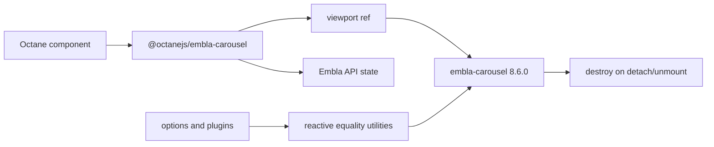

# Embla Carousel React binding - Plan

## Goal Capsule

- **Objective:** Ship `@octanejs/embla-carousel` as an API-compatible Octane binding for `embla-carousel-react@8.6.0`, reusing Embla's framework-neutral runtime and preserving the default `useEmblaCarousel` contract without React in the published runtime graph.
- **Portfolio ID:** `binding.embla-carousel-react`.
- **Open blockers:** None discovered during the 2026-08-02 reconciliation against Octane `origin/main`.
- **Execution profile:** One binding, one branch, one pull request, with current repository guidance and machine-checkable React parity evidence.

## Product Contract

### Summary

Applications importing `embla-carousel-react` should be able to migrate to an exact Octane package mapping instead of rewriting against a different carousel. The binding retains the familiar ref-plus-API tuple and delegates carousel behavior to the unchanged Embla core.

### Key Decisions

- **Preserve the upstream adapter API.** (session-settled: user-directed — chosen over a similar carousel abstraction: migration coverage is measured by recognizable package/API mappings.)
- **Land one binding PR.** (session-settled: user-directed — chosen over batching several shadcn prerequisites: every binding owns independent parity and review evidence.)
- **Reuse the framework-neutral core.** (session-settled: user-approved — chosen over porting Embla internals: only the React-facing lifecycle adapter needs Octane implementation.)
- **Follow repository guidance at implementation time.** (session-settled: user-directed — chosen over a frozen local checklist: every port uses the latest Octane port skill and React parity harness.)

### Requirements

- R1. Publish `@octanejs/embla-carousel` with a default export compatible with `embla-carousel-react@8.6.0`'s `useEmblaCarousel` function.
- R2. Preserve the call signature `(options?, plugins?)` and tuple result `[viewportRef, emblaApi | undefined]`.
- R3. Preserve `useEmblaCarousel.globalOptions` and apply it to `EmblaCarousel.globalOptions` before construction.
- R4. Reuse `embla-carousel@8.6.0` and the framework-neutral equality/DOM utilities; do not ship React, ReactDOM, or React types in the runtime graph.
- R5. Create one carousel instance when a viewport attaches in a browser, expose the API after commitment, destroy it on detach/unmount, and avoid construction during SSR.
- R6. Equivalent option and plugin values do not reinitialize; materially changed values reinitialize the existing API with current options/plugins.
- R7. Ref replacement destroys the prior instance and initializes the new viewport without leaking observers, listeners, or animation work.
- R8. Runtime and declaration exports match the upstream package root; `./package.json` remains package metadata rather than an Octane runtime API.
- R9. Pin npm release `8.6.0`, tarball integrity `sha512-0/PjqU7geVmo6F734pmPqpyHqiM99olvyecY7zdweCw+6tKEXnrE90pBiBbMMU8s5tICemzpQ3hi5EpxzGW+JA==`, and source commit `0fe65834136f1aa35e4c1a4a477e5ccb4bb5ee54` in `UPSTREAM.md`.
- R10. Crosswalk the two React adapter source files, the reactive-utils source/test surface used by the adapter, and the verified absence of adapter-local upstream tests.
- R11. Register applicable pristine/adapted runtime and type lanes in the repository React parity harness, with negative controls proving required evidence cannot disappear silently.
- R12. Add differential or behavioral fixtures for attachment, API publication, option/plugin reinitialization, global options, viewport replacement, cleanup, and SSR/hydration.
- R13. Add a real-browser carousel example/test proving pointer/scroll initialization and cleanup where jsdom cannot provide layout behavior.
- R14. Add README migration guidance, `status.json`, generated inventories, curated website category, root typecheck registration, and a patch changeset.
- R15. Any Octane runtime or shared-harness defect discovered during the port lands first in a separate prerequisite PR; this binding waits and rebases.

### Acceptance Examples

- AE1. Attaching the returned ref to a viewport produces an Embla API; clearing the ref destroys the instance and returns the exposed API to `undefined`.
- AE2. Passing a structurally equivalent options object does not call `reInit`; changing `loop`, breakpoints, or plugin options calls it once with the new values.
- AE3. Server rendering calls the binding without `window` or `document`, constructs no Embla instance, and hydrates into one client instance without duplicate initialization.
- AE4. A packed consumer imports the default function and its types with Octane and Embla installed but without React packages.
- AE5. Removing an adapted upstream utility assertion or required parity lane makes repository validation fail.

### Scope Boundaries

- Included: the `embla-carousel-react` package-root hook, types, lifecycle behavior, SSR/hydration, plugins/options updates, and a representative browser example.
- Excluded: porting `embla-carousel`, plugin packages, autoplay UI, or shadcn's higher-level Carousel component.
- Excluded: new Octane carousel abstractions or additional exports not present upstream.

## Planning Contract

### Key Technical Decisions

- KTD1. Implement the adapter with Octane lifecycle/state/ref primitives while leaving `embla-carousel` as the behavior engine. This keeps carousel physics, observers, plugins, and event semantics upstream-owned. Implements R1-R7.
- KTD2. Vendor permitted pinned React adapter and reactive-utils source/tests under the package's upstream evidence boundary. `UPSTREAM.md` records a complete source/export/test disposition, including the lack of React-adapter tests. Implements R9-R12.
- KTD3. Test lifecycle observations through a controllable Embla constructor boundary for deterministic conformance, then use the real core in integration/browser tests. Implements R5-R7, R12-R13.
- KTD4. Treat SSR as a no-construction contract and hydration as a single-construction contract. Implements R5, R12.
- KTD5. Keep the package root as the sole runtime entry point and mirror the upstream default/type exports exactly. Implements R1-R2, R8.

### High-Level Technical Design

## Implementation Units

### U1. Establish package provenance and parity inventory

**Goal:** Create the package shell, immutable upstream record, full export/source/test crosswalk, and parity manifest before implementing compatibility claims.

**Approach:** Follow the current `react-library-port` skill. Vendor MIT-permitted source/tests, record npm and Git pins, classify every export and upstream artifact, and register applicable runtime/type/differential/SSR/browser lanes.

**Test scenarios:** Missing source/test dispositions fail the audit; deleting a required lane or adapted assertion fails parity validation; the package exports only the planned root surface.

**Verification:** Provenance, license, exports, and parity inventory agree before adapter implementation proceeds.

### U2. Implement the Octane lifecycle adapter

**Goal:** Reproduce the ref, API, global-options, reinitialization, and cleanup contract over the real Embla core.

**Files:** `packages/embla-carousel/src/`, conformance fixtures/tests, type tests.

**Approach:** Translate React ref/state/effect/callback ownership into Octane primitives. Preserve the framework-neutral comparison behavior and avoid request-global or module-lifecycle leaks.

**Test scenarios:** Attach/detach; viewport replacement; equivalent and changed options/plugins; global options; destroy exactly once; no DOM; negative type assertions; no React dependency.

**Verification:** Adapted upstream utilities, behavioral conformance, and type lanes pass with failure-producing negative controls.

### U3. Prove SSR, hydration, and browser behavior

**Goal:** Validate the boundaries that unit-level HTML comparison cannot observe.

**Files:** package SSR/hydration tests, browser fixture/spec, and a stable playground example when required by current guidance.

**Approach:** Assert zero server construction, one hydrated construction, functional next/previous movement with real layout, and listener/observer cleanup after disposal.

**Test scenarios:** SSR without browser globals; hydration without duplicate instances; pointer/scroll interaction; focus remains consumer-owned; teardown leaves no live instance.

**Verification:** SSR/hydration and real-browser evidence pass on the supported environment.

### U4. Integrate, document, and release the binding

**Goal:** Make the package discoverable, typechecked, packable, and independently releasable.

**Files:** root `package.json`, `pnpm-workspace.yaml`, `vitest.config.js`, `website/src/content/bindings.json`, generated package/status/parity catalogs, `.changeset/`, package README/status.

**Approach:** Register the package once in every required inventory, add it to root binding typecheck, assign the curated website category, document import migration and divergences, and add a patch changeset.

**Test scenarios:** Packed consumer resolves runtime/types without React; generated checks detect omission/duplication; README examples compile against the public package.

**Verification:** Targeted gates, parity check, pack check, generated checks, typecheck, formatting, and the full required repository suite pass.

## Verification Contract

## Definition of Done

- `@octanejs/embla-carousel` preserves the pinned default hook and type surface over the real Embla core.
- Options, plugins, globals, viewport replacement, SSR/hydration, API publication, and cleanup have machine-checkable parity evidence.
- The packed package has no React runtime or type dependency.
- `UPSTREAM.md`, README, status, manifests, generated catalogs, curated website entry, and patch changeset agree.
- One PR carries only portfolio item `binding.embla-carousel-react`, passes review and CI, and merges before the local tracker is marked Complete and merged.
