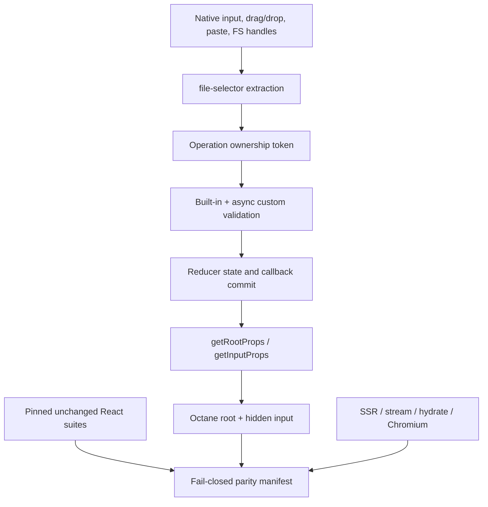

# Port react-dropzone 20.0.0 to Octane

## Goal Capsule

- **Objective:** Ship `@octanejs/dropzone` as the exact mapped Octane binding for `react-dropzone@20.0.0`, preserving its root runtime, complete type surface, package conditions, file-selection state machine, and observable browser behavior.
- **Authority:** The `react-dropzone@20.0.0` npm artifact and canonical commit `01fc05c5996bf615caf812627f7491375e647c7d` govern parity. The release is MIT licensed, requires Node `>=22`, and publishes only the root and `./package.json` entries.
- **Execution profile:** Vendor and hash the immutable npm and canonical source boundaries, retain framework-neutral validation and file-selection logic source-near, re-author the React hook/component seam with Octane hooks and refs-as-props, and prove it with unchanged pristine React runtime and type suites plus exhaustive adapted, differential, SSR, hydration, and trusted-Chromium evidence.
- **Stop conditions:** U1 is a hard gate. Stop before broad implementation if provenance cannot be frozen, either pristine suite cannot execute unchanged, or the smallest public-shaped Octane fixture cannot compile and run prop getters, refs, file input, DataTransfer drop, async supersession, SSR, hydration, and packed conditions without a framework change. First minimize the failure to a framework-only reproduction and compare it with cited working package patterns. Only a reduced reproduction that still fails may become a prerequisite; otherwise repair the binding probe inside U1. Start any prerequisite from a clean base without binding commits, pause this branch until it merges, then rebase and prove the resumed binding diff and ancestry contain no prerequisite implementation.
- **Tail ownership:** Deliver one isolated binding PR. Do not batch another binding, a pin upgrade, or an Octane runtime/compiler prerequisite into it.

---

## Product Contract

### Summary

An application using `react-dropzone@20.0.0` should be able to map its dependency and import root to `@octanejs/dropzone`, perform ordinary React-to-Octane authoring conversion, and retain the pinned public API and observable file-acquisition behavior. This is an exact mapped binding, not a similar drag-and-drop utility and not an Octane-specific redesign.

### Problem Frame

The package is a browser state machine, not merely a styled `<input type="file">`. It composes user and library handlers; tracks nested and global drags; interprets `DataTransfer`, clipboard, input, and File System Access results; validates asynchronously; suppresses stale operations; exposes imperative refs; manages document/window listeners; and must remain inert during server rendering. Representative tests would leave races, handler ordering, package conditions, and browser-only paths unproved.

### Settled Decisions

- KPD1. **Exact mapped binding over a similar alternative** (session-settled: user-directed — chosen over recommending or wrapping a different file-drop library because consumers need the pinned `react-dropzone` contract). Governs R1-R15.
- KPD2. **One PR per binding over batching** (session-settled: user-directed — chosen to isolate provenance, review, rollback, and CI evidence). Governs R16.
- KPD3. **Exhaustive parity over representative-only tests** (session-settled: user-directed — chosen because every upstream case and type program is part of the compatibility claim). Governs R2-R3, R13-R15.
- KPD4. **Priority order over opportunistic selection** (session-settled: user-directed — U1 falsification, then core, hook/component, evidence, and integration; easier demo paths cannot bypass higher-risk prerequisites). Governs R13-R16.

### Requirements

**Published surface and immutable evidence**

- R1. Publish `@octanejs/dropzone` with exact mapped root runtime and types plus the pinned root `types`/`import`/`require` conditions and `./package.json` export. Point published conditions at authored Octane source in accordance with repository policy, while proving equivalent consumer resolution.
- R2. Pin and hash the npm tarball, its 11 published files, integrity/signature/provenance metadata, package exports, compiled declarations, bundled runtime artifacts, source maps, README, and license. Separately pin and hash canonical source, license, package/test config, the two runtime spec files and snapshot, all nine `type-tests/*.tsx` files, and every support artifact required to execute them.
- R3. Run the pinned runtime suite unchanged against its exact React 19.2.8/Vitest 4.1.10/jsdom 30.0.1 oracle and run both upstream TypeScript commands/projects unchanged with the pin's compiler and React types. Generate static and collection-time inventories rather than relying on the planning observation of roughly 220 runtime cases; freeze exact collected and executed identities, snapshots, type files, and accepted/rejected programs.
- R4. Preserve the runtime namespace: default `Dropzone`, named `useDropzone`, and `ErrorCode`. Preserve every exported type: `Accept`, `AcceptGroup`, `DropEvent`, `DropzoneInputProps`, `DropzoneOptions`, `DropzoneProps`, `DropzoneRef`, `DropzoneRootProps`, `DropzoneState`, `FileError`, `FileRejection`, `FileWithPath`, and `ValidatorResult`.

**Component, props, refs, and interaction state**

- R5. Preserve `Dropzone` render-prop behavior and imperative `open()` through Octane refs-as-props. Preserve `useDropzone` return identity and state semantics, including `rootRef`, `inputRef`, both prop getters, `acceptedFiles`, `fileRejections`, focus, local/global drag state, dialog state, unknown drag verdict, and processing state.
- R6. Preserve `getRootProps` and `getInputProps` composition: arbitrary user props, `refKey`, merged refs, default/overridden role and tab index, hidden input attributes, accept flattening, capture, multiple, disabled, handler ordering, cancellation/propagation behavior, and input value reset required to reselect the same file.
- R7. Preserve click, keyboard, focus, blur, label, disabled, `noClick`, `noKeyboard`, `autoFocus`, missing-input, and programmatic-open behavior. Preserve `onFileDialogOpen`, `onFileDialogCancel`, `onError`, window-focus cancellation detection, and dialog/drop exclusion and recovery.

**File acquisition and validation**

- R8. Preserve native dragenter/dragover/dragleave/drop behavior, including nested targets, document drop prevention, file/non-file discrimination, `noDrag`, `noDragEventsBubbling`, user `stopPropagation`, local/global drag flags, accept/reject/unknown verdicts, empty MIME types, and cleanup.
- R9. Preserve paste-to-upload through the same acquisition/validation/callback pipeline, focused descendants, ignored text-only pastes, `noPaste`, prevention/propagation semantics, clipboard file extraction, and cleanup.
- R10. Preserve input `change`/`cancel`, multiple selection, acceptance, size, `maxFiles`, and callback behavior. `onDrop`, `onDropAccepted`, and `onDropRejected` keep their public names and receive native Octane events; do not rename library callbacks because Octane uses native events.
- R11. Preserve File System Access behavior: secure-context and capability gates, `useFsAccessApi`, picker type/description grouping, flattened input fallback, picker-without-input operation, AbortError cancellation, SecurityError and NotAllowedError input fallback, unexpected-error reporting, and window-focus listener policy.
- R12. Reuse pinned `attr-accept@^2.2.5` and `file-selector@^4.1.0` behavior unchanged where framework-neutral. Preserve `Accept`/`AcceptGroup` normalization, type/extension matching, min/max size, too-many-files behavior, `ErrorCode`, custom error codes, localized `getErrorMessage`, `FileWithPath`, directory entries/handles, and `getFilesFromEvent` extensibility.
- R13. Preserve async validation and supersession exactly: `isProcessing` spans async extraction and validation; sync/single/list/null validator results compose with built-in errors; rejected validators call `onError` without drop callbacks; only the newest operation may commit when extraction or validation resolves out of order; late work after unmount is inert; post-validation `maxFiles` still applies.

**Server, evidence, and delivery**

- R14. Server rendering must be deterministic and browser-global-free. Streaming output and hydration must preserve rendered root/input shape, adopt existing DOM nodes, attach refs/listeners once, remain interactive, preserve relevant pre-hydration form state, and produce no hydration warnings or page errors.
- R15. Every upstream runtime artifact and collected identity receives an unchanged/adapted/differential/non-applicable disposition, and every port-authored test receives exactly one classification. Every non-applicable disposition must bind the exact upstream identity to a React-only or unreachable premise and executable proof that the behavior is outside the mapped public contract. Every one of the nine upstream type files has an assertion-preserving adapted counterpart. The harness must fail closed for missing, duplicate, stale, or unsupported non-applicable rationales; missing, renamed, skipped, stale, duplicated, or unexecuted cases; removed type files/assertion groups/negative programs; forbidden transformations; provenance/fixture drift; and fake generated titles.
- R16. Deliver the package, README, `UPSTREAM.md`, `status.json`, license attribution, patch changeset, playground journey, package/status/parity generators, packed-consumer evidence, and one isolated binding PR. No React runtime or public React type may leak from the published package.

### Key Flows

- F1. **Select from the hidden input.** A root click or imperative `open()` opens one chooser, a selected file travels through extraction and validation, callbacks fire once, same-file reselection works, and cancel restores dialog state. Covers R5-R7, R10, R13.
- F2. **Drag through nested zones.** File drag entry produces accept/reject/unknown/global state, nested enters/leaves do not clear early, configured propagation rules hold, drop commits only the owning zone, and document listeners clean up. Covers R6, R8, R12-R13.
- F3. **Paste files.** A file-bearing clipboard event on the zone or focused child follows the drop pipeline, while text-only or disabled paste remains untouched. Covers R9-R10, R12-R13.
- F4. **Use the File System Access picker.** A supported secure browser receives grouped filters and handles; cancel, policy/security fallback, missing input, and unexpected failure follow the pinned callbacks and state transitions. Covers R7, R11-R13.
- F5. **Supersede async work.** A second input/drop/paste operation lands while older extraction or validation is pending; only the latest operation updates state or invokes drop callbacks. Covers R10-R13.
- F6. **Render, stream, hydrate, and interact.** Server output contains stable root/input markup without touching browser globals; Chromium adopts those nodes and then completes input, drag, paste, and open journeys without diagnostics. Covers R14-R16.
- F7. **Consume the packed package.** ESM, CommonJS, TypeScript, and package-metadata consumers resolve exactly the mapped conditions and runtime/type namespace without React leakage. Covers R1-R4, R15-R16.

### Acceptance Examples

- AE1. Given a hidden input mounted under `getInputProps()`, when the root is clicked and Playwright supplies a file, then React and Octane observe the same dialog flags, accepted/rejected files, callback sequence, event type, input reset, and ability to choose the same file again.
- AE2. Given nested zones and a DataTransfer containing accepted and rejected files, when the pointer enters children, leaves arbitrary descendants, and drops, then local/global drag flags, propagation, callback ownership, error codes, and final state match the pin.
- AE3. Given a text clipboard event and then a file clipboard event, when each is pasted into a focused descendant, then the first remains unconsumed and the second is processed exactly once unless `noPaste` is true.
- AE4. Given an older extraction or validator promise and a newer operation, when the newer resolves first and the older resolves or rejects later, then only the newer result commits, `isProcessing` clears correctly, stale callbacks remain silent, and unmount prevents any late update.
- AE5. Given grouped accept filters and `useFsAccessApi`, when the picker succeeds, aborts, is policy-blocked, or throws unexpectedly, then options, callbacks, fallback click, listeners, and error handling match React.
- AE6. Given server-rendered root/input DOM, when Chromium hydrates after a user-visible pre-hydration interaction, then node identity and applicable input state survive, refs/listeners become live once, and later selection/drop/paste works without hydration diagnostics.

### Scope Boundaries

- Port exactly `react-dropzone@20.0.0`; newer commits, older compatibility branches, and future entry points require a separate pin-upgrade PR.
- Preserve the package's MIT attribution. Vendor source/tests only from the immutable canonical commit and keep `upstream/` unpublished.
- Adapt the React seam only. Do not redesign `Dropzone`, `useDropzone`, prop getters, callbacks, errors, state names, or default policies.
- Package-name aliasing from `react-dropzone` is outside scope; consumers map imports to `@octanejs/dropzone`.
- A prerequisite Octane compiler/runtime, testing-library, or server fix is not part of this binding PR. U1 must stop and separate it.
- Trusted-browser evidence is bounded and local. It must not upload files, contact production endpoints, or claim that automation can open the operating system's native chooser UI.
- Real browser support for File System Access varies. Use a browser-level API substitute only to exercise the package branch and options/error contract; do not present it as an end-to-end operating-system picker proof.

### Success Criteria

- Immutable npm/source/license/export/runtime/type inventories agree with the exact pin and fail on drift.
- The unchanged pristine runtime suite and unchanged pristine type projects execute successfully; all adapted cases and type files are exhaustive, classified, assertion-preserving, and fail closed.
- All root runtime/type names and root/package-json conditions resolve from the packed binding with no React leakage.
- Input, drag/drop, paste, File System Access, refs, prop getters, validation, supersession, SSR, streaming, hydration, and trusted Chromium behavior match exactly after the ordinary React-to-Octane authoring conversions defined by this contract. Any other consumer-visible mismatch fails the binding and triggers the prerequisite STOP protocol unless the product contract is explicitly changed first.
- Package docs, status, playground, changeset, generated inventories, parity manifests, and the isolated PR agree.

---

## Planning Contract

### Pinned Public Surface Inventory

The implementation must generate this oracle from the npm artifact and canonical source. This prose is the reviewer baseline; generated evidence is authoritative.

- **Package:** `react-dropzone@20.0.0`; canonical commit `01fc05c5996bf615caf812627f7491375e647c7d`; MIT; Node `>=22`; peer React `>=18`; npm artifact integrity `sha512-Xw8tvvVPJQzj8ir5wivUMzA+G6R+aGhdU5KQzUMvVBlJNb26AW/0137VoYVmb5UgZcbhM9OCpjE4KOqqSL9QuQ==`.
- **`.` conditions:** `types`, `import`, and `require`. Runtime namespace: default `Dropzone`, named `useDropzone`, `ErrorCode`. No additional runtime subpath is published.
- **`.` types:** `Accept`, `AcceptGroup`, `DropEvent`, `DropzoneInputProps`, `DropzoneOptions`, `DropzoneProps`, `DropzoneRef`, `DropzoneRootProps`, `DropzoneState`, `FileError`, `FileRejection`, `FileWithPath`, `ValidatorResult`.
- **`./package.json`:** exact package metadata entry.
- **Npm boundary:** 11 files: license, README, package metadata, ESM/CJS bundles and maps, ESM/CJS declarations, and published `src/index.tsx` plus `src/utils/index.ts`. U1 records hashes rather than copying this list manually into validation logic.
- **Canonical test boundary:** `src/index.spec.tsx`, `src/utils/index.spec.ts`, `src/__snapshots__/index.spec.tsx.snap`, `test-setup.js`, `vitest.config.ts`, `tsconfig.json`, `tsconfig.type-tests.json`, and nine files under `type-tests/`: `accept.tsx`, `all.tsx`, `basic.tsx`, `events.tsx`, `file-dialog.tsx`, `hook.tsx`, `plugin.tsx`, `refs.tsx`, and `validator.tsx`. Planning found 218 directly line-starting `it`/`test` registrations and roughly 220 total syntactic registrations; U1 must record actual static, collected, parameterized, and executed identities and must not hard-code either planning count as truth.

### Key Technical Decisions

- KTD1. **Mirror the two-module upstream source boundary.** Vendor byte-exact `src/index.tsx` and `src/utils/index.ts`; mirror them under `packages/dropzone/src/`; reuse `attr-accept` and `file-selector`; adapt only React imports, hook slots, component rendering, refs, and event types. Governs R4-R13.
- KTD2. **Prove hook slotting and prop-getter spreads before porting.** U1 decides whether compiler auto-slotting suffices for the imported plain-TS hook or whether stable `subSlot` forwarding like `packages/floating-ui/src/internal.ts` is required. It also proves dynamic getter-returned spreads carry handlers, attributes, arbitrary props, and refs on root/input in client, SSR, and hydration. Governs R5-R7, R14.
- KTD3. **Use refs-as-props without changing the API.** Re-author upstream `forwardRef`/`useImperativeHandle` so `Dropzone` accepts a plain Octane `ref` prop exposing `{ open }`; compose consumer and internal host refs with Octane ref arrays while preserving `refKey`. Follow `packages/base-ui/src/button.ts`, `packages/base-ui/src/separator.ts`, and `packages/base-ui/src/toggle.ts`. Governs R5-R7.
- KTD4. **Keep one native acquisition pipeline.** Input, drop, paste, and File System Access handles feed the pinned extraction, validation, acceptance, state, and callback machinery. Do not create Octane-specific parallel validators or event shims. Governs R8-R13.
- KTD5. **Make operation ownership explicit and oracle-driven.** Preserve the pin's latest-operation token/supersession behavior for extraction and validation; use controlled promises and explicit task draining, never sleeps. Compare `isProcessing`, state, callbacks, and errors to React across resolve/reject/unmount orders. Governs R13.
- KTD6. **Separate jsdom adaptation from browser truth.** Exhaustively adapt upstream jsdom cases, then use trusted Chromium for file chooser delivery, native drag/paste event paths, focus/window timing, hydration, and page diagnostics. A jsdom DataTransfer or clipboard shim is not the browser evidence. Follow `packages/octane/tests/browser/native-change/`. Governs R7-R11, R14-R15.
- KTD7. **Use the bounded global parity harness.** Follow `packages/hook-form/audit/react-parity.json` and `scripts/react-parity/`; require unchanged pristine runtime/types, exact adapted inventories, transformation ledgers, test classifications, and negative controls. Generalize hook-form-specific verifiers where appropriate rather than weakening or bypassing them. Governs R2-R3, R15.
- KTD8. **Treat package branches and SSR/hydration as U1 architecture gates.** Pack and load ESM, CJS, types, and package metadata before building the full port; server render, stream, hydrate, and interact with the minimal public fixture. Governs R1, R4-R7, R14.
- KTD9. **One binding, one PR.** Keep framework prerequisites, pin upgrades, and other bindings outside this change. Governs R16.

### High-Level Technical Design



### Assumptions

- The npm metadata, integrity, MIT license, Node floor, canonical commit, and source layout observed during planning are candidates until U1 hashes and verifies them.
- The exact collected runtime count may differ from static registration counts because parameterized helpers or framework collection behavior can expand identities. The collected/executed inventory, not prose, governs parity.
- Upstream type files are compiler programs rather than a uniform assertion-helper DSL. U1 must identify accepted and intentionally rejected groups structurally and define a transformation ledger that preserves their compiler outcome.
- Octane's native event objects are expected to satisfy observable DropEvent behavior after public React event types are replaced. Any consumer-visible mismatch requires a documented divergence and passing differential/browser evidence; public React types may not leak as a shortcut.
- The hidden file input has no meaningful file selection during SSR. Hydration preservation applies to browser-created form state and adopted nodes where the platform permits it, not serialization of `FileList` into HTML.

### Sequencing

1. Freeze all upstream evidence and pass U1's pristine, compiler, prop-getter/ref, browser, supersession, SSR/hydration, and pack falsification gates.
2. Port framework-neutral utilities and validate file verdict/error/accept option behavior.
3. Port `useDropzone`, `Dropzone`, refs, prop getters, listeners, file acquisition, validation, and supersession in upstream source order.
4. Reconcile every upstream runtime/type identity and add differential, SSR, hydration, and trusted-browser coverage for observation gaps.
5. Integrate the package, playground, docs, changeset, generated inventories, and isolated PR.

### Output Structure

```text
packages/dropzone/
├── audit/
│   ├── react-parity.json
│   ├── runtime-inventories/
│   ├── type-inventories/
│   └── test-classifications.json
├── src/
│   ├── index.tsrx
│   └── utils/index.ts
├── tests/
│   ├── adapted/
│   ├── browser/
│   ├── differential/
│   ├── hydration/
│   ├── pristine/
│   ├── probes/
│   └── ssr/
├── typetests/
├── upstream/
├── package.json
├── README.md
├── status.json
├── tsconfig.json
└── UPSTREAM.md
```

---

## Implementation Units

### U1. Freeze provenance and falsify the architecture

- **Goal:** Establish immutable npm/source/license/API/test/type boundaries and prove every load-bearing Octane seam before broad port work.
- **Requirements:** R1-R16.
- **Dependencies:** None.
- **Files:** `packages/dropzone/upstream/`, `packages/dropzone/UPSTREAM.md`, `packages/dropzone/package.json`, `packages/dropzone/tsconfig.json`, `packages/dropzone/audit/public-api.json`, `packages/dropzone/audit/npm-files.json`, `packages/dropzone/audit/upstream-files.json`, `packages/dropzone/audit/runtime-inventories/`, `packages/dropzone/audit/type-inventories/`, `packages/dropzone/audit/verify-provenance.mjs`, `packages/dropzone/tests/pristine/upstream-runtime.test.ts`, `packages/dropzone/tests/probes/dropzone.tsrx`, `packages/dropzone/tests/probes/architecture.test.ts`, `packages/dropzone/tests/probes/server.test.ts`, `packages/dropzone/tests/probes/hydration.test.ts`, `packages/dropzone/tests/probes/browser/`, `packages/dropzone/tests/probes/packed-exports.test.mjs`, `packages/dropzone/tests/probes/consumers/`, `packages/dropzone/typetests/pristine/`, `pnpm-workspace.yaml`, `pnpm-lock.yaml`, `vitest.config.js`.
- **Approach:** Hash the npm tarball separately from the canonical commit archive; vendor byte-exact source, tests, snapshot, configs, license, and required support. Generate package-condition, runtime/type-export, source/test, static-registration, collection-time, execution, snapshot, and type-program inventories. Run the upstream Vitest suite unchanged with pinned React/Vitest/jsdom and run both upstream TypeScript commands/projects unchanged. Scaffold only enough authored package source to test public prop getters, root/input spreads, arbitrary props, internal/user refs and `refKey`, imperative `open`, hidden-input delivery, browser-created DataTransfer drop, controlled async extraction/validator supersession, global/document listener cleanup, browser-global-free render, stream/hydration adoption, and packed ESM/CJS/types/package-json resolution. Compile the imported hook using both candidate slot strategies only as needed; select the simplest proven strategy. Use `node scripts/scaffold-react-port.mjs` to produce the exhaustive case ledger, but do not commit unresolved todos. For each failing seam, reduce the case until it contains no React Dropzone state-machine logic and verify the same Octane mechanism in the cited working package patterns. Classify it as a framework prerequisite only if that reduced reproduction still fails; otherwise fix the probe within U1. A prerequisite starts from a clean base, this binding branch remains paused until it merges, and the resumed branch rebases onto that merge before U2.
- **Test scenarios:** Any changed npm/source/license byte, missing/extra package condition or export, deleted/renamed/duplicated/skipped/unexecuted runtime identity, snapshot drift, missing type file/group, removed negative program, or stale inventory fails. Pristine runtime and both type commands pass unchanged. Root/input getters compile and spread working handlers/attributes/refs; internal and user refs receive the correct nodes; `open` reaches the input; one trusted Chromium input selection and one DataTransfer drop reach the callback. Older extraction and validator operations lose to the newer operation exactly as React does. Server render/stream touches no browser global; hydration adopts root/input nodes, makes them interactive, and emits no diagnostics. Packed ESM, CJS, TypeScript NodeNext/Bundler, and `./package.json` consumers resolve the exact namespace without React leakage.
- **Verification:** Every U1 gate passes. If pristine evidence cannot run unchanged, if any root condition cannot be represented, or if the minimal public fixture requires an Octane core/compiler/server/testing-library change, **STOP**: document the failing observable contract, open a separate prerequisite plan/PR, and do not continue U2-U6 in this binding PR.

### U2. Port file verdict and accept-option utilities

- **Goal:** Preserve the framework-neutral normalization, verdict, error, and event-classification layer.
- **Requirements:** R8-R12.
- **Dependencies:** U1.
- **Files:** `packages/dropzone/src/utils/index.ts`, `packages/dropzone/tests/adapted/utils/index.spec.ts`, `packages/dropzone/tests/differential/utils.test.ts`, `packages/dropzone/typetests/accept.tsx`, `packages/dropzone/typetests/events.tsx`, `packages/dropzone/typetests/validator.tsx`.
- **Approach:** Port upstream utilities source-near and retain `attr-accept`/`file-selector` rather than recreating them. Preserve accepted MIME/extension serialization, grouped picker filters/descriptions, flattened input accept strings, size/type/quantity verdicts, error objects/messages, event-with-files detection, abort/security/not-allowed predicates, propagation checks, handler composition, document drag prevention, and thenable detection. Replace only React-specific event typing required by the published Octane surface.
- **Test scenarios:** Single/grouped accepts; invalid/empty MIME and extensions; Chrome empty-type drag; grouped descriptions; flattened input attribute; min/max boundaries; multiple/maxFiles; every `ErrorCode`; custom codes/messages; valid/invalid File System Access options; file/non-file drag and clipboard events; stopped propagation; handler composition ordering and cancellation; DOMException classification; native and thenable values.
- **Verification:** Adapted upstream utility cases, differential pure-function tables, export oracle, and adapted type groups pass with byte-equivalent observable values where applicable.

### U3. Port the hook, component, refs, and prop getters

- **Goal:** Implement the complete public client state machine without redesigning its API.
- **Requirements:** R4-R7, R10, R13.
- **Dependencies:** U1-U2.
- **Files:** `packages/dropzone/src/index.tsrx`, `packages/dropzone/src/index.tsrx.d.ts`, `packages/dropzone/tests/adapted/index.spec.tsx`, `packages/dropzone/tests/differential/component.test.ts`, `packages/dropzone/tests/_fixtures/dropzone.tsrx`, `packages/dropzone/typetests/basic.tsx`, `packages/dropzone/typetests/hook.tsx`, `packages/dropzone/typetests/plugin.tsx`, `packages/dropzone/typetests/refs.tsx`.
- **Approach:** Re-author `useDropzone` with the U1-approved slot strategy, preserving upstream reducer actions, memo/callback/effect dependencies, refs, operation ownership, listener lifetime, and public object shape. Re-author `Dropzone` as a render-prop component using a plain `ref` prop and expose `{ open }` without `forwardRef`. Keep prop getters generic and source-near; compose refs through Octane's public ref model; retain `refKey` and user handler precedence. Preserve explicit dependency arrays and account for Octane's three-member reducer tuple without changing public results.
- **Test scenarios:** Default and overridden props; render-prop state; object/callback/array/custom-key refs; ref replacement and unmount cleanup; arbitrary getter props; role/tabIndex; click/keyboard/focus/blur; label double-open prevention; disabled and each `no*` option; programmatic/missing-input open; same-file reset; dialog open/cancel and window focus; option changes after rerender; callback identity/ordering; no stale closures; unmount while dialog or async operation is active.
- **Verification:** Every applicable component/hook/prop/ref upstream identity executes in the adapted suite; public-shaped differential scenarios match state, DOM, callbacks, ref lifecycle, and errors.

### U4. Complete native acquisition, validation, and supersession

- **Goal:** Preserve all input, drag/drop, paste, File System Access, validation, and latest-operation behavior.
- **Requirements:** R8-R13.
- **Dependencies:** U2-U3.
- **Files:** `packages/dropzone/src/index.tsrx`, `packages/dropzone/tests/adapted/index.spec.tsx`, `packages/dropzone/tests/differential/acquisition.test.ts`, `packages/dropzone/tests/differential/supersession.test.ts`, `packages/dropzone/tests/browser/index.html`, `packages/dropzone/tests/browser/main.ts`, `packages/dropzone/tests/browser/react-dropzone.browser.test.ts`, `packages/dropzone/tests/_fixtures/acquisition.tsrx`, `packages/dropzone/typetests/file-dialog.tsx`, `packages/dropzone/typetests/validator.tsx`.
- **Approach:** Feed every acquisition source into one source-near extraction/validation pipeline. Preserve nested/global drag-target bookkeeping, document prevention, dialog/drop exclusion, paste targeting, input reset, picker gates/options/fallbacks, synchronous and asynchronous validators, error localization, and latest-operation ownership. Add React/Octane differential fixtures with controllable promises. Add side-by-side trusted-Chromium fixtures following `packages/octane/tests/browser/native-change/`; fail on console warning/error and page error. Use Playwright file chooser/input delivery for real file selection, browser-created DataTransfer/ClipboardEvent paths where supported, and a browser-level `showOpenFilePicker` substitute only for branch/options/error semantics.
- **Test scenarios:** Nested/sibling/global drags and arbitrary descendants; accepted/rejected/unknown verdicts; user and configured propagation; non-file drags; document outside drop; input selection/cancel/reselection; file and text paste on root/focused child with `noPaste`; directory entries and FileSystem handles; secure/insecure/unsupported picker; grouped filters; AbortError, SecurityError, NotAllowedError, missing input, and unexpected error; sync/async custom single/list/null errors; localized built-in/custom/too-many messages; pending processing; older extraction and validator resolve/reject permutations; second operation of a different source; unmount before completion; post-validation maxFiles.
- **Verification:** Exhaustive adapted cases and differential state/callback traces pass. Trusted Chromium proves file selection, drag/drop, paste, focus/dialog timing, picker branch behavior, and cleanup without diagnostics.

### U5. Prove exhaustive parity, SSR, streaming, hydration, and harness integrity

- **Goal:** Make every compatibility claim executable, classified, and fail-closed in package and repository CI.
- **Requirements:** R2-R4, R13-R15.
- **Dependencies:** U1-U4.
- **Files:** `packages/dropzone/tests/pristine/`, `packages/dropzone/tests/adapted/`, `packages/dropzone/tests/differential/`, `packages/dropzone/tests/ssr/`, `packages/dropzone/tests/hydration/`, `packages/dropzone/tests/browser/`, `packages/dropzone/typetests/`, `packages/dropzone/audit/react-parity.json`, `packages/dropzone/audit/test-classifications.json`, `packages/dropzone/audit/transformation-ledger.json`, `packages/dropzone/audit/runtime-inventories/`, `packages/dropzone/audit/type-inventories/`, `scripts/react-parity/react-dropzone-*.mjs`, `scripts/react-parity/check.mjs`, `scripts/react-parity/harness-lib.test.mjs`, `scripts/react-parity/react-dropzone-*.test.mjs`, `vitest.config.js`.
- **Approach:** Register unchanged pristine runtime and type lanes, exhaustive adapted runtime and type lanes, differential lanes, SSR/stream/hydration lanes, and required Chromium lanes in `audit/react-parity.json`. Inventory every upstream artifact, static registration, actual collected/executed identity, snapshot, type file, and structural assertion/negative group. Record only permitted transformations such as import roots, `.tsx` fixture conversion to `.tsrx`, React event/renderable type mapping, and forwardRef-to-ref-prop authoring; reject all others. Classify every port-authored test exactly once. Add only React Dropzone manifest registration, inventories, classifications, package-specific fail-closed checks, and negative controls supported by the existing shared harness. If an exact-parity claim requires generalizing shared harness code, U1 must stop and move that prerequisite into a separate plan and PR before this binding continues.
- **Test scenarios:** Missing/extra/renamed/duplicated/skipped/todo/expected-failure/unexecuted runtime cases fail; missing, duplicate, stale, or unsupported non-applicable rationales fail; stale or fake-title inventories fail; removed snapshots/assertions/type files/negative programs fail; undeclared transformations and fixture/provenance drift fail; a locally runnable lane omitted from global `react-parity:check` fails. SSR renders default/disabled/custom-state fixtures without browser access; streaming settles deterministic async children; hydration adopts exact root/input nodes, preserves permissible pre-hydration focus/value/file state, attaches refs/listeners once, remains interactive, and reports no mismatch. Production/server transform variants and Chromium page diagnostics are included.
- **Verification:** `pnpm react-parity:test` validates the negative controls and `pnpm react-parity:check` executes, rather than merely validates, every required react-dropzone lane with exact identities and hashes.

### U6. Integrate the package, playground, documentation, and release metadata

- **Goal:** Make the exact binding installable, discoverable, demonstrable, and honestly tracked in one isolated PR.
- **Requirements:** R1, R4, R16.
- **Dependencies:** U1-U5.
- **Files:** `packages/dropzone/package.json`, `packages/dropzone/README.md`, `packages/dropzone/LICENSE`, `packages/dropzone/UPSTREAM.md`, `packages/dropzone/status.json`, `packages/dropzone/tests/adoption/`, `packages/dropzone/tests/packed/`, `package.json`, `pnpm-workspace.yaml`, `pnpm-lock.yaml`, `vitest.config.js`, `scripts/check-package-packs.mjs`, `playground/octane/`, `website/src/content/bindings.json`, `.changeset/`, `docs/bindings-status.md`, `docs/binding-parity-gaps.md`, generated package/CLI inventories.
- **Approach:** Finalize the U1-proven root conditions, authored-source packaging, dependency/catalog pins, package projects, typecheck enumeration, README migration/security/browser-support guidance, upstream crosswalk, status claims, MIT attribution, patch changeset, and packed consumer. Add a playground route demonstrating click selection, drag/drop, paste, accepted/rejected output, async processing, and programmatic open without uploading files or calling production services. Extend packed-package checks for ESM, CJS, both TypeScript resolutions, runtime/type namespace, `./package.json`, and absence of React leakage. Run `pnpm sync` and commit all generated outputs in the implementation PR.
- **Test scenarios:** Packed ESM/CJS/types/package-json imports resolve; missing/extra exports fail; no React runtime or public type appears; `attr-accept`/`file-selector` resolve; consumer migration requires only package/import mapping and ordinary TSRX/event typing conversion; playground journeys work in development and production SSR/hydration; docs/status/crosswalk/parity evidence agree; changeset is patch; generated inventories are clean.
- **Verification:** Package tests, pack checks, scoped type/format checks, playground build/browser journey, status/parity/package generators, changeset checks, `pnpm sync`, and required repository CI gates pass before the single draft PR opens.

---

## Verification Contract

| Gate | Scope | Done signal |
| --- | --- | --- |
| U1 STOP gate | U1 | Immutable npm/source/license/API/test/type evidence, unchanged pristine runtime/types, minimal prop-getter/ref/input/drop/supersession/server/hydration/browser fixture, and packed-condition matrix pass; otherwise broad work stops for a separate prerequisite. |
| Provenance and API | U1, U5 | All 11 npm files, canonical artifacts, package conditions, runtime/type exports, static/collected/executed cases, snapshots, and nine type files are hashed, reconciled, and drift-checked. |
| Utilities | U2 | Accept/group/picker/input normalization, file verdicts, errors, event classification, and framework-neutral dependencies match the pin. |
| Hook and component | U3 | State, render prop, prop getters, arbitrary props, refs/refKey, imperative open, handlers, dialog, focus, and cleanup match React. |
| Acquisition and races | U4 | Input, nested/global drag/drop, paste, File System Access, async validation, error localization, `isProcessing`, and latest-operation supersession match in adapted/differential/browser evidence. |
| Types | U1-U5 | Both pristine upstream compiler commands and all nine adapted files preserve accepted/rejected programs and structural assertion hashes without React leakage. |
| SSR and browser | U1, U4-U5 | Server/stream output is global-free and deterministic; hydration adopts nodes/state and remains interactive; trusted Chromium file, drag, paste, picker-branch, focus, and cleanup journeys pass without diagnostics. |
| Harness integrity | U5 | Removed, renamed, skipped, stale, duplicated, fake, unexecuted, or structurally weakened evidence fails closed; every required lane executes through `react-parity:check`. |
| Integration | U6 | Package, pack, type, test, format, playground, docs, status, catalog, changeset, sync, and generated-inventory gates pass with no unrelated changes. |
| PR boundary | U6 | Exactly one isolated binding PR contains the complete package and evidence; any Octane prerequisite or future pin remains separate. When a prerequisite was required, the final ancestry and diff prove that it began from a clean base, merged independently, and left no prerequisite implementation or unrelated shared-harness generalization in this binding PR. |

## Definition of Done

- R1-R15 have direct executable evidence and R16 has package/repository/PR evidence.
- The exact `react-dropzone@20.0.0` npm artifact, canonical commit, MIT license, Node floor, package conditions, runtime/type namespace, runtime cases, snapshot, nine type files, and support/config artifacts are immutable and verified.
- The pristine React runtime suite and both pristine TypeScript commands/projects execute unchanged. Every upstream runtime identity and type group is exhaustively adapted or objectively classified; every port-authored test has exactly one classification.
- Default `Dropzone`, `useDropzone`, `ErrorCode`, all 13 exported type names, root `types`/`import`/`require`, and `./package.json` resolve from the packed binding without React runtime or public-type leakage.
- Render props, refs-as-props, `refKey`, prop getter composition, input, drag/drop, paste, File System Access, accept/size/count errors, custom/localized errors, async processing, supersession, dialog/focus/listener lifecycle, SSR, streaming, hydration, and trusted Chromium evidence are green.
- Negative controls prove the harness fails for provenance, source, fixture, case, execution, snapshot, type, transformation, classification, and lane-registration drift.
- README, `UPSTREAM.md`, status, license, playground, packed consumer, patch changeset, parity manifest, package/catalog/status/parity generators, and generated docs agree.
- `pnpm format:files:check packages/dropzone scripts/react-parity vitest.config.js package.json pnpm-workspace.yaml scripts/check-package-packs.mjs playground/octane website/src/content/bindings.json`, scoped package tests/typechecks, `pnpm react-parity:test`, `pnpm react-parity:check`, pack checks, playground production build, `pnpm test:markers:check`, `pnpm tsrx-decls:check`, and `pnpm sync` pass, followed by the repository-required CI gates.
- No skipped/todo/expected-failure case, representative-only parity claim, unpublished upstream behavior, hidden divergence, production upload/network dependency, unrelated binding, bundled framework prerequisite, or abandoned probe remains.
- One isolated draft PR is opened only after the verification contract is satisfied; all agent-actionable CI and review findings are resolved, while merge remains a maintainer action.

## Review Record

- **Coherence:** Every requirement maps to flows, units, verification gates, and done criteria; input, drag, paste, picker, supersession, package, and server surfaces remain consistently in scope.
- **Feasibility:** U1 makes pristine execution, hook slotting, dynamic prop spreads, refs, native events, supersession, SSR/hydration, trusted browser behavior, and packed conditions explicit falsification gates.
- **Correctness:** The plan preserves the upstream single acquisition/validation pipeline, source ordering, latest-operation ownership, native callback observations, and exact package/type surface.
- **Security and privacy:** Files remain local deterministic fixtures; no upload or production request is introduced; custom validators and `getFilesFromEvent` are documented as trusted consumer code; picker permission/policy failures are bounded.
- **Scope:** One exact stable pin and one binding PR; no aliasing, other binding, future release behavior, OS-picker automation claim, or hidden framework fix.
- **Product Contract preservation:** Bootstrap contract created from the settled exact-mapped-binding, one-PR, exhaustive-parity, and priority-order decisions; no later scope change.
