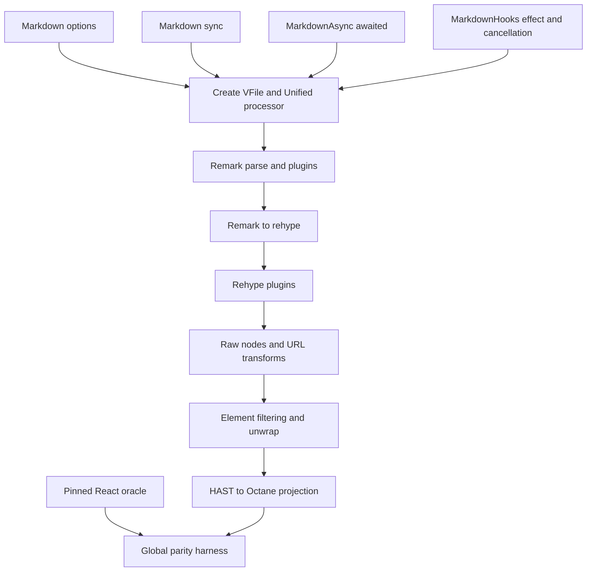

# Port react-markdown 10.1.0 to Octane

## Goal Capsule

- **Objective:** Ship `@octanejs/markdown` as the source-compatible Octane migration target for `react-markdown@10.1.0`, preserving its default, async, hooks, plugin, filtering, component, URL, SSR, and public-type contracts.
- **Authority:** The `react-markdown@10.1.0` npm artifact and canonical commit `44d2e4a44b37461ab7778d6870c1a9eb36393ad2` govern parity; Octane repository guidance governs adaptation and proof.
- **Execution profile:** Source-near port over Unified with exhaustive upstream inventory, pristine React and adapted Octane lanes, differential security and projection oracles, SSR/hydration evidence, and a bounded Chromium hooks lifecycle lane when jsdom cannot prove scheduling behavior.
- **Stop conditions:** Stop only for an upstream contract Octane cannot express without a product decision—including the pinned promise-returning mapped-component contract—a licensing contradiction, a prerequisite that belongs in a separate PR, or a human-only repository permission blocker.
- **Tail ownership:** Deliver one isolated binding PR and own its actionable CI and review tail. The durable tracker moves to `In review` after the PR opens and to `Complete and merged` only after the package is verified on upstream `main`.

---

## Product Contract

### Summary

Applications importing `react-markdown` should migrate through the ordinary React-to-Octane syntax/type conversion plus a dependency and import-root change, without library-specific API redesign, replacement Markdown renderers, or rewritten Unified plugin logic and component-mapping behavior. The port must retain the pinned package's synchronous, awaited asynchronous, and client-hook execution models and its security-relevant URL and raw-HTML behavior.

Here, exact binding means an equivalent mapped Octane package and API contract, not preserving the original `react-markdown` import identity through a package-manager override. Package.json discovery should map `react-markdown` to `@octanejs/markdown`; normal framework conversion changes the import root and React syntax/types.

### Problem Frame

Octane's MDX and Streamdown packages are adjacent capabilities, not import-compatible replacements. `react-markdown` has a distinct default export, named APIs, public types, Unified plugin contract, component override semantics, validation failures, and client async lifecycle. A lookalike Markdown renderer would leave a high-volume migration blocker and could silently change security behavior.

### Requirements

**Public package and provenance**

- R1. Publish `@octanejs/markdown` with default export `Markdown`, named runtime exports `MarkdownAsync`, `MarkdownHooks`, and `defaultUrlTransform`, and public types `AllowElement`, `Components`, `ExtraProps`, `HooksOptions`, `Options`, and `UrlTransform`.
- R2. Pin the npm artifact and canonical commit, vendor redistributable source and tests byte-exact, retain MIT attribution, hash both evidence boundaries, and account for every public export, public type, upstream artifact, and all 87 upstream subtests.
- R3. Preserve accepted and rejected TypeScript programs for default and named imports, options, plugin tuples, components, callbacks, async return values, and intrinsic properties without React runtime or public-type dependencies.

**Markdown processing and projection**

- R4. Preserve CommonMark parsing and the exact Unified pipeline: remark parse, ordered remark plugins, remark-to-rehype with merged options and dangerous-HTML handoff, then ordered rehype plugins.
- R5. Preserve default Markdown syntax output plus plugin-created GFM, table, footnote, SVG, ARIA, data, comma-separated, and style properties, including invalid-style tolerance, root replacement, comments, source nodes, keys, and fragments.
- R6. Preserve `components` mappings for intrinsic tags and custom Octane components, including complete intrinsic props, nested children, stable keys, the extra `node` prop, null output, and upstream invalid-component failures.
- R7. Preserve raw HTML behavior with no raw parser, explicit `rehype-raw`, and `skipHtml`, including the ordering of raw-node handling, URL transforms, filtering, unwrapping, and component projection.
- R8. Preserve `allowedElements`, `disallowedElements`, `allowElement`, and `unwrapDisallowed`, including invalid simultaneous lists, callback element/index/parent arguments, plugin-created nodes, and removal versus child extraction.

**Execution models, safety, and lifecycle**

- R9. Preserve synchronous `Markdown`, including synchronous plugin execution and the pinned failure for asynchronous transformers or invalid children/options.
- R10. Preserve awaited `MarkdownAsync`, including asynchronous remark/rehype plugins, component results supported by the pinned server contract, ordering, resolved output, and rejected errors.
- R11. Preserve `MarkdownHooks` fallback, effect dependencies, cancellation, latest-input behavior, errors, rerenders, recovery, and unmount cleanup without stale commits.
- R12. Preserve `defaultUrlTransform` exactly for relative, fragment, query, absolute, allowed-protocol, unsafe-protocol, case, whitespace/control-character, and empty URLs across every URL property and tag applicability in the pinned `html-url-attributes` map; custom transforms must receive `(url, key, node)` and preserve their pinned return semantics, while non-applicable tag/property pairs remain untouched.
- R13. Preserve runtime validation and deprecation failures, including non-string children and every removed legacy prop checked by the pinned source.

**Framework and delivery behavior**

- R14. Server rendering must be deterministic and browser-global-free for the sync and async APIs. Hydration must adopt existing nodes for default, plugin, filtering, URL, and component-override output; `MarkdownHooks` must preserve its pinned server/initial result and resolve safely on the client.
- R15. Register executable pristine React runtime/server/type lanes; adapted sync, async, hooks, DOM, SSR/hydration, type, and differential lanes; and exact collected/executed identities and hashes in the global React parity harness. Metadata-only evidence is insufficient.
- R16. Deliver package docs, status, changeset, generated catalog/status outputs, a representative playground example, and a mapped-equivalent consumer fixture in one isolated binding PR.

### Key Flows

- F1. **Render Markdown synchronously.** A consumer passes a string and synchronous plugins; the ordered Unified pipeline produces an Octane tree with exact filtering, URL, and component behavior or throws the pinned validation/plugin error. Covers R4-R9, R12-R13.
- F2. **Render Markdown asynchronously.** A server or async consumer awaits `MarkdownAsync`; async transforms settle in order and return the same projected tree, while errors reject. Covers R4-R10, R12-R14.
- F3. **Resolve Markdown through hooks.** A client mounts `MarkdownHooks`, observes the pinned fallback, changes source/options during pending work, and unmounts; only the active run may commit. Covers R10-R11, R14.
- F4. **Migrate an existing consumer.** A fixture changes only dependency/import mapping, then compiles and executes default/named APIs, plugins, components, and public types against the pristine and Octane packages. Covers R1-R3, R15-R16.

### Acceptance Examples

- AE1. Given Markdown containing headings, links, raw HTML, and plugin-created nodes, when the default export renders with component overrides and filtering, then the Octane tree, callback props, URL properties, and failures match React case-for-case.
- AE2. Given a slow plugin run followed by a fast source update, when `MarkdownHooks` resolves out of order, then the stale result never commits and unmount prevents all later commits.
- AE3. Given unsafe and obfuscated URL inputs, when default and custom URL transforms run on links and images, then every property matches the pinned oracle without broadening the safe set.
- AE4. Given server-rendered sync and async Markdown, when Chromium hydrates and updates the source, then existing nodes are adopted, no mismatch diagnostics occur, and new output replaces only obsolete content.

### Scope Boundaries

- Port `react-markdown@10.1.0`; do not absorb Streamdown, MDX, `remark-gfm`, `rehype-raw`, or other plugins into the package.
- Adapt only the framework seam: React elements, JSX runtime, hooks, component and renderable types become Octane equivalents. Do not change Unified ordering, validation, filtering, URL, or lifecycle behavior.
- Preserving the original `react-markdown` module specifier through aliasing or overrides is outside this binding. The migration inventory reports the exact `react-markdown` → `@octanejs/markdown` mapping.
- Do not add a sanitization policy beyond upstream. Document that custom transforms and plugins can weaken safety, and prove the pinned default contract.
- A newer major or prerelease belongs in a later isolated PR.

### Success Criteria

- A fixture copied from a real React consumer records every migration edit and proves that only ordinary framework-wide React-to-Octane syntax/type conversion plus dependency/import mapping is needed; default/named APIs, Unified plugin tuples, component-mapping behavior, callbacks, and public type shapes do not require library-specific redesign.
- Every public export/type and all 87 upstream cases have an executable or explicitly justified disposition, with no skips or expected failures.
- Exact URL/security, filtering, projection, sync/async/hooks, SSR/hydration, and lifecycle behavior is proven against the pinned React oracle.
- Global parity validation rejects stale, missing, renamed, skipped, duplicated, or unexecuted evidence.

---

## Planning Contract

### Key Technical Decisions

- KTD1. **Mirror the pinned module and processor shape.** Keep source near upstream `index` and `lib/index` boundaries and adapt the JSX runtime and hooks only. This makes validation, processing order, and URL logic reviewable against the pin. Governs R1-R13.
- KTD2. **Reuse Octane's established HAST projection seam.** Follow `packages/streamdown/src/lib/markdown.tsrx` and `hast-util-to-jsx-runtime` with Octane `createElement`/fragment adapters, while retaining react-markdown's distinct filtering and URL policy. Reject a bespoke renderer because it would expand semantic drift. (session-settled: user-approved — chosen over a similar Markdown renderer: migration requires equivalent bindings.) Governs R4-R8, R12.
- KTD3. **Keep three execution models and their compiler seams distinct.** The default API stays synchronous, `MarkdownAsync` is a plain TypeScript promise-returning API because TSRX rejects authored async components, and `MarkdownHooks` remains a compiler-processed client component owning effects and cancellation. Promise-returning mapped components must enter Octane's generic return-reconciliation path or trigger the plan's stop condition. Do not hide all three behind one async abstraction. Governs R9-R11, R14.
- KTD4. **Treat URL behavior as a security oracle.** Port `defaultUrlTransform` source-near and compare a table of safe, unsafe, obfuscated, relative, link, image, and custom-transform cases against React. Do not inherit Streamdown's identity transform. Governs R7, R12-R13.
- KTD5. **Make upstream coverage and migration evidence executable.** Inventory all 87 upstream subtests and run pristine React, adapted Octane, differential, server, hooks, hydration, and type lanes with exact identities and negative controls before marking provenance verified. Governs R2-R3, R15.
- KTD6. **Use real Chromium only for contracts requiring a browser.** Keep parser/tree/security comparisons in deterministic node/jsdom lanes; use the existing `vitest-full` Playwright pattern for hooks scheduling/hydration behavior that jsdom cannot faithfully prove. Governs R11, R14-R15.
- KTD7. **One binding, one PR.** Keep prerequisites and other plugins or bindings separate. (session-settled: user-directed — chosen over batching bindings: independent PRs keep the migration queue reviewable.) Governs R16.

### High-Level Technical Design

### Assumptions

- The pinned npm artifact and tag remain MIT and correspond to commit `44d2e4a44b37461ab7778d6870c1a9eb36393ad2`; provenance verification must confirm artifact integrity before implementation claims parity.
- The pristine oracle resolves unanswered behavior. A product decision is required only if Octane cannot express the observed contract.
- `MarkdownHooks` browser scope remains bounded to observable scheduling, hydration, fallback, update, error, and cleanup behavior; basic Markdown parsing does not need duplicate browser coverage.

### Sequencing

1. Freeze provenance, exports, types, and all upstream cases, create the minimal package/workspace scaffold, and falsify the load-bearing promise-returning mapped-component seam before committing to the projection architecture.
2. Port framework-neutral processor, validation, filtering, and URL behavior with differential tests.
3. Add Octane projection and the synchronous API, then async and hooks APIs.
4. Prove SSR/hydration and browser-only lifecycle behavior.
5. Register exhaustive parity evidence before integration metadata claims verification.
6. Add package/docs/example/catalog/changeset and run the complete repository gates.

---

## Implementation Units

### U1. Pin upstream evidence and prove the async component seam

- **Goal:** Establish immutable source, npm, license, export, type, and test boundaries and prove the load-bearing promise-returning mapped-component seam before the port architecture depends on it.
- **Requirements:** R1-R3, R15.
- **Dependencies:** None.
- **Files:** `packages/markdown/upstream/`, `packages/markdown/UPSTREAM.md`, `packages/markdown/audit/public-api.json`, `packages/markdown/audit/test-inventory.json`, `packages/markdown/audit/verify-provenance.mjs`, `packages/markdown/package.json`, `packages/markdown/tsconfig.json`, `packages/markdown/tests/probes/async-component.tsrx`, `packages/markdown/tests/probes/async-component.server.test.ts`, `packages/markdown/tests/adoption/consumer.tsrx`, `packages/markdown/tests/adoption/consumer.test.ts`, `packages/markdown/tests/adoption/MIGRATION.md`, `pnpm-workspace.yaml`, `pnpm-lock.yaml`.
- **Approach:** Vendor the 10.1.0 package and canonical source/test boundary byte-exact. Inventory the default export, three named runtime exports, six public types, source modules, artifacts, and all 87 upstream subtests. Create the minimal package exports, scripts, workspace registration, and direct runtime/dev dependency declarations needed to execute U2-U5. Before U2, exercise the proposed HAST-to-Octane adapter shape with a promise-returning mapped component through public-like entry points, including successful SSR, rejection, nested children, and its intended public type; failure triggers the plan stop condition and reopens KTD2-KTD3. Also freeze two adoption inputs before architecture commitment: pinned canonical react-markdown examples and one attribution-compatible public application consumer selected for default/named APIs, public types, plugin tuples, intrinsic/custom mappings, hooks, and async usage. Record every baseline framework-wide and library-specific edit separately. Defer public docs, release metadata, playground, changeset, and generated integration outputs to U6.
- **Test scenarios:** Missing or modified vendored files fail; altered license or package identity fails; missing/extra runtime or type exports fail; removed, renamed, skipped, duplicated, or unclassified upstream cases fail; the async-component probe resolves nested server output, propagates rejection, and typechecks through the planned mapping surface; the frozen adoption corpus exposes any react-markdown-specific redesign before U2 begins.
- **Verification:** Provenance and all negative controls pass with exact counts and hashes, and the architecture probe proves the entry condition for U2-U4.

### U2. Port processor, validation, filtering, and URL behavior

- **Goal:** Preserve framework-neutral Markdown processing and security-sensitive transforms before rendering adaptation.
- **Requirements:** R4, R7-R9, R12-R13; KTD1, KTD4.
- **Dependencies:** U1.
- **Files:** `packages/markdown/src/processor.ts`, `packages/markdown/src/url-transform.ts`, `packages/markdown/src/types.ts`, `packages/markdown/tests/differential/processor.test.ts`, `packages/markdown/tests/differential/url-transform.test.ts`, `packages/markdown/tests/validation.test.ts`.
- **Approach:** Keep upstream processor construction, VFile creation, deprecation checks, raw-node transformation, URL-attribute traversal, filtering order, and unwrapping source-near and renderer-independent.
- **Test scenarios:** Covers AE3. Compare relative/query/hash/absolute/allowed and unsafe protocols, case, whitespace/control characters, empty values, every pinned URL property/tag applicability, plugin-created URL-bearing elements, exact custom-transform arguments and returns, and untouched non-applicable pairs; validate non-string children, removed props, simultaneous allow/disallow lists, parent/index callbacks, unwrap on/off, plugin-created nodes, raw HTML, `skipHtml`, and transform ordering.
- **Verification:** Pristine/adapted differential identities and validation messages match the pin; deliberate mutations fail.

### U3. Port synchronous projection and public types

- **Goal:** Ship the default `Markdown` export and exact component projection contract through public entry points.
- **Requirements:** R1 (default export), R3-R9, R13; KTD1-KTD2.
- **Dependencies:** U1-U2.
- **Files:** `packages/markdown/src/index.tsrx`, `packages/markdown/src/project.ts`, `packages/markdown/src/types.ts`, `packages/markdown/tests/upstream/`, `packages/markdown/tests/conformance/`, `packages/markdown/typetests/`.
- **Approach:** Adapt `hast-util-to-jsx-runtime` to Octane's JSX runtime while preserving intrinsic/custom component dispatch, keys, nodes, properties, fragments, and failures. Keep public component types strict and React-free.
- **Test scenarios:** Covers AE1. Execute every applicable upstream sync case; inspect complete props for headings, code, lists, tables, links, images, SVG, plugin-created nodes, null components, keyed sibling updates, styles, ARIA/data properties, invalid components, root replacement, the default import, accepted plugin tuples, and rejected public-type programs.
- **Verification:** All sync upstream identities execute once; the default export, differential tree, and pristine/adapted type lanes pass.

### U4. Port async and hooks execution models

- **Goal:** Preserve awaited async rendering and client effect lifecycle without stale results.
- **Requirements:** R1 (named runtime exports), R9-R11, R13-R14; KTD3.
- **Dependencies:** U2-U3.
- **Files:** `packages/markdown/src/markdown-async.ts`, `packages/markdown/src/markdown-hooks.tsrx`, `packages/markdown/src/index.ts`, `packages/markdown/tests/async/`, `packages/markdown/tests/hooks/`, `packages/markdown/tests/browser/`.
- **Approach:** Implement `MarkdownAsync` as a plain TypeScript function returning the exact awaited promise type so it does not enter TSRX's forbidden async-component lowering. Keep `MarkdownHooks` in compiler-processed TSRX with the pinned effect dependency list and cancellation behavior. Define how promise-returning mapped components pass through HAST projection into Octane's generic return-reconciliation path; if no source-compatible authoring form survives server rendering, stop and record the incompatibility rather than weakening R10.
- **Test scenarios:** Covers AE2. Named imports, async remark/rehype success, tuple ordering, sync throw versus async rejection, fallback, error propagation, rerender, recovery, slow-old/fast-new completion, changed plugin/options identity, repeated effect setup, unmount cleanup, and no obsolete commit. Separately prove promise-returning mapped-component server success and rejection through public entry points. Activate Chromium only for scheduling behavior not faithfully proven in jsdom.
- **Verification:** Every upstream async/hooks identity plus port-authored race/cleanup identity executes; pristine and adapted outcomes/errors match.

### U5. Prove SSR, hydration, and executable global parity

- **Goal:** Make every contract lane executable and fail-closed in package and global CI.
- **Requirements:** R2-R3, R14-R15; KTD5-KTD6.
- **Dependencies:** U1-U4.
- **Files:** `packages/markdown/tests/ssr/`, `packages/markdown/tests/hydration/`, `packages/markdown/audit/react-parity.json`, `packages/markdown/audit/runtime-inventory.json`, `scripts/react-parity/react-markdown-*.mjs`, `scripts/react-parity/check.mjs`, `vitest.config.js`.
- **Approach:** Add pristine React runtime/server/type projects; adapted sync/async/hooks/SSR/hydration/type projects; focused differential projects; and bounded Chromium projects for required browser-only contracts, with exact collected/executed identities, source hashes, and negative controls.
- **Test scenarios:** Covers AE4. Sync and awaited async SSR without globals; exact server markup; hooks pinned initial/fallback result; default/plugin/filter/URL/component hydration; original-node adoption; no diagnostics; interactive updates; missing, stale, renamed, skipped, duplicated, or unexecuted lane rejection.
- **Verification:** Package projects and `react-parity:check` execute every required lane; the manifest earns `verified` only after all evidence passes.

### U6. Integrate package, adoption example, and release metadata

- **Goal:** Make the binding installable, discoverable, demonstrable, and accurately tracked.
- **Requirements:** R16; KTD7.
- **Dependencies:** U1-U5.
- **Files:** `packages/markdown/package.json`, `packages/markdown/README.md`, `packages/markdown/status.json`, `packages/markdown/LICENSE`, `packages/markdown/tests/adoption/consumer.test.ts`, `package.json`, `playground/octane/`, `website/src/content/bindings.json`, `.changeset/`, generated package/status/parity inventories.
- **Approach:** Finalize package files and root typecheck/project registration, add a controlled plugin/component playground demo, and execute the adoption corpus already frozen in U1. Its complete migration record must require only ordinary framework-wide syntax/type conversion plus the declared dependency/import mapping—no react-markdown-specific API or behavioral redesign—then add the patch changeset, status/catalog metadata, and generated outputs. README security guidance must state that default raw HTML is rendered as text, `rehype-raw` parses but does not sanitize, plugins and component mappings are trusted code, custom URL transforms can broaden the allowed set, and untrusted content needs an explicitly positioned sanitizer. Minimal dependency, workspace, export, build, and adoption-source scaffolding already belongs to U1.
- **Test scenarios:** Covers F4. Workspace and packed imports resolve; the pre-adaptation consumer includes JSX-returning component mappings, intrinsic-prop forwarding, `node` destructuring, null returns, and the published `Components` type; its recorded Octane diff contains no library-specific API redesign; no React dependency leaks; playground builds and demonstrates sync/plugin/component behavior; a default raw-HTML case and deliberately unsafe plugin/component/custom-transform fixture keep documentation claims precise; generated docs remain clean.
- **Verification:** Package pack, scoped type/format/tests, playground production build, `pnpm sync`, changeset/status/catalog checks, and global parity all pass.

---

## Verification Contract

| Gate | Scope | Done signal |
| --- | --- | --- |
| Provenance | U1, U5 | Source/npm/license hashes, exports, types, 87 upstream cases, classifications, and negative controls pass. |
| Public types | U3, U5 | Pristine and adapted type probes accept/reject the intended programs with no React leakage. |
| Sync and projection | U2-U3 | Every applicable upstream sync identity and differential tree/props/error checkpoint executes once and matches. |
| Async and hooks | U4-U5 | Awaited plugins, fallback, errors, rerenders, cancellation, latest-input, recovery, and cleanup match the pin. |
| URL and filtering safety | U2-U5 | The full URL matrix, raw HTML, filtering, unwrap, callback, and validation oracle matches React. |
| SSR and hydration | U4-U5 | Sync/async server output is global-free and deterministic; hydration adopts nodes and remains updateable without diagnostics. |
| Real browser | U4-U5 | Bounded Chromium evidence passes for any hooks scheduling/hydration contract that jsdom cannot prove. |
| Global parity | U1-U5 | Every declared lane executes with exact identities/hashes and all negative controls reject drift. |
| Repository integration | U6 | Pack, typecheck, tests, format, playground build, sync, status/catalog, and changeset checks pass. |
| PR tail | U6 | Isolated PR is open, tracker says `In review`, actionable CI/review is resolved, and human-only residuals are recorded. |

---

## Definition of Done

- Requirements R1-R15 have direct executable evidence, R16's delivery artifacts have repository evidence, and the maintainer-controlled PR/tracker lifecycle is attested separately.
- The pinned default/named/type surface is available through public package entry points without React runtime or public-type dependencies.
- All 87 upstream cases are executed or carry a narrow, reviewed adaptation disposition; none are silently skipped.
- Sync, async, hooks, plugin, projection, filtering, URL, validation, SSR/hydration, type, migration, and required Chromium lanes are green and registered globally.
- `UPSTREAM.md`, README, status, license, changeset, playground, catalog, generated docs, parity manifest, and durable tracker agree with the implementation and PR state.
- No abandoned experiments, stale inventories, test-only behavior, unrelated changes, unsafe broadening, or hidden divergence remains.
- The PR has been babysat until CI is decided and all agent-actionable review is resolved; merge remains a maintainer action.
