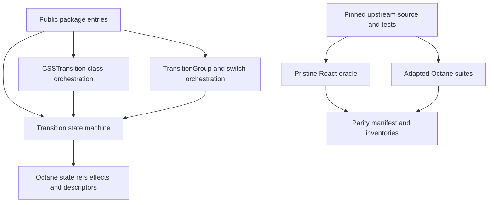
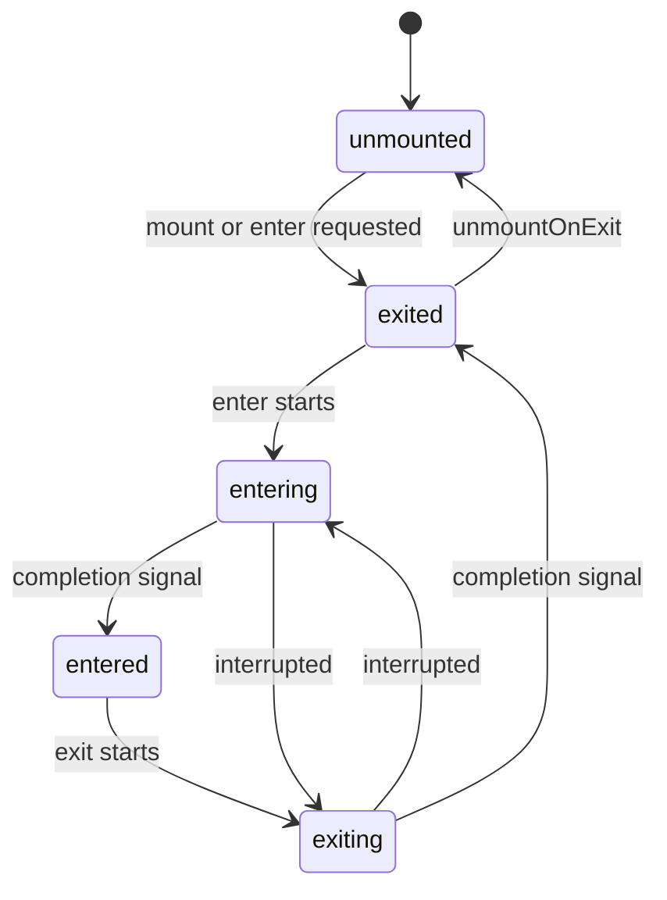
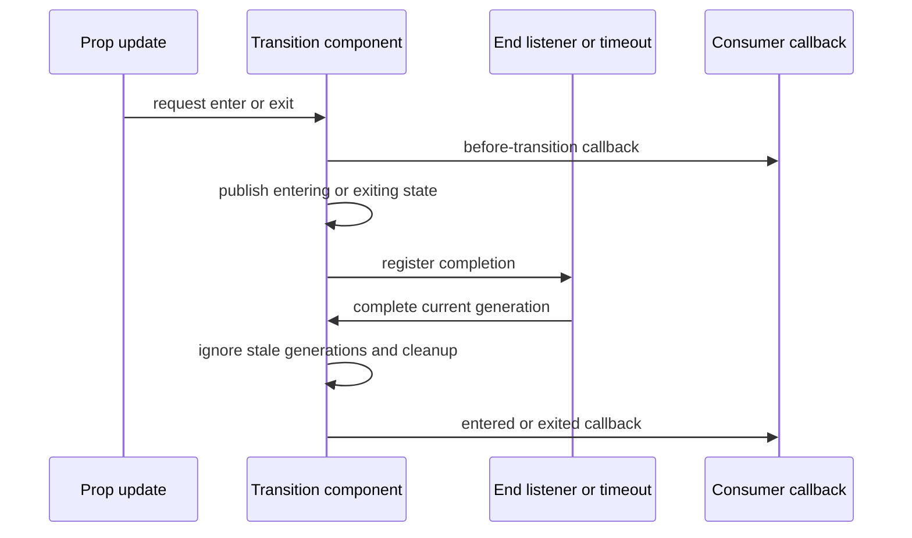

# React Transition Group binding port

## Goal Capsule

- **Objective:** Publish `@octanejs/transition-group` as an exact Octane binding for the public surface and observable behavior of `react-transition-group@4.4.5`.
- **Authority:** The pinned upstream tag and its tests define parity; Octane's documented intentional divergences and repository binding guidance constrain adaptations.
- **Execution profile:** One binding, one focused pull request, with vendored provenance, exhaustive export and test disposition, and registered React parity lanes.
- **Stop condition:** A required behavior needs a runtime, compiler, SSR, or shared parity-harness change outside the binding package. That work is split into a prerequisite PR rather than hidden in this port.
- **Tail ownership:** The binding PR remains draft until current-head validation, review, and CI satisfy repository readiness rules; merging remains a maintainer action.

---

## Product Contract

### Summary

React users should be able to replace the package dependency and imports for `react-transition-group` with an Octane-owned binding without choosing a similar-but-different animation abstraction or rewriting transition orchestration. The port targets the immutable `v4.4.5` release and preserves its package vocabulary: `Transition`, `CSSTransition`, `TransitionGroup`, `SwitchTransition`, `ReplaceTransition`, and `config`.

### Problem Frame

`react-transition-group` remains a dependency beneath mature React UI libraries, including consumers that use it indirectly. Octane cannot execute its React-authored class components unchanged, so package migration currently requires application-specific adapters or replacing the dependency. A trustworthy binding must reimplement the thin React-facing lifecycle in Octane while proving callback order, timeouts, class changes, keyed child retention, server output, refs, and cancellation against the pinned upstream release.

### Requirements

**Compatibility surface**

- R1. The package exposes every public root and documented per-component entry point shipped by `react-transition-group@4.4.5`, using the same export names and import intent.
- R2. Each component preserves upstream prop names, defaults, callback arguments, child-function behavior, ref behavior, and transition state vocabulary wherever Octane can observe the same contract.
- R3. `Transition` preserves appear, enter, exit, mount-on-enter, unmount-on-exit, timeout, custom end-listener, disabled-transition, cancellation, and callback-order behavior.
- R4. `CSSTransition` preserves base/active/done class sequencing, forced reflow where upstream requires it, object and string class-name forms, and cleanup across interrupted transitions.
- R5. `TransitionGroup`, `SwitchTransition`, and `ReplaceTransition` preserve keyed child retention, enter/exit coordination, transition modes, context propagation, and wrapper customization.

**Evidence and distribution**

- R6. The port records the exact upstream package version, tag commit, source boundary, license, export crosswalk, and disposition of every upstream source and test artifact.
- R7. Vendored upstream source, tests, and license remain byte-exact development evidence, are integrity-checked, and are excluded from the published package.
- R8. Every parity claim is backed by a pinned upstream test citation or a React/Octane differential scenario; Octane-only tests are classified and do not count as React parity.
- R9. The parity harness fails when expected upstream evidence, adapted cases, classifications, hashes, or required execution lanes drift or disappear.
- R10. Package metadata, status inventory, generated documentation, test projects, workspace dependencies, and a patch changeset integrate the binding with repository-wide checks.

### Scope Boundaries

- The binding ports `react-transition-group@4.4.5`; it does not design a new animation API or substitute Motion, Web Animations, or Octane view transitions.
- Browser CSS interpolation and pixel rendering are not package-owned behavior. Tests observe classes, DOM lifecycle, callbacks, refs, and timing boundaries.
- React class instances, legacy lifecycle methods, `findDOMNode`, and StrictMode double invocation are not compatibility promises. `nodeRef` and Octane refs-as-props are the supported node identity path, with explicit recorded divergences where upstream exposes an unreachable legacy behavior.
- Framework defects discovered during parity work are deferred to separate prerequisite PRs and linked from this plan and binding PR.

### Acceptance Examples

- AE1. Given an initially exited `Transition`, when `in` becomes true and its timeout advances, it emits the same state sequence and callbacks as the pinned React implementation.
- AE2. Given a `CSSTransition` with string or object class names, when enter or exit is interrupted, the DOM retains only the classes upstream retains and callback order remains equivalent.
- AE3. Given a keyed `TransitionGroup`, when children are inserted, removed, and reordered, exiting children remain until completion and surviving DOM identity is preserved.
- AE4. Given `SwitchTransition` in `out-in` or `in-out` mode, when its keyed child changes, the old and new child visibility sequence matches upstream.
- AE5. Given server rendering, disabled transitions, zero timeouts, custom end listeners, or rapid prop changes, the binding completes deterministically without leaking timers, listeners, classes, or stale callbacks.

---

## Planning Contract

### Key Technical Decisions

- KTD1. **Exact package compatibility.** Implement the `react-transition-group` API rather than recommending an adjacent Octane animation primitive. (session-settled: user-directed — chosen over similar alternatives: package.json migration needs a direct equivalent.)
- KTD2. **One binding per pull request.** Keep this port isolated from every other portfolio item. (session-settled: user-directed — chosen over a bundled portfolio PR: each binding needs independent review and checkoff.)
- KTD3. **Pinned source and executable parity evidence.** Mirror upstream module boundaries, vendor the BSD-3-Clause source and tests at commit `4cb51a9be0ebf508cb8f6506452097f7ebb874fe`, and register pristine plus adapted lanes with the repository parity harness. (session-settled: user-directed — chosen over ad hoc tests: every port must follow current repository guidance and the React parity harness.)
- KTD4. **Functional lifecycle adaptation.** Replace upstream class lifecycle machinery with explicit Octane state, refs, layout effects, and cleanup while keeping the public state machine and observable callback/timer semantics. Class-instance compatibility is recorded as not applicable rather than emulated.
- KTD5. **No hidden framework fixes.** If a failing upstream case proves a runtime, compiler, SSR, or shared-harness defect, stop that path and create a separate prerequisite PR. (session-settled: user-directed — chosen over mixing framework fixes into the binding: ownership and risk must remain reviewable.)
- KTD6. **Native scheduling with deterministic tests.** Use the upstream timeout/end-listener contract and fake-clock control, test observable state boundaries, and avoid asserting private effect or scheduler internals.

### High-Level Technical Design

The design is directional. Exact internal function and file boundaries may adjust during implementation while the upstream mirror and public surface remain fixed.

### Sequencing

U1 establishes immutable evidence and package scaffolding before behavior is authored. U2 provides the shared state machine required by U3 and U4. U5 closes parity and distribution evidence after the complete surface exists. U6 performs repository integration and release validation.

### Risks and Dependencies

- Upstream is class-component-based and predates refs-as-props. Adaptation can preserve observable behavior but cannot expose class instances or `findDOMNode`; every affected case needs an explicit disposition and migration note.
- Timer and effect ordering can differ subtly between React and Octane. Tests use completion generations, deterministic clocks, and consumer-observable callbacks rather than implementation call order.
- Child mapping depends on stable descriptor keys and cloning behavior. Existing Octane `Children`, `cloneElement`, context, and keyed reconciliation are the required substrate; any proven defect triggers KTD5.
- The upstream npm tarball contains compiled code but omits source tests; canonical tag source and tests are therefore the vendoring authority, while the tarball inventory defines published entry points.
- BSD-3-Clause permits source redistribution when copyright, license conditions, and disclaimer are retained. The vendored license and package notice must remain intact.

---

## Implementation Units

### U1. Pin upstream evidence and scaffold the package

- **Goal:** Create the reviewable source, license, integrity, package, documentation, status, and test skeleton for R1, R6, R7, and R10.
- **Files:** `packages/transition-group/package.json`, `packages/transition-group/README.md`, `packages/transition-group/UPSTREAM.md`, `packages/transition-group/LICENSE`, `packages/transition-group/status.json`, `packages/transition-group/tsconfig.json`, `packages/transition-group/upstream/**`, `packages/transition-group/audit/**`.
- **Patterns:** Follow `packages/three/UPSTREAM.md`, the complete parity manifest in `packages/hook-form/audit/`, and current publishable binding manifests.
- **Test scenarios:** Verify the upstream checkout commit and version; verify byte hashes for every vendored source, test, and license artifact; fail on missing, extra, or modified evidence; verify upstream files are absent from packed output.
- **Verification:** The package metadata and evidence validators pass before implementation claims exist.

### U2. Port the Transition state machine

- **Goal:** Implement the foundational transition lifecycle for R2 and R3 using Octane function components and cleanup-safe hooks, governed by KTD4 and KTD6.
- **Files:** `packages/transition-group/src/Transition.tsrx`, `packages/transition-group/src/TransitionGroupContext.ts`, `packages/transition-group/src/config.ts`, `packages/transition-group/src/types.ts`, `packages/transition-group/tests/adapted/Transition.test.ts`, `packages/transition-group/tests/differential/transition.test.ts`, `packages/transition-group/tests/ssr/transition.test.ts`.
- **Patterns:** Use Octane refs-as-props, explicit dependency arrays for React-equivalent lifecycle boundaries, and nearby function-component ports that project child render functions as descriptors.
- **Test scenarios:** Cover all five visible states; appear, enter, and exit defaults; mount-on-enter and unmount-on-exit; numeric and object timeouts; zero timeout; custom end listener; disabled transitions; interrupted and reversed transitions; stale completion suppression; callback arguments and order; node refs; context-driven group enter/exit; SSR initial state.
- **Verification:** Adapted cases retain upstream case names/citations, differential cases match the pinned React oracle, and cleanup tests prove no post-unmount callbacks.

### U3. Port CSSTransition class orchestration

- **Goal:** Preserve R4 on top of U2 without owning CSS animation rendering.
- **Files:** `packages/transition-group/src/CSSTransition.tsrx`, `packages/transition-group/src/utils/reflow.ts`, `packages/transition-group/tests/adapted/CSSTransition.test.ts`, `packages/transition-group/tests/adapted/CSSTransitionGroup.test.ts`, `packages/transition-group/tests/differential/css-transition.test.ts`.
- **Patterns:** Mirror upstream class-name resolution and forced-reflow boundaries; observe DOM classes and callbacks through public props.
- **Test scenarios:** Cover enter, appear, and exit base/active/done classes; string prefix and object class-name forms; child classes preserved; forced reflow before active class; interrupted transitions; repeated cycles; nodeRef; callback node arguments; unmount cleanup.
- **Verification:** Every class assertion is paired with a pinned upstream citation or differential React run, and deliberate legacy-ref divergence is explicit.

### U4. Port grouped and switched transitions

- **Goal:** Implement R5 using Octane descriptor traversal, stable keys, cloning, context, and state.
- **Files:** `packages/transition-group/src/TransitionGroup.tsrx`, `packages/transition-group/src/SwitchTransition.tsrx`, `packages/transition-group/src/ReplaceTransition.tsrx`, `packages/transition-group/src/utils/ChildMapping.ts`, `packages/transition-group/src/utils/SimpleSet.ts`, `packages/transition-group/tests/adapted/ChildMapping.test.ts`, `packages/transition-group/tests/adapted/TransitionGroup.test.ts`, `packages/transition-group/tests/adapted/SwitchTransition.test.ts`, `packages/transition-group/tests/differential/groups.test.ts`.
- **Patterns:** Use public `Children`, `cloneElement`, `isValidElement`, and descriptor keys; assert final DOM and survivor identity, not React's physical move set.
- **Test scenarios:** Cover initial mapping, insertion, removal retention, reorder, simultaneous enter/exit, `component={null}`, custom wrappers, child factories, callback chaining, nested groups, `out-in` and `in-out`, rapid key replacement, ReplaceTransition callback routing, and cleanup after group deletion.
- **Verification:** Utility cases run unchanged where framework-neutral, component cases run as adapted or differential evidence, and node identity assertions cover keyed survivors.

### U5. Complete export, test, type, and parity crosswalks

- **Goal:** Make every compatibility claim auditable for R1, R6, R8, and R9.
- **Files:** `packages/transition-group/src/index.ts`, `packages/transition-group/tests/exports.test.ts`, `packages/transition-group/tests/parity-controls.test.ts`, `packages/transition-group/typetests/**`, `packages/transition-group/audit/react-parity.json`, `packages/transition-group/audit/test-classifications.json`, `packages/transition-group/audit/*.json`.
- **Patterns:** Follow existing exhaustive export tests and the registered pristine/adapted manifest lanes; keep package-specific logic inside the package unless the harness needs a reusable extension.
- **Test scenarios:** Verify all six root exports and documented per-component entry points; exercise public prop types and rejected misuse; fail controls for removed upstream files, deleted adapted cases, skipped markers, stale hashes, unclassified tests, and a required lane that validates but does not execute.
- **Verification:** `react-parity:check` both validates metadata and executes every required runtime/type lane.
- **Execution note:** If registration exposes a missing shared parity-harness capability, stop this unit, land the reusable harness extension in a separate prerequisite PR, then rebase and consume it here.

### U6. Integrate package inventory and release evidence

- **Goal:** Finish R10 and demonstrate external consumption without React at runtime.
- **Files:** `vitest.config.js`, `pnpm-workspace.yaml`, `pnpm-lock.yaml`, `.changeset/*.md`, generated package/status/parity documentation, and any package inventory generated by `pnpm sync`.
- **Patterns:** Follow neighboring binding projects, source exports, Node engine baseline, and patch changesets for 0.x packages.
- **Test scenarios:** Install or link the packed package in an external fixture; compile an Octane consumer using root and per-component imports; run a representative transition; assert the tarball excludes upstream evidence and does not require React or ReactDOM at runtime.
- **Verification:** Scoped package tests, SSR tests, type tests, parity checks, package checks, sync, formatting, and the repository's relevant full gates pass with a clean worktree.

---

## Verification Contract

| Gate | Applicability | Covers | Done signal |
| --- | --- | --- | --- |
| Package Vitest projects | Always | U2-U5 | Runtime, differential, SSR, controls, and export suites pass with no skipped markers. |
| Upstream provenance and inventory validation | Always | U1, U5 | Commit, version, license, hashes, file inventory, and test dispositions match the pin. |
| Adapted `.tsrx` typecheck and public typetests | Always | U2-U6 | Public API accepts supported usage and rejects the same invalid shapes except documented divergences. |
| React parity audit | Always | U1-U5 | All required pristine, adapted, differential, and type lanes execute and the generated report is current. |
| Package/status inventory sync | Always | U6 | Generated package and binding status documents contain the new package without unrelated drift. |
| Packed external consumer | Always | U1, U6 | The published shape compiles and runs without a React runtime dependency and excludes vendored evidence. |
| Scoped format and repository typecheck | Always | U1-U6 | Changed authored files are formatted and the repository typecheck succeeds. |
| Full repository tests and format gate | Before push | U1-U6 | Relevant full gates pass or any pre-existing unrelated failure is precisely documented. |
| Real-browser forced-reflow test | Always | U3 | A real browser proves that the base-to-active class boundary crosses a layout read and reaches the expected observable transition lifecycle. |

---

## Definition of Done

- `@octanejs/transition-group` exists as a publishable source package with exact root and per-component import coverage for the pinned release.
- Every upstream export and test artifact has an evidence-backed disposition, and every port-authored test has exactly one parity classification.
- The vendored BSD-3-Clause source, tests, and license match committed hashes and are excluded from the package tarball.
- Transition, CSS class, group, switch, replacement, SSR, ref, interruption, and cleanup contracts satisfy the pinned React oracle or carry an explicit consumer-facing divergence.
- Negative controls prove the parity evidence cannot silently become incomplete or stop executing.
- Package, status, parity, and generated inventories are current; a patch changeset is present; the worktree is clean after sync and validation.
- No runtime, compiler, SSR, or shared-harness defect is concealed in the binding PR; any prerequisite is isolated and linked.
- The portfolio tracker is updated to `In review` only after the draft PR exists, and to `Complete and merged` only after the package is present on current upstream `main`.
