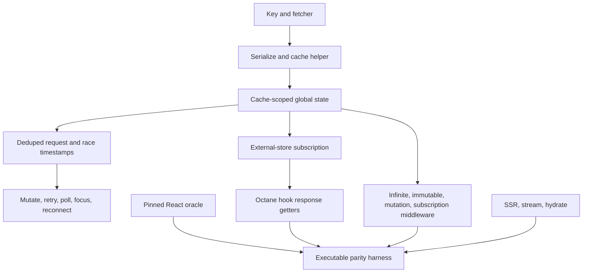

# Port SWR 2.4.2 to Octane

## Goal Capsule

- **Objective:** Ship `@octanejs/swr` as the exact mapped Octane binding for `swr@2.4.2`, including the root, `infinite`, `immutable`, `mutation`, `subscription`, `_internal`, and conditional React-server entry points.
- **Authority:** The `swr@2.4.2` npm artifact and canonical tag commit `f1c1fd855f1e9e7c85755e4232ea4b03c7f81910` govern parity; Octane's current React-port, compiler, runtime, SSR, hydration, and testing guidance governs adaptation.
- **Execution profile:** Reuse framework-neutral SWR logic source-near, re-author its React seam with Octane hooks, and prove parity through unchanged pristine React execution plus assertion-preserving adapted, differential, SSR, hydration, and browser lanes.
- **Stop conditions:** Stop before implementation expands if an early probe shows that Octane cannot express SWR's subscription snapshots, render-time promise/Suspense contract, cache/provider isolation, mutation transition ordering, or server/hydration behavior without a framework change; isolate any such prerequisite into its own PR. Also stop for a license/provenance contradiction or a human-only permission blocker.
- **Tail ownership:** Deliver one isolated SWR binding PR, babysit every agent-actionable CI/review result, mark the durable tracker `In review` only after opening the PR, and mark it `Complete and merged` only after the package is present on upstream `main`.

---

## Product Contract

### Summary

An application with `swr` in `package.json` should be able to map it to `@octanejs/swr`, change import roots, perform only ordinary React-to-Octane syntax/type conversion, and retain SWR's public API and observable data-fetching behavior. Exact binding means mapped package/API parity, not preserving the original `swr` module identity through an override.

### Problem Frame

SWR is not only a fetch-on-mount hook. Its contract spans serialized keys, shared cache providers, external-store subscriptions, request deduplication, races, mutation timestamps, optimistic rollback, focus/reconnect events, retry and polling timers, Suspense, server fallback, streaming, devtools metadata, and five specialized entry points. A demo-only `useSWR` lookalike would leave common migrations blocked and could introduce stale-data, duplicate-request, or cache-isolation defects.

### Requirements

**Published surface and provenance**

- R1. Publish `@octanejs/swr` with exact mapped exports for `.`, `./infinite`, `./immutable`, `./mutation`, `./subscription`, `./_internal`, `./package.json`, and the root/infinite/_internal `react-server` conditions present at the pin.
- R2. Pin and hash the npm artifact, canonical source, MIT license, published entry conditions, all public runtime/type exports, all 53 upstream test/config/support artifacts, 338 statically declared runtime/unit `test`/`it` call sites, the three same-spelling generic helper invocations in `test/type/trigger.ts`, 181 type-assertion identities, and the five upstream committed skips. Never convert those skips into silent Octane skips: classify their upstream disposition and provide executable evidence or a narrow non-applicability rationale.
- R3. Preserve accepted and rejected TypeScript programs for keys, fetchers, configs, middleware, cache providers, responses, mutate/trigger overloads, infinite pagination, subscriptions, Suspense blocking data, and `_internal` exports without React runtime or React public-type leakage.

**Core cache and request behavior**

- R4. Preserve key normalization/serialization and `stableHash` behavior for strings, tuples, objects, functions, falsy/throwing keys, circular values, and server/client stability.
- R5. Preserve cache creation, provider nesting, default and custom cache isolation, subscriptions, fallback merging, dependency-selected rerenders, bound/global mutation, `useSWRConfig`, `SWRConfig`, middleware composition, `preload`, and cache cleanup.
- R6. Preserve request lifecycle behavior: initial/loading/validating states, fallback and keep-previous-data behavior, concurrent deduplication, callback ownership, stale-response suppression, request/mutation race ordering, promise keys, fetcher changes, paused state, and unmount cleanup.
- R7. Preserve mutation behavior including data/function/promise inputs, revalidation selection, optimistic data, populate-cache functions, rollback-on-error predicates, throw-on-error, callbacks, race timestamps, bound/global scope, and reset/trigger state.
- R8. Preserve automatic revalidation on focus and reconnect, offline gating, refresh polling (number/function intervals), hidden/offline policy, loading-slow, error retry/backoff hooks, timer replacement, and disposal. If upstream does not abort fetches at this pin, do not invent AbortSignal semantics; prove that losing requests are ignored and that consumer-created abort/rejection behavior propagates without leaks.
- R9. Preserve immutable behavior by forcibly disabling stale, focus, reconnect, and interval revalidation while retaining initial fetch, explicit mutation, cache, keys, errors, and types.
- R10. Preserve infinite behavior: first-page serialization, sequential/parallel page keys, previous-page data, initial/persisted size, setSize, per-page cache, preloading, page-selective mutation, revalidation options, empty termination, error states, Suspense, and server serialization.
- R11. Preserve remote mutation behavior: trigger argument/fetcher contract, defaults, transition-visible state, latest-trigger wins, reset, callbacks, errors, cache population, optimistic rollback, and all public overloads.
- R12. Preserve subscription behavior: cache-scoped shared subscriptions, key changes, reference counting, exactly-once disposal after the last subscriber, data/error delivery, invalid disposer failure, and no updates after cleanup.

**Rendering, server, and integration behavior**

- R13. Preserve Suspense and promise behavior for cached/uncached data and errors, deduped siblings, fallback, preload, retry/recovery, concurrent rendering, and transition boundaries without render-phase state corruption.
- R14. Preserve deterministic browser-global-free server entry points and SSR output, fallback seeding, streaming Suspense behavior, and hydration adoption. Node adoption itself must not create an extra request, but hydration is not a blanket no-revalidation mode: fallback and preload data must still revalidate exactly as `revalidateOnMount`, `revalidateIfStale`, Suspense, key changes, and the pinned oracle require. Preserve `test/use-swr-integration.test.tsx` cases “should call fetch function when revalidateOnMount is true even if fallbackData is set,” “initial loading state should be false when revalidation is disabled with fallbackData,” and “should revalidate even if fallbackData is provided”; `test/use-swr-suspense.test.tsx` case “should not fetch when cached data is present and revalidateIfStale is false”; `test/use-swr-preload.test.tsx` cases “preload the fetcher function with the suspense mode” and “dedupe requests during preloading”; and `test/use-swr-streaming-ssr.test.tsx` case “should match ssr result when hydrating.”
- R15. Make devtools an explicit mapped divergence. Preserve validated `window.__SWR_DEVTOOLS_USE__` middleware arrays, expose the Octane runtime only as `window.__SWR_DEVTOOLS_OCTANE__`, and never claim or populate React's `window.__SWR_DEVTOOLS_REACT__`. Ignore hostile/non-array ambient values rather than spreading or executing them. Document this incompatibility and that fetchers, middleware, providers, subscribers, retry callbacks, and accepted devtools middleware are trusted executable code.
- R16. Run the pinned React runtime suite unchanged with its pinned Jest/React dependencies and run all three upstream TypeScript projects unchanged: `test/tsconfig.json`, `test/type/tsconfig.json`, and `test/type/suspense/tsconfig.json`. Separately maintain a line/case-level assertion-preserving crosswalk into Octane fixtures. Reconcile the 338 syntactic runtime/unit call sites, parameterized declarations, conditional-version helpers, and actual collected Jest identities by storing both inventories; only objective, enumerated per-case dispositions are allowed. Register exact collected/executed identities, pristine and adapted runtime/type hashes, differential scenarios, SSR/hydration, and required browser lanes in global `react-parity:check`; metadata-only or synthetic title-loop evidence is insufficient.
- R17. Deliver README, UPSTREAM/crosswalk, status, license attribution, changeset, package/catalog outputs, representative playground/adoption fixtures, and one binding PR whose migration record demonstrates no SWR-specific API redesign.

### Key Flows

- F1. **Read and revalidate shared data.** Two consumers with the same key share one request and cache record, subscribe independently, update only for fields they read, and resolve races without stale commits. Covers R4-R6.
- F2. **Mutate optimistically.** A consumer applies optimistic data, observes mutation state, succeeds or rolls back on the configured error, and triggers exactly the configured revalidation/callback sequence. Covers R7, R11.
- F3. **Respond to environment events.** Focus, reconnect, polling, offline, slow-loading, and error-retry signals schedule bounded revalidation and clean up on key/provider/unmount changes. Covers R8-R9.
- F4. **Page or subscribe.** Infinite consumers load sequential/parallel pages and resize safely; subscription consumers share one external subscription per cache/key and dispose only after the last unmount. Covers R10, R12.
- F5. **Suspend, render on the server, and hydrate.** Server fallback/preload produces deterministic output; streaming settles in order; browser hydration adopts nodes and cache state without a renderer-generated request while preserving any request mandated by mount-revalidation configuration. Covers R13-R14.
- F6. **Migrate a package consumer.** A frozen real-world fixture maps every used root/subpath import to `@octanejs/swr`, compiles its public types, and executes without library-specific behavioral workarounds. Covers R1-R3, R15-R17.

### Acceptance Examples

- AE1. Given two mounted consumers with the same uncached key, when both render concurrently, then the pinned fetcher call count, loading flags, callbacks, resolved data, and rerender counts match React; unmounting one does not detach the other.
- AE2. Given an older slow request and a newer mutation/revalidation, when they resolve out of order, then the older result cannot overwrite the winning state and every configured success/error/discard callback matches the pin.
- AE3. Given optimistic data and a failing remote mutation, when `rollbackOnError` accepts or rejects the error, then cache, hook state, thrown value, callbacks, and subsequent revalidation match React case-for-case.
- AE4. Given server fallback plus a Suspense boundary, when output streams and Chromium hydrates, then server markup is deterministic, existing nodes are adopted, cache/provider identity survives, and adoption causes no renderer-generated request or hydration diagnostic; configured mount revalidation still occurs or remains suppressed according to the pinned `revalidateOnMount`, `revalidateIfStale`, Suspense, and preload behavior.
- AE5. Given two subscription consumers in one cache and an equal key in another cache, when consumers unmount, then each cache owns one subscription and each disposer fires exactly once after its own final subscriber leaves.

### Scope Boundaries

- Port stable `swr@2.4.2` only. Newer commits, open PR behavior, unreleased abort support, and future subpaths require separate pin-upgrade PRs.
- Preserve the package's MIT source/test attribution. Do not vendor third-party example applications unless their license and attribution permit it; an external pinned checkout plus recorded hashes is acceptable evidence.
- Adapt the framework seam only. Do not redesign SWR APIs, introduce a new cache protocol, or change retry/deduplication defaults.
- `swr` module-specifier aliasing is outside scope; package inventory maps `swr` and each used subpath to `@octanejs/swr` equivalents.
- React Server Components are not an Octane promise. The conditional `react-server` exports are preserved as deterministic server-safe modules; unsupported RSC semantics must be documented without dropping the entry conditions.
- Browser/network tests use deterministic fake fetchers and local event control. They must not contact arbitrary production URLs or expose credentials.
- Abort behavior is limited to the pinned observable contract. A framework- or library-level auto-abort feature belongs to a later upstream pin and isolated PR.

### Success Criteria

- Every published entry condition and public runtime/type name below has a generated export oracle and a reviewed crosswalk row.
- The pristine React runtime suite and all three pristine TypeScript projects execute unchanged. Every adapted runtime/type identity has a one-for-one assertion-preserving disposition; no case exists only as a generated title.
- Cache subscriptions, dedupe, races, mutation, events/timers, infinite, immutable, remote mutation, subscription, Suspense, SSR/streaming/hydration, devtools, and types match the pin.
- A frozen consumer needs only import/dependency mapping and ordinary framework conversion, with no SWR-specific API redesign.
- All package, global parity, repository, and PR-tail gates are green or reduced to a recorded human-only action.

---

## Planning Contract

### Pinned Public Surface Inventory

The implementation must generate this oracle from both the npm declarations/conditions and canonical source; this human-readable inventory is the review baseline.

- **`.` client runtime:** default `useSWR`; named `SWRConfig`, `unstable_serialize`, `useSWRConfig`, `mutate`, `preload`. Root types: `SWRGlobalConfig`, `SWRConfiguration`, `Revalidator`, `RevalidatorOptions`, `Key`, `KeyLoader`, `KeyedMutator`, `SWRHook`, `SWRResponse`, `Cache`, `BareFetcher`, `Fetcher`, `MutatorCallback`, `MutatorOptions`, `Middleware`, `Arguments`, `State`, `ScopedMutator`.
- **`.` `react-server`:** `unstable_serialize`, `SWRConfig`; no default hook export.
- **`./infinite` client:** default `useSWRInfinite`; named runtime `unstable_serialize`, `infinite`; types `SWRInfiniteConfiguration`, `SWRInfiniteResponse`, `SWRInfiniteHook`, `SWRInfiniteKeyLoader`, `SWRInfiniteFetcher`, `SWRInfiniteCompareFn`, `SWRInfiniteKeyedMutator`, `SWRInfiniteMutatorOptions`.
- **`./infinite` `react-server`:** `unstable_serialize` only.
- **`./immutable`:** default `useSWRImmutable`; named runtime `immutable`.
- **`./mutation`:** default `useSWRMutation`; types `SWRMutationConfiguration`, `SWRMutationResponse`, `SWRMutationHook`, `MutationFetcher`, `TriggerWithArgs`, `TriggerWithoutArgs`, `TriggerWithOptionsArgs`.
- **`./subscription`:** default `useSWRSubscription`; named runtime `subscription`; types `SWRSubscription`, `SWRSubscriptionOptions`, `SWRSubscriptionResponse`, `SWRSubscriptionHook`.
- **`./_internal` client runtime:** `SWRConfig`, `revalidateEvents`, `INFINITE_PREFIX`, `initCache`, `defaultConfig`, `cache`, `mutate`, `compare`, `IS_REACT_LEGACY`, `IS_SERVER`, `rAF`, `useIsomorphicLayoutEffect`, `slowConnection`, `SWRGlobalState`, `stableHash`, `isWindowDefined`, `isDocumentDefined`, `isLegacyDeno`, `hasRequestAnimationFrame`, `createCacheHelper`, `noop`, `UNDEFINED`, `OBJECT`, `isUndefined`, `isFunction`, `mergeObjects`, `isPromiseLike`, `mergeConfigs`, `internalMutate`, `normalize`, `withArgs`, `serialize`, `subscribeCallback`, `getTimestamp`, `useSWRConfig`, `preset`, `defaultConfigOptions`, `withMiddleware`, `preload`.
- **`./_internal` types:** `GlobalState`, `FetcherResponse`, `BareFetcher`, `Fetcher`, `BlockingData`, `InternalConfiguration`, `PublicConfiguration`, `FullConfiguration`, `ProviderConfiguration`, `SWRHook`, `Middleware`, `Arguments`, `Key`, `StrictTupleKey`, `MutatorCallback`, `MutatorOptions`, `MutatorConfig`, `Broadcaster`, `State`, `MutatorFn`, `MutatorWrapper`, `Mutator`, `ScopedMutator`, `KeyedMutator`, `SWRConfiguration`, `IsLoadingResponse`, `SWRResponse`, `KeyLoader`, `RevalidatorOptions`, `Revalidator`, `RevalidateEvent`, `RevalidateCallback`, `Cache`, `StateDependencies`.
- **`./_internal` `react-server`:** `serialize`, `SWRConfig`, `INFINITE_PREFIX`.
- **`./package.json`:** exact package metadata export. The package also needs import/require/type conditions equivalent to the pinned artifact while pointing at authored Octane source per repository policy.

### Upstream Test Identity Baseline

- The tag contains 53 files under `test/`: two root setup/config artifacts, 16 type-suite artifacts, three unit suites, 31 `use-swr-*` runtime suites, and one shared runtime utility. The provenance generator, not this prose count, is authoritative and must fail on drift.
- Static inventory at the pin finds 341 syntactic `test`/`it` call sites: 338 runtime/unit declarations plus three generic helper invocations in `test/type/trigger.ts`. Collection-time enumeration must distinguish actual Jest identities from type-test helper calls and expand parameterized cases to their collected names.
- Type evidence contains 181 `expectType`/assignability/`@ts-expect-error` assertion sites across 13 type source files. File hashes and assertion-group hashes are required.
- Five runtime cases are committed as `it.skip`: two unmount callback cases, one synchronous-mutation dedupe case, one infinite prefetch/Suspense-waterfall case, and one transition-state case. Each must be recorded as upstream-skipped at the pin and paired with an executable Octane/React differential or explicit framework-contract disposition; the adapted suite itself may not use `.skip`.

### Key Technical Decisions

- KTD1. **Port the binding, preserve the core shape.** Vendor the pin byte-exact, mirror `src/index`, `src/_internal`, `src/infinite`, `src/immutable`, `src/mutation`, and `src/subscription`, and keep framework-neutral serialization/cache/mutation code source-near. Re-author imports/hooks/context and server seams only. Governs R1-R15.
- KTD2. **Prove external-store semantics before building on them.** U1 must probe `useSyncExternalStore` snapshot identity, subscription timing, render-phase cache changes, provider switches, sibling dedupe, and teardown through public-shaped fixtures. A failed semantic probe is a prerequisite/framework stop, not permission to replace SWR subscriptions with ad hoc state. Governs R5-R6, R10, R12-R14.
- KTD3. **Use one cache/request state machine.** Root, infinite, immutable, mutation, and subscription entry points share pinned cache helpers, global state, timestamps, and middleware rather than parallel Octane-specific stores. Governs R4-R12.
- KTD4. **Make races deterministic and observable.** Use controllable promises, fake clocks, explicit microtask draining, callback logs, and cache snapshots; never rely on sleeps. Compare winner data, calls, timestamps/order, and render/subscription effects to React. Governs R6-R8, R10-R13.
- KTD5. **Treat Suspense, hydration, and packed conditions as architecture gates.** Probe cached/uncached promise and error throwing, sibling dedupe, transition mutation state, streaming fallback/resolution, configuration-sensitive mount revalidation, hydration cache adoption, and every packed export branch in U1. Do not defer a fundamental incompatibility until the final browser or packaging lane. Governs R1, R11, R13-R14.
- KTD6. **Preserve environment policy and make devtools divergence honest.** Focus/reconnect/offline/polling/retry globals get deterministic adapters with explicit cleanup; browser-only semantics run in Chromium. `__SWR_DEVTOOLS_USE__` accepts arrays only, `__SWR_DEVTOOLS_OCTANE__` identifies the mapped runtime, and the React-specific global is deliberately absent and documented. Governs R8, R14-R15.
- KTD7. **Parity evidence must execute behavior.** Run the pinned upstream Jest React runtime suite unchanged and run all three pinned upstream TypeScript projects unchanged; these pristine lanes are mandatory. Adapted fixtures, differential evidence, source citations, structural hashes, and objective per-case dispositions apply only to the separately enumerated Octane-side cases. Reject synthetic loops that only reproduce upstream titles. Governs R2-R3, R16.
- KTD8. **One binding, one PR.** Framework prerequisites, upstream pin upgrades, and other bindings remain separate. Governs R17.

### High-Level Technical Design

### Assumptions

- `v2.4.2` is a stable MIT release and its tag commit matches the npm artifact's provenance; U1 must verify rather than trust this planning observation.
- Octane's existing hook/context/Suspense/server APIs are candidate seams, not assumed parity. U1 probes decide whether a separate framework PR is required.
- `_internal` is published and therefore in scope even though consumers should avoid it. Documentation may label its stability but cannot omit its exports.
- The pristine suite's React 16-19 compatibility matrix is upstream context. The selected pristine React/Jest versions must be pinned and the unchanged suite must run; Octane parity is against its collected behavior, not React StrictMode double invocation.
- The repository's authored-source package policy is assumed capable of representing import, require, type, and `react-server` branches only until U1 proves a packed artifact. Failure to preserve any branch or intentional omission stops U2.

### Sequencing

1. Freeze npm/source/license/export/test/type evidence and run architecture probes for subscriptions, dedupe, mutation, Suspense, streaming SSR, configuration-sensitive hydration, and packed conditional exports.
2. Port framework-neutral serialization, cache, global state, config, and middleware primitives with unit/differential evidence.
3. Port root `useSWR`, events, timers, retries, preload, mutation, and devtools behavior.
4. Port immutable, infinite, mutation, subscription, and conditional server entry points.
5. Execute exhaustive upstream/adapted/type/SSR/hydration/browser parity with negative controls.
6. Integrate package/docs/example/catalog/changeset, run repository gates, open the isolated PR, and own its tail.

---

## Implementation Units

### U1. Freeze provenance and falsify architecture risks

- **Goal:** Establish immutable package/source/license/API/test boundaries and prove the load-bearing Octane seams before implementation commits to them.
- **Requirements:** R1-R3, R5-R6, R11-R16.
- **Dependencies:** None.
- **Files:** `packages/swr/upstream/`, `packages/swr/UPSTREAM.md`, `packages/swr/audit/public-api.json`, `packages/swr/audit/upstream-tests.json`, `packages/swr/audit/collected-jest-tests.json`, `packages/swr/audit/type-assertions.json`, `packages/swr/audit/verify-provenance.mjs`, `packages/swr/package.json`, `packages/swr/tsconfig.json`, `packages/swr/tests/probes/external-store.tsrx`, `packages/swr/tests/probes/suspense.tsrx`, `packages/swr/tests/probes/architecture.test.ts`, `packages/swr/tests/probes/server.test.ts`, `packages/swr/tests/probes/browser.test.ts`, `packages/swr/tests/probes/packed-exports.test.mjs`, `packages/swr/tests/probes/conditions/`, `packages/swr/tests/adoption/consumer.tsrx`, `packages/swr/tests/adoption/MIGRATION.md`, `pnpm-workspace.yaml`, `pnpm-lock.yaml`.
- **Approach:** Vendor canonical source/tests/license byte-exact and hash the npm artifact separately. Generate an oracle for every condition/export/type and reconcile syntactic sites with actual Jest collection, expanded parameterized cases, and conditional-version helpers. Run the pristine React runtime suite and all three pristine TypeScript projects unchanged as a non-optional baseline. Create the minimal package/workspace scaffold and pack it before U2; load the tarball through ESM import, CommonJS `require`, `node --conditions=react-server`, TypeScript NodeNext, TypeScript Bundler, and `./package.json`, testing root, infinite, and `_internal` positive exports plus explicitly omitted server exports. Freeze canonical SWR examples plus one attribution-compatible public consumer using root and specialized subpaths; record framework-wide versus SWR-specific migration edits before architecture work. Run public-shaped probes for snapshot stability and subscription timing; provider switching/isolation; sibling concurrent dedupe; mutation transition ordering; cached and uncached Suspense/promise/error behavior; streaming SSR; fallback/preload hydration with both enabled and suppressed mount revalidation; cleanup; and the mapped devtools decision (`__SWR_DEVTOOLS_USE__` arrays, `__SWR_DEVTOOLS_OCTANE__`, no React global, hostile/non-array inputs). Any framework or package-branch mismatch is an actionable stop condition and separate prerequisite PR.
- **Test scenarios:** Altered source/license/package metadata, missing/extra export, changed condition, deleted/renamed/duplicated/skipped test, removed type assertion, or unexecuted probe fails. Actual Jest collection reconciles every static declaration and parameter expansion. External-store snapshots do not loop; cache updates between render/commit converge; subscribers detach once; sibling requests dedupe; losing responses cannot commit; Suspense settles/retries; server output is global-free. Hydration adoption itself adds no fetch, while the configured mount revalidation count follows the named integration/Suspense/preload oracle cases. Packed ESM/CJS/React-server/type/package-json branches resolve correctly and omitted root/infinite/_internal server exports fail import. Hostile/non-array devtools globals are ignored and the React global remains absent.
- **Verification:** Exact hashes/counts, unchanged pristine runtime/all-three-type projects, negative controls, architecture probes, and packed condition matrix pass. U2 is blocked unless every gate passes or a separate prerequisite PR is explicitly created.

### U2. Port serialization, cache, configuration, and shared state

- **Goal:** Preserve the framework-neutral state machine on which every hook and subpath depends.
- **Requirements:** R4-R5, R15.
- **Dependencies:** U1.
- **Files:** `packages/swr/src/_internal/constants.ts`, `packages/swr/src/_internal/events.ts`, `packages/swr/src/_internal/types.ts`, `packages/swr/src/_internal/utils/`, `packages/swr/src/_internal/index.ts`, `packages/swr/tests/unit/`, `packages/swr/tests/differential/cache.test.ts`, `packages/swr/tests/differential/config.test.ts`, `packages/swr/typetests/internal/`.
- **Approach:** Port serialization/hash, cache helpers, global state, config merge/context, middleware composition, preload, timestamps, subscription callbacks, web presets, and server-safe helpers source-near. Replace React context/hooks only at explicit adapter boundaries; keep cache provider keys and cleanup semantics intact. Implement the U1-approved mapped devtools contract rather than copying React metadata: accept middleware only from an array-valued `__SWR_DEVTOOLS_USE__`, expose `__SWR_DEVTOOLS_OCTANE__`, omit `__SWR_DEVTOOLS_REACT__`, and document the incompatibility.
- **Test scenarios:** Primitive/object/tuple/circular/throwing/falsy keys; stable hashes; default/custom/nested providers; fallback precedence; cache subscriptions and equality; dependency-selected notifications; middleware ordering; preload reuse; provider teardown/re-init; `_internal` runtime and type imports; valid devtools middleware arrays preserve order; undefined, object, string, iterable, proxy, and hostile getter ambient values cannot execute or escape the integration surface; the React metadata global is never created.
- **Verification:** Unit and React/Octane differential suites pass with identical cache snapshots/callback logs and a complete `_internal` export oracle.

### U3. Port root useSWR, mutation, events, and timers

- **Goal:** Preserve the root hook and its request/revalidation/mutation lifecycle.
- **Requirements:** R5-R8, R13, R15.
- **Dependencies:** U2.
- **Files:** `packages/swr/src/index/use-swr.tsrx`, `packages/swr/src/index/index.ts`, `packages/swr/src/index/config.ts`, `packages/swr/src/index/serialize.ts`, `packages/swr/tests/upstream/root/`, `packages/swr/tests/differential/root.test.ts`, `packages/swr/tests/browser/environment.test.ts`, `packages/swr/typetests/root/`.
- **Approach:** Re-author the hook seam with Octane slots while retaining upstream cache helpers, response getters, dedupe tables, timestamps, callback ownership, mutation machinery, event registration, polling/retry timers, preload, Suspense, and cleanup. Preserve library callback names; there is no host-input event mapping in this package. Treat fetchers and middleware as trusted consumer code and surface their failures exactly.
- **Test scenarios:** Loading/fallback/previous data; key/fetcher/config changes; concurrent siblings; callback and render counts; stale request versus revalidation/mutation; sync/async fetcher errors; paused state; unmount; global/bound mutate input forms; optimistic/populate/rollback/throw; focus throttling; reconnect/offline; hidden/offline polling; dynamic intervals; loading-slow; retry/backoff; consumer abort rejection; no automatic abort beyond the pin; Suspense cached/uncached/error/recovery and transition behavior.
- **Verification:** Every applicable root upstream identity executes once in pristine/adapted evidence; differential state/callback/render traces and bounded Chromium environment cases match.

### U4. Port infinite, immutable, remote mutation, subscription, and server entries

- **Goal:** Complete every published specialized entry point and conditional server surface.
- **Requirements:** R1, R3, R9-R14.
- **Dependencies:** U2-U3.
- **Files:** `packages/swr/src/infinite/`, `packages/swr/src/immutable/`, `packages/swr/src/mutation/`, `packages/swr/src/subscription/`, `packages/swr/src/index/index.react-server.ts`, `packages/swr/src/_internal/index.react-server.ts`, `packages/swr/tests/upstream/subpaths/`, `packages/swr/tests/differential/subpaths.test.ts`, `packages/swr/tests/ssr/`, `packages/swr/typetests/subpaths/`.
- **Approach:** Keep each upstream middleware boundary and shared state machine. Adapt `useSyncExternalStore`, refs, effects, callbacks, and transition state through proven U1 seams. Preserve server-condition export omissions as well as presences. Ensure subscription bookkeeping deletes or retains entries exactly as the pin does—do not import unreleased fixes from `main`.
- **Test scenarios:** Immutable first fetch and disabled automatic revalidation; infinite sequential/parallel keys, previous-page data, setSize, persistSize, per-page preload/cache/mutate/error/Suspense; remote mutation trigger args, defaults, races, reset, transition state, callbacks and overloads; subscription key/provider changes, shared/ref-counted setup, data/error, invalid disposer, final cleanup; server-condition import success/failure; deterministic fallback and serialization.
- **Verification:** All client/server subpath exports and types match the oracle, every applicable subpath upstream identity executes, and no root-only assumption leaks into server modules.

### U5. Prove SSR, streaming, hydration, browser, and global parity

- **Goal:** Make every parity claim executable and fail-closed in package and repository CI.
- **Requirements:** R2-R3, R6-R16.
- **Dependencies:** U1-U4.
- **Files:** `packages/swr/tests/pristine/`, `packages/swr/tests/adapted/`, `packages/swr/tests/ssr/`, `packages/swr/tests/hydration/`, `packages/swr/tests/browser/`, `packages/swr/audit/react-parity.json`, `packages/swr/audit/runtime-inventory.json`, `packages/swr/audit/type-inventory.json`, `scripts/react-parity/swr-*.mjs`, `scripts/react-parity/check.mjs`, `vitest.config.js`.
- **Approach:** Run the upstream Jest React runtime suite unchanged with pinned dependencies and run all three upstream TypeScript projects unchanged. Preserve each adapted fixture, assertion, timer, case name, and source citation; record an allowed-transformation ledger and hashes. Store static-call-site and actual-collected-Jest inventories, including expanded parameterized and conditional-version cases, and permit only objective per-case dispositions (`unchanged pristine`, `assertion-preserving adapted`, `differential`, or enumerated non-applicability with reason). Add true dual-framework differential fixtures for high-risk races and state traces, dedicated SSR/stream/hydration projects, and Chromium only for focus/visibility/online, scheduling, streaming/hydration, and cleanup observations unavailable in jsdom. Register all lanes globally.
- **Test scenarios:** Every actual collected upstream identity is executed or objectively classified; all five upstream skips receive executable differential/framework-contract evidence; static/collected/parameterized inventories reconcile; missing/stale/renamed/duplicated/skipped/unexecuted cases fail; removed assertions and `@ts-expect-error` markers fail; fake title-only loops fail; source/fixture/provenance drift fails. Fallback/preload SSR streams and hydrates with node/cache adoption and no renderer-created request, while mount revalidation is present or absent exactly as the named `revalidateOnMount`, `revalidateIfStale`, Suspense, and preload oracle cases require.
- **Verification:** Package projects and `pnpm react-parity:check` execute—not merely validate—the declared pristine/adapted/type/differential/server/browser lanes and negative controls.

### U6. Integrate package, migration example, and release metadata

- **Goal:** Make the binding installable, discoverable, demonstrable, and honestly tracked.
- **Requirements:** R17.
- **Dependencies:** U1-U5.
- **Files:** `packages/swr/package.json`, `packages/swr/README.md`, `packages/swr/LICENSE`, `packages/swr/status.json`, `packages/swr/UPSTREAM.md`, `packages/swr/tests/adoption/`, `package.json`, `playground/octane/`, `website/src/content/bindings.json`, `.changeset/`, generated package/status/parity inventories.
- **Approach:** Finalize—without changing the U1-proven branch design—authored-source exports for every root/subpath/condition, public docs, compatibility/security guidance, patch changeset, catalog/status entries, and a playground showing shared fetch, optimistic mutation, and pagination or subscription. Execute the frozen U1 consumer and preserve its complete migration diff. README must cover trusted fetchers/middleware/providers/subscribers/retry/devtools code, the `__SWR_DEVTOOLS_OCTANE__` mapping and React-global incompatibility, cache scoping, configuration-sensitive server fallback hydration, and the absence of automatic request abortion at this pin.
- **Test scenarios:** Packed ESM/CJS/types/condition/subpath imports resolve; omitted server exports remain omitted; no React runtime/type dependency leaks; consumer requires no SWR-specific API redesign; playground demonstrates dedupe and mutation without real network access; docs/status/crosswalk/export oracle agree; generated outputs are clean.
- **Verification:** Pack checks, scoped type/format/tests, playground production build, `pnpm sync`, changeset/status/catalog checks, global parity, and full required repository gates pass before the isolated draft PR opens.

---

## Verification Contract

| Gate | Scope | Done signal |
| --- | --- | --- |
| Provenance/API | U1, U5 | npm/source/license hashes, all conditions/exports/types, 53 artifacts, reconciled static/collected/parameterized runtime identities, all three unchanged TS projects, 181 type assertions, per-case classifications, and negative controls pass. |
| Architecture | U1 | External-store, provider, dedupe, mutation transition, Suspense, streaming SSR, configuration-sensitive hydration, mapped devtools, and packed condition probes pass or produce a separate prerequisite PR. |
| Core/cache | U2 | Serialization, provider isolation, fallback, subscription, middleware, preload, devtools, and `_internal` differential traces match. |
| Root lifecycle | U3 | Fetch/dedupe/race/mutate/focus/reconnect/offline/poll/retry/Suspense states and callbacks match the pin. |
| Specialized subpaths | U4 | Infinite, immutable, mutation, subscription, and conditional server runtime/type surfaces and behavior match. |
| Types | U1-U5 | Pristine and adapted compiler projects preserve all accepted/rejected programs and assertion hashes without React leakage. |
| SSR/browser | U4-U5 | Server/stream output is deterministic; hydration adopts DOM/cache state without an adoption-generated request and preserves configured mount revalidation; bounded Chromium environment/lifecycle evidence passes. |
| Global parity | U5 | Every declared lane executes with exact identities/hashes; fake-title and evidence-drift negative controls fail closed. |
| Integration | U6 | Package/pack/type/test/format/playground/sync/status/catalog/changeset gates pass and the migration fixture needs no API redesign. |
| PR tail | U6 | One draft PR is open, tracker says `In review`, and every agent-actionable CI/review item is resolved. |

---

## Definition of Done

- R1-R16 have direct executable evidence and R17 has repository/PR evidence.
- Every pinned root/subpath/condition runtime and type export is present or intentionally absent exactly as its oracle specifies.
- The unchanged pristine React runtime suite and all three pristine TypeScript projects execute. Every adapted runtime/type artifact and actual collected identity carries an objective per-case disposition; static declarations, parameter expansions, conditional helpers, and collection reconcile, and no committed skip, todo, expected failure, deleted assertion, or synthetic title loop masquerades as parity.
- Cache subscriptions, dedupe, races, mutation, focus/reconnect/poll/retry, immutable, infinite, mutation, subscription, Suspense, SSR/streaming/config-sensitive hydration, browser, mapped devtools, packed conditional exports, and type lanes are green.
- `UPSTREAM.md`, README, status, license, changeset, playground, catalog, generated docs, parity manifests, PR, and durable tracker agree.
- No unpublished upstream behavior, hidden divergence, unrelated change, abandoned probe, production-network dependency, or React runtime/type leak remains.
- The PR is babysat until CI is decided and all agent-actionable review is resolved; merge remains a maintainer action.

## Review Record

- **Coherence:** Confirmed every requirement maps to flows, implementation units, verification gates, and done criteria; conditional server omissions and `_internal` are consistently in scope.
- **Feasibility:** Moved external-store, dedupe, transition, Suspense, streaming, and hydration uncertainty into U1 probes with explicit prerequisite-PR stop conditions; avoided assuming Octane parity.
- **Security:** Bounded network fixtures, documented executable-code trust surfaces and ambient devtools handling, preserved cache/provider isolation, and prohibited credential-bearing or production requests.
- **Scope:** Kept one stable pin and one binding PR; excluded aliasing, unreleased abort behavior, unrelated framework fixes, RSC promises, and other bindings.
- **Adversarial amendment:** Made hydration revalidation config-sensitive, replaced the impossible React devtools metadata claim with an explicit Octane mapping, made pristine runtime/all-three-type execution mandatory with collected-identity reconciliation, and moved packed conditional exports into U1 as a stop gate.
- **Product Contract preservation:** Bootstrap contract created from the user-settled exact mapped-binding, one-PR, exhaustive-parity requirements; no later scope change.
