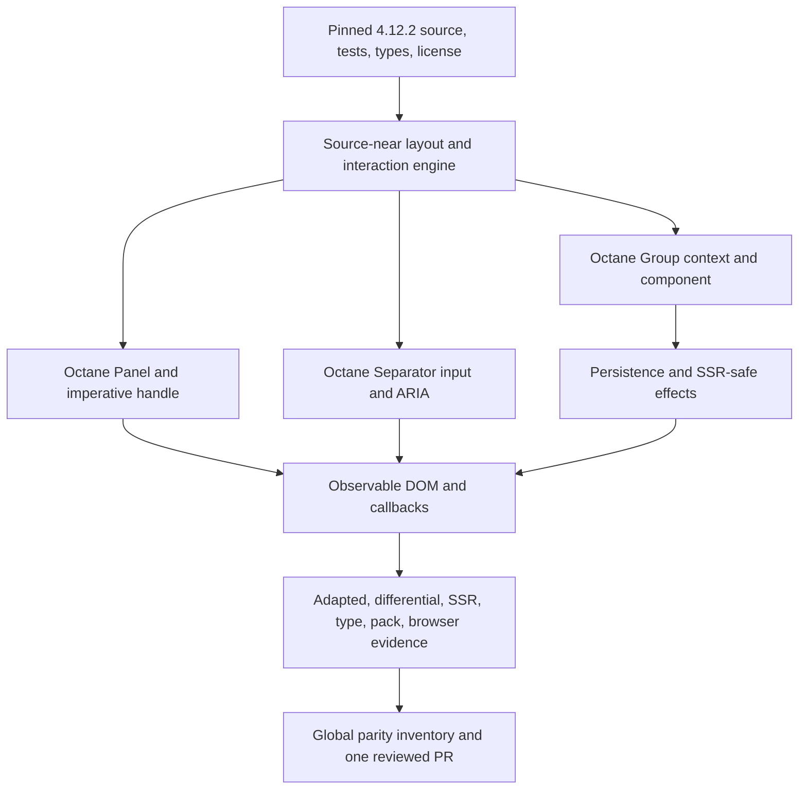

# Port react-resizable-panels v4.12.2 to Octane

## Goal Capsule

- **Objective:** Ship `@octanejs/resizable-panels` as the source-compatible Octane migration target for `react-resizable-panels@4.12.2`, including the full public runtime/type surface, SSR-safe initial layout, accessible pointer and keyboard resizing, persistence, and imperative handles.
- **Authority:** The pinned upstream artifact and observable React behavior govern parity; repository guidance governs Octane adaptation and proof; session-settled one-binding/one-PR and tracker policies govern delivery.
- **Execution profile:** Exact-source port with executable pristine React, adapted Octane, differential, SSR, type, and real-browser lanes.
- **Stop conditions:** Stop only for an upstream contract that Octane cannot express without a product decision, a licensing contradiction, or a genuinely human-only repository/CI permission blocker.
- **Tail ownership:** The binding PR remains owned through review and CI; the durable ecosystem tracker advances from In progress to In review and only to Complete and merged after merge verification on `main`.

---

## Product Contract

### Summary

Applications should be able to replace their React panel dependency with the Octane binding without selecting a similar-but-different splitter API or rewriting their component structure. The package must retain the pinned library's names, props, imperative handles, DOM/ARIA contract, sizing rules, persistence protocol, and server-rendering behavior.

### Problem Frame

`react-resizable-panels` is a popular package-level migration blocker because its value is not only visual splitting: it coordinates constrained layout math, live geometry, document-level input, accessible separators, nested groups, refs, persistence, and SSR. A superficial `Group`/`Panel`/`Separator` lookalike would leave migration work with consumers and would not satisfy the top-level package-equivalence goal.

### Requirements

**Public package contract**

- R1. Publish `@octanejs/resizable-panels` with the exact root runtime exports `Group`, `Panel`, `Separator`, `isCoarsePointer`, `useDefaultLayout`, `useGroupCallbackRef`, `useGroupRef`, `usePanelCallbackRef`, and `usePanelRef`, plus every public type exported by `react-resizable-panels@4.12.2`.
- R2. Preserve upstream prop names, defaults, callback arguments, ref lifecycle, imperative handle methods, display names, package metadata entry points, and valid intrinsic DOM attributes without requiring React at consumer runtime or in shipped public types.
- R3. Pin and retain auditable upstream source, tests, package metadata, license, tag commit, npm artifact hash, adapted-source hashes, export inventory, type inventory, and every upstream test identity.

**Resizable layout behavior**

- R4. Preserve horizontal and vertical groups, nested groups, percentage/pixel/em/rem/vh/vw inputs, default layout distribution, fixed/relative resize behavior, min/max constraints, disabled panels, and group resize recomputation.
- R5. Preserve pointer hit regions, coarse/fine target sizing, pointer drag completion/cancellation, cursor and selection cleanup, separator double-click reset, and current-state callback behavior across rerenders.
- R6. Preserve collapsible panel thresholds, collapsed size, expand-to-recent-size behavior, and group/panel imperative methods with their validated return values.

**Accessibility, persistence, and rendering**

- R7. Preserve separator keyboard behavior for orientation, arrows, Home, End, Enter, disabled state, focus, and WAI-ARIA role/orientation/value relationships.
- R8. Preserve `useDefaultLayout` storage identity, restore/save behavior, debouncing compatibility, `onlySaveAfterUserInteractions`, invalid/missing data fallback, conditional panel IDs, and injected storage implementations.
- R9. Server rendering must not read browser-only globals and must produce deterministic initial markup/layout that hydrates without replacing nodes; browser effects attach and clean up observers, global listeners, and cursor styles.
- R10. Preserve the documented `data-group`, `data-panel`, and `data-separator` DOM contract, caller classes/styles subject to upstream protected styles, IDs/test IDs, callback ordering, and layout metadata including `isUserInteraction`.

**Evidence and delivery**

- R11. Execute pristine React, adapted Octane, differential DOM, Node SSR/hydration, public-type, packed-consumer, and real-Chromium geometry/input/persistence evidence; every upstream test identity is executed or explicitly classified by the global parity harness.
- R12. Deliver exactly one isolated binding PR, follow current repository generation/package guidance, update the durable binding tracker, and babysit CI/review until merge or a genuinely human-only blocker.

### Key Flows

- F1. Render and resize a group
  - **Trigger:** An application renders direct `Panel` and `Separator` children inside a `Group`.
  - **Steps:** Initial constraints resolve; a pointer or keyboard interaction changes layout; DOM styles and ARIA values update; live and completed callbacks receive the validated layout.
  - **Outcome:** Panel sizes remain within constraints and match the pinned React oracle.
  - **Covered by:** R4, R5, R7, R10.
- F2. Control a panel imperatively
  - **Trigger:** A consumer obtains a panel or group handle.
  - **Steps:** The consumer collapses, expands, resizes, reads size/layout, or sets a layout.
  - **Outcome:** The applied value is constraint-validated, callbacks have correct metadata, and the handle remains current across rerenders.
  - **Covered by:** R2, R6, R10.
- F3. Restore a server-rendered layout
  - **Trigger:** A server renders a group whose client uses persisted layout data.
  - **Steps:** Server output uses deterministic defaults; hydration adopts existing nodes; storage/observers attach client-side; later user interaction saves the new layout.
  - **Outcome:** No browser global is read on the server, hydration remains live, and persisted state follows upstream precedence.
  - **Covered by:** R8, R9.

### Acceptance Examples

- AE1. Given two 50% panels, when their separator is dragged 100 physical pixels in an 800-pixel horizontal group, then constrained percentage and pixel sizes, callback payloads, cursor state, and separator ARIA values match React before, during, and after pointer release. Covers R4, R5, R7, R10.
- AE2. Given a collapsible panel with minimum and collapsed sizes, when drag crosses the collapse threshold and its imperative handle later expands it, then it collapses and returns to the correct prior size with matching callbacks. Covers R5, R6.
- AE3. Given a vertical group with a focused separator, when ArrowUp, Home, End, and Enter are used, then layout, focus, disabled behavior, and `aria-valuenow/min/max` match React. Covers R7.
- AE4. Given stored layouts for conditional panel ID sets, when the hook loads valid, malformed, missing, and alternate-ID records, then selection, fallback, saving, and user-interaction filtering match React without server-side storage access. Covers R8, R9.
- AE5. Given server-rendered nested groups, when hydrated and resized in Chromium, then the same nodes are adopted, real geometry drives the result, refs stay live, and all observers/listeners/styles are removed on unmount. Covers R4, R5, R9.

### Scope Boundaries

- The port includes the published `4.12.2` package contract and upstream test corpus, not the upstream documentation application or a new Octane-specific splitter abstraction.
- React-only implementation mechanics may be adapted to Octane hooks, refs-as-props, compiler slots, and native events, but observable behavior and type strictness may not be weakened.
- Framework-neutral algorithms should remain source-near; analogous Octane splitters are implementation references, not substitutes or dependencies that redefine behavior.
- Examples/catalog documentation necessary to discover and validate the binding are included; wholesale migration of upstream documentation pages is deferred.

### Success Criteria

- A representative package consumer changes the dependency/import target and component runtime only, while its public API usage and observable behavior remain valid.
- Global parity validation rejects missing exports, missing types, drifted vendored/adapted files, skipped/renamed/unexecuted upstream tests, and unclassified port-authored tests.
- Real Chromium proves behavior that jsdom cannot: geometry, pointer hit regions/capture, ResizeObserver response, cursor cleanup, keyboard focus, and persistence reload.
- The isolated PR reaches green actionable CI/review and the tracker accurately reflects its lifecycle.

### Dependencies

- Pinned upstream: `react-resizable-panels@4.12.2`, repository tag `4.12.2`, commit `a1eeb7aefdb024bb5879a323218e0ac05f77f28e`, MIT license.
- npm artifact SHA-256: `099742808fafbe3a0288d758271aaf1c35dc9b66ec85077e60f0861e58e89e61`.
- Octane compiler/runtime hooks, native DOM event model, SSR runtime, Vitest projects, browser test infrastructure, and repository React parity harness.

---

## Planning Contract

### Key Technical Decisions

- KTD1. **Exact pinned port, not an equivalent widget.** Vendor and crosswalk `4.12.2` source/tests/license and mirror the upstream module graph where practical. This is session-settled: the user asked for top-level package.json equivalents and one port PR per binding. Governs R1-R3, R11-R12.
- KTD2. **Public types are Octane-owned and React-free.** Re-express React node, intrinsic attribute, event, CSS, ref, dispatch, and JSX types using Octane/DOM-owned public types while retaining upstream validation strength. Add a packed Octane-only consumer check so React and `@types/react` cannot leak through authored-source publication. Governs R1-R2.
- KTD3. **Source-near layout engine with explicit framework boundaries.** Retain upstream constraint, hit-region, sizing, and mutable interaction algorithms; adapt component/hooks layers to Octane. Use `packages/mantine-hooks/src/use-splitter/`, `packages/aria/src/table/useTableColumnResize.ts`, and Radix/Base UI pointer patterns only as Octane integration references. Governs R4-R7.
- KTD4. **Fresh state in native/global callbacks.** Use Octane state getters for delayed pointer/keyboard/observer callbacks and refs for mutable DOM/interaction session objects. Verify compiler auto-slotting or pass stable subslots for cross-file custom hooks; never create a fresh subslot per render. Governs R4-R6, R9-R10.
- KTD5. **SSR-safe effects and persistence.** Keep module evaluation and render free of `window`, `document`, storage, geometry, and ResizeObserver reads. Deterministic defaults render first; client effects hydrate, measure, restore, observe, and clean up. Governs R8-R9.
- KTD6. **Proof is split by observation boundary.** jsdom covers deterministic algorithms/DOM; pristine and differential lanes compare React; SSR/hydration covers server boundaries; public type and pack tests cover contract isolation; real Chromium covers geometry, pointer, ResizeObserver, focus, and reload persistence. Governs R7-R11.
- KTD7. **Every identity is accounted for globally.** Extend `scripts/react-parity/check.mjs` with inventories, hashes, classifications, and negative controls patterned after `packages/hook-form/`; no `.skip`, `.todo`, expected-failure, or vague recorded parity qualifies as complete. Governs R3, R11.
- KTD8. **One PR and durable lifecycle status.** Work remains isolated on `jon/react-resizable-panels-binding`; tracker state changes only at implementation start, PR open, and verified merge. This is session-settled. Governs R12.

### High-Level Technical Design

The component layer owns context registration and DOM output. The source-near global layer owns validated layout math, group/panel mutable records, hit regions, cursor state, and active interactions. Effects create all browser-only observers/listeners and return complete cleanup. The audit layer treats upstream files, exports, types, and tests as enumerated inputs rather than sampling them opportunistically.

### Sequencing

1. Establish provenance, package scaffolding, inventories, and failing contract tests; falsify the React-free public-type strategy with paired positive/negative probes for every React type dependency category before behavior porting.
2. Port pure sizing/layout algorithms and their adapted upstream tests.
3. Prove an early vertical slice with one two-panel group across pointer input, keyboard input, an imperative ref, hydration, and real-browser geometry; then port the remaining Group/Panel/Separator state, refs, DOM, imperative handles, events, persistence, and SSR surface.
4. Complete differential, type, hydration, browser, pack, and global parity proof.
5. Generate repository inventories, simplify/review, publish one PR, babysit, and update lifecycle status.

### Risks and Mitigations

- **Geometry false confidence:** jsdom returns zero layout and may hide ResizeObserver defects. Mitigation: controlled deterministic geometry only for unit/differential proof plus mandatory Chromium scenarios using actual bounding boxes and observer delivery.
- **Hook/compiler identity drift:** React call-order assumptions can corrupt nested custom hooks. Mitigation: inspect the full hook-bearing module graph, verify compiler auto-slotting, and test identity/ref continuity through conditional/nested rerenders.
- **Stale global listeners:** native pointer handlers can close over old layouts. Mitigation: latest-state getters, explicit interaction records, callback-freshness tests, and cleanup assertions.
- **Type erasure or React leakage:** authored source can publish accidental React imports or `any`-derived props. Mitigation: declaration/type fixtures plus an external Octane-only packed consumer.
- **Incomplete parity claims:** a green bounded suite can omit upstream identities. Mitigation: manifest-level crosswalk validation and negative controls in the repository-wide parity checker.

---

## Implementation Units

### U1. Pin provenance and scaffold the package

- **Goal:** Create an auditable package shell whose contract tests fail before implementation.
- **Requirements:** R1-R3, R11-R12.
- **Files:** `packages/resizable-panels/package.json`, `packages/resizable-panels/UPSTREAM.md`, `packages/resizable-panels/upstream/`, `packages/resizable-panels/audit/`, `packages/resizable-panels/status.json`, `packages/resizable-panels/tsconfig.json`, `pnpm-workspace.yaml`, `vitest.config.js`.
- **Patterns:** `packages/hook-form/UPSTREAM.md`, `packages/hook-form/audit/`, `packages/hook-form/upstream/SHA256SUMS`.
- **Approach:** Move the durable workspace tracker to In progress, vendor the exact canonical source/tests and npm publication artifacts, retain MIT notices, enumerate runtime/type/test identities, define package exports and dedicated test projects, and add failing export/type/checksum tests. Before U2, inventory every public dependency on React's node, intrinsic attribute, event, CSS, ref, dispatch, and JSX types and run paired accepted/rejected probes against the proposed Octane-owned forms; stop for a product decision if equal strictness is not expressible.
- **Test Scenarios:** checksum detects modified/deleted/extra vendored files; export inventory detects missing/extra runtime exports; type inventory detects missing/weakened declarations; paired type probes falsify widening and narrowing for every React type-dependency category; test inventory detects missing/renamed/skipped identities; package metadata resolves authored source without publishing audit/upstream material.
- **Dependencies:** None.
- **Verification:** Package provenance verifier, parity negative controls, export/type contract tests.

### U2. Port sizing and layout algorithms

- **Goal:** Preserve framework-neutral parsing, constraint validation, default distribution, resizing, collapse thresholds, and ARIA calculations.
- **Requirements:** R4, R6-R7, R10-R11.
- **Files:** `packages/resizable-panels/src/global/`, `packages/resizable-panels/src/utils/`, `packages/resizable-panels/tests/upstream/`.
- **Patterns:** Pinned `lib/global/` source; Octane references in `packages/mantine-hooks/src/use-splitter/` remain non-authoritative.
- **Approach:** Adapt source-near pure modules before framework code and preserve upstream test identities/parameter matrices.
- **Test Scenarios:** all supported units and invalid units; constrained redistribution across 2+ panels; disabled and fixed-size panels; collapse/expand threshold; group resize preservation modes; default layout rounding; nested orientation math; separator ARIA values at min/max/current.
- **Dependencies:** U1.
- **Verification:** Adapted upstream pure test lane and differential algorithm fixtures against pinned React-package behavior where publicly observable.

### U3. Port Group, Panel, Separator, and imperative APIs

- **Goal:** Implement the public component tree and live interaction engine with exact DOM, callbacks, accessibility, and refs.
- **Requirements:** R1-R7, R9-R10.
- **Files:** `packages/resizable-panels/src/components/`, `packages/resizable-panels/src/global/`, `packages/resizable-panels/src/hooks/`, `packages/resizable-panels/src/index.tsrx`, `packages/resizable-panels/tests/conformance/`.
- **Patterns:** Pinned component/module graph; `packages/tanstack-virtual/src/internal.ts` for compiler slots; `packages/radix/src/Slider.ts` and `packages/base-ui/src/slider.ts` for native pointer cleanup.
- **Approach:** First complete a compatibility checkpoint containing one two-panel group with pointer resize, keyboard resize, an imperative ref, hydration adoption, and real-browser geometry. Do not bulk-port the remaining surface until that checkpoint passes. Then port Group context/registration, Panel lifecycle and imperative handles, Separator input/ARIA, and global hit-region/cursor/event coordination. Keep public refs as props, use current-state getters in global callbacks, and isolate browser-only work in effects.
- **Test Scenarios:** horizontal/vertical and nested DOM; multiple sibling groups and separate roots; defaults/classes/styles/IDs/data attributes; registration/reorder/unmount while another group remains active; sequential and overlapping interaction registry isolation; pointer start/move/release/cancel/out/leave; coarse/fine targets; reference-safe cursor/listener cleanup; double click; disabled combinations; keyboard arrows/Home/End/Enter; collapse/expand/resize/getSize/isCollapsed; group get/set layout; callback order/metadata and rerender freshness; ref attach/change/detach.
- **Dependencies:** U2.
- **Verification:** Adapted upstream component tests, differential fixtures, targeted identity/focus/ref tests, compiler/typecheck.

### U4. Port persistence and SSR/hydration behavior

- **Goal:** Preserve `useDefaultLayout` and no-browser rendering while producing a live hydrated group.
- **Requirements:** R8-R9, R11.
- **Files:** `packages/resizable-panels/src/components/group/auto-save/`, `packages/resizable-panels/src/components/group/useDefaultLayout.ts`, `packages/resizable-panels/tests/ssr/`, `packages/resizable-panels/tests/hydration/`.
- **Patterns:** Pinned persistence source; SSR alias patterns in `vitest.config.js`; hydration observation guidance in `.agents/memories/testing.md`.
- **Approach:** Preserve storage keys/serialization and deprecated compatibility surface, defer all browser access to client effects, and verify node adoption plus live refs/events after hydration.
- **Test Scenarios:** valid/missing/malformed stored layout; group/id alias and conditional panel IDs; custom/blocked storage; debounce and interaction-only saving; initial precedence; server render without globals; deterministic markup; hydrate existing nodes; resize and save after hydration; cleanup on unmount.
- **Dependencies:** U3.
- **Verification:** Node SSR project, hydration conformance project, React differential persistence cases.

### U5. Complete public type, browser, and parity proof

- **Goal:** Demonstrate exact migration behavior at every observation boundary and make omissions mechanically impossible.
- **Requirements:** R1-R3, R5, R7-R12.
- **Files:** `packages/resizable-panels/typetests/`, `packages/resizable-panels/tests/differential/`, `packages/resizable-panels/tests/browser/`, `packages/resizable-panels/audit/`, `scripts/react-parity/check.mjs`, `scripts/react-parity/react-resizable-panels-*-lib.test.mjs`, `scripts/check-package-packs.mjs`, `scripts/package-pack-canaries.mjs`.
- **Patterns:** `packages/hook-form/tests/differential/`, hook-form parity schema and negative controls, `packages/dexie/tests/browser/`.
- **Approach:** Compile representative valid/invalid public usage for both packages, compare stable public observations with a pinned React oracle, test external packed consumption without React types, and execute actual layout/input/persistence in Chromium. Record a machine-readable per-test disposition of verbatim, mechanically adapted, behaviorally rewritten, or externally covered; rewritten tests name changed setup/assertions and the pristine/differential evidence retaining the original observation. Differential flows use identical external triggers and explicit checkpoints for synchronous dispatch, microtasks/effects, animation frames, ResizeObserver delivery, debounce completion, and callback traces.
- **Test Scenarios:** every export and public type; valid and invalid props/ref handles; default/nested/collapsible DOM; sibling groups across separate roots; real pointer hit target and drag; ResizeObserver group resize; separator keyboard/focus/ARIA; cursor cleanup after release/unmount; reload persistence; SSR/hydration; a generated packed-consumer manifest, TSRX source, type probe, and SSR probe that import the package without React or `@types/react`; deliberate missing export/type/test/hash/disposition-evidence mutations rejected by the global checker.
- **Dependencies:** U3, U4.
- **Verification:** Dedicated type, pristine, differential, server, browser, pack-consumer, and global parity commands.

### U6. Integrate, document, review, and deliver

- **Goal:** Register the binding across repository surfaces, remove experimental debris, and carry its single PR through review.
- **Requirements:** R12.
- **Files:** `website/src/content/bindings.json`, `playground/octane/src/demos/ReactResizablePanels.tsrx`, `playground/octane/src/catalog.ts`, generated binding/package/parity documents, CLI data, `.changeset/`.
- **Patterns:** `pnpm sync` generated-source workflow and current binding PR conventions.
- **Approach:** Add catalog/status/changeset inputs and a runnable playground example showing representative `Group`/`Panel`/`Separator` migration, regenerate derived inventories, run LFG simplification and correctness/API/testing reviews, fix all actionable findings, open exactly one PR, and update the durable workspace tracker to In review at PR open and Complete and merged only after merge verification.
- **Test Scenarios:** generators are clean/idempotent; website/CLI/MCP inventories expose the package once; the playground example builds and resizes through pointer and keyboard input; changeset names the correct package; no dead-end code or untracked generated drift remains; CI/review state is drained or an explicit human-only blocker is recorded.
- **Dependencies:** U1-U5.
- **Verification:** Repository generation checks, focused and global quality gates, PR CI/review inspection, merge verification on `main`.

---

## Verification Contract

| Evidence | Command or lane | Done signal |
|---|---|---|
| Provenance | `pnpm --dir packages/resizable-panels upstream:verify` | Exact vendored and adapted hashes, tag/npm metadata, license, exports, types, and test identities validate. |
| Adapted upstream | `pnpm --dir packages/resizable-panels test:upstream` | Every adapted upstream identity executes or is explicitly classified. |
| DOM/differential | `pnpm exec vitest run --project resizable-panels` | Component, algorithm, ref, callback, persistence, and React differential scenarios pass. |
| SSR | `pnpm exec vitest run --project resizable-panels-server` | The Node/server runtime renders deterministic output without browser globals. |
| Hydration | `pnpm exec vitest run --project resizable-panels-hydration` or the binding's jsdom client project | Client runtime adopts existing nodes and preserves live events, refs, state, focus, and cleanup. |
| Pristine oracle | `pnpm exec vitest run --project react-resizable-panels-pristine` | Pinned unmodified React evidence executes successfully. |
| Browser | Dedicated `resizable-panels-browser` Vitest project | Chromium proves real geometry, pointer/keyboard, ResizeObserver, focus, cursor cleanup, sibling-root isolation, and reload persistence. Engine-sensitive code stays on standards-based APIs used by upstream; if the repository harness supports Firefox/WebKit without new infrastructure, run the representative interaction slice there too, otherwise record Chromium as the executable browser lane rather than claiming multi-engine proof. |
| Types | Package `tsrx-tsc` projects plus adapted/pristine type parity | Public API retains strictness and Octane-only consumption resolves without React dependencies. |
| Packed consumer | `pnpm packages:pack:check` | External install/import/typecheck/SSR canary passes from the packed artifact. |
| Global parity | `pnpm react-parity:check` | Inventories, classifications, hashes, and negative controls reject omissions/drift. |
| Repository integration | `pnpm sync`, marker/declaration/generated checks, formatting and relevant root typechecks | Generated surfaces are clean and all repository gates pass. |

The implementation may refine exact script names to match repository conventions, but it may not collapse browser, pristine, SSR, type, or global identity validation into metadata-only assertions.

---

## Definition of Done

- U1 is done when provenance, license, package scaffolding, inventories, and negative controls are auditable and fail closed.
- U2 is done when the pinned pure sizing/layout test identities pass without algorithm substitutions that change observable behavior.
- U3 is done when public components, native input, accessibility, callbacks, refs, and imperative methods match React across adapted and differential evidence.
- U4 is done when persistence and SSR/hydration precedence, safety, adoption, liveness, and cleanup are executable.
- U5 is done when public types are React-free but equally strict, packed consumption works, real-browser behavior passes, and the global parity audit accounts for every identity.
- U6 is done when repository catalogs/generated outputs/changeset/tracker are correct, simplification and review findings are resolved, the single PR is green, and its merge is verified on `main`.
- No skipped/todo/expected-failure test, unclassified upstream identity, undeclared public type dependency, stale generated file, abandoned experiment, debug artifact, or unexplained parity divergence remains.
- Product Contract unchanged after bootstrap; implementation decisions may refine mechanics but not narrow R1-R12 without an explicit product decision.

## Appendix

### Research breadcrumbs

- Exact-port and parity model: `packages/hook-form/UPSTREAM.md`, `packages/hook-form/audit/react-parity.json`, `packages/hook-form/tests/differential/`, and `scripts/react-parity/hook-form-*-lib.test.mjs`.
- Closest Octane implementation references: `packages/mantine-hooks/src/use-splitter/`, `packages/aria/src/table/useTableColumnResize.ts`, `packages/tanstack-virtual/src/internal.ts`, `packages/radix/src/Slider.ts`, and `packages/base-ui/src/slider.ts`.
- Repository semantics: `.rulesync/skills/react-library-port/SKILL.md`, `docs/differences-from-react.md`, and `.agents/memories/testing.md`.
- Upstream module/test source: canonical tag `4.12.2` at commit `a1eeb7aefdb024bb5879a323218e0ac05f77f28e`.
