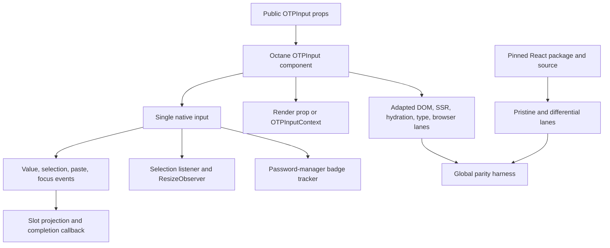

# Port input-otp 1.4.2 to Octane

## Goal Capsule

- **Objective:** Ship `@octanejs/input-otp` as the source-compatible Octane migration target for `input-otp@1.4.2`, including the complete public runtime and type surface, SSR-safe markup, accessible single-input OTP behavior, render-prop/context slots, paste and selection behavior, and password-manager badge displacement.
- **Authority:** The npm artifact and canonical repository at commit `81ccdb48c010d800b24942aa231909f0c971b1ca` govern parity; Octane repository guidance governs adaptation and proof; the session's one-binding-per-PR tracker policy governs delivery.
- **Execution profile:** Source-near React binding port with byte-pinned provenance, exhaustive export and test inventories, pristine React and adapted Octane lanes, public-type probes, SSR/hydration evidence, differential checkpoints, and real-Chromium interaction coverage.
- **Stop conditions:** Stop only for an upstream contract that Octane cannot express without a product decision, a licensing contradiction, a required runtime or compiler prerequisite that must land in a separate PR, or a human-only repository permission blocker.
- **Tail ownership:** Own the isolated PR through actionable review and CI. Move the tracker to `In review` after opening the PR and to `Complete and merged` only after verifying the package on upstream `main`.

---

## Product Contract

### Summary

Applications importing `input-otp` should migrate to `@octanejs/input-otp` without replacing the component API or adopting a visually similar multi-input implementation. The port must retain the upstream single-input accessibility model, slot projection, selection semantics, controlled and uncontrolled state, completion callback, clipboard handling, password-manager accommodation, DOM data attributes, and intrinsic input props.

### Problem Frame

`input-otp` is a shadcn dependency and a direct package-level migration blocker. Its observable contract depends on browser selection, focus, paste, autofill, and password-manager behavior that jsdom cannot prove. A lookalike set of separate inputs would break the package identity, keyboard behavior, assistive-technology semantics, mobile autofill, and source compatibility.

### Requirements

**Public package contract**

- R1. Publish `@octanejs/input-otp` with exact root runtime exports `OTPInput`, `OTPInputContext`, `REGEXP_ONLY_DIGITS`, `REGEXP_ONLY_CHARS`, and `REGEXP_ONLY_DIGITS_AND_CHARS`, plus public types `OTPInputProps`, `SlotProps`, and `RenderProps`.
- R2. Preserve upstream prop names, defaults, callback arguments, ref behavior, `displayName`, intrinsic input attributes, render-prop and context-child modes, and TypeScript accept/reject behavior without React in consumer runtime or public types.
- R3. Pin the npm artifact and canonical source commit, vendor redistributable source and tests byte-exact, retain MIT license evidence, hash both evidence boundaries, and account for every public export and upstream test artifact.

**Input behavior and rendering**

- R4. Preserve controlled and uncontrolled values, default value adoption, `maxLength`, pattern filtering, input mode, placeholder projection, text alignment, disabled behavior, arbitrary input props, and the default `one-time-code` autocomplete value.
- R5. Preserve the single real input with projected slots, active-slot and fake-caret state, focus and hover flags, placeholder characters, container class/style contract, `data-input-otp*` attributes, injected autofill CSS, and optional no-script fallback.
- R6. Preserve keyboard editing and browser selection behavior for typing, overwrite-at-capacity, arrows, single and multi-character replacement, word deletion, forward deletion, selection direction, blur, and ref focus.
- R7. Preserve paste insertion and replacement, iOS paste handling, `pasteTransformer`, pattern rejection, selection placement, value truncation, and consumer paste callbacks.
- R8. Preserve `onComplete` when the value first crosses from shorter than `maxLength` to exactly `maxLength`, without duplicate completion on stable full values.
- R9. Preserve password-manager badge detection and the `increase-width` and `none` strategies, including viewport-space checks, known badge selectors, width and clipping changes, bounded retry timers, and cleanup.

**Framework and delivery behavior**

- R10. Preserve the public `onChange(newValue)` callback while adapting the hidden text input to Octane's native per-edit `onInput` event. Do not expose the host event or rename the library callback.
- R11. Server rendering must not read browser globals and must produce deterministic initial markup that hydrates by adopting existing nodes. Client effects must attach and remove selection listeners, observers, timers, intervals, and injected styles without leaks.
- R12. Execute the complete 15-case upstream Playwright suite or a case-for-case Octane adaptation, including the upstream CI-skipped Shift-selection case as an active Octane case. Add pristine React, adapted Octane, SSR/hydration, public-type, differential, and real-browser lanes to the global parity harness with negative controls for missing, renamed, skipped, stale, or unexecuted evidence.
- R13. Deliver one isolated binding PR with package docs, `status.json`, changeset, generated catalog/status updates, a representative playground example, and the durable tracker lifecycle update.

### Key Flows

- F1. Enter and edit an OTP.
  - **Trigger:** A user focuses the projected OTP control and types, selects, replaces, or deletes characters.
  - **Steps:** The single native input updates; pattern and length rules apply; the controlled callback receives the new string; slot projection mirrors characters and selection.
  - **Outcome:** Input value, selection, slots, focus state, and callbacks match the pinned React oracle.
  - **Covered by:** R4, R5, R6, R10.
- F2. Paste an OTP.
  - **Trigger:** A user pastes text into an empty input or selected range.
  - **Steps:** The optional transformer runs; pattern and maximum length apply; the selected range is replaced; the caret and slots update.
  - **Outcome:** The final value, selection, callback payload, and projected slots match React on desktop and the iOS compatibility branch.
  - **Covered by:** R4, R7, R10.
- F3. Render and hydrate an OTP.
  - **Trigger:** A server renders controlled or default OTP content and a browser hydrates it.
  - **Steps:** Deterministic markup renders without browser access; hydration adopts nodes; effects install CSS, observer, selection, and password-manager behavior.
  - **Outcome:** Existing nodes survive hydration, the input remains editable, and unmount removes owned resources.
  - **Covered by:** R5, R9, R11.

### Acceptance Examples

- AE1. Given a six-character numeric controlled OTP, when the user types seven digits, then the value remains six characters, the final character follows upstream overwrite behavior, slot characters match, and the public callback sequence matches React. Covers R4, R5, R6, R10.
- AE2. Given a selected middle range, when the user types or pastes transformed content, then only the selected range is replaced, pattern-invalid content is rejected, the value is capped, and the browser selection matches React. Covers R6, R7.
- AE3. Given a value that grows from five to six characters, when the sixth character commits, then `onComplete` receives the complete string once and does not repeat without another below-to-full transition. Covers R8.
- AE4. Given render-prop and context-child consumers, when focus, hover, value, placeholder, and selection change, then both modes receive equivalent `RenderProps` and slot state. Covers R2, R5.
- AE5. Given server-rendered OTP markup, when Chromium hydrates, focuses, pastes, and unmounts it, then the original nodes are adopted and all listeners, observers, intervals, and timers are removed. Covers R9, R11.

### Scope Boundaries

- Port the published `input-otp@1.4.2` package contract and adapt its canonical test suite to the Vite-hosted Octane fixture. Do not port the documentation site, Tailwind styling, or Next.js test application as product code.
- Preserve the upstream single-input design. Do not substitute multiple visible inputs or a different OTP package.
- React implementation mechanics such as `forwardRef` and synthetic text `onChange` may be adapted to Octane refs-as-props and native `onInput`, but observable library behavior may not be weakened.
- The prerelease `1.5.0-beta.1` tag is outside this pin. Upgrade work belongs in a later isolated PR.

### Success Criteria

- A representative consumer changes only its dependency and import root while retaining public component, prop, callback, context, and type usage.
- Every published export and every one of the 15 upstream browser cases has an executable or explicitly justified disposition, with no skips or expected failures.
- Real Chromium proves focus, hover, selection, deletion, paste, autocomplete markup, completion, geometry, deterministic compatibility with the pinned upstream password-manager selector/geometry algorithm, and cleanup. It does not claim live-extension interoperability.
- Global parity validation rejects stale or incomplete provenance, runtime inventories, type probes, and port-test classifications.

### Dependencies

- Pinned npm package `input-otp@1.4.2`, integrity `sha512-l3jWwYNvrEa6NTCt7BECfCm48GvwuZzkoeG3gBL2w4CHeOXW3eKFmf9UNYkNfYc3mxMrthMnxjIE07MT0zLBQA==`.
- Canonical commit `81ccdb48c010d800b24942aa231909f0c971b1ca`, whose commit message bumps the package to 1.4.2.
- Upstream MIT license permits source and test redistribution with attribution.

---

## Planning Contract

### Key Technical Decisions

- KTD1. **Mirror the upstream module layout.** Place Octane modules beside a byte-pinned `upstream/source/packages/input-otp/src` tree so reviewers can compare `input`, regex constants, timeout scheduling, previous-value tracking, password-manager behavior, and public types directly. Governs R1-R3.
- KTD2. **Keep one real input.** Re-author `OTPInput` as a `.tsrx` component with the same hidden-input and projected-slot architecture. Reject a multi-input rewrite because it changes accessibility, autofill, selection, and package identity. (session-settled: user-approved — chosen over a similar OTP component: the tracker requires equivalent bindings, not alternatives.) Governs R4-R8.
- KTD3. **Adapt only the host event seam.** Wire the native text host with `onInput` and call the unchanged public `onChange(newValue)` callback after applying upstream filtering and selection logic. Keep consumer `onPaste`, `onFocus`, `onBlur`, `onMouseOver`, and `onMouseLeave` callbacks as native event callbacks. Governs R2, R6, R7, R10.
- KTD4. **Use browser evidence for browser contracts.** Adapt all upstream Playwright cases to a Vite-hosted Octane fixture and add password-manager, paste-transform, hydration, and cleanup checkpoints. Do not replace selection or geometry proof with jsdom mocks. Governs R6-R9, R11-R12.
- KTD5. **Make evidence executable and exhaustive.** Register pristine React browser/type evidence, adapted Octane DOM/browser/type evidence, SSR/hydration, and differential checkpoints in `audit/react-parity.json`; use exact inventories and negative controls. A manifest may say `verified` only after every required lane executes successfully. Governs R3, R12.
- KTD6. **One binding, one PR.** Keep runtime/compiler prerequisites as separate blockers if discovered. This branch contains only `input-otp` package, shared parity registration needed by it, docs/catalog/example integration, and generated artifacts. (session-settled: user-directed — chosen over batching several bindings: independent PRs make the queue reviewable and checkable.) Governs R13.

### High-Level Technical Design

### Implementation Constraints

- Public renderables use `OctaneNode`; no React types may escape the package.
- OTP values and transformed clipboard contents remain ephemeral client state: package code must not log, persist, transmit, or include them in diagnostics. Tests, browser traces, screenshots, and playground examples use synthetic non-secret values and avoid recording entered values; value exposure is limited to the native input, projected slots, and documented consumer callbacks required for parity.
- `.tsrx` programs use `tsrx-tsc`; do not add ambient `declare module '*.tsrx'` shims.
- Hook slots must remain compiler-assigned or be forwarded explicitly if cross-file custom hooks require it.
- The vendored evidence tree remains byte-exact, checksummed, prettier-ignored, and excluded from published package files.
- Upstream test names remain intact. The upstream conditional skip is removed from the adapted suite and its scenario must execute.
- Any genuine divergence needs a passing behavioral test plus matching `UPSTREAM.md`, `status.json`, README, and parity-manifest entries.

### Sequencing

1. Pin and inventory provenance, exports, types, source, and all upstream test artifacts before implementing behavior.
2. Port framework-neutral utilities and strict public types before the component.
3. Port the component, native event seam, render/context projection, and resource lifecycles with targeted DOM and SSR checkpoints.
4. Adapt all upstream Playwright cases, then add differential, hydration, password-manager, and cleanup evidence.
5. Register global parity lanes and negative controls before claiming verification.
6. Add docs, status, example, workspace/catalog integration, changeset, generated outputs, and PR lifecycle updates.

---

## Implementation Units

### U1. Pin upstream evidence and public contract

- **Goal:** Establish immutable, license-safe source, package, export, type, and test inventories before implementation.
- **Requirements:** R1-R3, R12.
- **Files:** `packages/input-otp/upstream/`, `packages/input-otp/UPSTREAM.md`, `packages/input-otp/audit/public-api.json`, `packages/input-otp/audit/test-inventory.json`, `packages/input-otp/audit/verify-provenance.mjs`.
- **Approach:** Vendor the npm artifact and canonical source/test boundary at the pinned commit. Record hashes, license, package metadata, five runtime exports, three public types, and every Playwright artifact and case.
- **Test Scenarios:** Modified or missing vendored file fails; removed or extra export fails; missing, renamed, skipped, or unclassified upstream case fails; missing port-authored classification fails.
- **Verification:** `node packages/input-otp/audit/verify-provenance.mjs --negative-controls`.

### U2. Port utilities and strict public types

- **Goal:** Port regex constants, timeout scheduling, previous-value tracking, password-manager helper types, and React-free public declarations.
- **Requirements:** R1-R3, R9.
- **Files:** `packages/input-otp/src/index.ts`, `packages/input-otp/src/regexp.ts`, `packages/input-otp/src/sync-timeouts.ts`, `packages/input-otp/src/use-previous.ts`, `packages/input-otp/src/types.ts`, `packages/input-otp/typetests/`.
- **Approach:** Keep source-near framework-neutral logic. Replace React intrinsic and renderable types with strict Octane equivalents while preserving the discriminated render-versus-children contract.
- **Test Scenarios:** Exact runtime/type exports; accepted controlled, uncontrolled, render-prop, context-child, intrinsic-prop, and ref usages; rejected missing `maxLength`, simultaneous render/children, React node/event leakage, and invalid strategies; one unchanged consumer source derived from shadcn's canonical InputOTP wrapper compiles against upstream and Octane with only dependency/import mapping changed, covering ref, change, focus, blur, paste, mouse, render-prop, and context usage, while a deliberate signature mismatch fails.
- **Verification:** Package `tsrx-tsc` plus pristine and adapted type probes.

### U3. Port OTPInput rendering and state

- **Goal:** Implement the complete single-input component and slot projection through public package entry points.
- **Requirements:** R2, R4-R5, R8, R10.
- **Files:** `packages/input-otp/src/input.tsrx`, `packages/input-otp/tests/upstream/`, `packages/input-otp/tests/conformance/`.
- **Approach:** Translate `forwardRef` to a ref prop, retain controlled/uncontrolled state and memoized derived state, use native `onInput` internally, and preserve render-prop/context-child output and DOM/data/style contracts.
- **Test Scenarios:** Empty/default/controlled values; prop forwarding and defaults; pattern rejection; slot characters/placeholders; focus/hover/active/fake-caret flags; disabled behavior; onComplete transitions; no-script fallback; public ref focus; one exposed native text input in the browser accessibility tree; accessible-name, description, disabled, and focus semantics forwarded through intrinsic props while projected slots remain presentation-only.
- **Verification:** Adapted DOM suite, differential checkpoints, public-entry consumer test, and package typecheck.

### U4. Port selection, paste, and resource lifecycles

- **Goal:** Preserve browser editing, paste, observer, stylesheet, and password-manager behavior with exact cleanup.
- **Requirements:** R6-R7, R9-R11.
- **Files:** `packages/input-otp/src/input.tsrx`, `packages/input-otp/src/use-pwm-badge.ts`, `packages/input-otp/tests/browser/`, `packages/input-otp/tests/hydration/`, `packages/input-otp/tests/ssr/`.
- **Approach:** Retain the selection algorithm and known badge detection. Use effects for browser-only resources and ensure every listener, observer, interval, and timeout has a matched cleanup.
- **Test Scenarios:** All 15 upstream browser cases; active Shift-selection case; word/backspace/delete editing; insert and replace paste; paste transformation and pattern rejection; autofocus; completion; known and geometry-detected password-manager badges; insufficient viewport space; strategy none; ResizeObserver height; unmount cleanup; SSR without globals; hydration node adoption and live editing.
- **Verification:** Real Chromium suite, Node SSR suite, hydration suite, and leak instrumentation.

### U5. Register executable parity evidence

- **Goal:** Make the global harness prove the complete pinned contract rather than only validate metadata.
- **Requirements:** R3, R12.
- **Files:** `packages/input-otp/audit/react-parity.json`, runtime/type inventories under `packages/input-otp/audit/`, `scripts/react-parity/check.mjs`, `vitest.config.js`, `packages/input-otp/package.json`.
- **Approach:** Add pristine React, adapted Octane, SSR/hydration, differential, browser, pristine-type, and adapted-type lanes with exact collected/executed identities and hashes. Register the real-Chromium lane as an existing `vitest-full` parity project whose Vitest suite launches Playwright, following the React Resizable Panels binding pattern; do not add a metadata-only browser lane or a new global execution kind.
- **Test Scenarios:** Every lane runs from package CI and `react-parity:check`; removed, renamed, skipped, duplicated, stale, or unexecuted evidence fails; lockfile and source integrity drift fail.
- **Verification:** `pnpm react-parity:check` and package negative controls.

### U6. Integrate package, example, docs, and release metadata

- **Goal:** Make the binding installable, discoverable, demonstrable, and accurately tracked.
- **Requirements:** R13.
- **Files:** `packages/input-otp/package.json`, `packages/input-otp/README.md`, `packages/input-otp/status.json`, `pnpm-workspace.yaml`, `pnpm-lock.yaml`, `playground/octane/`, `website/src/content/bindings.json`, `.changeset/`, generated package/status/parity docs.
- **Approach:** Follow current package metadata conventions, add a controlled numeric OTP playground example, register website/catalog discovery, add a patch changeset, run repository synchronization, and keep the durable external tracker aligned with the PR lifecycle. Include the unchanged pinned shadcn-derived adoption fixture as binding-local parity evidence; do not modify or ship the separate shadcn binding in this PR.
- **Test Scenarios:** Workspace import resolves; packed consumer compiles without React; playground example builds and accepts keyboard/paste input; generated docs are clean; changeset and status validation pass.
- **Verification:** `pnpm sync`, scoped format/type/package checks, playground production build, and generated-file checks.

---

## Verification Contract

| Gate | Scope | Done signal |
| --- | --- | --- |
| Provenance | U1, U5 | Vendored source/package/test hashes, export inventory, test inventory, and negative controls pass. |
| Public types | U2, U3 | Pristine React and adapted Octane type probes accept and reject the intended programs with no React leakage. |
| Adapted DOM | U3-U4 | Every adapted upstream DOM identity and port-authored conformance/hydration identity executes once and passes. |
| Pristine React | U5 | Every pinned React oracle identity executes once under pinned dependencies and passes. |
| SSR and hydration | U3-U5 | Node SSR is browser-global-free; hydration adopts nodes and remains interactive without mismatch diagnostics. |
| Real browser | U3-U5 | All 15 upstream Playwright scenarios plus browser accessibility-tree, password-manager, paste-transform, hydration, and cleanup cases pass in Chromium. Mobile one-time-code support is verified at parity scope by exact `autocomplete="one-time-code"`, `inputmode`, single-input, and intrinsic-attribute markup; this plan does not claim automated carrier/SMS autofill on an iOS device. |
| Global parity | U1-U5 | `pnpm react-parity:check` executes all required lanes and rejects every negative control. |
| Repository integration | U6 | `pnpm sync`, scoped formatting, typecheck, package tests, playground build, status/catalog checks, and changeset validation pass. |
| PR tail | U6 | Isolated PR is open, tracker says `In review`, actionable CI and review are resolved, and human-only residuals are recorded. |

---

## Definition of Done

- Requirements R1-R12 have direct executable evidence and no silent export, type, source, test, or browser gap remains. R13's maintainer-controlled delivery state is attested by recorded PR/tracker URLs and observed lifecycle state rather than mislabeled as machine-executable parity evidence.
- Every implementation unit U1-U6 is committed with its named verification evidence.
- `@octanejs/input-otp` exposes the pinned 1.4.2 contract through public entry points without React runtime or public-type dependencies.
- The complete upstream browser suite runs without skips, including the case upstream conditionally skipped in CI.
- Pristine React, adapted Octane, SSR/hydration, differential, type, packed-consumer, and Chromium lanes are registered and green.
- `UPSTREAM.md`, `status.json`, README, changeset, example, catalog, generated docs, and durable tracker agree with the actual implementation and PR state.
- No abandoned experiments, generated browser state, stale inventories, test-only behavior, unrelated changes, or hidden divergences remain in the branch.
- The PR has been babysat until CI is decided and every agent-actionable review item is resolved. Merge remains a maintainer action.
