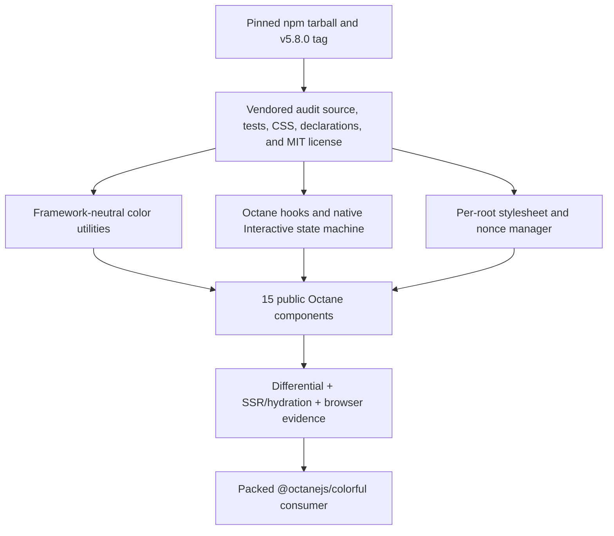

# React Colorful Binding - Plan

## Goal Capsule

- **Objective:** Add `@octanejs/colorful` as an exact, source-accounted Octane port of `react-colorful@5.8.0`, including its complete root runtime/type surface, styling behavior, React parity harness, SSR/hydration, and real-browser interaction evidence.
- **Authority:** The published npm package defines the consumer contract. The matching `v5.8.0` repository tag defines source and test provenance. Octane repository guidance defines the permitted framework adaptations and evidence bar.
- **Execution profile:** One isolated branch and one draft PR. The PR remains draft through current-head CI and Cursor review; an Octane maintainer alone decides readiness and merge.
- **Stop conditions:** Do not claim parity if any public export, upstream source/test identity, stylesheet behavior, native interaction path, or type contract lacks an explicit disposition; if an Octane runtime/compiler defect is exposed, repair it in a separate prerequisite PR.

## Product Contract

### Summary

Applications importing `react-colorful` should be able to map that package to `@octanejs/colorful` without replacing its components or color model. The binding targets the complete public contract of release `5.8.0`, not a similar picker API.

### Requirements

#### Provenance and public surface

- R1. Pin npm `react-colorful@5.8.0`, integrity `sha512-Wy9OzPfjSN9bF12OB8N7UQvlsZ0I+7wHxpN+bV5BjNQGxOj6IiwkRjevJK9yOBjJWGQvAaf1OXtn8rUeEatAng==`, tarball shasum `9bc89aac3e8c847b503489614e2d28227b36641f`, repository tag `v5.8.0`, commit `d914e7647c40a8bbdb286985176e769d76061732`, and the complete MIT notice.
- R2. Expose the exact root component surface: `HexColorPicker`, `HexAlphaColorPicker`, `HslColorPicker`, `HslaColorPicker`, `HslStringColorPicker`, `HslaStringColorPicker`, `HsvColorPicker`, `HsvaColorPicker`, `HsvStringColorPicker`, `HsvaStringColorPicker`, `RgbColorPicker`, `RgbaColorPicker`, `RgbStringColorPicker`, `RgbaStringColorPicker`, and `HexColorInput`.
- R3. Expose the six public color types (`RgbColor`, `RgbaColor`, `HslColor`, `HslaColor`, `HsvColor`, `HsvaColor`) and `setNonce`, with no invented runtime exports or subpaths.
- R4. Crosswalk every upstream source module, public export, test file, test identity, and published declaration to exactly one executable or explicitly classified disposition. The audit must fail closed for missing, renamed, duplicated, stale, or skipped evidence.

#### Color, rendering, and input behavior

- R5. Preserve every color model conversion, normalization, default color, equality rule, shorthand/alpha hex form, string formatting, rounding, validation, and class-name rule represented by the pinned source and tests.
- R6. Preserve controlled color synchronization: mount and parent rerender do not spuriously call `onChange`; user updates emit only changed normalized colors; grayscale hue changes do not emit equivalent values; mid-interaction controlled updates reset dirty state as upstream does.
- R7. Preserve `onChangeEnd`: it fires once after a dirty mouse, touch, or arrow-key interaction, does not fire without a changed color, and observes the final normalized color. Releasing outside the picker and the upstream lost-button/touch recovery path remain covered.
- R8. Preserve the exact picker markup, class names, inline pointer/gradient styles, prop forwarding, default props, accessibility roles/labels/value attributes, focus behavior, and regular `div` event support for all picker variants.
- R9. Preserve native mouse and touch interaction across the picker, owner window, iframe documents, and ShadowRoots. Touch identifier selection, multi-touch behavior, mouse suppression after touch, document/window listener cleanup, `buttons`/`touches` recovery, and unmount cleanup must match the pinned implementation.
- R10. Preserve keyboard behavior for arrow keys only, including default prevention, five-percent movement increments, clamping at edges, and `onChangeEnd` on keyup.
- R11. Preserve `HexColorInput` filtering, maximum length, optional prefix display, alpha forms, controlled prop updates, invalid-value blur restoration, native `onBlur`, and per-edit `onChange` semantics. At the host seam, React synthetic `onChange` is adapted to Octane native `onInput` without changing the public component callback name.
- R12. Preserve automatic stylesheet injection into the closest owning `Document` or `ShadowRoot`, once per root, including iframe ownership, disconnected-node fallback, CSP nonce from `setNonce` or `__webpack_nonce__`, and garbage-collectable root bookkeeping. Do not turn the upstream auto-style contract into a required consumer CSS import.

#### SSR, browser, and release evidence

- R13. Server rendering must access no browser globals, produce deterministic picker/input markup, and never inject a client style element. Hydration must adopt existing nodes, install behavior after mount, inject one correctly owned stylesheet, and remain interactive without duplicate content.
- R14. Run the pinned React suite as a pristine oracle where practical; execute adapted Octane cases, shared differential cases, SSR/hydration cases, and real Chromium plus Firefox cases. Geometry, focus, mouse/touch movement, iframe/ShadowRoot ownership, and stylesheet placement require real-browser evidence.
- R15. Integrate package metadata, changeset, generated package/binding/parity inventories, website catalog, playground demo, and migration mapping. Packed outside-workspace ESM/types/SSR/browser consumers must resolve no React runtime and must exclude vendored audit evidence.

### Scope Boundaries

#### In scope

- The complete `react-colorful@5.8.0` root package contract.
- Source-accounted React-to-Octane component/hook/event adaptation.
- The bundled stylesheet and automatic per-root injection contract.
- Unit, differential, SSR, hydration, Chromium, Firefox, type, and package-consumer evidence.

#### Outside this product's identity

- New color models, alternate picker layouts, pointer-event rewrites, custom theming APIs, or a manual-CSS-only variant.
- React synthetic events, `ReactElement` identity, React internals, or literal execution of upstream React components.
- A generic cross-binding color or stylesheet framework.

### Acceptance Examples

- AE1. A controlled `HexColorPicker` dragged with mouse and touch emits the same normalized sequence as React, commits `onChangeEnd` once, and renders matching pointer/ARIA state.
- AE2. Every object and string picker renders its correct default and round-trips representative values without a spurious callback on mount or controlled rerender.
- AE3. A `HexColorInput` accepts valid prefixed/unprefixed alpha and non-alpha edits, rejects invalid characters/lengths, restores invalid input on blur, and retains the public `onChange(string)` contract through native `input` events.
- AE4. Pickers mounted in the document, an iframe, and a ShadowRoot receive one stylesheet in the correct root with the configured nonce; teardown and remount do not duplicate it.
- AE5. Server markup hydrates by node adoption, gains native mouse/touch/keyboard behavior, and an outside-workspace packed consumer imports every runtime/type export without React.

## Planning Contract

### Key Technical Decisions

- KTD1. **Exact current release.** Target `5.8.0`, including the newly current `onChangeEnd` and closest-root style injection behavior, rather than the older API commonly remembered from `5.6.x`.
- KTD2. **One binding, one draft PR.** This branch owns only `@octanejs/colorful` and binding-local integration. It stays draft regardless of green checks or automated approval.
- KTD3. **Transcribe framework-neutral logic, re-author framework seams.** Color conversion/validation/equality code stays source-correspondent; components and hooks are authored for Octane and `.tsrx` rather than trying to execute React JSX.
- KTD4. **Native events with public callback parity.** Picker handlers receive native `MouseEvent`, `TouchEvent`, `KeyboardEvent`, and `FocusEvent`. `HexColorInput` uses host `onInput` while continuing to expose upstream's component-level `onChange(string)`.
- KTD5. **Retain automatic styles.** Package the pinned CSS as an internal string and preserve one-style-per-root insertion, nonce, ShadowRoot, and iframe behavior. A consumer-imported stylesheet would be only similar, not exact.
- KTD6. **Fail-closed parity.** Pin upstream artifacts and enumerate source, exports, types, and tests. Validation rejects coverage drift and evidence that silently stops executing.
- KTD7. **Browser evidence owns browser claims.** jsdom may cover deterministic state/markup, but real Chromium and Firefox own geometry, focus, native mouse/touch/keyboard, iframe, ShadowRoot, and style-insertion claims.

### High-Level Design

### Risks and Mitigations

- **Synthetic/native event drift:** Adapt only the event wrapper boundary and compare emitted colors, focus, prevention, and callback timing against React.
- **Stale callbacks or dirty-state drift:** Preserve event-callback refs and explicitly cover callback replacement, controlled mid-drag updates, equivalent colors, and `onChangeEnd` reset.
- **Geometry false positives:** Set deterministic element boxes and drive actual browser events in both supported engines.
- **Stylesheet duplication/ownership:** Test document, iframe, multiple mounts, ShadowRoot, nonce, and disconnected-node fallback independently.
- **Type widening:** Compile positive and negative consumer fixtures against the published declarations, including native div/input props and omitted `color`/handlers.
- **Audit theater:** Mutation controls must prove that deleting an export, source file, test identity, browser case, or vendored license causes a gate to fail.

## Implementation Units

### U1. Pin and inventory upstream

- Vendor immutable audit inputs under `packages/colorful/upstream/`, retain the MIT license, and record npm/tag coordinates in `UPSTREAM.md`.
- Build inventories for source files, public runtime/type exports, upstream test identities, and allowed adaptations.
- Keep all vendored audit inputs out of the published tarball.
- Add mutation controls for missing/stale/renamed/duplicate evidence.

### U2. Port utilities, types, and stylesheet ownership

- Port color conversion, compare, clamp, round, format, and validation utilities source-correspondently.
- Define Octane-native div/input prop mappings while retaining the public generic color contracts.
- Package the exact stylesheet content as an internal runtime string.
- Implement `setNonce`/webpack nonce resolution and one-style-per-owning-root insertion.
- Prove SSR no-op, document, iframe, ShadowRoot, nonce, fallback, and duplicate suppression behavior.

### U3. Port interaction and color state

- Implement stable event callbacks and the controlled HSVA state/dirty/commit model.
- Re-author `Interactive` with Octane refs, native host events, owner-window listeners, touch-id tracking, lost-button recovery, focus, keyboard handling, and cleanup.
- Cover callback replacement, equivalent colors, mid-drag controlled updates, mouse/touch/multi-touch, mouse-after-touch suppression, arrow keys, and unmount.

### U4. Port the complete component/type surface

- Re-author shared `Pointer`, `Saturation`, `Hue`, `Alpha`, base pickers, and all 14 public picker variants.
- Re-author `HexColorInput` with native `onInput` at the host seam.
- Export precisely the 15 components, six types, and `setNonce`.
- Add runtime, differential, and type fixtures for defaults, every color model, prop forwarding, class/style/ARIA markup, inputs, and negative surface assertions.

### U5. Add SSR, hydration, and real-browser evidence

- Add deterministic server fixtures for representative alpha/non-alpha pickers and the input.
- Hydrate by node adoption and prove style insertion plus post-hydration interaction.
- Drive mouse, touch, multi-touch, outside-window recovery, keyboard, focus, iframe, ShadowRoot, nonce, and cleanup in Chromium and Firefox.
- Register every lane through generic parity configuration; do not add package-specific CI workflow logic.

### U6. Integrate and release-test

- Add package manifest, README/status, changeset, workspace/test registration, migration mapping, website catalog, and playground demo.
- Regenerate authoritative package/binding/parity/CLI/eval inventories.
- Pack and install the package outside the workspace; verify ESM, types, SSR/hydration/browser smoke, CSS ownership, and absence of React runtime resolution.
- Record exact validation in the draft PR body and durable campaign tracker.

## Verification Contract

| Gate | Evidence |
| --- | --- |
| Provenance | Reproducible npm/tag coordinates, byte/file/license/export/test/type inventories, mutation controls |
| Runtime | Adapted upstream cases plus source-attributed Octane conformance cases |
| Differential | Shared fixtures/interactions produce React-equivalent DOM and callback traces |
| Types | Positive and negative packed-consumer type programs using the public root surface |
| SSR/hydration | Deterministic server output, no server style mutation, node adoption, live post-hydration input |
| Browser | Chromium and Firefox geometry, mouse/touch/keyboard/focus, iframe, ShadowRoot, nonce, cleanup |
| Release | Generated inventories, playground production build, packed outside-workspace consumer, no React runtime |
| Review | Independent review, all current-head Cursor feedback resolved, CI observed while PR remains draft |

## Definition of Done

- The complete pinned `5.8.0` root runtime/type contract is present with no silent export, source, test, style, or behavior gap.
- Every upstream source and test identity has exactly one executable or justified disposition, and mutation controls prove the audit fails closed.
- Runtime, differential, type, SSR, hydration, Chromium, Firefox, and packed-consumer gates pass on the final head.
- Document, iframe, and ShadowRoot stylesheet ownership and CSP nonce behavior are proven in a real browser.
- The published package contains authored source/declarations, README, UPSTREAM record, and MIT notice; it excludes audit evidence and has no React runtime dependency.
- Repository metadata, generated inventories, playground, changeset, and migration mapping are current.
- The work remains isolated to one binding branch and one draft PR; maintainers own readiness and merge.
