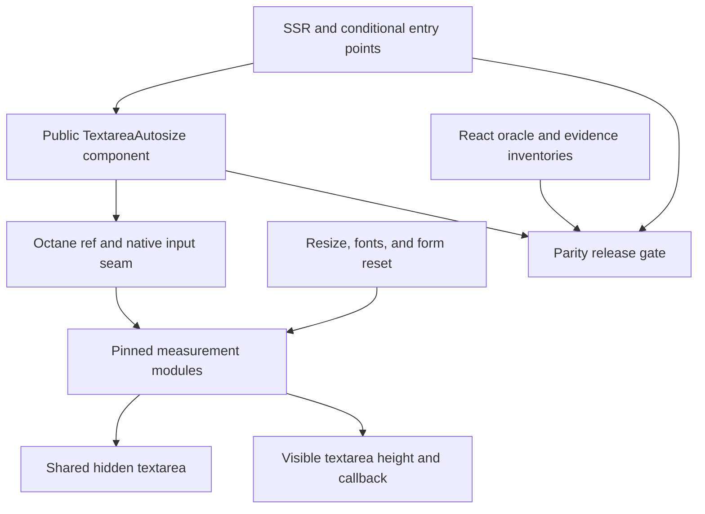
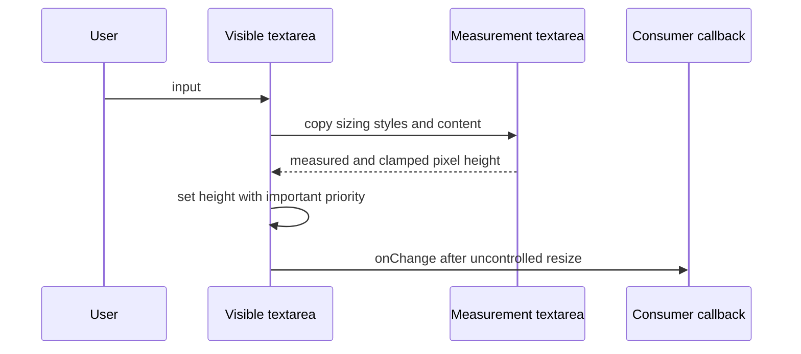

# feat: Add exact react-textarea-autosize binding

## Goal Capsule

- **Objective:** Ship `@octanejs/textarea-autosize` as an exact Octane binding for `react-textarea-autosize@8.5.9`, including its default component, named public types, package conditions, and observable browser lifecycle.
- **Authority:** The npm artifact with SHA-1 `ab8627b09aa04d8a2f45d5b5cd94c84d1d4a8893`, upstream commit `ed1894cd8611d99fbea1c47adcf6ee522b1030fd`, repository guidance, and executable React-oracle evidence govern parity in that order.
- **Execution profile:** Port the pinned source module by module, preserve framework-neutral measurement logic, re-author the React component seam for Octane, and prove layout behavior in Chromium.
- **Stop conditions:** Stop for a source/license mismatch, an unexpressible public surface, a required Octane core change that belongs in a prerequisite PR, or browser evidence that contradicts the parity claim.
- **Tail ownership:** One isolated branch and one draft PR; keep it draft through current-head CI, Cursor/Bugbot, mergeability, and feedback cleanup. Never merge without explicit user direction.

---

## Product Contract

### Summary

Developers can replace `react-textarea-autosize` with `@octanejs/textarea-autosize` without redesigning their component API. The Octane package must preserve the native textarea surface, row constraints, measurement cache, height callback, ref identity, SSR output, and browser resizing lifecycle of the pinned release.

### Problem Frame

Octane has textarea primitives but no package-compatible binding for the widely used autosizing component. A visual approximation is insufficient because the upstream contract depends on computed styles, browser layout, hidden measurement state, controlled and uncontrolled event timing, form reset, font loading, and conditional server bundles.

### Requirements

#### Public package contract

- R1. Export the default autosizing textarea component and the named `TextareaAutosizeProps` and `TextareaHeightChangeMeta` types with the pinned upstream accept/reject surface.
- R2. Preserve native textarea attributes, data/ARIA attributes, events, styles, and the pinned callback/object `HTMLTextAreaElement` ref surface. The public `onChange` adaptation guarantees callback order, bubbling, cancellation, `target`, `currentTarget`, and value during dispatch; React `SyntheticEvent` identity, React-only fields, and post-dispatch `currentTarget` retention are explicit framework divergences.
- R3. Preserve `minRows`, `maxRows`, `cacheMeasurements`, and `onHeightChange(height, { rowHeight })` behavior without adding public options or runtime subpaths beyond the pinned `./package.json` entry point.
- R4. Support the root and `./package.json` package entry points across the relevant import, browser, worker, workerd, edge-light, development, and default conditions without installing React at runtime.

#### Measurement and lifecycle

- R5. Match upstream height calculation for content-box and border-box textareas, wrapping, padding, borders, sizing styles, placeholder fallback, the one-row sentinel, row clamps, the Firefox double-read, and `height` with important priority.
- R6. Resize uncontrolled textareas synchronously on each edit before the public `onChange` callback and resize controlled textareas after their render update.
- R7. Fire `onHeightChange` only when numeric height changes and report the measured row height from that same calculation.
- R8. Preserve measurement caching semantics, including reuse of sizing data when enabled and recalculation after sizing-style changes when disabled.
- R9. Preserve window resize, font loading, own-form reset with request-animation-frame timing, unmount safety, listener cleanup, remount, and detached-node no-op behavior. A reset restores the native default value, remeasures after animation frame, fires only a changed-height callback, and never synthesizes public `onChange`.
- R10. Preserve the module-global hidden measurement textarea without cross-instance value or styling leakage.

#### Server and adoption

- R11. Render one plain textarea during SSR and non-browser imports without accessing measurement DOM globals or replacing the consumer callback/ref contract.
- R12. Hydrate React-shaped server markup by adopting the same textarea, preserving pre-hydration user value, selection, and focus. Uncontrolled `defaultValue` retains the edit; controlled `value` retains it through adoption and reasserts the owner value on the first real controlled update, matching Octane's controlled-host contract.
- R13. Preserve the development-only rejection of `style.minHeight` and `style.maxHeight`; production must not introduce that assertion.

#### Evidence and adoption

- R14. Pin and hash the npm artifact, release source, runtime/type/test files, MIT license, public exports, package conditions, and every evidence inventory with negative controls.
- R15. Run the complete pinned upstream runtime test inventory as pristine React and one-for-one adapted Octane evidence, with every port-authored case classified and no skip/todo/expected-failure markers.
- R16. Ship migration guidance, package/status/catalog/playground/CLI/MCP mappings, generated inventories, changeset, and packed external-consumer validation.

### Key Flows

- F1. **Uncontrolled edit:** The user types into an uncontrolled textarea; the binding measures and applies height before invoking the public change callback. Covers R2, R5-R7.
- F2. **Controlled update:** The user edits a controlled textarea; the owner updates `value`; the layout effect measures the rendered value and applies the matching height. Covers R2, R5-R7.
- F3. **Environmental resize:** Window resize and font `loadingdone` remeasure every mounted live textarea. Form reset remeasures only a textarea owned by that form after the request-animation-frame and value-change guards. Covers R8-R10.
- F4. **Server adoption:** The server emits one textarea; the user may focus or edit it before hydration; Octane adopts that host and starts measurement without replacement or lost state. Covers R11-R12.
- F5. **Migration:** Tooling rewrites the exact React package import, installs the Octane binding, and the representative app builds without React. Covers R1-R4, R14-R16.

### Acceptance Examples

- AE1. Given identical React and Octane content-box textareas, when content grows and shrinks across row clamps, then both report the same pixel height, row height, callback count, and callback ordering. Covers R5-R7.
- AE2. Given two instances with different styles, when they alternate measurements, then the shared hidden textarea does not leak style or value state between them. Covers R8-R10.
- AE3. Given controlled and uncontrolled server textareas whose values, selection, and focus change before hydration, when Octane hydrates, then the original nodes and user state survive adoption; uncontrolled state persists, while the first real controlled update reasserts its owner value and resizes. Covers R11-R12.
- AE4. Given a deleted listener case, altered provenance hash, removed type assertion, missing package condition, or stale generated inventory, when release validation runs, then the affected evidence boundary fails closed. Covers R4, R9, R14-R16.

### Scope Boundaries

- Do not add a generic autosize hook, styling system, synthetic event layer, or alternate textarea component.
- Do not edit Octane core to disguise a binding defect. A proven core gap becomes a separate prerequisite PR.
- Do not treat jsdom scroll metrics as layout parity evidence.
- Do not publish vendored upstream source/tests; they are byte-exact development evidence.

---

## Planning Contract

### Key Technical Decisions

- KTD1. **Pin release 8.5.9 at two evidence boundaries.** Retain the published package for distribution metadata and the exact tagged repository tree for source/tests absent from the tarball. This prevents package-only evidence from silently omitting the implementation oracle. Governs R4, R14-R15.
- KTD2. **Preserve the public `onChange` name over native `onInput` host wiring.** React synthesizes per-edit change events while Octane intentionally uses native events. The package callback remains source-compatible in name and ordering, while documentation and paired types record the native event adaptation. Governs R2, R6.
- KTD7. **Compose all input handlers at one native host boundary.** A U8 React oracle pins the order of `onInputCapture`, `onChangeCapture`, `onInput`, internal uncontrolled resize, and public `onChange` when supplied alone and together. The adapter preserves that order and documents event-object differences rather than overwriting or duplicating callbacks. Governs R2, R6.
- KTD8. **Replace React-only helper hooks locally.** Binding-local Octane hooks reproduce `use-latest` callback freshness and `use-composed-ref` callback/object ref replacement and null teardown; neither React helper ships as a runtime dependency. Governs R2, R9.
- KTD9. **Mirror upstream environment conditions with React-free local modules.** Binding-local `#is-browser` and `#is-development` condition modules drive browser/server behavior behind the exact root export condition families. Governs R4, R11, R13.
- KTD3. **Keep calculation modules structurally aligned with upstream.** Port `calculateNodeHeight`, `getSizingData`, hidden styles, and DOM utilities without framework redesign; re-author only the hook/component/ref seam. This makes behavior and future upgrades reviewable. Governs R5-R10.
- KTD4. **Use browser differentials as the measurement authority.** jsdom covers deterministic component plumbing and upstream test parity; real Chromium compares computed style, scroll height, events, lifecycle, caching, and hydration. A focused Firefox lane proves the retained double-read regression in the affected engine. Governs R5-R13, R15.
- KTD5. **Treat hydration as host adoption, not string equality.** The evidence observes node identity, user value, focus, refs, events, height updates, and cleanup rather than framework markers. Governs R11-R12.
- KTD6. **Fail closed through the global React parity contract.** Every runtime/type/test/evidence file and required lane is inventoried and executed by the repository-wide manifest, package, and generated-artifact gates. Governs R14-R16.

### High-Level Technical Design

### Sequencing

Pin and verify provenance before writing product code. Prove the load-bearing hydration and native-event seams in a minimal browser feasibility gate before porting calculation modules. Port the calculation layer before the complete component seam. Establish deterministic runtime, SSR, and type parity before the exhaustive browser matrix. Add repository integration only after all package-local evidence is green.

### Risks and Dependencies

- Browser font and scroll metrics can vary by platform; use controlled fonts/styles and compare React and Octane in the same Chromium process.
- The shared hidden textarea can retain state across cases; isolate documents where required and add an explicit multi-instance leakage case.
- Hydration can preserve a pre-hydration value that differs from server attributes; assert the user-visible property and node identity, not a brittle serialized snapshot.
- Root generated inventories and parity hashes can change on rebase; regenerate from the final base and never hand-edit them.

---

## Implementation Units

### U1. Pin upstream provenance and public inventory

### U2. Port calculation and measurement modules

- **Goal:** Match upstream pixel-height calculation independently of the component wrapper.
- **Requirements:** R5, R7-R10; KTD3-KTD4.
- **Files:** `packages/textarea-autosize/src/calculateNodeHeight.ts`, `packages/textarea-autosize/src/getSizingData.ts`, `packages/textarea-autosize/src/forceHiddenStyles.ts`, `packages/textarea-autosize/src/utils.ts`, `packages/textarea-autosize/tests/measurement/`.
- **Approach:** Preserve the pinned module boundaries, sizing-property list, box-model adjustments, double scroll read, clamp rules, cache boundary, and hidden textarea reset behavior.
- **Test scenarios:** Content and border box; padding and borders; explicit lines and wrapping; placeholder and sentinel; min/max/default rows; every sizing property; cached and uncached styles; multiple instances; detached node; second-read negative control.
- **Verification:** Deterministic module tests and paired Chromium measurement cases match React results.

### U8. Prove hydration and event feasibility early

- **Goal:** Falsify the two load-bearing framework assumptions before most implementation cost is incurred.
- **Requirements:** R2, R11-R12; KTD2, KTD5. Depends on U1.
- **Files:** `packages/textarea-autosize/tests/feasibility/`, `packages/textarea-autosize/vitest.browser.config.ts`, `vitest.config.js`.
- **Approach:** Build the smallest React-server-to-Octane-hydration fixture for controlled and uncontrolled native textareas, plus the public callback adapter seam. Stop for a core adoption or event contract that cannot meet the declared boundary without a separate prerequisite.
- **Test scenarios:** Mutate value, selection, and focus before hydration; assert host identity, callback/object ref, native input dispatch, controlled reassertion, uncontrolled persistence, and cleanup. Probe every input/change capture/bubble handler alone and together to pin exact order, bubbling, cancellation, target/currentTarget lifetime, and the documented SyntheticEvent boundary.
- **Verification:** The minimal Chromium oracle passes against both ownership modes and every event field guaranteed by R2 before U2-U7 continue.

### U3. Implement the Octane component and lifecycle seam

- **Goal:** Expose the exact component behavior with explicit Octane event/ref adaptations.
- **Requirements:** R1-R3, R6-R10, R13; KTD2-KTD4.
- **Files:** `packages/textarea-autosize/src/index.tsrx`, `packages/textarea-autosize/src/hooks.ts`, `packages/textarea-autosize/src/useLatest.ts`, `packages/textarea-autosize/src/useComposedRef.ts`, `packages/textarea-autosize/src/types.ts`, `packages/textarea-autosize/src/conditions/`, `packages/textarea-autosize/tests/runtime/`, `packages/textarea-autosize/tests/conformance/`.
- **Approach:** Use refs as props, reproduce the two React helper-hook semantics locally, preserve public callback naming, compose all capture/bubble input/change paths in the U8-oracle order, and install each upstream listener with exact cleanup and reset guards. Browser access is gated through the binding-local condition modules from KTD9.
- **Test scenarios:** Object and callback ref attach, replacement, and null teardown with exact React type acceptance; latest callback freshness without listener churn; label/id association; ARIA label, description, and invalid state; required, disabled, and read-only behavior; tab and programmatic focus/selection; native keyboard entry; every input/change capture/bubble handler alone and together; controlled and uncontrolled grow/shrink; guaranteed event fields and declared SyntheticEvent divergences; callback order and de-duplication; window resize; fonts present/absent; own-form reset value/height/callback sequence; other-form reset isolation; post-unmount RAF; remount; development and production style assertion paths. The hidden measurement textarea remains `aria-hidden` and unfocusable.
- **Verification:** Adapted upstream cases, Octane conformance cases, and negative controls pass without a synthetic event layer.

### U4. Build pristine, adapted, differential, SSR, and type evidence

- **Goal:** Execute deterministic runtime, server, package-condition, and type claims against the pinned React implementation.
- **Requirements:** R1-R4, R6-R7, R11, R13-R15; KTD4-KTD6.
- **Files:** `packages/textarea-autosize/tests/pristine/`, `packages/textarea-autosize/tests/differential/`, `packages/textarea-autosize/tests/ssr/`, `packages/textarea-autosize/typetests/`, `packages/textarea-autosize/vitest*.config.ts`, `vitest.config.js`.
- **Approach:** Register complete pristine/adapted runtime and type lanes plus a separate server project. Keep layout-dependent claims out of deterministic DOM emulation.
- **Test scenarios:** Deterministic U2-U3 cases; single-host SSR; packed resolution and safe evaluation across browser/development, browser/production, worker, workerd, edge-light, import, module, and default conditions; callback/ref/prop forwarding; package type accepts/rejects; deleted assertion/case/fixture/manifest negative controls.
- **Verification:** Every deterministic required lane executes, every upstream and authored case has one classification, and parity validation reports no stale or duplicate identities.

### U7. Build hydration and real-browser differential evidence

- **Goal:** Prove every layout, adoption, cache, and environmental lifecycle claim in real Chromium against the pinned React implementation.
- **Requirements:** R5-R12, R15; KTD4-KTD6.
- **Files:** `packages/textarea-autosize/tests/hydration/`, `packages/textarea-autosize/tests/browser/`, `packages/textarea-autosize/vitest.browser.config.ts`, `vitest.config.js`.
- **Approach:** Run identical fixtures in fresh isolated documents or same-origin frames within one browser process. Reset global listeners, styles, fonts hooks, and measurement nodes between identities; alternate and randomize React/Octane order. Normalize an explicit allowlist of environment-only fields and retain host identity, values, focus, pixel metrics, callback order, listener effects, and cleanup evidence.
- **Test scenarios:** Every U2-U3 layout and lifecycle case; controlled and uncontrolled hydration node/value/selection/focus/ref/event preservation and first-update ownership; width and font changes; form reset and unmount race; cached and uncached style changes; shared hidden textarea isolation; contaminated-order negative control; mutation controls for each load-bearing branch; Firefox dynamic-toggle regression proving the second scroll-height read.
- **Verification:** Hydration, Chromium, and focused Firefox lanes execute from the parity manifest and match the React oracle for every classified identity.

### U5. Add adoption and repository integration

- **Goal:** Make the exact binding discoverable, migratable, runnable, and releasable through normal Octane surfaces.
- **Requirements:** R4, R16; KTD6. Depends on U4 and U7.
- **Files:** `packages/textarea-autosize/README.md`, `packages/textarea-autosize/status.json`, `website/src/content/bindings.json`, `packages/octane-mcp-server/src/bridge.js`, `packages/cli/tests/catalog.test.js`, `playground/octane/package.json`, `playground/octane/src/demos/ReactTextareaAutosize.tsrx`, `playground/octane/src/catalog.ts`, `package.json`, `.changeset/`, generated binding/parity/package/CLI/eval inventories.
- **Approach:** Document exact compatibility and event-type adaptation, add the exact package rewrite/install mapping, preserve the `./package.json` export, and generate all maintained catalogs from source. The playground provides labeled controlled and uncontrolled examples with deterministic initial content, visible row limits, measured height/row-height and callback output, grow/shrink text actions, form reset, focus/ref state, and reset-to-initial behavior.
- **Test scenarios:** CLI/MCP rewrite; keyboard-operable playground labels and controls; controlled/uncontrolled grow, shrink, row clamps, focus, callback output, and reset; external packed consumer resolves all conditions and types without React; generated checks reject stale entries.
- **Verification:** Playground production build, CLI/MCP tests, packed-package consumers, sync, changeset, and all generated checks pass.

### U6. Run final release and review gates

- **Goal:** Prove the branch is reviewable from current base and create only a draft PR.
- **Requirements:** R14-R16.
- **Files:** All changed files and generated outputs. The parent workspace tracker `docs/octane-react-ecosystem-port-review.md` is maintained outside this PR and verified separately.
- **Approach:** Run scoped and global parity, types, declarations, format, package-pack, test, generated, and browser gates; simplify without changing behavior; perform independent code/document review; update durable tracker status; commit logical units and open a draft PR.
- **Test scenarios:** Final manifest executes all required lanes; final packed tarball contains only intended release files; no React runtime dependency; clean generated diff; PR remains draft through current-head review.
- **Verification:** Local gates are green, review findings are resolved or durably recorded, the pushed head matches evidence hashes, GitHub reports a draft PR, and the parent workspace tracker records the exact branch, pin, PR, evidence, and review state.

---

## Verification Contract

| Gate | Applies to | Done signal |
| --- | --- | --- |
| Package provenance and inventory scripts | U1-U5 | Exact pin, source/test/type/export/package/evidence inventories and negative controls pass. |
| Pristine and adapted runtime suites | U3-U4 | Every pinned upstream runtime case executes in both classifications. |
| Paired `tsc` and `tsrx-tsc` projects | U1, U3-U4 | Equivalent public accept/reject programs pass with documented event/renderable adaptations only. |
| Server, hydration, Chromium, and focused Firefox projects | U2-U4, U7-U8 | SSR safety, host adoption, real layout, lifecycle, cache, cleanup, and the Firefox double-read regression match the React oracle. |
| Package, declarations, format, and test gates | U1-U6 | Targeted checks and the applicable root gates pass from the final branch head. |
| Playground, CLI/MCP, generated, and pack checks | U5-U6 | Migration surfaces build and generated files are current; packed external consumers resolve without React. |
| Draft PR and current-head review | U6 | PR opens draft and stays draft until CI, Cursor/Bugbot, mergeability, and feedback gates are explicitly complete. |

---

## Definition of Done

- Requirements R1-R16 and flows F1-F5 have direct executable or retained-provenance evidence.
- The exact `8.5.9` runtime, type, package-condition, server, hydration, layout, cache, listener, ref, event, and callback contracts are accounted for.
- Every upstream test/type artifact and every port-authored case has one complete classification and an executed manifest lane.
- Real Chromium proves all layout-dependent claims against React in the same environment.
- The package, documentation, status, playground, CLI/MCP mappings, changeset, generated inventories, and external packed consumers are complete and React-free.
- No skipped cases, expected failures, stale hashes, hand-edited generated files, unintentionally omitted release files, abandoned experiments, or unresolved review findings remain; vendored provenance inputs remain development-only and unpacked.
- The isolated PR exists as a draft and the durable tracker records its branch, pin, PR, evidence, and current review state.
