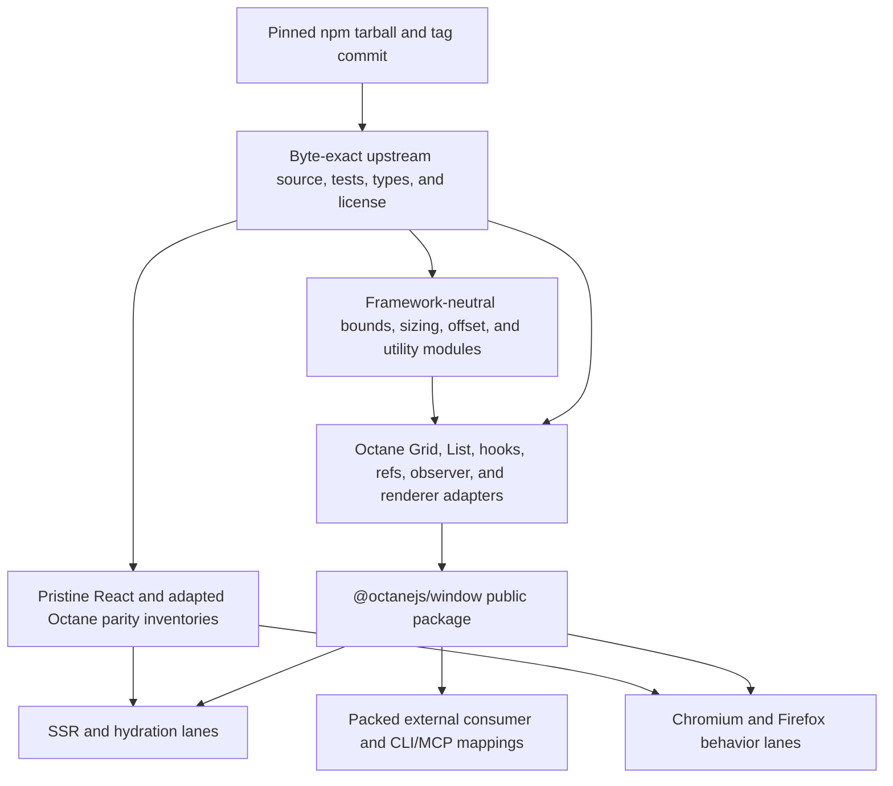
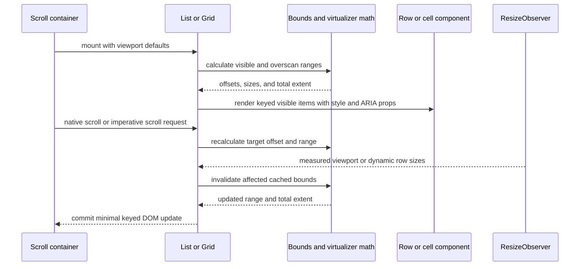

# feat: Add exact react-window binding

## Goal Capsule

- **Objective:** Add `@octanejs/window` as an exact, source-accounted port of `react-window@2.3.0`, with executable React parity, SSR/hydration, browser virtualization, type, provenance, and packed-consumer evidence.
- **Authority:** The pinned upstream tag and published tarball define the package contract; Octane repository guidance defines acceptable adaptations and evidence.
- **Execution profile:** One isolated binding branch and one draft PR. Cross-cutting Octane runtime/compiler changes require a separate prerequisite PR unless a small binding-owned integration defect can be proven and reviewed in this branch.
- **Stop conditions:** Stop rather than claim parity if licensing or provenance cannot be proven, an exported surface cannot be implemented honestly, a required upstream case is silently unaccounted for, or virtualization needs a product-level Octane semantic change.
- **Tail ownership:** Keep the PR draft through current-head CI and automated review; maintainers own readiness and merge.

---

## Product Contract

### Summary

Applications importing the current `react-window` package should be able to map that dependency to `@octanejs/window` without accepting a merely similar virtualization API. The binding targets the current v2 package contract, not the incompatible v1 API that older documentation and ecosystem memory often imply.

### Problem Frame

Octane already ships TanStack Virtual, but it is not source-compatible with `react-window`. Migration therefore still requires application-level rewrites for a package with millions of weekly downloads. The binding must preserve the pinned package's observable virtualization contract while adapting React hooks, component rendering, refs, native scrolling, ResizeObserver work, and SSR to Octane's compiler-first model.

### Requirements

#### Exact surface and provenance

- R1. Pin `react-window@2.3.0`, its npm tarball integrity, annotated tag, tag commit `4d9eebbb510262b3b7e95463cf49a10de53ea77d`, MIT license, peer/oracle versions, published files, repository source, and repository test boundary.
- R2. Account for every public runtime and type export from the pinned package: `Grid`, `List`, `getScrollbarSize`, `useDynamicRowHeight`, four imperative-ref hooks, and all exported prop, imperative API, render-component, alignment, and dynamic-height types.
- R3. Preserve v2 prop names, callbacks, imperative methods, error behavior, sizing inputs, overscan behavior, accessibility attributes, tag customization, directionality, and ref lifecycles unless a documented Octane divergence is unavoidable.
- R4. Do not claim or add the incompatible v1 `FixedSizeList`, `VariableSizeList`, `FixedSizeGrid`, or `VariableSizeGrid` APIs; document that version boundary explicitly.

#### Behavioral parity

- R5. Match pinned React observable ranges, item/cell positions, overscan, scroll alignment, keying, rerender behavior, resize response, dynamic row-height caching, and imperative scrolling for supported inputs; assert deterministic mounted-node and render-work bounds so a full-dataset implementation cannot satisfy the parity suite.
- R6. Preserve current v2 SSR behavior: `defaultHeight` and `defaultWidth` provide deterministic server markup, browser-only observers and layout reads do not execute on the server, and hydration adopts the server structure before live measurement updates it.
- R7. Prove real-browser behavior for vertical and horizontal lists, grids, RTL, scrolling, ResizeObserver-driven changes, dynamic row heights, imperative refs, focus/identity stability, and cleanup.
- R8. Preserve public callback names such as `onRowsRendered`, `onCellsRendered`, `onResize`, and native `onScroll`; do not introduce React's synthetic event layer.

#### Evidence and release integration

- R9. Vendor the permitted upstream source, tests, types, and license byte-exact; crosswalk every upstream source module, export, and test file to ported, reused, adapted, divergent, or not applicable evidence.
- R10. Execute the pinned React runtime suite and type contract as pristine oracles, a one-for-one adapted Octane suite, differential scenarios where both frameworks can share observables, and negative controls that fail on missing, renamed, skipped, stale, or structurally altered evidence.
- R11. Register all pristine/adapted runtime and type lanes in the generic React parity manifest and declare project ownership without package-specific workflow logic.
- R12. Integrate the package into exports, workspace/catalog/status/CLI/MCP mappings, documentation, one representative playground example covering both `List` and `Grid`, changesets, and external packed-consumer validation without shipping vendored evidence.

### Scope Boundaries

#### In scope

- The complete `react-window@2.3.0` root package surface.
- Current browser, SSR, hydration, type, package-condition, and migration behavior needed by that surface.
- Exact upstream source/test provenance and generic parity-harness integration.

#### Outside this product's identity

- `react-window` v1 compatibility exports.
- `react-window-infinite-loader` or other companion packages.
- A new generic virtualization framework shared with TanStack Virtual.
- Pixel-perfect behavior in environments without layout; jsdom evidence remains bounded to deterministic mocked geometry, with real layout asserted in browsers.

#### Deferred to Follow-Up Work

- Any independently publishable v1 compatibility package, if the team later approves that separate target.
- Cross-package virtualization abstractions discovered during implementation; duplication is preferred over an unplanned shared framework in this PR.

### Acceptance Examples

- AE1. Given a 10,000-row `List` with a fixed row height and a 300px viewport, when the user scrolls to row 5,000, React and Octane report equivalent visible/overscan ranges and render equivalent positioned rows without mounting the entire dataset.
- AE2. Given a `Grid` with variable function-based column/row sizes, when its imperative ref scrolls to a target cell using each supported alignment, Octane matches React's offsets, visible range, ARIA coordinates, and range errors.
- AE3. Given a dynamic-height list, when ResizeObserver reports changed row sizes, cached bounds, total height, visible rows, and scroll anchoring update equivalently and observers are released on unmount.
- AE4. Given SSR dimensions, when `List` and `Grid` render on the server and hydrate in a browser, markup is deterministic, no browser API runs server-side, hydration reuses the DOM, and live measurement updates without duplicate content.
- AE5. Given a consumer importing every public runtime and type export from a packed tarball, the consumer builds, executes SSR and browser smoke scenarios, resolves no React runtime, and maps `react-window` imports through the repository's CLI/MCP bridge.

---

## Planning Contract

### Key Technical Decisions

- KTD1. **Pin current v2 exactly.** Target `react-window@2.3.0` rather than v1 or a blended compatibility layer. (session-settled: user-directed — chosen over a similar alternative or legacy compatibility approximation: the migration tracker requires exact current-package bindings.) Governs R1-R4.
- KTD2. **One binding branch and draft PR.** Keep this package self-contained and split any genuinely cross-cutting prerequisite into its own PR. (session-settled: user-directed — chosen over batching several bindings or infrastructure changes: the campaign requires one PR per binding and independent review.) Governs R12.
- KTD3. **Port module by module from vendored source.** Mirror upstream `lib/` ownership in `packages/window/src/`; preserve framework-neutral math/utilities with source correspondence and adapt React-owned hooks/components to Octane instead of wrapping TanStack Virtual. Governs R2, R3, R5, and R9.
- KTD4. **Treat render-component props as a compiler boundary.** Prove `rowComponent` and `cellComponent` invocation, keyed identity, style props, children, and refs in a small feasibility fixture before broad transcription. If Octane cannot represent the exact dynamic component contract, stop for an owning prerequisite rather than replacing it with a different API. Governs R3, R5, and R7.
- KTD5. **Use layered parity evidence.** Upstream pure tests validate algorithms; pristine React tests and adapted Octane cases validate framework behavior; differential tests compare shared observables; real Chromium and Firefox validate layout/scroll/ResizeObserver/RTL; SSR/hydration and packed consumers validate release boundaries. Governs R5-R12.
- KTD6. **Keep public events native.** Preserve library callback names and pass native scroll behavior through Octane; adaptations belong only at the renderer/hook/ref boundary and must be listed in the transformation ledger. Governs R3 and R8.
- KTD7. **Maintain exact evidence mechanically.** Hash vendored artifacts, inventory source/tests/types/cases, enforce injective crosswalks and allowed transforms, and add mutation tests so broad green suites cannot hide missing parity evidence. Governs R9-R11.

### High-Level Technical Design

### Assumptions

- The MIT license and copyright notices permit vendoring the pinned repository evidence and adapting the implementation with attribution.
- Latest-package compatibility means v2.3.0 even though v1 remains common in existing applications; v1 is a separate future product decision.
- The existing Octane dynamic component, keyed range, ref-as-prop, ResizeObserver, SSR, hydration, and browser test primitives are sufficient unless the U2 feasibility gate proves otherwise.
- Repository-wide current parity/package generators remain authoritative and may add generated files beyond those named initially.

### Prerequisites and branch boundaries

- Draft PR #548 (`infra.browser-firefox`) owns the generic Firefox browser selector and runner. U1-U4 may proceed before it merges, but U5 must consume the merged generic infrastructure after rebasing; this binding must not copy or recreate that cross-cutting runner.
- Draft PR #550 (`infra.package-commonjs`) owns executable CommonJS package conditions and their repository-wide validation. The binding may prove ESM, types, SSR, hydration, and browser consumers independently, but any CommonJS parity claim in U6 depends on the merged prerequisite after rebasing; this binding must not duplicate package-condition infrastructure.
- If either prerequisite changes its public helper contract before merge, adapt this branch after rebasing and rerun the affected exact-head evidence. Do not weaken or omit the Firefox or CommonJS gate to keep this PR independently green.

### Output Structure

---

## Implementation Units

### U1. Pin and inventory the upstream contract

### U2. Prove Octane feasibility at the renderer boundary

- **Goal:** Prove the hardest v2 contracts before transcribing the full implementation.
- **Requirements:** R3, R5-R8; KTD4, KTD6.
- **Dependencies:** U1.
- **Files:** `packages/window/tests/feasibility/**`, `packages/window/src/internal.ts`, `vitest.config.js`.
- **Approach:** Build minimal source-attributed fixtures for dynamic row/cell component props, keyed item identity, style/ARIA objects, ref-as-prop imperative handles, native scroll updates, percentage/function sizing, ResizeObserver cleanup, and SSR default dimensions. Keep the production candidate only if the exact observable contract is representable without an application-facing adapter.
- **Execution note:** Treat this as a hard feasibility gate; a compiler/runtime ownership gap becomes a separate prerequisite rather than a weakened binding API.
- **Patterns to follow:** Dynamic collection components in `packages/aria/`, slot forwarding in `packages/floating-ui/` and `packages/base-ui/`, virtualization/browser setup in `packages/tanstack-virtual/`.
- **Test scenarios:**
  - Two sibling lists using the same row component retain independent hook/ref state and keyed DOM identity.
  - A dynamic cell component receives exact indices, ARIA attributes, style, and caller props without compiler metadata leakage.
  - A native scroll event updates the rendered range and callbacks once at the expected commit boundary.
  - Imperative callback and object refs attach, remain stable across rerenders, expose the outer element, and detach on unmount.
  - SSR with default dimensions performs no browser API access and produces hydratable structure.
- **Verification:** All boundary probes pass in development and production compilation, SSR, and a real browser, or the unit records an evidence-backed stop with no false parity claim.

### U3. Port framework-neutral core, hooks, and utilities

- **Goal:** Reproduce pinned bounds, sizing, scrolling, caching, observer, RTL, and callback behavior with module-level source correspondence.
- **Requirements:** R2, R3, R5, R8-R10; KTD3, KTD5-KTD7.
- **Dependencies:** U1, U2.
- **Files:** `packages/window/src/core/**`, `packages/window/src/hooks/**`, `packages/window/src/utils/**`, `packages/window/src/types.ts`, `packages/window/tests/upstream/**`, `packages/window/tests/differential/**`.
- **Approach:** Preserve pure algorithms as close to upstream as repository publication rules allow; adapt composed hooks to explicit Octane slot ownership; keep measurement, scrollbar, RTL, resize, stable-callback, and cache semantics at their upstream module boundaries. Run pure tests unchanged and port hook tests case by case.
- **Execution note:** Begin from upstream tests and preserve their assertions; classify failures before changing behavior.
- **Patterns to follow:** `packages/tanstack-virtual/src/`, `packages/aria/src/utils/useResizeObserver.ts`, binding-local `subSlot`/trailing-slot normalization patterns.
- **Test scenarios:**
  - Fixed, percentage, function, and dynamic sizes produce pinned estimated totals, cached bounds, start/stop ranges, and aligned offsets across empty, first, middle, and final indices.
  - Invalid indices and sizes throw the same error classes and boundary messages as React where public.
  - RTL offset normalization covers negative, positive-descending, and positive-ascending browser models.
  - ResizeObserver updates only changed measurements, preserves stable callbacks, and disconnects every observer/listener.
  - Scrollbar size caching and forced recalculation match the pristine oracle under controlled DOM geometry.
- **Verification:** Every upstream pure/hook case has a disposition and executable evidence, all adapted hooks are slot-safe across siblings and rerenders, and no React runtime enters the production dependency graph.

### U4. Implement the complete List and Grid surfaces

- **Goal:** Publish exact v2 components and imperative APIs on top of the proven core.
- **Requirements:** R2-R8; KTD3-KTD6; AE1-AE4.
- **Dependencies:** U3.
- **Files:** `packages/window/src/components/list/**`, `packages/window/src/components/grid/**`, `packages/window/src/index.ts`, `packages/window/tests/runtime/**`, `packages/window/tests/differential/**`, `packages/window/tests/ssr/**`, `packages/window/tests/types/**`.
- **Approach:** Port `List` and `Grid` module by module, including children overlays, tag names, rest DOM props, class/style merging, ARIA coordinates, custom keys, overscan, callbacks, default dimensions, dynamic heights, and all imperative-ref helpers/methods. Keep compiler slot metadata outside public declarations and runtime callbacks.
- **Execution note:** Port upstream component cases in source order and keep exact case names/citations so omissions remain visible.
- **Patterns to follow:** Component/ref boundaries in `packages/base-ui/` and `packages/radix/`; SSR/hydration and differential fixtures in current exact binding ports.
- **Test scenarios:**
  - Covers AE1. Fixed and function-sized lists render exact visible/overscan rows at initial, wheel/scroll, programmatic, and end-of-list positions.
  - Covers AE2. Grids cover vertical/horizontal movement, all alignments, custom row/column keys, ARIA indices, overlays, tag names, RTL, and invalid target errors.
  - Covers AE3. Dynamic heights update total extent and anchored visible content without remounting unaffected keyed rows.
  - Covers AE4. SSR defaults produce stable markup; hydration adopts nodes; client measurement changes ranges without duplicate callbacks or DOM.
  - Prop objects containing forbidden injected keys are rejected by types; permitted custom row/cell props arrive unchanged at runtime.
  - Ref hooks have exact public types and imperative methods expose the mounted element and perform the same scroll requests as React.
- **Verification:** Runtime exports and declarations match the pinned inventory, upstream/adapted/differential/SSR/type lanes pass, and documented divergences are explicit, consumer-visible, and tested.

### U5. Prove real-browser virtualization and lifecycle parity

### U6. Integrate, pack, document, and release the binding

- **Goal:** Make the exact binding discoverable and consumable through every supported migration and release surface.
- **Requirements:** R4, R9-R12; KTD1, KTD2, KTD5, KTD7; AE5.
- **Dependencies:** U1-U5; merged CommonJS package-condition infrastructure from draft PR #550 before claiming or validating `require` parity.
- **Files:** `packages/window/package.json`, `packages/window/README.md`, `packages/window/status.json`, `.changeset/*.md`, `pnpm-workspace.yaml`, `vitest.config.js`, catalog/status/CLI/MCP mapping sources and generated artifacts, playground/consumer fixtures, package-pack validation sources.
- **Approach:** Publish authored source and exact types without vendored evidence; add package metadata, migration mapping, status/catalog entries, one representative playground example that exercises both `List` and `Grid`, a changeset, and generic release validation. Document the v2-only boundary and every intentional Octane adaptation. Run repository generators once and review every generated change.
- **Execution note:** Prefer packed external-consumer smoke evidence over package-internal import success for release claims.
- **Patterns to follow:** Current shipped binding packages, generated binding status/catalog tooling, CLI/MCP bridge mapping tests, and package pack canaries.
- **Test scenarios:**
  - Covers AE5. An outside-workspace consumer installs the real tarball, imports every runtime/type export, builds client/server bundles, executes SSR, and hydrates/browser-smokes without React.
  - `react-window` dependency mapping resolves to `@octanejs/window` through CLI and MCP catalogs with exact focused tests.
  - Vendored source/tests/audit fixtures are absent from the tarball while every authored importable source and declaration is present.
  - Stable and canary React parity inventories plus package/status/catalog generators remain current and fail on an omitted package surface.
  - README and status data state v2.3.0 coverage and reject any implied v1 compatibility.
- **Verification:** Repository sync is clean, packed consumers pass all supported module/type/build/SSR/browser lanes, generated inventories are current, and the draft PR body reports precisely which global gates ran.

---

## Verification Contract

| Gate | Evidence | Covers |
| --- | --- | --- |
| Upstream provenance and audit controls | Exact tag/tarball/license/source/test/type hashes, crosswalk validation, and mutation tests | U1, R1-R2, R9-R10 |
| Focused feasibility | Development/production compiler, DOM, SSR, hydration, and browser boundary probes | U2, R3, R5-R8 |
| Package runtime and types | Complete local Vitest projects, pristine React suite, adapted Octane suite, differential lanes, pristine/adapted type projects | U3-U4, R2-R10 |
| Browser parity | Chromium and Firefox paired virtualization, layout, scroll, RTL, resize, identity, focus, and cleanup journeys | U5, R5-R7, R10-R11 |
| Repository quality | `pnpm sync`, scoped and repository formatting, typecheck, test-marker and workflow regressions, relevant root tests | U6, R11-R12 |
| Release consumer | Full package-pack gate plus outside-workspace ESM/CommonJS/type/client/server/SSR/hydration/browser consumer; CommonJS executes only after rebasing onto merged #550 | U6, R12, AE5 |
| Review and PR state | Independent code review, resolved current-head feedback, terminal CI evidence where drafts allow it, mergeability/base freshness, draft retained | U6, KTD2 |

---

## Definition of Done

- `@octanejs/window` exposes every pinned v2.3.0 runtime and type export with no silent gap or undocumented divergence.
- Every upstream source module, test artifact/case, and type assertion has one evidence-backed disposition, and negative controls prove the inventories fail closed.
- Pristine React, adapted Octane, differential, SSR/hydration, Chromium, Firefox, type, and packed-consumer lanes execute successfully on the final head.
- The published tarball contains authored package sources/declarations/docs/license but excludes vendored audit evidence and has no React runtime dependency.
- Status, catalog, CLI/MCP mappings, documentation, changeset, examples, parity manifests, and generated inventories are current.
- No v1 compatibility claim appears in exports, documentation, status, or migration mappings.
- The work remains one isolated binding PR, opens and stays draft, and all actionable current-head review feedback is resolved before maintainers decide readiness.
