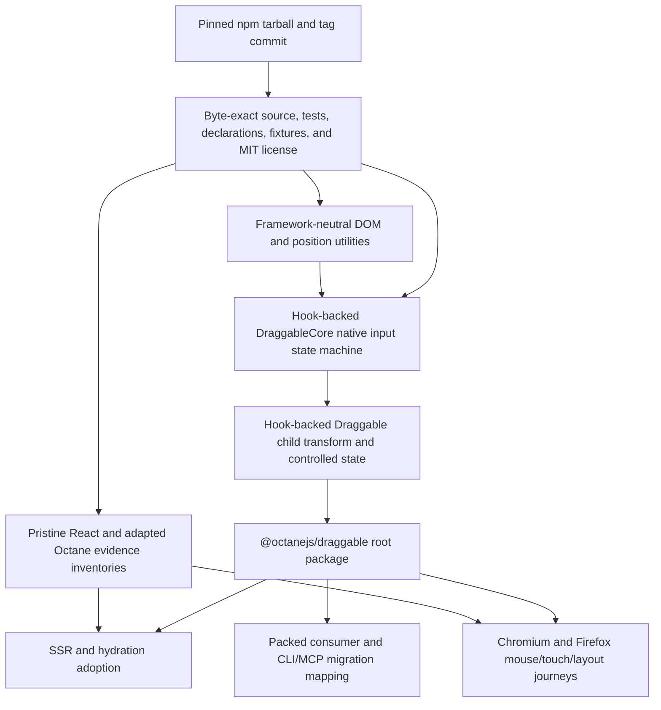
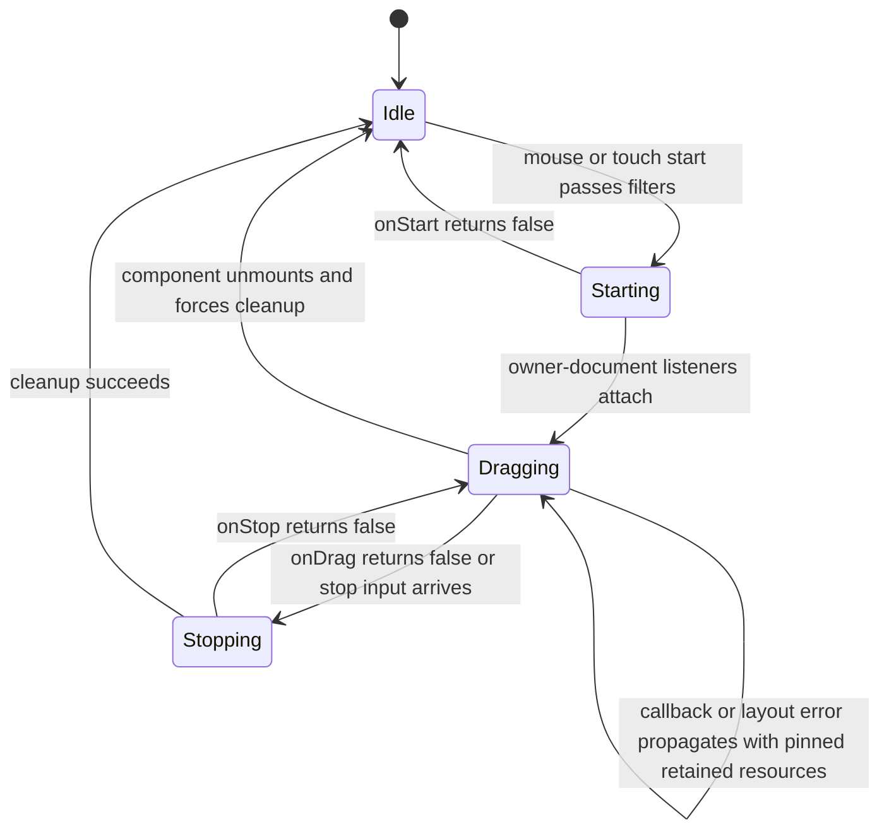

# React Draggable Binding - Plan

## Goal Capsule

- **Objective:** Add `@octanejs/draggable` as an exact, source-accounted port of `react-draggable@4.7.1`, with executable runtime, type, SSR, hydration, real-browser, provenance, and packed-consumer evidence.
- **Authority:** The published `react-draggable@4.7.1` npm runtime files and declarations are the consumer-contract authority. The pinned repository tag supplies source and test provenance. Every discrepancy between those artifacts must receive an explicit parity-ledger disposition before implementation evidence can pass. Octane repository guidance defines acceptable framework adaptations and proof.
- **Execution profile:** Use one isolated binding branch and one draft PR. A cross-cutting runtime, compiler, browser-runner, or package-condition defect belongs in a separate prerequisite PR unless the change is demonstrably binding-owned.
- **Stop conditions:** Stop rather than claim parity if license provenance is incomplete, an upstream export or test lacks a disposition, class-to-hook adaptation changes a consumer-visible contract, or required native drag behavior cannot be proven in a real browser.
- **Tail ownership:** Keep the PR draft through current-head CI and automated review. Octane maintainers own readiness and merge.

---

## Product Contract

### Summary

Applications that import `react-draggable` should be able to map the package to `@octanejs/draggable` without replacing its component API or drag semantics with a merely similar abstraction. The port targets the complete public contract of the current `4.7.1` release.

### Problem Frame

Octane already offers DnD Kit, but DnD Kit does not implement the `react-draggable` package contract. Existing applications still depend on `Draggable`, `DraggableCore`, their callback data, controlled and uncontrolled positions, bounds, grid snapping, native mouse and touch lifecycles, and child-cloning behavior. Migration should not require those applications to redesign their drag layer.

### Requirements

#### Exact surface and provenance

- R1. Pin `react-draggable@4.7.1`, npm integrity `sha512-wa3tzfFnYt3yaZLuyU58fl1TNunfWfBekDgWhZA1+gb2jnp42wZ0ymuopR6M5kqDYmm4hKmzGlcKWjZf3Zb6RQ==`, tarball shasum `e502c3cfe0cc97d691e12aaa377a975fce097d71`, tag object `cec7498ff84e91215987636d3edbb6ca132ee9e5`, commit `bcbaa8eb285aea49865ca8870c0b7b441c2fe6a4`, published files, repository source/tests, and MIT notice.
- R2. Expose the exact root runtime surface: default `Draggable` and named `DraggableCore`; expose the eight published type exports and only the upstream `.` and `./package.json` subpaths.
- R3. Preserve the published prop and callback contract, including consumer-optional component props, optional `propTypes`, and the upstream event-handler declaration oddity. Apply the explicit Octane public-type mapping in KTD8; constructor, class-instance, lifecycle, and React-instance-ref assignability are intentionally outside the Octane binding contract and must be recorded as framework adaptations rather than silently approximated.
- R4. Crosswalk every upstream source module, runtime/type export, test file, test identity, browser case, fixture, and authored port test to one evidence-backed disposition.

#### Component and drag behavior

- R5. Preserve the one-child/no-wrapper contract, non-drag child props, upstream replacement of the cloned child’s drag event handlers, class/style merging, HTML translate output, SVG transform behavior, position offsets, and the documented overwrite behavior for a child’s existing transform.
- R6. Preserve uncontrolled `defaultPosition` and controlled `position` behavior, including movement during a controlled gesture, reversion on stop, position-without-handler warning, axis output restrictions, and callback data that still reports unrestricted coordinates.
- R7. Preserve numeric, parent, and selector bounds; grid snapping; slack recovery; scale; offset-parent coordinates; ShadowRoot-aware selector lookup; layout error behavior; and callback cancellation semantics.
- R8. Preserve `DraggableCore` mouse and touch contracts: start ordering, left-click and macOS control-click filtering, `allowAnyClick`, handle/cancel matching, touch identifier tracking, passive-listener behavior, mobile-scroll opt-out, document-level owner-document listeners, iframe safety, user-select hack/nonce lifecycle, and live props during active gestures. `onStart=false` creates no global side effects, `onDrag=false` follows the pinned forced-stop path, and `onStop=false` retains the active gesture and required resources until a later accepted stop or unmount against the same resolved node performs cleanup. Callback/layout exceptions and active-gesture `nodeRef` or owner-document replacement propagate and retain or mis-target resources exactly where the pinned implementation does; these dispositions are characterized, not normalized into stronger cleanup guarantees.
- R9. Match each React 19 missing-`nodeRef` path separately while retaining the upstream public type’s older-React compatibility: render and mount succeed, mount skips native touch-start registration when no node resolves, cloned mouse start throws `<DraggableCore> not mounted on DragStart!`, and touch start cannot occur through the absent native listener. Preserve object/callback ref and custom-component forwarding behavior without using class components or `findDOMNode` in Octane.
- R10. Do not add Pointer Events or `touchcancel` behavior. The pinned package supports mouse and touch only, so broader input support would be a different contract.

#### Rendering and release evidence

- R11. Produce deterministic SSR for both components, hydrate by adopting the existing child node, defer DOM listeners and layout work until mount, prove post-hydration mouse/touch behavior, and prove the post-mount SVG transform transition without duplicate content or leaked resources.
- R12. Execute the pinned React unit/type suite and browser suite as pristine oracles where possible, port cases one-for-one to Octane, compare shared observables differentially, and add fail-closed mutation controls for missing, skipped, renamed, stale, or structurally altered evidence.
- R13. Register every required lane in the generic React parity manifest and execution group without package-specific CI workflow logic. Real Chromium and Firefox engines are required for layout, bounds, iframe, Shadow DOM, passive-listener registration, touch default prevention, focus, SVG, and cleanup claims. The contract covers browser-platform behavior observable in those supported engines; it does not claim physical-device or mobile-WebKit validation absent an upstream or repository lane for it.
- R14. Integrate package metadata, status, website catalog, playground, CLI/MCP mapping, changeset, generated inventories, and packed outside-workspace consumers without shipping vendored audit evidence or adding React as a runtime dependency.

### Scope Boundaries

#### In scope

- The complete `react-draggable@4.7.1` root package surface and its published type contract.
- Source-accounted class-to-hook adaptation that retains consumer-observable state, callbacks, transforms, refs, and listener lifecycles.
- Mouse and touch behavior, SSR/hydration, real-browser layout, package conditions, and migration surfaces required by the pinned release.

#### Outside this product's identity

- Pointer Events, `touchcancel`, keyboard dragging, collision detection, sortable lists, drag overlays, or DnD Kit compatibility.
- New source subpaths or wrapper DOM elements absent from upstream.
- Literal preservation of React class instances, `ReactDOM.findDOMNode`, synthetic events, or React internals.
- A shared drag framework spanning `@octanejs/dnd-kit` and this package.

#### Deferred to Follow-Up Work

- Any generic Octane runtime/compiler correction exposed by feasibility tests.
- Cross-binding abstractions discovered during implementation. This PR prefers a complete local port over an unplanned shared layer.

### Acceptance Examples

- AE1. Given an uncontrolled `Draggable` with grid and parent bounds, when a mouse gesture enters, leaves, and re-enters the bound, Octane matches React’s snapped callback data, clipped transform, slack recovery, classes, and stop state.
- AE2. Given a controlled `Draggable`, when touch movement occurs, the child moves during the gesture, callbacks receive the pinned data shape, and the child returns to the supplied position after stop.
- AE3. Given a `DraggableCore` inside an iframe or ShadowRoot with handle/cancel selectors, when mouse and multi-touch gestures begin and leave the element, listeners remain attached to the correct owner document, selector behavior matches React, and all listeners and user-select artifacts are removed at stop or unmount.
- AE4. Given server-rendered HTML and SVG children, when Octane hydrates them, it reuses the existing nodes, attaches no duplicate content, becomes mouse/touch interactive, and applies the pinned post-mount HTML/SVG transform behavior.
- AE5. Given an outside-workspace consumer that installs the packed package, imports every runtime/type export, and maps `react-draggable` through Octane tooling, ESM, types, SSR, hydration, and browser smoke behavior run without React; supported CommonJS behavior also runs after the shared package-condition prerequisite lands.

---

## Planning Contract

### Key Technical Decisions

- KTD1. **Port the current package exactly.** Target `react-draggable@4.7.1` rather than an older release or a similar drag API. (session-settled: user-directed — chosen over different-but-similar Octane alternatives: the migration list is based on exact `package.json` equivalents.) Governs R1-R14.
- KTD2. **Keep one binding in one draft PR.** This branch owns only `@octanejs/draggable` and binding-local integration. (session-settled: user-directed — chosen over batching bindings or promoting green PRs automatically: the campaign requires one PR per binding and maintainer-controlled readiness.) Governs R14.
- KTD3. **Rewrite class ownership without changing the state machine.** Re-author `Draggable` and `DraggableCore` as hook-backed Octane functions while preserving upstream mutable drag fields, current-props visibility, callback cancellation, and document-listener cleanup. A wrapper around DnD Kit would change R5-R10 and is rejected.
- KTD4. **Treat `nodeRef` as an exact React 19 boundary.** Preserve the pinned runtime failure when no node can be resolved, keep the older-compatible optional public type, and never add `findDOMNode` or implicit element discovery. Governs R3 and R9.
- KTD5. **Use Octane child primitives at the framework seam.** Preserve the one-child/no-wrapper DOM contract with Octane `Children.only`, `cloneElement`, and refs-as-props; retain non-drag props but replace the same drag event handlers that upstream replaces; then prove identity, classes, style, SVG attributes, and custom components against React. Composing those handlers would be a documented divergence and is rejected unless pinned React evidence contradicts the source reading. Governs R5, R9, and R11.
- KTD6. **Keep input semantics native and bounded to upstream.** Implement only mouse and touch with owner-document listeners and native passive options. Do not translate the contract to Pointer Events or synthetic events. Governs R7-R10.
- KTD7. **Make parity fail closed.** Hash and inventory upstream artifacts at file, test, case, export, and type-assertion granularity; permit only documented transformations; require pristine, adapted, differential, SSR/hydration, browser, and packed-consumer lanes. Governs R4 and R11-R14.
- KTD8. **Map public component types explicitly at the framework seam.** Export both values as Octane callable `ComponentBody<Partial<Props>>` components with observable `displayName`, `defaultProps`, and optional `propTypes` statics. Map `ReactNode` children to `OctaneNode`, `React.RefObject<HTMLElement | null>` to the structural `{ current: HTMLElement | null }` object accepted by Octane refs, and retain the upstream native `MouseEvent | TouchEvent` callback events and all eight named data/prop types. JSX callability, optional props, refs-as-props, statics, and event/data shapes are required; React class construction, lifecycle/instance members, `React.Component` assignability, and instance refs are documented unavoidable framework adaptations. Governs R2-R3, R9, and U4.

### High-Level Technical Design

### Assumptions and Prerequisites

- MIT permits vendoring, adaptation, and publication when the full copyright, permission notice, and disclaimer remain with substantial portions.
- Octane’s existing `Children.only`, `cloneElement`, refs-as-props, native event system, SSR, hydration, and owner-document APIs can represent the observable contract. U2 is a hard gate for that assumption.
- Draft PR #548 owns the reusable Firefox browser runner. Browser evidence may develop against Chromium first, but the binding cannot claim complete multi-browser parity until it consumes the shared runner after rebasing.
- Draft PR #550 owns executable CommonJS package conditions. ESM, types, SSR, hydration, and browser consumers remain independently required; CommonJS claims wait for that prerequisite rather than duplicating its infrastructure.
- The audit records the exact consumed head revisions of PRs #548 and #550 plus the required capabilities: reusable Firefox execution for parity-owned browser projects, and executable packed CommonJS root/package-json conditions. Any consumed-head change invalidates and reruns the affected U5 or U6 evidence before the claim is restored.
- The pinned 4.7.1 upstream suite has 204 unit/type cases across 11 Vitest files and 23 Puppeteer cases. Implementation must verify those counts from the vendored tag instead of trusting this planning snapshot.

### Risks and Mitigations

- **Class-to-hook state drift:** Preserve the upstream transition model first and use callback-sequence oracles that distinguish `onStart=false`, `onDrag=false`, and `onStop=false`, plus controlled reversion, slack, live prop changes, and unmount during a drag.
- **Stale props or leaked listeners:** Route active gesture listeners through stable current values and test rerenders mid-drag. Match the pinned resource disposition for `onStop=false`, thrown callbacks/layout work, and active `nodeRef` or owner-document replacement, including retained or mis-targeted listeners; prove cleanup only on the terminal paths where pinned React performs it and record known retained-resource behavior without silently improving it.
- **False browser confidence:** Keep layout, selector bounds, iframe, Shadow DOM, passive touch, focus, SVG, and user-select claims out of jsdom-only evidence.
- **Type/runtime mismatch:** Execute the published prop/data contract and React 18 compatibility fixtures through the KTD8 mapping, including optional `propTypes`, the event-handler type inconsistency, callable component use, and negative assertions for intentionally unsupported class-instance contracts.
- **Contract expansion:** Negative controls reject invented exports, subpaths, Pointer Events, or wrapper DOM nodes.

---

## Implementation Units

### U1. Pin and inventory the upstream release

- **Goal:** Establish an immutable, legally distributable, fail-closed work list before porting behavior.
- **Requirements:** R1-R4, R12-R13; KTD1, KTD7.
- **Dependencies:** None.
- **Files:** `packages/draggable/upstream/**`, `packages/draggable/UPSTREAM.md`, `packages/draggable/LICENSE`, `packages/draggable/audit/**`, `packages/draggable/tests/audit/**`, `packages/draggable/package.json`.
- **Approach:** Vendor the tagged `lib/`, `test/`, declarations, fixtures, package metadata, and license byte-exact; record npm and Git coordinates; inventory exports, files, 204 unit/type identities, 23 browser identities, and allowed transformations; keep vendored evidence out of published files.
- **Execution note:** Establish mutation controls before adapted source so later green tests cannot redefine the work list.
- **Patterns to follow:** `packages/three/UPSTREAM.md`, `scripts/react-parity/`, and exact-port audit manifests present on current main.
- **Test scenarios:**
  - The pristine pinned tree passes file, byte, license, package-condition, export, test-case, and type-assertion inventories.
  - Removing or renaming one source file, runtime export, unit case, browser case, or type assertion fails with the missing identity.
  - Mapping two upstream cases to one adapted case or altering a fixture beyond the permitted transform ledger fails validation.
  - Adding an unapproved public export, source subpath, skipped marker, or stale hash fails validation.
- **Verification:** Immutable coordinates reproduce the vendored tree, every upstream identity has exactly one disposition, and each mutation control demonstrably fails.

### U2. Prove the Octane framework seams

- **Goal:** Prove the highest-risk React-to-Octane boundaries before broad transcription.
- **Requirements:** R5, R8-R11; KTD3-KTD6, KTD8; AE4.
- **Dependencies:** U1.
- **Files:** `packages/draggable/tests/feasibility/**`, `packages/draggable/src/internal.ts`, `vitest.config.js`.
- **Approach:** Build minimal source-attributed fixtures for one-child cloning and handler replacement, ref forwarding, the per-path React 19 missing-`nodeRef` behavior, stable listener identity with live props across rerenders, owner-document native listeners, passive touch, SSR/hydration adoption, and HTML-to-SVG post-mount transform selection. Stop for an owning prerequisite if the exact observable seam is not representable.
- **Execution note:** Treat this as a hard gate; do not compensate for an Octane ownership gap with an application-facing API change.
- **Patterns to follow:** `packages/octane/tests/clone-children.test.ts`, `packages/octane/tests/differential/clone-children.test.ts`, binding-local ref handling in current main, and `packages/dnd-kit/tests/hydration/`.
- **Test scenarios:**
  - A host child and custom component preserve identity, non-drag props, class, style, and forwarded object/callback refs; the same child drag handlers as React are replaced with exactly-once internal delivery.
  - Without `nodeRef`, render and mount succeed, mount installs no native touch-start listener, mouse start throws the pinned not-mounted error, and no touch start is delivered; supplying it resolves the exact child node without `findDOMNode`.
  - Rerendering callbacks, grid, scale, or disabled state during an active drag matches live-prop behavior. Replacing `nodeRef` or its owner document matches the pinned stop/unmount target exactly, including any retained listeners on the original document.
  - Server rendering reads no browser global; hydration adopts the same HTML/SVG child node and becomes interactive without duplicate content.
  - A native touch start uses the required passive setting and mobile-scroll behavior in a real browser.
- **Verification:** Development/production compilation, React/Octane comparison, SSR/hydration, and browser probes establish the seams or record an evidence-backed stop.

### U3. Port utilities and the DraggableCore state machine

- **Goal:** Reproduce the pinned coordinate, selector, listener, touch, and callback-only core contract.
- **Requirements:** R4, R7-R10, R12; KTD3, KTD4, KTD6-KTD7; AE3.
- **Dependencies:** U1-U2.
- **Files:** `packages/draggable/src/utils/**`, `packages/draggable/src/DraggableCore.tsrx`, `packages/draggable/tests/upstream/**`, `packages/draggable/tests/differential/**`, `packages/draggable/tests/runtime/**`.
- **Approach:** Preserve pure utility modules with source correspondence; translate the class-owned fields and lifecycle into stable hook state; attach move/stop listeners to the node’s owner document; keep callback cancellation and touch identifier semantics exactly at upstream boundaries.
- **Execution note:** Port upstream utility and core cases in source order and classify each failure before changing an assertion.
- **Patterns to follow:** `packages/dnd-kit/src/` for native drag integration, `packages/floating-ui/` for manual hook-slot ownership, and binding-local native cleanup patterns.
- **Test scenarios:**
  - Mouse start covers disabled, right-click, macOS control-click, `allowAnyClick`, handle, cancel, and the unconditional `onMouseDown` ordering.
  - `onStart=false` creates no global side effects; `onDrag=false` follows the pinned mouse/touch forced-stop transition; `onStop=false` retains the active drag until a later accepted stop or same-node unmount completes cleanup.
  - Touch gestures track only the initiating identifier, honor `allowMobileScroll`, and remove passive listeners at stop and unmount.
  - Grid, scale, offset parent, scrolled containers, iframe owner documents, ShadowRoot selectors, and missing selectors match React data or errors.
  - Callback, layout, and selector errors match React's thrown error and callback trace. Errors before activation create no drag resources; errors during an active gesture retain resources as pinned. Active-gesture `nodeRef` or owner-document replacement reproduces the pinned cleanup target, including any original-document retention.
  - A direct `DraggableCore` emits exact start/move/stop data and never adds position styles or drag classes.
- **Verification:** Every upstream utility/core case has an executable disposition, differential callback traces match React, and no listener/style artifact survives cleanup.

### U4. Port Draggable rendering and controlled position behavior

- **Goal:** Publish the exact visual component and complete public runtime/type surface over U3.
- **Requirements:** R2-R7, R9-R12; KTD3-KTD5, KTD7-KTD8; AE1-AE2.
- **Dependencies:** U3.
- **Files:** `packages/draggable/src/Draggable.tsrx`, `packages/draggable/src/index.ts`, `packages/draggable/src/types.ts`, `packages/draggable/tests/upstream/**`, `packages/draggable/tests/differential/**`, `packages/draggable/tests/runtime/**`, `packages/draggable/typetests/**`.
- **Approach:** Preserve the upstream controlled/uncontrolled state transitions, grid/slack/bounds math, class transitions, HTML/SVG transforms, offsets, and one-child cloning; expose only the pinned root exports and adapt declarations only where Octane’s framework types require a documented mapping.
- **Execution note:** Run pristine and adapted type programs alongside runtime cases so source adaptation cannot silently widen or narrow the API.
- **Patterns to follow:** Public declaration and differential patterns in current exact bindings, plus `packages/octane/tests/differential/_rig.ts`.
- **Test scenarios:**
  - Covers AE1. Uncontrolled object/parent/selector bounds and grids match transforms, classes, clipped callback data, slack recovery, and stop coordinates.
  - Covers AE2. Controlled mouse and touch gestures move during drag and revert to the supplied position on stop; updated controlled props rebase correctly.
  - Axis restrictions alter output only, while callbacks retain full data; numeric/string position offsets and scale apply exactly once.
  - HTML and SVG children match pinned transforms; upstream-owned child drag handlers are replaced; non-drag props remain; existing child transform overwrite is documented and tested.
  - Default/named runtime exports and all eight public type exports satisfy the KTD8 mapping: Octane JSX callability, optional props, structural `nodeRef`, observable statics, native events, and data types pass; negative fixtures prove class construction, instance/lifecycle access, `React.Component` assignability, and instance refs are deliberately unavailable.
- **Verification:** Runtime, differential, and type inventories match the pinned surface with no silent divergence or React runtime dependency.

### U5. Execute SSR, hydration, and real-browser parity

- **Goal:** Prove rendering and native interaction contracts that unit tests cannot establish.
- **Requirements:** R5-R13; KTD4-KTD7; AE1-AE4.
- **Dependencies:** U4 and the shared Firefox runner before the final completeness claim.
- **Files:** `packages/draggable/tests/ssr/**`, `packages/draggable/tests/hydration/**`, `packages/draggable/tests/browser/**`, `packages/draggable/audit/react-parity.json`, `vitest.config.js`.
- **Approach:** Register non-overlapping pristine, adapted, differential, SSR, hydration, and browser projects in the generic parity group; run paired React/Octane Chromium and Firefox journeys with real geometry, mouse/touch input, owner documents, Shadow DOM, SVG, focus, and teardown.
- **Patterns to follow:** `docs/react-parity-testing.md`, current-main parity manifests, `packages/dnd-kit/tests/browser/`, and `packages/dnd-kit/tests/hydration/`; revalidate any draft-PR precedent only after its exact head is consumed.
- **Test scenarios:**
  - Covers AE4. HTML and SVG children SSR deterministically, hydrate by node adoption, become interactive, and switch to the pinned post-mount transform form without warnings.
  - Real mouse and touch journeys cover controlled/uncontrolled transitions, axis, object/parent/selector/negative bounds, grid, scale, nested handles/cancel, scroll, input focus, mixed or overlapping input characterization, callback-driven unmount, and unmount during drag.
  - Iframe and ShadowRoot cases attach listeners and query selectors in the correct root; movement outside the source element still completes.
  - Native touch events in supported real browser engines prove passive-listener registration and `allowMobileScroll` default-prevention behavior; this is browser-platform parity, not a physical-device or mobile-WebKit claim. User-select style/body state follows every pinned terminal disposition.
  - A pinned callback, layout, or selector error during an active gesture reproduces React's thrown value and retained-resource disposition; subsequent accepted stop or same-node unmount follows the pinned cleanup behavior, while ref/document replacement preserves the pinned target behavior.
  - The required-lane runner reports every declared identity exactly once, and the ordinary sharded configuration excludes only parity-owned work.
- **Verification:** Pristine/adapted suites, SSR/hydration, and both real browser engines pass on the exact head; jsdom results are not used to claim browser-only behavior.

### U6. Integrate, pack, document, and release the binding

- **Goal:** Make the binding discoverable and consumable through every supported Octane migration and release surface.
- **Requirements:** R1-R4, R10, R12-R14; KTD1-KTD2, KTD7; AE5.
- **Dependencies:** U1-U5; shared CommonJS package conditions before a CommonJS completeness claim.
- **Files:** `packages/draggable/package.json`, `packages/draggable/README.md`, `packages/draggable/status.json`, `.changeset/*.md`, `pnpm-workspace.yaml`, `pnpm-lock.yaml`, `vitest.config.js`, `packages/octane-mcp-server/src/bridge.js`, `packages/octane-mcp-server/src/bridge.test.js`, `website/src/content/bindings.json`, `playground/octane/package.json`, `playground/octane/src/catalog.ts`, `playground/octane/src/demos/ReactDraggable.tsrx`, `scripts/check-package-packs.mjs`, generated binding/package/CLI/eval inventories.
- **Approach:** Publish authored source, declarations, README, UPSTREAM record, and license but exclude vendored tests/audit evidence; add exact migration mapping and a representative playground demo; generate status/catalog artifacts; validate installed tarballs outside the workspace with one Octane runtime.
- **Execution note:** Use installed-tarball behavior as the release oracle rather than package-internal imports.
- **Patterns to follow:** Current binding manifests, `packages/octane-mcp-server/src/bridge.js`, `scripts/check-package-packs.mjs`, and playground catalog entries.
- **Test scenarios:**
  - Covers AE5. An outside-workspace consumer imports the default and named exports plus all public types, builds client/server bundles, executes SSR/hydration/browser smoke, and resolves no React runtime.
  - `react-draggable` maps exactly to `@octanejs/draggable` through MCP and package migration data; near-name or already-bound packages are not remapped.
  - The packed tarball includes authored importable source, license, README, UPSTREAM record, and declarations while excluding vendored source/tests and audit fixtures.
  - Status, website, package, parity-gap, CLI, MCP, and eval inventories fail when the package or mapping is omitted and are current after synchronization.
  - The playground demo proves uncontrolled bounds/grid and controlled reset behavior in a production build and interactive browser journey.
- **Verification:** Repository synchronization is clean, packed consumers and playground browser behavior pass, generated artifacts are current, and the PR body reports exact gates without claiming blocked prerequisites.

---

## Verification Contract

| Gate | Evidence | Covers |
| --- | --- | --- |
| Upstream provenance | Immutable npm/tag/license/source/test/type hashes, exhaustive crosswalk, and mutation controls | U1, R1-R4, R12 |
| Framework feasibility | Child/ref/listener/state-machine/SSR/hydration/browser boundary probes | U2, R5, R8-R11 |
| Package runtime and types | Pristine React, adapted Octane, differential, package-authored conformance, and paired type programs | U3-U4, R2-R12 |
| SSR and hydration | Server-only execution, deterministic markup, node adoption, post-hydration input, SVG transition, and cleanup | U5, R5, R9, R11-R13 |
| Browser parity | Chromium and Firefox mouse/touch/layout/iframe/Shadow DOM/focus/SVG/user-select journeys | U5, R5-R13 |
| Generic parity harness | `pnpm react-parity:check`, manifest validation, exact identity execution, and local/sharded ownership checks | U1-U5, R4, R12-R13 |
| Repository quality | Package tests, `pnpm sync`, scoped and repository formatting, typecheck, marker checks, and workflow regression tests | U6, R13-R14 |
| Release consumer | Package-pack gate plus outside-workspace ESM/type/client/server/SSR/hydration/browser consumer; CommonJS after the shared prerequisite | U6, R14, AE5 |
| Review and PR state | Independent review, resolved current-head feedback, terminal draft-available CI, mergeability/base freshness, and draft retained | U6, KTD2 |

---

## Definition of Done

- `@octanejs/draggable` exposes the complete pinned 4.7.1 runtime and type contract with no silent export, subpath, case, or behavioral gap.
- Every upstream source module, test artifact/case, browser case, fixture, and type assertion has one evidence-backed disposition, and mutation controls prove the inventories fail closed.
- Pristine React, adapted Octane, differential, SSR, hydration, Chromium, Firefox, type, and packed-consumer lanes execute successfully on the final head.
- Real-browser evidence proves layout, selector bounds, iframe, Shadow DOM, passive touch, focus, SVG, owner-document listeners, and cleanup; no jsdom-only claim substitutes for it.
- The tarball contains authored source, declarations, README, UPSTREAM record, and MIT notice, excludes audit evidence, and resolves no React runtime.
- Status, website catalog, playground, CLI/MCP mapping, changeset, generated inventories, and migration documentation are current.
- No Pointer Events, wrapper DOM, invented subpath, class component, `findDOMNode`, or undocumented type adaptation enters the public contract.
- Abandoned experiments and dead-end adaptation code are removed from the final diff.
- The work remains one isolated binding PR, opens and stays draft, and all actionable current-head review feedback is resolved before maintainers decide readiness.
