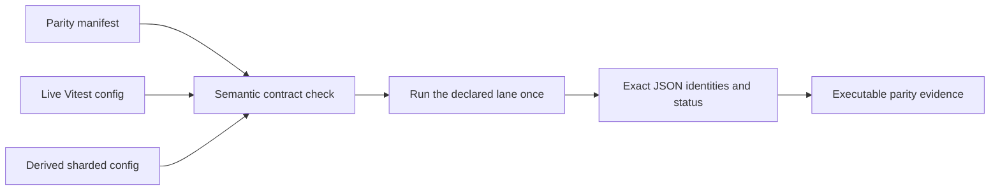

# Replace Vitest config hashes with executable parity contracts

## Goal capsule

- **Objective:** Replace broad `vitest.config.js` hashes with checks that prove each parity lane is selected, owned, executed, and passed.
- **Authority:** The manifest declares the evidence. The live runner configuration declares how Vitest runs it. The runner report proves the result.
- **Current baseline:** The repository has 37 required, available Vitest lanes. All 37 now have `react-parity` ownership.
- **Migration size:** Twenty-four manifests contain 28 references to `vitest.config.js` as a hashed support file.
- **Stop condition:** Fail if owned files and claimed files differ. Fail if two required Vitest lanes execute the same test identity.

## Problem

A hash of the complete `vitest.config.js` file answers one question:

> Did any byte in this file change?

It does not answer these questions:

- Does the named Vitest project exist?
- Does the project select the declared evidence file?
- Does the parity job own that file?
- Does ordinary sharded CI exclude that file?
- Did Vitest execute the declared test identity?
- Did the test pass exactly once?

The hash also reacts to unrelated changes. A timeout change for one package invalidates evidence in many other packages.

The replacement must check the execution contract directly. It must not store another digest of a normalized config object.

## Terms

- A **lane** is one executable unit in `react-parity.json`.
- An **evidence file** contains a declared parity test or supports that test.
- A **claimed file** is a test file for which a required lane accepts CI responsibility.
- An **owned file** is a test file that ordinary sharded CI removes for the parity job.
- A **test identity** is `(project, file, fullName)`.

These terms have one meaning throughout this plan.

A lane usually executes its claimed files with Vitest. A direct-runner lane can claim a Vitest wrapper that its Jest or Playwright run replaces.

## Proof model

No single check proves parity. The complete chain provides the proof.

| Claim | Evidence |
| --- | --- |
| The source and support inputs did not change without review. | SHA-256 hashes for direct evidence files, fixtures, setup files, inventories, and upstream records. |
| The lane points to a real runner. | A semantic check against the live Vitest project or the declared direct runner. |
| The runner selects the declared tests. | Exact file and test-name selection from the manifest or full-suite inventory. |
| The parity job owns the selected files. | Equality between the claimed file set and the `testExecution` owned file set. |
| Ordinary sharded CI does not repeat the work. | The derived sharded config omits or excludes the owned files. |
| The tests ran and passed. | The runner JSON report contains the exact expected identity multiset with `passed` status. |
| Two Vitest parity lanes do not repeat the same test. | A cross-lane identity check rejects duplicate `(project, file, fullName)` values. |
| The environment is reproducible. | The existing Node, package-manager, platform, architecture, and lockfile checks. |
| The React source claim is complete enough for its status. | The existing provenance, upstream-suite, inventory, and divergence checks. |

This proof has a clear boundary. It proves only the declared cases and full-suite inventories.

It does not prove that every possible React behavior has parity. The provenance status and coverage report describe that wider claim.



## Configuration model

The manifest remains the source for lane selection. `vitest.config.js` remains the source for runner configuration.

The implementation does not copy aliases, plugins, timeouts, or setup arrays into the manifest. That copy would create a second config source.

### Fully owned project

The parity job owns every test in this project:

```js
{
	testExecution: { group: 'react-parity' },
	test: {
		name: 'rxjs-differential',
		include: ['packages/rxjs/tests/differential/**/*.test.ts'],
		environment: 'jsdom',
		globalSetup: ['packages/rxjs/tests/differential/_setup.ts'],
	},
}
```

The matching manifest lane names the project and the exact test file:

```json
{
  "id": "rxjs-bind-differential",
  "type": "differential",
  "oracle": "required",
  "project": "rxjs-differential",
  "files": [
    {
      "path": "packages/rxjs/tests/differential/parity.test.ts",
      "role": "test",
      "sha256": "<test-file-sha256>",
      "cases": [
        {
          "id": "differential:bound-value",
          "testName": "bind renders current values and later emissions byte-identically",
          "fullName": "differential: @octanejs/rxjs vs real @react-rxjs/core bind renders current values and later emissions byte-identically"
        }
      ]
    }
  ]
}
```

The lane continues to hash its test, fixture, setup, and differential rig. It does not hash `vitest.config.js`.

### Mixed project

A mixed project needs file-level ownership:

```js
{
	testExecution: {
		group: 'react-parity',
		include: ['packages/react-error-boundary/tests/differential/parity.test.ts'],
	},
	test: {
		name: 'react-error-boundary-differential',
		include: ['packages/react-error-boundary/tests/differential/**/*.test.ts'],
	},
}
```

The parity lane claims `parity.test.ts`. The ordinary shard keeps `react-oracle.test.ts`.

Ownership is file-based. If one file contains parity and ordinary tests, split that file before assigning ownership.

### Full-suite lane

A full-suite lane gets its file and identity sets from its inventory:

```json
{
  "id": "example-adapted-full-suite",
  "type": "adapted-octane",
  "oracle": "required",
  "project": "example",
  "execution": {
    "kind": "vitest-full",
    "inventory": "packages/example/audit/adapted-runtime.json"
  }
}
```

The inventory supplies every expected `(file, fullName)` pair. The runner report must match that multiset exactly.

### Direct runners

TypeScript, Jest, and Playwright lanes keep their current execution objects. They do not use Vitest test selection.

A direct runner can still have a Vitest wrapper project. The Hook Form pristine lane is one example.

The validator treats a wrapper as owned when both conditions are true:

- the lane lists the wrapper file as evidence;
- the wrapper file matches a live Vitest project with `react-parity` ownership.

The parity job runs the direct runner. Ordinary CI does not run the wrapper again.

## Semantic validation logic

Add `scripts/react-parity/vitest-contract.mjs`. This module builds and checks one repository-wide execution model.

### 1. Load the inputs once

The validator loads these inputs:

- every discovered `packages/*/audit/react-parity.json` manifest;
- the base projects from `vitest.config.js`;
- the derived projects from `vitest.ci-sharded.config.js`;
- every referenced full-suite inventory.

The validator rejects duplicate Vitest project names before it checks lanes.

### 2. Classify each required lane

Use the current default for targeted Vitest lanes:

```js
function runnerKind(lane) {
	return lane.execution?.kind ?? 'vitest-cases';
}
```

Only required, available lanes take part in execution ownership.

Optional or unavailable lanes do not justify removing tests from ordinary CI.

### 3. Derive each lane's claimed files

```js
function claimedFiles(lane, inventory, project) {
	switch (runnerKind(lane)) {
		case 'vitest-cases':
			return lane.files.filter((file) => file.role === 'test').map((file) => file.path);
		case 'vitest-full':
			return inventory.files;
		case 'typescript':
			return [];
		case 'jest-full':
		case 'playwright-full':
			return lane.files
				.map((file) => file.path)
				.filter((file) => project && projectSelects(project, file));
	}
}
```

The last branch finds direct-runner wrappers. It does not turn Jest or Playwright evidence into a Vitest lane.

### 4. Check base project selection

For each claimed Vitest file, the validator checks these conditions:

1. `lane.project` names one live Vitest project.
2. A positive `test.include` pattern matches the file.
3. No negative `test.include` pattern matches the file.
4. No `test.exclude` pattern matches the file.

Use `node:path.matchesGlob` for the repository's Node 22 minimum. Keep the matching helper covered by focused tests.

This check reports the lane ID, project name, file, and failed pattern rule.

### 5. Build the owned file set

Discover the files selected by each owned project. Walk only the literal roots from its positive include patterns.

For a fully owned project:

```text
owned files = all files selected by project.test
```

For a scoped project:

```text
owned files = project files that match testExecution.include
```

Then build the claimed set from all required lanes that use the project.

The validator requires set equality:

```text
claimed files - owned files = empty
owned files - claimed files = empty
```

Each difference has a distinct error:

- A claimed but unowned file can run in both CI paths.
- An owned but unclaimed file has no parity executor and disappears from ordinary CI.

This two-way check protects mixed projects. It also prevents an overly broad ownership glob from dropping ordinary tests.

### 6. Check the derived shard view

The validator checks the actual output of `configureShardedProjects`.

- A fully owned project must not exist in the sharded view.
- A scoped project must remain in the sharded view.
- A scoped project must exclude every ownership pattern.
- The derived project must not contain the repository-only `testExecution` field.

The existing generic transformer test remains. Package lists do not belong in that test.

### 7. Reject cross-lane duplicate execution

Build the expected identity multiset for each required Vitest lane.

- A targeted lane uses its declared `file.cases[].fullName` values.
- A full-suite lane uses its runtime inventory.

Reject an identity when two different required lanes claim the same key:

```js
const key = `${lane.project}\0${file}\0${fullName}`;
```

Duplicate names inside one full-suite lane remain a multiset. The existing inventory summary records them, and the JSON check verifies their count.

The current checkout has one known cross-lane overlap. Hook Form runs this identity in its full lane and its targeted controller lane:

```text
packages/hook-form/tests/upstream/useController.test.tsx
useController should return a promise-like value from field.onInput
```

Remove the redundant `hook-form-adapted-controller` lane during migration. Bind its divergence to the existing full-inventory ID `runtime:7d5a9c5cc9ee98bc`.

### 8. Use execution as the final check

`react-parity:check` must not run a separate Vitest collection before each lane.

The current runner already supplies explicit files and test names. It also reads Vitest's JSON report.

Keep that flow and strengthen its repository-wide checks:

```js
const expected = expectedIdentities(lane);
const actual = identitiesFromVitestJson(report);

assertSameMultiset(actual, expected.map((test) => ({
	...test,
	status: 'passed',
})));
```

This check catches these failures:

- a declared test did not run;
- an undeclared test ran;
- a test ran more times than expected;
- a test was skipped, failed, or marked pending;
- a config change stopped the project from loading its required setup.

A harmless config change does not fail the check. For example, a larger timeout does not invalidate evidence if the exact tests still pass.

That behavior is intentional. The result matters; the config file version does not.

## Command behavior

### `pnpm react-parity:validate`

Keep this command cheap. It performs no test execution and no Vitest collection.

It checks:

- schemas and direct evidence hashes;
- inventories and provenance;
- environments and lockfile integrity;
- live project existence and file selection;
- two-way ownership equality;
- the derived sharded view;
- cross-lane identity overlap.

### `pnpm react-parity:check`

Run the same static checks first. Then execute every required, available lane once.

Use the runner report as both collection evidence and execution evidence. Do not add a second full run.

### `harness.mjs validate`

Keep explicit Vitest collection for local diagnosis. A developer can inspect one lane without running it:

```bash
node scripts/react-parity/harness.mjs validate \
  --manifest packages/rxjs/audit/react-parity.json \
  --lane rxjs-bind-differential
```

## Implementation units

### U1. Add the execution-contract model

- **Files:** `scripts/react-parity/vitest-contract.mjs` and `scripts/react-parity/vitest-contract.test.mjs`.
- **Goal:** Build claimed files, owned files, sharded files, and expected identities from repository data.
- **Tests:** Use small temporary fixtures. Do not hard-code current package names as the main regression test.
- **Negative cases:** Missing project, excluded evidence, missing ownership, broad ownership, orphan ownership, duplicate lane identity, and stale sharded output.
- **Controls:** Cover full ownership, scoped ownership, full inventories, direct-runner wrappers, and harmless config changes.

### U2. Connect validation to the parity commands

- **Files:** `scripts/react-parity/check.mjs`, `scripts/react-parity/harness-lib.mjs`, and focused tests.
- **Goal:** Run the semantic check once before validation or execution.
- **Approach:** Pass loaded manifests and configs into one validator. Do not reload the root config for each package.
- **Failure format:** Report the manifest path, lane ID, project, file, and failed rule.

### U3. Enforce one execution for each identity

- **Files:** The new validator, Hook Form manifest, Hook Form divergence marker, and focused harness tests.
- **Goal:** Reject cross-lane duplicate identities before CI starts expensive work.
- **Migration:** Remove the redundant Hook Form controller lane. Keep the case in the full-suite inventory.
- **Boundary:** Preserve valid duplicate titles inside one lane as a counted multiset.

### U4. Remove the broad config hashes

- **Files:** The 24 affected `packages/*/audit/react-parity.json` manifests.
- **Goal:** Remove all 28 `vitest.config.js` support entries.
- **Preserve:** Keep hashes for test files, fixtures, setup files, rigs, inventories, upstream snapshots, and classification records.
- **Cleanup:** Remove the stale RxJS note that says the lane stays outside `testExecution` until provenance is verified.
- **Schema:** No schema change is required because config support entries are optional today.
- **Generation:** Do not add a config-hash generator to `pnpm sync`.

### U5. Update the contract documentation

- **Files:** `docs/react-parity-testing.md` and focused command help when needed.
- **Goal:** Explain the proof chain and its boundary.
- **Required wording:** State that a config hash is not parity evidence. State that passing declared observations provides the behavioral evidence.
- **Examples:** Keep one fully owned project, one mixed project, one full inventory, and one direct runner.

## Verification plan

Run focused checks during implementation:

```bash
node --test scripts/react-parity/vitest-contract.test.mjs
node --test --test-name-pattern='derives sharded projects generically' scripts/ci-workflow.test.mjs
pnpm react-parity:validate
pnpm react-parity:test
```

Run representative lane checks for each execution shape:

```bash
node scripts/react-parity/harness.mjs run \
  --manifest packages/rxjs/audit/react-parity.json \
  --lane rxjs-bind-differential

node scripts/react-parity/harness.mjs run \
  --manifest packages/react-error-boundary/audit/react-parity.json \
  --lane react-error-boundary-reset-differential
```

Also run the ordinary React Error Boundary shard. It must keep its non-parity oracle test:

```bash
pnpm vitest run \
  --config vitest.ci-sharded.config.js \
  --project react-error-boundary-differential
```

Do not run the complete local Vitest suite for this change. Let CI execute all required parity lanes and the normal shard matrix.

Before push, run the repository-required generation and focused formatting commands:

```bash
pnpm sync
pnpm format:files scripts/react-parity docs/react-parity-testing.md packages/*/audit/react-parity.json
git diff --check
```

## Acceptance criteria

- No parity manifest hashes `vitest.config.js`.
- Every required, available Vitest lane names one live project.
- Every claimed file is selected by its base project.
- Claimed files and owned files are equal for every `react-parity` project.
- Fully owned projects disappear from the ordinary sharded config.
- Scoped projects keep all non-parity files in ordinary sharded CI.
- No two required Vitest lanes execute the same `(project, file, fullName)` identity.
- Every executed lane returns the exact expected identities with `passed` status.
- TypeScript, Jest, and Playwright lanes retain direct execution.
- `react-parity:validate` remains metadata-only and fast.
- `react-parity:check` does not add a second collection or execution pass.
- CI reports semantic failures with the owning lane and file.

## Definition of done

The repository no longer treats the byte version of `vitest.config.js` as parity evidence.

The manifest and live runner configuration form one checked execution contract. The parity job executes that contract once and verifies its exact result.

Ordinary sharded CI executes only tests that the parity job does not own.
