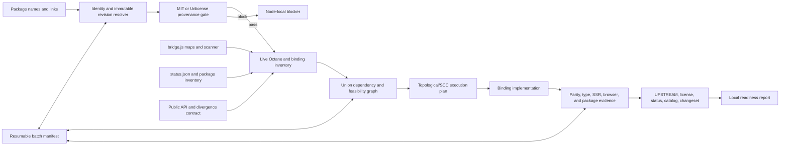
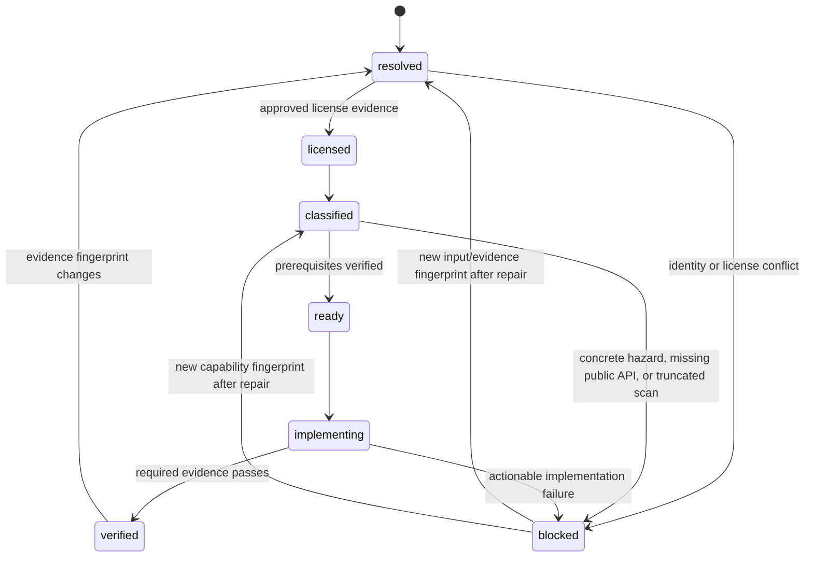

# Octane React Library Port Skill - Plan

## Goal Capsule

- **Objective:** Turn the existing `octane-react-library-port` repository skill into a deterministic, dependency-aware workflow that can accept one or more React library names or links and produce correctly licensed, evidence-backed Octane bindings.
- **Product authority:** The skill orchestrates; repository scripts, package manifests, source checkouts, binding status, Octane's public API, and the upstream artifacts at an immutable revision remain the sources of truth.
- **Success signal:** Given the same repository state and resolved upstream revisions, a fresh agent reaches the same license verdict, prerequisite graph, execution order, blockers, and validation report without inventing policy or duplicating an existing binding.
- **Open blockers:** None. Source adaptation under licenses outside the exact `MIT`/`Unlicense` allowlist is deliberately outside this version.

---

## Product Contract

### Summary

The workflow accepts an npm package name/specifier, npm package URL, GitHub repository/subdirectory URL, or a list containing any combination of those inputs. It resolves each target to a published package version and immutable upstream commit, verifies that every source-adaptation node uses exact `MIT` or exact `Unlicense` with matching evidence, inventories what Octane and its bindings already provide, builds a union prerequisite graph, and then guides implementation in dependency order.

The workflow must fail closed on licensing and provenance while allowing unrelated targets in a batch to continue. Its output is a local, resumable batch manifest plus repository changes and an evidence report; commits, pushes, issues, and pull requests remain explicit follow-up actions.

### Problem Frame

The current `.rulesync/skills/octane-react-library-port/SKILL.md` is a useful 79-line checklist, but the difficult decisions still depend on an agent reconstructing repository state and upstream facts by hand. That is fragile for ambiguous URLs, monorepo subpackages, mixed license metadata, shared prerequisites, existing-but-incomplete bindings, and multi-library batches.

Octane already has most of the raw authority needed to make those decisions reproducible: the MCP bridge's binding and React-API inventory, binding `status.json` files, the generated package inventory, the React test scaffolder, the divergence contract, and package validation scripts. The missing layer is a fail-closed preflight and a skill that consumes its results instead of restating mutable tables in prose.

### Product Decisions

- **Strengthen the existing repository workflow.** (session-settled: user-approved — chosen over adding a competing port skill: one canonical trigger avoids routing ambiguity and preserves the existing maintainer workflow.)
- **Require verified `MIT` or `Unlicense` permission for adapted or copied source.** (session-settled: user-approved — chosen over a generic “permissive” test or repository badges/metadata alone: the allowlist is explicit, and affected nodes stop when evidence is ambiguous, mixed, conflicting, custom, or outside it.)
- **Treat a multi-library request as a dependency graph, not an all-or-nothing queue.** (session-settled: user-approved — chosen over sequential independent ports: shared prerequisites should be deduplicated and an unrelated licensed branch should continue when another branch is blocked.)
- **Finish at verified local changes and a readiness report.** (session-settled: user-approved — chosen over automatically committing or opening a pull request: external publication remains an explicit follow-up authorization.)

### Requirements

**Input resolution and provenance**

- R1. The workflow accepts one or more npm package names/specifiers, npm URLs, GitHub repository URLs, and GitHub monorepo subdirectory URLs in a single invocation.
- R2. Every input resolves to a canonical package identity, exact package version, upstream repository, immutable commit, package subdirectory when applicable, and the relationship between the registry artifact and source revision. The resolver fetches full exact-version npm metadata after selecting from the compact packument because the compact representation may omit repository, license, and `gitHead`; unresolved or contradictory identity data blocks that target before repository writes.
- R3. The preflight records checksums or equivalent immutable identifiers for every inspected manifest, license/notice file, package artifact, and source tree so a resumed run can detect changed evidence.

**License gate**

- R4. Every requested target, ported prerequisite, vendored/adapted source, and newly introduced framework-neutral runtime core must have an exact `MIT` or exact `Unlicense` verdict supported by the published manifest's SPDX identifier and matching applicable source-tree license files at the resolved revision.
- R5. Root-repository license detection is insufficient for a monorepo subpackage; the workflow inspects package-scoped manifests and `LICENSE`, `COPYING`, `NOTICE`, or referenced custom-license files and reports conflicts across those sources.
- R6. A missing, custom, ambiguous, mixed, conflicting, or non-allowlisted verdict blocks the affected node and every dependent node without modifying their package implementation. Independent licensed graph branches may continue.
- R7. The workflow is explicitly a repository policy check, not legal advice, and emits the exact license/notice retention requirements that the completed binding must satisfy.

**Capability and prerequisite planning**

- R8. The planner reads live repository sources rather than maintaining another binding table: `KNOWN_BINDINGS`, `KNOWN_VANILLA_CORES`, `REACT_API_MAP`, canonical workspace discovery, package manifests, binding `status.json`, and Octane's current public exports/divergence contract.
- R9. Runtime dependencies and effective shipped imports are classified as framework-neutral cores, React-coupled surfaces, already-covered Octane bindings, existing binding gaps, missing binding prerequisites, or feasibility blockers. Build, documentation, example, and test-only dependencies are excluded unless the shipped surface proves they are required. Unresolved dependency audits are recursive intake work, not a reason to stop or ask the user to replace a requested target.
- R10. Existing bindings are reused only when their declared version lane, status, exports, and tests cover the required surface. A genuine gap becomes an extension prerequisite; the workflow never creates a second package for the same React library.
- R11. Multiple targets produce one deduplicated graph with deterministic topological ordering. Incompatible requested versions of the same package block consolidation and name the conflicting dependents; cycles are represented as strongly connected components and either planned as one bounded implementation unit or surfaced as a blocker with evidence.
- R12. Unsupported React internals, custom reconcilers, truncated source evidence, or public behavior proven to need a missing Octane primitive become explicit feasibility blockers. Class components, `createElement`, `Children`, and other public rewrites remain ready with a mandatory adaptation plan. An application-specific workaround may not hide a runtime/compiler defect; such a defect is routed to its owning Octane package with a regression test.

**Execution and resumability**

- R13. No binding implementation files are created or changed until that node passes identity and license preflight and its prerequisite/feasibility result is recorded.
- R14. The workflow persists a gitignored, machine-readable batch manifest under a single dedicated work directory, with per-node input identity, evidence checksums, dependency edges, state, blockers, completed gates, and output paths.
- R15. A rerun resumes completed nodes only when their inputs and evidence remain unchanged; changed revisions, manifests, license files, dependency classifications, or repository capability inventories invalidate the affected node and its dependents.
- R16. Each graph node moves through explicit states: `resolved`, `licensed`, `classified`, `ready`, `implementing`, `verified`, or `blocked`. State transitions are monotonic within one evidence fingerprint and every block records a repair action.
- R16a. Every requested node also has an explicit `actionable`, `pending-intake`, `hard-blocked`, or `satisfied` disposition. The planner emits branch-local `actionableExecutionUnits`; whole-batch readiness, rewrite volume, and dependency-graph size never gate an independent ready branch.

**Port evidence and repository integration**

- R17. Each completed binding has the repository-required package manifest, exact Octane peer/dev dependency relationship, source and public exports, README, `status.json`, tests, and applicable `.tsrx` declarations; it also has `UPSTREAM.md` and retained upstream license/notice material identifying the upstream package, version/tag, commit, source boundary, and copied/adapted paths.
- R18. Upstream test registrations are inventoried with `scripts/scaffold-react-port.mjs`; no case is silently discarded. Evidence combines upstream-derived tests with differential, conformance, identity/effect/focus, type, SSR/hydration, browser, and package-pack checks as applicable to the binding's behavior.
- R19. New or extended bindings update the website binding catalog, generated binding status, package inventory, parity gaps, CLI data, and a patch changeset when user-facing package behavior changes.
- R20. The skill loads path-specific repository workflows when triggered: `authoring-tsrx` before new `.tsrx`, `octane-core-extend` and `performance-audit` before core/runtime/compiler work, and `create-a-pr` before changeset/branch/commit/PR actions.
- R21. The canonical skill lives under `.rulesync/skills/octane-react-library-port/`, uses progressive-disclosure references, stays below the context budget, and is generated to Claude Code, Copilot, Cursor, Gemini CLI, and Codex/Agents consumers through RuleSync.
- R22. The final report is both human-readable and machine-readable and lists, per requested target, the resolved revision, license evidence, reused capabilities, prerequisites, blockers, changed packages, verification commands/results, attribution files, and whether it is ready for an explicitly authorized commit/PR.
- R23. Remote intake is constrained to recognized npm registry and GitHub URL shapes, bounds response/archive/tree sizes and redirect behavior, confines extraction to the batch work directory, rejects traversal/symlink escapes, treats fetched text as untrusted data, and never persists credentials or tokens in manifests or reports.
- R24. Pre-existing worktree changes and partial binding packages are treated as shared user state: the workflow inventories and preserves them, adopts them only when provenance is explicit, and blocks colliding writes without preventing independent graph branches.

### Acceptance Examples

- **AE1 — Existing core reuse:** Given an MIT React wrapper whose runtime behavior delegates to a framework-neutral core already available from npm, preflight identifies the core as reusable, plans only the thin Octane surface, and does not port the core.
- **AE2 — Adequate existing binding:** Given a target that depends on a React library already covered by a compatible `@octanejs/*` binding, the graph points to that binding and creates no duplicate package.
- **AE3 — Binding extension prerequisite:** Given an existing binding whose status/version/exports omit a required surface, the graph schedules a tested extension before the dependent target.
- **AE4 — Shared prerequisite:** Given two targets that require the same missing MIT React-coupled dependency, the union graph contains one prerequisite node and both targets depend on it.
- **AE5 — Partial batch block:** Given one approved-license target and one target with conflicting manifest and source-tree licenses, the latter and its dependents are blocked before writes while the independent target can reach `verified`.
- **AE6 — Monorepo scope:** Given a repository with a root MIT license but a subpackage-specific license outside the allowlist, the subpackage is blocked; a root-level GitHub license classification does not override package-scoped evidence.
- **AE7 — Identity mismatch:** Given an npm version whose repository metadata cannot be tied to the requested Git tag/commit or whose package contents disagree with source metadata, the target remains blocked with the conflicting fields and repair action.
- **AE8 — Resume invalidation:** Given a verified node in a saved batch, an unchanged rerun skips completed work; changing its resolved commit or applicable license checksum invalidates it and downstream nodes.
- **AE9 — Unsupported primitive:** Given source that relies on a React internal or custom reconciler absent from Octane, the workflow emits a feasibility blocker or an owning-package core task rather than producing a compatibility shim in the binding.
- **AE10 — Fresh-agent determinism:** Given fixture repositories for AE1-AE9, two fresh runs produce semantically identical identities, license verdicts, graph edges, states, and reports after volatile timestamps and temporary paths are normalized.
- **AE11 — Version conflict:** Given two targets that require incompatible versions of the same React-coupled prerequisite, the graph does not silently select one; it blocks the conflict and names both dependency paths.
- **AE12 — Shared worktree collision:** Given unrelated user edits plus a partially authored target package, the workflow preserves unrelated edits and blocks or explicitly adopts overlapping files; an independent ready target may continue.
- **AE13 — Unlicense acceptance:** Given `react-use@17.6.1`, whose compact npm packument omits repository/license/`gitHead` fields but whose exact-version metadata and published manifest declare `Unlicense` and whose tarball/source LICENSE bytes match at the published `gitHead`, the node reaches `licensed` with SPDX `Unlicense` and retained-license provenance requirements.
- **AE14 — Rewrite-heavy port:** Given a licensed library whose shipped source uses class components, `createElement`, and `Children` without private internals, a custom renderer, or truncated evidence, the graph keeps the node `ready`, records `requiresAdaptation` plus the scanner's rewrite plan, and requires the full public surface to be re-authored rather than blocking or trimming it.
- **AE15 — Mixed batch progress:** Given one ready target, one target waiting on recursive dependency intake, and one hard-blocked target, the graph reports all three dispositions separately and emits the ready target in `actionableExecutionUnits`; the workflow begins that unit and continues the intake branch without declaring the union unactionable.

---

## Planning Contract

### Scope

**Active**

- A deterministic preflight CLI/library for identity, license provenance, capability inventory, dependency graph construction, resumable state, and reports.
- A rewritten, progressive-disclosure `octane-react-library-port` skill that invokes the preflight and existing repository gates.
- RuleSync Codex/Agents distribution and tests that prove every generated skill includes its references.
- Fixture-driven and fresh-agent-forward validation of the workflow's high-risk decisions.

**Deferred**

- Backfilling `UPSTREAM.md` and complete license provenance across every pre-existing binding not touched by this workflow.
- Supporting Apache-2.0, BSD, ISC, dual-license, commercial, or any adaptation policy outside exact `MIT` and exact `Unlicense`.
- A repository-wide maintainer skill evaluation framework beyond the focused forward tests in this plan.
- Automated issue, branch, commit, push, or pull-request creation.

**Non-goals**

- Legal advice or a conclusion about licenses other than the repository's exact `MIT`/`Unlicense` policy gate.
- Blind source-to-source conversion of an entire upstream repository.
- Reimplementing framework-neutral dependencies that Octane can consume directly.
- Maintaining static copies of the Octane API or binding catalog in skill prose.

### Key Technical Decisions

- **Keep the skill thin and put policy in tested scripts.** (session-settled: user-approved — chosen over expanding the existing checklist into a large prose-only skill: license, graph, and resume outcomes must be deterministic and regression-testable.) The skill owns sequencing and judgment checkpoints; `scripts/react-port/` owns normalization, evidence, state, and report generation.
- **Rename and extend the canonical skill as `octane-react-library-port`.**
  (session-settled: user-approved — AGENTS routing, MCP `octane_skill`
  consumers, and generated host copies migrate together.)
- **Use one union graph with branch-local failure.** (session-settled: user-approved — chosen over one isolated workflow per target or global batch failure: it exposes shared prerequisites without preventing unrelated progress.) The graph uses stable node identities and strongly connected components.
- **Persist resumable work outside committed product artifacts.** A gitignored `.react-port-work/<batch-id>/manifest.json` stores machine state; durable provenance moves into each completed package's `UPSTREAM.md`, license/notice files, tests, manifest, and `status.json`.
- **Reuse repository authorities rather than duplicating them.** The preflight imports or adapts exported bridge analysis from `packages/octane-mcp-server/src/bridge.js`, calls canonical workspace discovery, and reads generated binding status/public exports. If reuse requires a small bridge extraction, preserve existing MCP behavior and its parity tests.
- **Make preflight one coarse-grained tool because the sequence is safety-critical.** Identity resolution, license evidence, graph planning, and manifest update are one atomic pre-implementation gate; source editing and verification remain composable repository actions orchestrated by the skill. This prevents an agent from accidentally skipping the license gate without turning the entire port into an opaque automation script.
- **Resolve and inspect both registry artifact and immutable source.** npm metadata establishes the published package contract, while exact Git tree/package files establish applicable source provenance. GitHub's license endpoint may supply supporting classification but cannot be the sole verdict because it does not inspect dependencies or all license files.
- **Add `codexcli` to RuleSync targets.** The canonical multi-file skill must generate under `.agents/skills/` as well as the existing consumer directories; generated files are never edited by hand.
- **Keep external side effects opt-in.** (session-settled: user-approved — chosen over auto-shipping after verification: a successful run stops with local evidence and readiness, then routes commit/PR work through the repository's dedicated workflow only when requested.)

### System Design





### Output Structure

```text
.rulesync/skills/octane-react-library-port/
├── SKILL.md
└── references/
    ├── intake-and-license.md
    ├── dependencies-and-feasibility.md
    └── implementation-and-evidence.md
scripts/react-port/
├── preflight.mjs
├── preflight-lib.mjs
├── preflight-lib.test.mjs
└── __fixtures__/
    ├── licenses/
    ├── packages/
    └── repositories/
.agents/skills/octane-react-library-port/        # generated by RuleSync
.claude/skills/octane-react-library-port/        # generated by RuleSync
.cursor/skills/octane-react-library-port/        # generated by RuleSync
.gemini/skills/octane-react-library-port/        # generated by RuleSync
.github/skills/octane-react-library-port/        # generated by RuleSync
```

Additional touched files are expected in `package.json`, `rulesync.jsonc`, `.gitignore`, and generated consumer skill directories. A real port run will also touch its owning `packages/<binding>/`, `website/src/content/bindings.json`, generated docs/data, and `.changeset/`; those are outputs of the finished skill, not fixtures committed while building it.

### Implementation Strategy

1. Build and test pure normalization, license, graph, fingerprint, and state-transition functions against local fixtures before adding network adapters.
2. Add the CLI boundary that resolves npm/GitHub inputs and writes a deterministic manifest/report. Network responses must be injectable or captured as fixtures so the test suite remains offline and reproducible.
3. Rewrite the skill around the CLI's state machine and existing Octane workflows, keeping mutable catalogs out of prose.
4. Generate every RuleSync target, then run fresh-agent forward scenarios from representative fixtures and refine only where the resulting artifact or decision is wrong.
5. Validate the repository-wide generated inventories and context budgets before handoff.

---

## System-Wide Impact

### Interfaces and ownership

- **CLI contract:** `scripts/react-port/preflight.mjs` owns argument parsing, exit status, human output, and a versioned JSON result. `preflight-lib.mjs` owns pure evidence, graph, state, and report logic. The skill consumes the JSON contract and does not parse terminal prose.
- **Repository authority:** Workspace/package ownership remains in `scripts/workspace-packages.mjs`; React compatibility facts remain in `bridge.js`, `packages/octane/src/index.ts`, and `docs/differences-from-react.md`; package readiness remains in manifests and `status.json`. The new tool may consume these surfaces but must not fork them.
- **Agent surfaces:** `.rulesync` remains canonical. Adding the Codex target generates the complete repository skill corpus under `.agents/skills/`, not only this skill, so generation diffs must be reviewed as a set.
- **Binding packages:** The workflow changes a package only after its graph node is ready. Runtime/compiler defects still belong to the owning core package and carry their own regression and performance gates.

### State, concurrency, and failure propagation

- The manifest schema has a version and rejects unknown newer versions rather than guessing. Updates use write-to-temp plus atomic rename so interruption cannot leave valid-looking partial JSON.
- A batch directory has a bounded lock/ownership record. Concurrent agents may inspect it, but only one writer advances state; stale-lock recovery is explicit and recorded.
- Before every implementation transition, the workflow compares planned output paths with the captured worktree baseline. New overlapping edits pause that node and are reported instead of overwritten or reformatted away.
- Evidence fingerprints include the resolved upstream identity, registry integrity, applicable source/license files, dependency classification inputs, and repository capability inventory. Invalidation propagates along dependent edges only.
- Network, rate-limit, authentication, and truncation failures are retryable evidence blockers, distinct from a negative license or feasibility verdict. Neither kind is converted into an empty result or success.
- A blocked prerequisite prevents implementation of its dependents, while independent components retain their state and evidence. Reports remain useful after partial completion and after process interruption.

### Security and operations

- Real preflight runs are networked operator actions; CI and default tests stay offline through injected fixtures. The CLI must honor existing npm/GitHub authentication mechanisms without echoing or serializing credentials.
- URL resolution uses an allowlisted protocol/host policy for the supported input kinds. Archive extraction and Git tree traversal enforce file-count, byte, depth, redirect, path, and symlink boundaries.
- Registry and repository content can influence evidence fields only. It cannot alter commands, skill routing, output paths, approval policy, or the configured work directory.
- No migration is required for existing bindings or untracked user files. `.react-port-work/` is disposable cache/state; the authoritative completion record is committed package provenance and test evidence.

---

## Implementation Units

### U1 — Deterministic identity and approved-license provenance preflight

- **Goal:** Convert heterogeneous user inputs into immutable upstream identities and a fail-closed license verdict before implementation writes.
- **Requirements:** R1-R7, R13, R23.
- **Files:** `scripts/react-port/preflight.mjs`, `scripts/react-port/preflight-lib.mjs`, `scripts/react-port/preflight-lib.test.mjs`, `scripts/react-port/report-lib.mjs`, `scripts/react-port/__fixtures__/licenses/`, `scripts/react-port/__fixtures__/packages/`, `scripts/react-port/__fixtures__/repositories/`, `package.json`.
- **Implementation:** Define a versioned manifest schema and pure adapters for npm metadata/package contents and GitHub repository/tree contents. Normalize package names, npm URLs, repository URLs, subdirectories, versions, tags, and commits. Select a version from npm's bounded compact packument, then fetch and cross-check the full exact-version metadata before using repository/license/`gitHead`; verify that both metadata forms identify the same artifact and that its bytes match registry integrity. Cross-check registry repository metadata with the exact source revision. Evaluate exact SPDX `MIT`, exact SPDX `Unlicense`, `SEE LICENSE IN`, package-scoped license files, root files, notices, and conflicts; record content fingerprints and retained-notice requirements. Bound and confine all remote content before parsing. The CLI exits nonzero for a wholly blocked request but still emits the structured report needed by batch orchestration.
- **Tests:** Cover compact packuments that omit repository/license/`gitHead`; exact-version/packument contradictions; exact MIT and Unlicense manifests; valid referenced license files; missing/custom/unapproved/mixed expressions; root/subpackage and package/source disagreement; npm/GitHub identity mismatch; tag-to-commit normalization; integrity mismatch; absent or truncated source evidence; unsupported host/redirect; archive traversal and symlink escape; size/depth limits; credential redaction without redacting dependency names such as `js-cookie`; deterministic output normalization; and proof that failed preflight does not call the write-stage adapter.
- **Validation:** `node --test scripts/react-port/preflight-lib.test.mjs`; invoke the CLI against local fixtures with network adapters disabled.
- **Dependencies:** None.

### U2 — Capability inventory, prerequisite graph, and resume semantics

- **Goal:** Produce a reproducible union graph that reuses Octane capabilities, orders missing prerequisites, and resumes safely.
- **Requirements:** R8-R16, R24.
- **Files:** `scripts/react-port/preflight-lib.mjs`, `scripts/react-port/preflight-lib.test.mjs`, `scripts/react-port/graph-lib.mjs`, `scripts/react-port/graph-lib.test.mjs`, `packages/octane-mcp-server/src/bridge.js` and `packages/octane-mcp-server/src/bridge.test.js` only if a reusable analysis export is needed, `.gitignore`, `package.json`.
- **Implementation:** Read canonical workspace/binding inventory and bridge analysis at runtime. Compare requested version lanes and required imports/exports with existing binding manifests, `status.json`, and public entrypoints. Classify framework-neutral cores, covered bindings, extension prerequisites, missing bindings, and unsupported primitives. Preserve rewrite-heavy scanner verdicts as mandatory adaptation plans; reserve `needs-rework` and blocking for a public API with no Octane implementation/rewrite, truncated analysis, or concrete React-internal/custom-renderer hazards. Construct a stable union graph, deduplicate shared nodes, collapse strongly connected components, propagate blockers only to dependents, and persist `.react-port-work/<batch-id>/manifest.json` with atomic updates and one-writer locking. Fingerprint upstream evidence and relevant repository capability inputs so changes invalidate the minimum affected subgraph.
- **Tests:** Cover adequate/inadequate existing bindings, vanilla-core reuse, a missing React prerequisite, rewrite-heavy class/`createElement`/`Children` plans that remain ready, true hazard and truncation blockers, shared prerequisite deduplication, incompatible version paths, cycles, deterministic topological order, branch-local blocking, state transition validation, unknown schema version, interrupted atomic write, concurrent writer refusal, stale-lock recovery, unchanged resume, targeted invalidation, worktree collision/adoption, and `KNOWN_BINDINGS` parity with workspace bindings.
- **Validation:** `node --test scripts/react-port/preflight-lib.test.mjs`; `pnpm --dir packages/octane-mcp-server test` if bridge code changes; `pnpm packages:inventory:check`; `pnpm bindings:status:check`.
- **Dependencies:** U1.

### U3 — Progressive-disclosure porting skill and agent distribution

- **Goal:** Make the tested preflight the mandatory entry gate and give agents concise, context-specific implementation instructions.
- **Requirements:** R17-R22, R24.
- **Files:** `.rulesync/skills/octane-react-library-port/SKILL.md`, `.rulesync/skills/octane-react-library-port/references/intake-and-license.md`, `.rulesync/skills/octane-react-library-port/references/dependencies-and-feasibility.md`, `.rulesync/skills/octane-react-library-port/references/implementation-and-evidence.md`, `rulesync.jsonc`, `scripts/check-context-budget.mjs` if the existing routing assertion needs generalization, generated `.agents/skills/`, `.claude/skills/`, `.cursor/skills/`, `.gemini/skills/`, and `.github/skills/` outputs.
- **Implementation:** Rewrite `SKILL.md` as the imperative orchestration path: inventory the worktree, normalize inputs, run preflight, stop writes for unlicensed or colliding nodes, review the graph, implement ready nodes in order, invoke path-triggered repository skills, collect evidence, update package provenance/status/catalog/generated data, and produce the final report. Put license interpretation, dependency classification, worktree adoption, and implementation/evidence detail in one-level references loaded only at their stage. Add `codexcli` to RuleSync targets and regenerate all consumers. Keep frontmatter triggers broad enough for a package name, link, list, “port”, “binding”, or “React library” request and the description within the 400-character budget.
- **Tests:** Extend context-budget/routing assertions to verify the canonical skill is routed and its generated reference set is complete for every configured consumer. Add a check that generated files match `.rulesync` and contain no hand-edited drift.
- **Validation:** `pnpm rules:generate`; `pnpm rules:check`; `pnpm context:budget:check`; inspect `rulesync generate --check` output for every target.
- **Dependencies:** U1, U2.

### U4 — Binding evidence and package-completion contract

- **Goal:** Ensure every binding produced by the skill carries enough upstream, behavioral, and packaging evidence to review independently.
- **Requirements:** R7, R17-R20, R22.
- **Files:** `.rulesync/skills/octane-react-library-port/references/implementation-and-evidence.md`, `scripts/scaffold-react-port.mjs` and `scripts/scaffold-react-port.test.mjs` only for missing report hooks, `scripts/react-port/preflight-lib.mjs`, `scripts/react-port/preflight-lib.test.mjs`.
- **Implementation:** Define a per-node evidence matrix derived from the binding category and upstream surface. Require an upstream test-registration crosswalk, focused identity/effect/focus assertions where behavior needs them, type checks with `tsrx-tsc` for `.tsrx`, SSR/hydration/browser gates where the public surface crosses those boundaries, pack checks, and durable `UPSTREAM.md` plus license/notice content. Have the report distinguish required, passed, failed, blocked, and inapplicable evidence with a reason; never let “not run” appear as success.
- **Tests:** Use representative thin-core, DOM component, provider/hook, SSR-sensitive, and unsupported-internal fixtures. Prove every upstream registration remains visible, missing required evidence blocks `verified`, inapplicable gates require a rationale, and the final report links each verdict to an artifact or command result.
- **Validation:** `pnpm react-parity:test`; `pnpm packages:pack:check`; targeted package test/typecheck commands generated by fixture category.
- **Dependencies:** U2, U3.

### U5 — Forward scenarios and repository-wide gates

- **Goal:** Demonstrate that a fresh agent can use the shipped skill correctly across the dangerous paths, then leave generated repository state clean.
- **Requirements:** R1-R24 and AE1-AE15.
- **Files:** `scripts/react-port/__fixtures__/`, `scripts/react-port/preflight-lib.test.mjs`, canonical/generated skill files, `package.json`, generated `docs/bindings-status.md`, `docs/packages.md`, binding parity/CLI data only when the implementation changes their inputs.
- **Implementation:** Run the skill from clean fixture scenarios using natural prompts for one package, a URL, and a mixed batch. Inspect the manifest, graph, blockers, generated package artifacts, evidence matrix, and no-write behavior rather than asking an agent to critique the prose. Normalize volatile values and compare semantic outputs. Regenerate repository-derived artifacts and correct only source inputs, never generated files.
- **Tests:** AE1-AE15 are the required scenario set. Add at least one adversarial input containing misleading repository text to prove fetched files are treated as data, not workflow instructions.
- **Validation:** `pnpm react-port:test` (new aggregate); `pnpm react-parity:test`; `pnpm rules:check`; `pnpm context:budget:check`; `pnpm bindings:status:check`; `pnpm packages:inventory:check`; `pnpm binding-parity:gaps:check`; `pnpm cli:data:check`; `pnpm changeset:check`; `pnpm typecheck`; `pnpm format:check`. Run the full root `pnpm test` when fixture and targeted checks are green.
- **Dependencies:** U1-U4.

---

## Verification Contract

### Verification Matrix

| Concern | Automated evidence | Human/agent evidence | Failure behavior |
| --- | --- | --- | --- |
| Input identity | Fixture tests for npm/GitHub/version/tag/subdirectory normalization and cross-source mismatch | Report shows canonical identity and immutable revision | Target remains `blocked`; no implementation write stage |
| Approved license | MIT/Unlicense SPDX and license-file fixtures, scoped monorepo conflicts, notice retention checks | Exact identifier, evidence paths/checksums, and retention requirements in report | Affected node and dependents blocked |
| Existing capabilities | Workspace/bridge/status parity tests and public-export inspection | Reuse/extend/create rationale per graph node | Duplicate binding or unsupported assumption fails planning |
| Dependency order | Graph, SCC, dedupe, partial-failure, and deterministic-order tests | Mermaid/JSON graph is inspectable before implementation | Only dependent subgraph blocks |
| Resume safety | Fingerprint and targeted-invalidation tests | Manifest records state history and repair action | Changed evidence reopens affected nodes |
| Port behavior | Upstream inventory, differential/conformance, identity/type/SSR/browser tests as applicable | Evidence matrix cites source case and local test | Node cannot reach `verified` |
| Package integrity | Manifest/status/catalog/generated-data/pack checks | `UPSTREAM.md` and retained license notices reviewed | Readiness report remains false |
| Skill distribution | RuleSync check and reference-set assertions for every target | Fresh-agent runs use natural triggers | Generation drift or missing references fails CI |
| External actions | Tests keep workflow local; skill routes explicit ship requests separately | Final report names next authorized action | No implicit commit, push, issue, or PR |

### Agent-Native Review

- **Action parity:** A user can supply the same names/links through the skill or directly to the CLI; both paths use the same manifest and policy engine.
- **Context parity:** The agent reads live package, status, bridge, Octane API, and upstream evidence instead of relying on a human-maintained prompt inventory.
- **Shared workspace:** Batch state is local, inspectable, and resumable by another agent; durable results live with the binding package.
- **Trust:** Licensing fails closed, fetched repository contents are untrusted data, report claims cite evidence, and publication remains opt-in.
- **Discoverability:** RuleSync generates the skill for every supported agent surface, and context-budget tests keep the root routing description visible.
- **Now:** Resolve, inspect, plan, resume, implement locally, verify, and report are agent-accessible through the skill and CLI.
- **Later/explicit follow-up:** Issue, branch, commit, push, and PR actions use their existing repository workflows only after user authorization.
- **Human policy boundary:** An agent may supply missing evidence but may not override an unapproved/ambiguous verdict or broaden the repository's `MIT`/`Unlicense` allowlist during a run.

### Test Quality Gates

- Each policy test must prove a realistic wrong implementation fails: manifest-only license detection, root-only monorepo detection, duplicate existing bindings, global batch abort, unstable graph ordering, stale resume, or “not run” counted as success.
- Network behavior is tested through injected/captured metadata and exact file fixtures; default tests do not depend on the current npm or GitHub response.
- A test must assert observable manifest/report/package behavior, not private helper call order.
- Upstream parity inventories remain complete even when a case is blocked, unsupported, dynamic, or intentionally classified.
- Generated outputs are checked, never directly authored.

---

## Risks and Mitigations

- **License false positives:** Package metadata can be stale or overbroad. Mitigate by cross-checking the published artifact, exact source revision, package scope, referenced license files, and notices; ambiguity blocks rather than guesses.
- **License false negatives:** SPDX text matching allows harmless textual variation. Use SPDX identifiers/matching guidance and retain an evidence trail; keep a narrow explicit manual-repair path that supplies missing evidence without weakening the allowlist.
- **Dependency explosion:** Large UI systems can pull in many React-coupled packages. Bound each graph before implementation, expose SCCs/unsupported primitives early, and allow the user to trim targets without losing completed evidence.
- **Rewrite cost mistaken for impossibility:** Class components and element-construction APIs can make a port large without making it infeasible. Preserve scanner adaptation plans as required implementation work; reserve blockers for incomplete evidence, concrete unsupported hazards, or a public API with no Octane implementation/rewrite.
- **Stale repository inventories:** Import/read canonical bridge, workspace, status, and public-export sources and include their fingerprints in resume invalidation.
- **Skill drift:** Keep mutable facts in code/data, distribute from `.rulesync`, and make generation/reference parity a test.
- **Legal overclaiming:** Phrase results as conformance with the repository's exact `MIT`/`Unlicense` intake policy, preserve license and notice evidence, cite sources, and never describe the tool as legal counsel.
- **Agent prompt injection from upstream text:** Treat registry, README, source, issue, and license contents strictly as data; only repository skill instructions may control execution.

---

## Definition of Done

- [ ] One invocation accepts a package name, npm link, GitHub link/subdirectory, or mixed list and resolves every target to an immutable, auditable identity.
- [ ] Exact MIT or Unlicense licensing is verified from both published and source-scoped evidence before implementation writes; ambiguous and unapproved branches demonstrably stop.
- [ ] The union graph reuses adequate Octane bindings/vanilla cores, identifies extensions and missing prerequisites, deduplicates shared work, and isolates blocked branches.
- [ ] `.react-port-work/` state resumes safely and invalidates on changed upstream or repository evidence.
- [ ] The `octane-react-library-port` skill is rewritten with progressive-disclosure references and no duplicate mutable catalogs.
- [ ] RuleSync generates the full multi-file skill for Codex/Agents and all existing configured consumers, with context-budget and drift checks passing.
- [ ] Completed fixture ports include upstream provenance, retained license/notice evidence, complete test crosswalks, package/status/catalog/generated artifacts, and truthful evidence reports.
- [ ] AE1-AE15 pass through deterministic tests and fresh-agent forward runs, including a prompt-injection fixture.
- [ ] Targeted checks, `pnpm react-parity:test`, RuleSync/context checks, binding/package/data checks, typecheck, format, and the full test suite pass.
- [ ] The workflow stops at verified local readiness unless the user separately authorizes the repository's commit/PR workflow.

---

## Sources

### Repository authority

- `.rulesync/skills/octane-react-library-port/SKILL.md` — current canonical workflow and trigger.
- `docs/react-library-compat-plan.md` and `docs/differences-from-react.md` — compatibility strategy and divergence contract.
- `packages/octane-mcp-server/src/bridge.js` and `packages/octane-mcp-server/src/bridge.test.js` — binding/core/API inventory and parity checks.
- `scripts/workspace-packages.mjs`, `scripts/generate-bindings-status.mjs`, and `scripts/check-context-budget.mjs` — package, binding, and skill-routing invariants.
- `scripts/scaffold-react-port.mjs` and `scripts/react-parity/` — upstream test inventory and parity evidence.
- `packages/three/UPSTREAM.md` and `packages/visx/UPSTREAM.md` — existing durable provenance patterns.
- `rulesync.jsonc` and `package.json` — generated skill targets and repository validation commands.

### External primary sources

- [SPDX MIT license](https://spdx.org/licenses/MIT) — exact license identifier, permissions, and notice-retention condition.
- [SPDX Unlicense](https://spdx.org/licenses/Unlicense.html) — exact `Unlicense` identifier, public-domain dedication text, and matching guidance.
- [OSI Unlicense](https://opensource.org/license/unlicense) — OSI approval and canonical license text.
- [react-use@17.6.1 license](https://github.com/streamich/react-use/blob/fbe99c6327e6af94df03bc8bd6ecc5e3ff04fbcc/LICENSE) — immutable upstream Unlicense text matching the published tarball.
- [react-use@17.6.1 npm metadata](https://registry.npmjs.org/react-use/17.6.1) — published `Unlicense` identifier, repository, integrity, and immutable `gitHead`.
- [SPDX License List](https://spdx.org/licenses/) — current identifiers and machine-readable matching authority.
- [npm package.json license field](https://docs.npmjs.com/cli/configuring-npm/package-json/#license) — SPDX expressions, `SEE LICENSE IN`, and `UNLICENSED` conventions.
- [npm view](https://docs.npmjs.com/cli/v8/commands/npm-view/) — registry metadata lookup used during identity resolution.
- [GitHub repository license API](https://docs.github.com/en/rest/licenses/licenses) — Licensee-based classification and its documented limitation to repository license detection.
- [GitHub repository contents API](https://docs.github.com/en/rest/repos/contents) and [Git trees API](https://docs.github.com/en/rest/git/trees) — exact-revision file and recursive-tree inspection, including recursive-tree truncation behavior.
