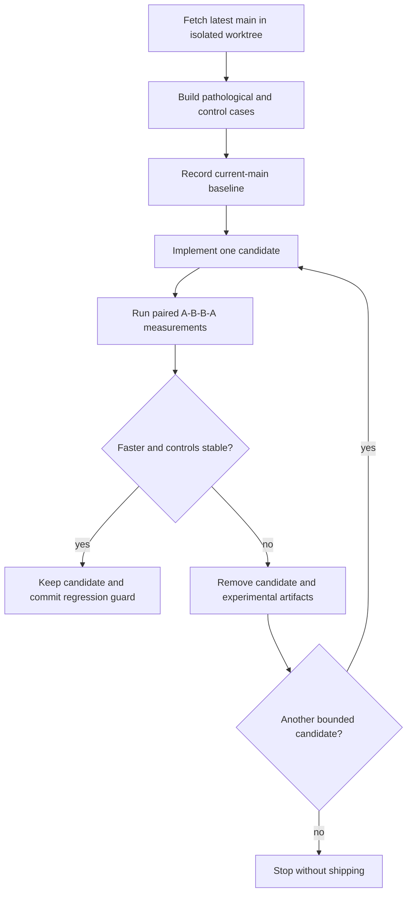
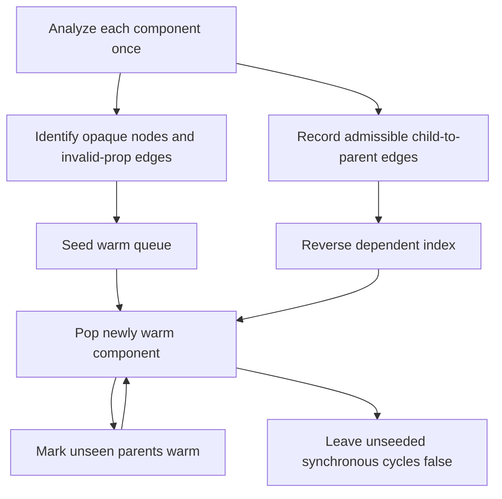

# TSRX Warm Reachability Propagation - Plan

## Goal Capsule

- **Objective:** Large TSrX modules with deep component graphs compile faster without changing fetch-tree warming behavior or generated semantics.
- **Means:** Prove and replace declaration-order-dependent whole-module warm-reachability rescans with incremental reverse-edge propagation, subject to the measurement gate in KTD1.
- **Authority:** The user request and repository instructions override this plan. Product Requirements override implementation details. Key Technical Decisions govern implementation mechanics.
- **Execution profile:** Start from the latest `origin/main` in a dedicated worktree because the current checkout overlaps merged compiler performance work.
- **Stop conditions:** Discard a candidate when paired measurements do not show a repeatable speedup. Move to the next bounded compiler candidate. Stop without shipping when the candidate ladder has no reproducible performance defect.
- **Tail ownership:** The LFG pipeline owns commit, push, PR creation, and current-head CI after implementation and review gates pass.

---

## Product Contract

### Summary

Remove accidental repeated compiler work from one TSrX analysis path and retain only a change that produces a measured speedup on current `main`.

### Problem Frame

`classifySameModuleWarmPotential` computes whether a same-module component can reach async or opaque work. Its current fixed-point loop scans every component after each newly discovered warm descendant. A root-first chain with one opaque leaf can therefore advance one hop per whole-module pass, making compile cost depend on declaration order for reasons unrelated to the emitted program.

Recent compiler performance PRs already addressed generated-name allocation (#850), nesting-diagnostic deduplication (#857), memo-witness propagation (#859), and component-hoist reference indexing (#863). This plan excludes those paths and targets a distinct fixed point that remains on current `main`.

### Requirements

**Performance proof**

- R1. Establish a current-`main` baseline that reproduces a material declaration-order penalty in a deep same-module component graph with an opaque or async leaf.
- R2. Retain an implementation only when paired A/B measurements show a repeatable pathological-case speedup outside the observed run-to-run noise and its declaration-order ratio passes a committed ceiling that the original implementation fails.
- R3. Keep the matched dependency-first control free of a repeatable regression outside the observed run-to-run noise.
- R4. Remove an unsuccessful candidate and its experimental artifacts before evaluating the next candidate.

**Compiler correctness**

- R5. Preserve warm-reachability results for opaque descendants, fully synchronous graphs, recursive cycles, and call sites that do not own a child's required props.
- R6. Preserve diagnostics, emitted behavior, source locations, and parser AST immutability.
- R7. Bound new compile-time bookkeeping to the component nodes and graph edges analyzed by the owning pass.

**Scope and provenance**

- R8. Base implementation and measurements on the latest fetched default branch in an isolated worktree.
- R9. Do not duplicate the compiler areas changed by PRs #850, #857, #859, or #863.
- R10. Ship one proven compiler optimization with focused regression coverage, benchmark evidence, documentation, and an Octane patch changeset.

### Acceptance Examples

- AE1. **Covers R1, R2, R5.** Given a root-first chain whose leaf reaches opaque work, when current `main` and the candidate compile the same source in alternating order, then the candidate preserves every expected warm edge and produces a repeatable speedup larger than the measured noise band.
- AE2. **Covers R3, R5.** Given the same graph declared dependency-first, when the candidate compiles it, then correctness assertions pass and repeated measurements show no control regression outside the measured noise band.
- AE3. **Covers R5, R6.** Given a fully synchronous cycle with no opaque seed, when the candidate compiles it, then no component becomes warm-reachable solely because of recursion and generated semantics match current `main`.
- AE4. **Covers R4.** Given a candidate whose paired results fall inside benchmark noise or regress the control, when the gate is evaluated, then its code and benchmark-only artifacts are removed before the next candidate begins.

### Scope Boundaries

**In scope**

- The primary candidate is warm-reachability propagation in `packages/octane/src/compiler/compile.js`.
- If the primary candidate fails R2 or R3, the bounded fallback order is local auto-memo hazard propagation in `compile.js`, then custom dependency-hook discovery in `packages/octane/src/compiler/hook-deps.js`.
- Only the first candidate that satisfies the performance and correctness requirements ships.

**Outside this work**

- Generated-name allocation, nesting diagnostics, memo-witness propagation, and component-hoist indexing already covered by recent PRs.
- Runtime scheduling, SSR behavior changes, and new public APIs.
- Unrelated compiler cleanup or combining multiple optimizations in one PR.
- A benchmark-only PR when no compiler change produces a measured improvement.

---

## Planning Contract

### Key Technical Decisions

- KTD1. **Measure before and after every candidate.** Build the pathological and control cases first, record the exact `origin/main` revision, and alternate baseline/candidate process order. R2 and R3 decide whether the candidate survives.
- KTD2. **Propagate warm reachability from seeds through reverse edges.** Index each admissible child-to-parent relationship once, seed parents whose edge is already opaque or fails required-prop ownership, and process each newly warm component through a queue. This preserves false synchronous cycles because a cycle without a seed never enters the queue.
- KTD3. **Extend the existing TSrX component-graph benchmark when it can isolate the defect.** Add opaque-leaf declaration-order variants and semantic assertions to `benchmarks/tsrx-component-graph/` instead of creating a parallel harness. Create a focused suite only if the existing generator cannot express the candidate without weakening its current witness and hoist controls.
- KTD4. **Pin analysis semantics at both small and large scales.** Focused compiler tests cover cycles, opaque descendants, and required-prop ownership. The large benchmark verifies diagnostics and the emitted warm-plan shape before timing a sample.
- KTD5. **Keep the change compilation-local.** Reverse indexes, queues, and seen state exist only during compilation and scale with the analyzed graph. No parser AST node is mutated.
- KTD6. **Use a bounded fallback ladder.** If warm reachability fails the measurement gate, repeat KTD1 against auto-memo local hazards and then custom dependency-hook discovery. Stop after those candidates when no reproducible defect remains.

### High-Level Technical Design

The performance gate controls whether any candidate becomes product work:

The primary algorithm changes graph evaluation, not the reachability rule:

### Assumptions

- A root-first graph with one opaque leaf triggers the current whole-module fixed point strongly enough to satisfy R1. If it does not, KTD6 applies.
- The existing `tsrx-component-graph` harness can add an opaque-leaf pair while preserving its current live-witness and component-hoist controls.
- Component binding names remain unique keys within `ctx.componentInfo`, as required by the existing analysis maps.
- `ce-work` will refetch `origin/main` immediately before creating the implementation worktree so planning-time repository movement cannot make the base stale.

### Risks and Mitigations

- **Edge-specific required-prop checks can be flattened incorrectly.** Treat a call site that fails ownership as an immediate warm seed, and add reverse propagation only for admissible edges. Cover both outcomes in focused tests.
- **Cycles can be over-promoted.** Seed-driven queue processing must leave a closed synchronous cycle false. Add a cycle with no seed and a cycle that reaches an opaque node.
- **Recent compiler optimizations can mask the baseline.** Compare against the exact fetched `origin/main`, alternate process order, and record both pathological and control results.
- **A transient reverse index increases compiler memory.** Keep it local to the pass and proportional to graph edges. Do not retain AST copies or add runtime metadata.

### Sources and Research

- `packages/octane/src/compiler/compile.js`: `classifySameModuleWarmPotential`, `warmCallsiteOwnsRequiredProps`, and the existing incremental auto-memo propagation pattern.
- `benchmarks/tsrx-component-graph/run.mjs`: current 2,400-component declaration-order harness with semantic witness and hoist assertions.
- `benchmarks/baselines/ratios.json`: existing declaration-order ratio guard conventions.
- `packages/octane/tests/parallel-use.test.ts`: fetch-tree warming semantics for nested, opaque, mutable, and prop-dependent component paths.
- Recent overlap exclusions: PRs #850, #857, #859, and #863.

---

## Implementation Units

### U1. Reproduce and guard the warm-reachability penalty

- **Goal:** Add a correctness-gated benchmark case that exposes the primary fixed-point cost on current `main`.
- **Requirements:** R1, R2, R3, R5, R8, R9; AE1, AE2.
- **Dependencies:** None.
- **Files:** `benchmarks/tsrx-component-graph/run.mjs`, `benchmarks/tsrx-component-graph/README.md`, `benchmarks/baselines/ratios.json`, `benchmarks/baselines/local/tsrx-component-graph.json`.
- **Approach:** Extend the existing graph generator with matched root-first and leaf-first opaque-leaf variants. Assert diagnostics, graph shape, and emitted warm artifacts before accepting timing samples. Record exact main and candidate revisions in the evidence notes. Do not commit a ratio guard until the candidate satisfies KTD1.
- **Execution note:** Establish and retain the failing current-`main` performance control before changing compiler code.
- **Patterns to follow:** Existing paired declaration-order variants in `benchmarks/tsrx-component-graph/run.mjs` and scaling notes in `benchmarks/tsrx-nesting-diagnostics/README.md`.
- **Test scenarios:**
  - Covers AE1. Compile a root-first deep graph with an opaque leaf and require zero diagnostics plus the expected reachable warm-plan shape before recording time.
  - Covers AE2. Compile the matched dependency-first graph and require the same semantic assertions before recording time.
  - Compile the existing live-import variants and preserve their witness and component-hoist counts so the new case cannot weaken prior guards.
  - Run the committed ratio against unmodified `origin/main` and confirm that the old fixed-point path breaches the new ceiling.
- **Verification:** The baseline demonstrates R1, every benchmark sample passes semantic controls, and the harness can compare exact main and candidate checkouts without source drift.

### U2. Propagate warm reachability incrementally

- **Goal:** Remove declaration-order-dependent rescans while preserving the compiler's warm-plan classification.
- **Requirements:** R2, R3, R5, R6, R7; AE1, AE2, AE3.
- **Dependencies:** U1.
- **Files:** `packages/octane/src/compiler/compile.js`, `packages/octane/tests/parallel-use.test.ts`.
- **Approach:** Replace only the fixed-point portion of `classifySameModuleWarmPotential` according to KTD2 and KTD5. Reuse the existing component metadata and call-site ownership predicate. Keep the initial per-component AST analysis unchanged unless profiling proves it is the actual bottleneck.
- **Execution note:** Preserve generated output with characterization tests before replacing the propagation loop.
- **Patterns to follow:** The reverse-dependent queue used by incremental auto-memo witness propagation in `packages/octane/src/compiler/compile.js`.
- **Test scenarios:**
  - Covers AE1. A small root-first chain ending in an imported or otherwise opaque child marks every ancestor warm-reachable and retains nested fetch warming.
  - Covers AE2. The same chain declared dependency-first produces the same warm-plan classification.
  - Covers AE3. A recursive same-module cycle with only synchronous work stays excluded from warming.
  - A recursive cycle that reaches one opaque descendant propagates warm reachability to every component that can reach the seed.
  - A child with required props remains synchronous when the call site owns every required field.
  - The same child becomes warm-reachable when a call site omits or cannot prove ownership of a required field.
  - Existing mutable-component and nested fetch-tree tests retain their start order, adoption count, and terminal output.
- **Verification:** Focused compiler and runtime tests pass, AST immutability remains intact, generated semantics match the characterization fixtures, and U1 satisfies R2 and R3.

### U3. Evaluate the bounded fallback candidates when required

- **Goal:** Continue the search without shipping the primary change when warm-reachability propagation does not produce a measured win.
- **Requirements:** R1, R2, R3, R4, R5, R6, R7, R8, R9; AE2, AE4.
- **Dependencies:** U1 and the failed measurement gate from U2.
- **Files:** `packages/octane/src/compiler/compile.js`, `packages/octane/src/compiler/hook-deps.js`, `packages/octane/tests/auto-memo.test.ts`, `packages/octane/tests/compiler/auto-hook-deps.test.ts`, and a candidate-specific benchmark under `benchmarks/` only while that candidate is active.
- **Approach:** Revert the unsuccessful primary implementation and its candidate-only benchmark artifacts. Evaluate local auto-memo hazard propagation first, then custom dependency-hook discovery. For each candidate, characterize its fixed-point semantics, construct matched pathological and control sources, measure unmodified current `main`, implement one incremental propagation change, and apply KTD1. Keep only the first candidate with a repeatable speedup and a durable current-main-failing guard; stop when neither fallback reproduces a performance defect.
- **Execution note:** Never retain code, tests, or benchmark registration from a rejected candidate. If no fallback survives the gate, end the task without a branch, changeset, or PR.
- **Patterns to follow:** The primary candidate's A/B/B/A evidence protocol and the focused auto-memo and auto-hook dependency tests named above.
- **Test scenarios:**
  - Covers AE4. A rejected warm-reachability candidate leaves no compiler or benchmark diff before auto-memo hazard work begins.
  - A deep local-call graph that propagates one new auto-memo hazard per pass demonstrates whether declaration order causes a repeatable penalty while matched shallow and dependency-first controls remain stable.
  - If auto-memo hazard propagation does not survive the gate, a deep custom-hook call graph demonstrates whether hook discovery advances one callable per pass while a matched direct-hook control remains stable.
  - The selected fallback preserves recursive-cycle behavior, parser AST immutability, diagnostics, and emitted dependency or memo semantics.
- **Verification:** One fallback satisfies R2 and R3 against the exact base revision, or both fail reproducibly and the final diff is empty apart from the planning artifact.

### U4. Finalize durable performance and release evidence

- **Goal:** Integrate the proven optimization into repository performance gates and package release metadata.
- **Requirements:** R2, R3, R4, R8, R10; AE4.
- **Dependencies:** U2 when the primary candidate satisfies KTD1; otherwise U3 when a fallback candidate satisfies KTD1.
- **Files:** The selected benchmark's ratio and local-baseline entries, its README, and `.changeset/<generated-performance-name>.md`; conditionally `benchmarks/README.md` and `packages/octane-mcp-server/src/index.js` only when the final candidate creates a new benchmark suite.
- **Approach:** Commit only the benchmark registration and MCP exposure required by the final suite shape. Document the exact baseline/candidate revisions, paired results, correctness controls, and threshold rationale. Add an Octane patch changeset. Omit manifest or MCP changes when U1 extends the already-registered suite without a new public benchmark name.
- **Patterns to follow:** Performance evidence and MCP exposure from PRs #857 and #859, without reusing their optimized paths.
- **Test scenarios:**
  - Covers AE4. Confirm the final diff contains no code or benchmark artifacts from rejected candidates.
  - Run the new ratio guard against current `main` and confirm it fails for the reproduced defect.
  - Run the same guard against the final candidate and confirm it passes across repeated quick and normal samples.
  - Run the complete existing `tsrx-component-graph` suite and preserve every previous target and semantic assertion.
  - If the benchmark manifest changes, verify the MCP benchmark listing and invocation resolve the final suite.
- **Verification:** Repository benchmark discovery is current, the final ratio guard distinguishes main from the candidate, package metadata is synchronized, and all required release artifacts describe only the shipped optimization.

---

## Verification Contract

| Gate | Command or evidence | Done signal |
|---|---|---|
| Exact base | `git rev-parse origin/main` plus the worktree base commit | The worktree begins at the latest fetched default-branch commit and contains no unrelated branch commits. |
| Paired performance | Candidate-specific A/B/B/A benchmark runs against exact main and the worktree | The pathological speedup is repeatable and larger than the observed noise band, the control has no repeatable regression outside that band, and repeated runs agree on direction. |
| Durable ratio | `node benchmarks/bench.mjs --quick --ratios tsrx-component-graph` and a normal-iteration confirmation | The final candidate passes the committed ceiling and unmodified main fails it. |
| Focused behavior | `pnpm exec vitest run packages/octane/tests/parallel-use.test.ts` plus the focused test file for any fallback candidate | Warm start order, cycle classification, prop ownership, diagnostics, and output assertions pass. |
| Compiler regression | `pnpm exec vitest run packages/octane/tests/compiler packages/octane/tests/auto-memo.test.ts` | Compiler and auto-memo suites pass without weakened assertions. |
| Types and format | `pnpm typecheck:files` and `pnpm format:files:check` over the final diff | Changed files typecheck and match repository formatting. |
| Generated metadata | `pnpm sync` | Generated inventories are current and any generated changes are committed. |
| Repository gate | `pnpm test`, current-head CI, and `git diff --check` | Relevant local tests pass, CI is green, and the final diff has no whitespace errors. |

---

## Definition of Done

- The final worktree is based on the latest fetched `origin/main` and excludes the stale `fix/tsrx-compiler-perf` commit.
- The final change does not overlap the optimized paths from PRs #850, #857, #859, or #863.
- One candidate satisfies R2 and R3 with paired revision-pinned evidence.
- Current main fails the new performance guard and the final candidate passes it.
- All correctness scenarios for the selected candidate pass without changing public or runtime semantics.
- The final diff contains focused compiler code, regression tests, durable benchmark evidence, documentation, and the required patch changeset.
- `pnpm sync`, scoped formatting, scoped typechecking, relevant tests, and current-head CI pass.
- Every rejected candidate and abandoned benchmark experiment has been removed from the final diff.
- The open PR records the measured improvement, baseline and candidate revisions, controls, risk, and agent-authored provenance.
