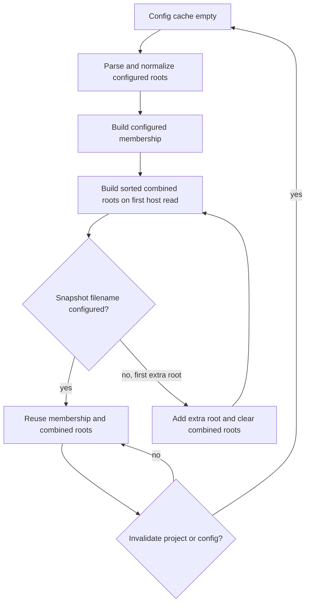

# Cache Text Type Project Roots - Plan

## Goal Capsule

- **Objective:** Developers using TypeScript-backed TSrX text inference keep warm rebuild latency stable as unrelated configured project roots grow.
- **Means:** Cache configured-root membership and the sorted language-service root list for the lifetimes defined by KTD1 and KTD2.
- **Authority:** The user request, the current `createTextTypeProject` contract, the Octane core engineering standard, and measured same-machine evidence in that order.
- **Execution profile:** Establish the scaling baseline first. Keep the change only if the candidate improvement exceeds observed variance and preserves returned text facts.
- **Stop conditions:** Do not ship a semantic change, a stale root cache, or an optimization without a trustworthy large-root signal. If the baseline falsifies the hypothesis, remove the abandoned work and select a different non-overlapping performance target.
- **Tail ownership:** The implementation owner carries the validated diff through a current-base pull request and green required CI.

---

## Product Contract

### Summary

Make warm text-type snapshots stop paying repeated linear membership checks and root-list reconstruction when the project root set has not changed.

### Problem Frame

`createTextTypeProject` normalizes the configured root files once, but each public snapshot scans that array with `includes`. Its TypeScript language-service host also rebuilds, deduplicates, and sorts the combined configured and extra roots whenever the host asks for script filenames. Large applications therefore repeat work proportional to unrelated project size during warm compiler activity even though the root set changes only on config reload or first use of an extra root.

The optional text-facts service performs much more expensive semantic work when inputs change. Cached snapshots should not retain avoidable project-size cost after that work is stable.

### Requirements

**Warm-path performance**

- R1. A cached snapshot of a configured file must not linearly scan all configured roots.
- R2. The language-service host must reuse the same sorted root-list value until configured or extra root membership changes.
- R3. The large-root benchmark must demonstrate a candidate improvement beyond observed same-machine variance while returning the same text facts as the control.

**Root-set correctness**

- R4. Configured roots and explicitly snapshotted extra roots must remain visible to the TypeScript project once each, with the same deterministic ordering as before, including when a formerly extra root later enters the configured include set.
- R5. Adding the first snapshot for an extra root must refresh the root list and invalidate semantic proofs exactly once for that membership change.
- R6. Whole-project and file-specific invalidation must reload config-derived membership before the next snapshot, matching the existing config reload contract.
- R7. Filename spelling, source overlay, project version, and disposal behavior must remain unchanged.

**Delivery boundaries**

- R8. The change must not alter public APIs, generated JavaScript, text-fact serialization, or TypeScript compiler options.
- R9. The pull request must not duplicate the recent performance work on Vite asset walks, scheduler depth prefixes, router dispatch, compiler hoist and memo propagation, TSRX nesting diagnostics, host-prop sorting, streaming boundary scans, form diagnostics, hydration templates, behavior queues, or deopt lists.
- R10. If the root-scaling baseline does not support the hypothesis, this candidate must be abandoned rather than shipped as speculative cleanup.

### Success Criteria

- The large configured-root case improves by more than the measured run-to-run noise against the exact `origin/main` baseline.
- The same-run large-to-small warm-snapshot ratio loses its prior root-count scaling and stays within the reviewed ratio guard.
- All benchmark variants return identical stable facts for the target source and report the same configured semantic control.

### Scope Boundaries

- The active scope is root membership and root-list lifetime inside `createTextTypeProject`, its behavioral coverage, and a durable benchmark guard.
- The work does not optimize TypeScript diagnostics, virtual TSX mapping, project-version hashing, ordinary Octane compilation, or bundler integration.

#### Deferred to Follow-Up Work

- Other text-facts hot paths may be audited only after this candidate lands or is falsified. They must not be bundled into the same pull request without independent evidence.

---

## Planning Contract

### Key Technical Decisions

- KTD1. **Cache data at its owning lifetime.** Build configured-root membership beside the parsed config and lazily cache the sorted, deduplicated combined roots. The parsed config remains the authority for both values, while exact-string deduplication preserves the existing configured-plus-extra semantics across config reloads.
- KTD2. **Invalidate only on membership changes.** Clear both config-derived caches when config is invalidated. Clear only the combined root-list cache when a new extra root is added. Ordinary source changes must not rebuild an unchanged root set.
- KTD3. **Use a scaling benchmark with semantic controls.** Compare repeated warm snapshots in small-root and large-root projects after service warmup. The harness must support an alternate checkout root so baseline and candidate use the same fixture and runner.
- KTD4. **Keep the optimization private.** Do not expose cache state or test-only instrumentation. Behavioral tests protect invalidation semantics, and the benchmark protects cost.

### Assumptions

- TypeScript or Volar requests the script root list often enough during warm snapshots for repeated allocation and sorting to be measurable in addition to the confirmed linear membership scan.
- The configured file list is immutable while the parsed config cache is live.
- A large synthetic root list with trivial files is representative of the project-size component of this cost even though it does not model all semantic-analysis workloads.

### High-Level Technical Design

The cache lifecycle follows the same boundaries that already own config and semantic-service invalidation.

| Event | Config membership | Combined roots | Semantic service |
| --- | --- | --- | --- |
| Repeated configured snapshot | Reuse | Reuse | Reuse |
| First extra-root snapshot | Reuse | Rebuild lazily | Invalidate |
| Existing extra-root snapshot | Reuse | Reuse | Reuse |
| Whole or file-specific invalidation | Rebuild lazily | Rebuild lazily | Recreate |
| Dispose | Release | Release | Dispose |

### Risks & Dependencies

- A missed invalidation would leave TypeScript with stale roots, while a config reload that forgets to deduplicate retained extra roots would change the project version and could duplicate language-service work. Coverage must exercise config inclusion changes and first-use extra roots through the public API.
- A benchmark dominated by TypeScript initialization would hide the target cost. Warmup and timed cached snapshots must be separate phases.
- A new cache retains one membership set and one root array per live text-type project. This duplicates references, not path strings, and must be released on disposal.

### Sources & Research

- `packages/octane/src/compiler/typescript.js` owns the text-type project, config cache, extra roots, language-service host, and invalidation lifecycle.
- `packages/octane/tests/compiler/typescript-text-inference.test.ts` establishes config reload, overlay, filename, project-version, and disposal behavior.
- `benchmarks/compiler-throughput/README.md`, `benchmarks/tsrx-component-graph/README.md`, and `benchmarks/README.md` establish Node-only timing, alternate-checkout, semantic-control, and ratio-guard conventions.
- PR #785 introduced TypeScript text inference and its current root handling. No recent user-authored performance pull request changes `packages/octane/src/compiler/typescript.js`.

---

## Implementation Units

### U1. Add the text-type root scaling benchmark

- **Goal:** Create a reproducible warm-snapshot harness that can validate or falsify the root-scaling hypothesis before runtime code changes.
- **Requirements:** R3, R9, R10; KTD3.
- **Dependencies:** None.
- **Files:**
  - Create `benchmarks/text-type-roots/README.md`.
  - Create `benchmarks/text-type-roots/run.mjs`.
  - Modify `benchmarks/bench.mjs`.
- **Approach:**
  1. Generate isolated small-root and large-root TypeScript projects outside the measured interval.
  2. Initialize `createTextTypeProject`, warm the language service, then time repeated cached snapshots with alternating variant order.
  3. Accept an alternate source-root environment variable so the exact harness can measure `origin/main` and the candidate checkout.
  4. Publish timing statistics plus root count, stable fact checksum, source version, and project version as semantic metadata.
- **Execution note:** Run the unchanged harness against `origin/main` before modifying `packages/octane/src/compiler/typescript.js`. If large-root warm cost does not exceed the small-root control beyond noise, stop this candidate and remove its abandoned diff.
- **Patterns to follow:** `benchmarks/tsrx-component-graph/run.mjs` for alternate-checkout A/B measurement and `benchmarks/lib/stats.mjs` for sample summaries.
- **Test scenarios:**
  - A small configured-root project warms successfully, then repeated snapshots return one stable fact checksum and valid string-child evidence.
  - A large configured-root project performs the same semantic work and reports the same target facts while differing only in unrelated root count.
  - An invalid iteration count or failed fact assertion produces a failed benchmark payload and non-zero exit.
  - An alternate checkout root loads that checkout's source compiler without changing the generated fixture.
- **Verification:** The benchmark emits valid machine-readable results, proves semantic equality, and shows whether warm cost scales with configured root count on `origin/main`.

### U2. Cache configured membership and combined roots

- **Goal:** Remove project-size work from unchanged warm snapshots while preserving every root-set transition.
- **Requirements:** R1, R2, R4, R5, R6, R7, R8; KTD1, KTD2, KTD4.
- **Dependencies:** U1.
- **Files:**
  - Modify `packages/octane/src/compiler/typescript.js`.
  - Modify `packages/octane/tests/compiler/typescript-text-inference.test.ts`.
- **Approach:**
  1. Derive configured-root membership from the normalized file list when config loads.
  2. Lazily retain the sorted configured-plus-extra root list used by the language-service host.
  3. Clear the combined list when a new extra root is admitted.
  4. Clear config-derived state when either invalidation form drops the parsed config, and release retained state during disposal.
- **Patterns to follow:** Keep cache ownership beside the existing `config`, `extraRoots`, and `disposeService` state. Preserve the comments that define config reload and exact filename semantics.
- **Test scenarios:**
  - Repeated snapshots of a configured `.tsrx` file return the same facts and project version.
  - The first snapshot of a valid file outside the configured include set adds it as an extra root and yields its text facts.
  - Repeating the extra-root snapshot does not change its project version without a source or config change.
  - Updating the config include set followed by whole-project invalidation makes the next snapshot use the new configured roots.
  - A file first admitted as an extra root and later added to the configured include set remains present once after invalidation; its project version matches a fresh equivalent project without retained extra-root history.
  - File-specific invalidation continues to reload an extended config and preserves existing strict-null-check behavior.
  - Case-insensitive filesystems continue to bind returned facts to the exact requested filename spelling.
  - Disposal remains idempotent and rejects later snapshot or invalidation calls.
- **Verification:** Targeted compiler tests pass, the public return values stay byte-for-byte stable for unchanged inputs, and no test-only cache access is introduced.

### U3. Lock in the measured improvement and release note

- **Goal:** Turn the validated candidate into a durable performance guard and a publishable patch.
- **Requirements:** R3, R8, R10; KTD3.
- **Dependencies:** U1, U2.
- **Files:**
  - Modify `benchmarks/baselines/ratios.json`.
  - Create `benchmarks/baselines/local/text-type-roots.json`.
  - Create `.changeset/cache-text-type-project-roots.md`.
- **Approach:**
  1. Re-run the final candidate after self-review using the same warmup, iteration count, runner options, and machine state as baseline.
  2. Record the candidate result and add a reviewed same-run scaling guard with variance headroom.
  3. Document the user-visible compiler performance improvement as an Octane patch changeset without promising an unsupported absolute latency.
- **Patterns to follow:** Use existing compiler benchmark baselines and the patch-track changeset convention for `octane`.
- **Test scenarios:**
  - The quick ratio run passes for the candidate and would reject the measured `origin/main` scaling behavior.
  - The benchmark checksum and fact metadata remain identical after the optimization.
  - A workload with few configured roots shows little or no improvement, confirming the change removes project-size work rather than shifting unrelated cost.
- **Verification:** The final benchmark result is newer than the final code edit, the ratio guard has documented noise headroom, and the changeset describes only measured behavior.

---

## Verification Contract

| Gate | Applies to | Done signal |
| --- | --- | --- |
| Exact baseline/candidate benchmark | U1-U3 | Same harness and fixture show a large-root improvement beyond variance, with identical semantic metadata. |
| `node benchmarks/bench.mjs --quick --ratios text-type-roots` | U1, U3 | Harness correctness and the same-run scaling guard pass. |
| `pnpm exec vitest run packages/octane/tests/compiler/typescript-text-inference.test.ts` | U2 | Text-facts behavior, invalidation, filename, and disposal coverage pass. |
| `pnpm format:files:check` on changed paths | U1-U3 | All authored files match repository formatting. |
| `pnpm typecheck:files` on changed paths | U2-U3 | Source and test types pass the scoped repository typecheck. |
| `pnpm sync` | U3 | Generated inventories and synchronized artifacts are current and included when changed. |
| Relevant full repository and CI gates | U1-U3 | Required tests and current-head pull request checks are terminal and successful. |

The performance claim is valid only when the large-root candidate delta exceeds observed variance and the final large-to-small ratio stays inside the reviewed guard. If either condition fails, R10 applies.

---

## Definition of Done

- U1 is complete when the benchmark reproduces or falsifies the root-count scaling hypothesis on unmodified `origin/main` with semantic controls intact.
- U2 is complete when cached root state follows every config, extra-root, invalidation, and disposal transition in R4-R7.
- U3 is complete when the final candidate measurement, local baseline, ratio guard, and patch changeset agree on the demonstrated improvement.
- The branch contains no abandoned instrumentation, failed candidate code, temporary fixtures, or unrelated changes.
- The branch is based on the live default branch, synchronization is current, and the pull request has no conflicts.
- Required and relevant CI is green on the current pushed head, and all actionable review feedback is resolved.
