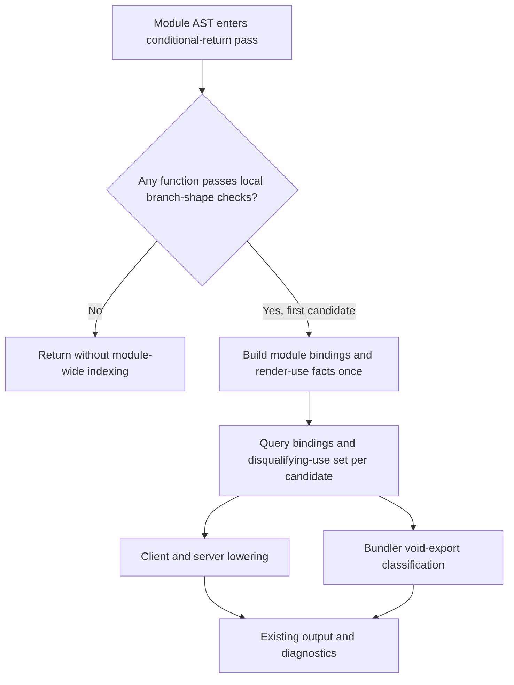

# Index JSX Return Uses - Plan

## Goal Capsule

- **Objective:** Developers spend less time waiting for component-heavy TSRX modules to compile, with no change to rendered behavior, diagnostics, or public compiler output.
- **Means:** Replace per-candidate whole-module usage scans in conditional JSX return lowering with one lazy module-scoped index (KTD1, KTD2, KTD3).
- **Authority:** The user request and repository engineering rules override this plan. Current compiler source and tests override summaries. Measured evidence overrides the optimization hypothesis.
- **Execution profile:** Start from current `origin/main` in the isolated worktree. Establish a baseline before editing the compiler. Keep only a candidate that produces a stable, guarded improvement.
- **Stop conditions:** Abandon this candidate if the exact-main benchmark does not expose adverse scaling or if the candidate cannot preserve classification and emitted results. Resume the TSRX audit with a different bottleneck instead of shipping a speculative change.
- **Tail ownership:** Open a focused pull request, run current-head CI, and fix relevant failures until the required checks pass.

---

## Product Contract

### Summary

Reduce accidental compile-time scaling in TSRX modules that contain many React-style conditional JSX return components. Keep the optimization distinct from the recent compiler performance work on generated names, nesting diagnostics, memo witnesses, component-hoist references, warm reachability, and TypeScript project roots.

### Problem Frame

Conditional JSX return lowering proves that each eligible function is used only as a component before converting value-returning branches into template control flow. The current proof calls `moduleOnlyRendersComponent` once per eligible component. Each call rebuilds wrapper metadata and walks the full module AST, so an ordinary module with many eligible components repeats the same lexical classification work and trends quadratically.

The compiler runs this lowering for client and server output, while bundler export classification repeats the same per-declaration proof. The repeated work exists for implementation convenience rather than because the proof depends on the candidate component.

### Requirements

**Performance proof**

- R1. Deliver a measured TSRX compiler speedup by removing avoidable repeated work from a real compiler path.
- R2. Commit a deterministic scaling guard that fails on exact pre-change `origin/main` and passes on the candidate with semantic controls intact.
- R3. Reject this candidate and continue the audit if measurement does not validate the hypothesis.

**Compatibility**

- R4. Preserve current conditional-return eligibility for client compilation, server compilation, HMR compilation, and bundler void-export classification.
- R5. Preserve current diagnostics, authored locations, output behavior, and conservative treatment of ambiguous or value-position component references.

**Scope and delivery**

- R6. Do not duplicate the recent performance pull requests opened by `jonkwheeler`.
- R7. Base the work on the latest default branch in a separate worktree and ship it through a focused pull request with green relevant CI.

### Success Criteria

- Exact-main A/B evidence shows the new scaling guard catches the repeated-scan implementation.
- The candidate passes the guard with enough margin to distinguish the improvement from timing noise.
- Focused behavioral and compiler tests preserve conditional-return classification across permitted render uses and disqualifying value uses.
- The final diff contains no abandoned benchmark experiments or unrelated compiler cleanup.

### Scope Boundaries

In scope:

- Conditional JSX return analysis in the Octane compiler and its bundler mirror.
- Focused behavior and classification coverage for the indexed proof.
- A dedicated Node-only TSRX compilation benchmark, ratio guard, benchmark inventory, and release metadata.

Out of scope:

- Auto-memo witness propagation, warm reachability, component-hoist reference indexing, generated-name allocation, nesting diagnostics, TypeScript text-project roots, or other areas covered by recent performance PRs.
- Changes to which conditional return forms are eligible for lowering.
- Runtime optimizations, emitted helper ABI changes, or parser AST mutation.
- Reusing `tsrx-component-graph`, because open PR #872 changes that benchmark and a separate workload gives this claim an independent guard.

---

## Planning Contract

### Key Technical Decisions

- KTD1. **Index disqualifying value uses once.** Walk the module in the same conservative positions as `moduleOnlyRendersComponent`, collect identifier names seen in disallowed value positions, and answer each candidate with set membership. Preserve the existing blindness to tag positions, declaration identifiers, export specifiers, static property names, and bare identifiers passed to Octane `memo` or `lazy`.
- KTD2. **Build module facts lazily.** Create the module-level bindings, wrapper-local set, and disqualifying-use index only after a function passes the local conditional-return shape checks. Modules without an eligible candidate must not pay for another full AST walk.
- KTD3. **Share only compilation-local analysis.** Reuse one lazy analysis state across all candidates in a compiler or bundler pass. Do not retain state across files, compilations, invalidations, or HMR generations.
- KTD4. **Make falsification part of the benchmark contract.** Compare two component counts with identical conditional-return semantics, validate diagnostics and classification before accepting samples, and add a normalized scaling ratio. Record absolute timings and a same-scale ineligible control so the result separates repeated eligibility scans from parse/print cost. The committed threshold must fail on exact `origin/main` and pass repeated candidate runs with a noise margin.
- KTD5. **Preserve the parser AST.** Build side metadata without annotating or rewriting adopted AST nodes. Conditional-return lowering remains copy-on-write.

### Assumptions

- The selected repeated module scan is the first candidate, not a settled fact. U1 must disprove or confirm it before U2 changes production code.
- A module-level set of disqualifying identifier names is equivalent to rerunning the current candidate-specific walker because allowed and disallowed positions do not depend on the candidate name.
- Existing conservative false negatives, including same-spelling identifiers in nested scopes, remain conservative false negatives rather than becoming new eligibility.
- A dedicated `tsrx-jsx-return-branches` benchmark avoids coupling this work to the active warm-reachability PR and gives the performance claim a narrow semantic control.

### High-Level Technical Design

The analysis cache belongs to one module pass. The first eligible candidate initializes it. Later candidates query the same facts in constant expected time instead of walking the module again.

### Risks and Mitigations

- **Eligibility drift:** A too-permissive index could lower a directly called component and change its value ABI. Preserve the exact traversal exclusions and add mixed permitted/disqualifying reference cases in compiler and runtime tests.
- **Common-path regression:** Eager indexing could slow modules with no eligible conditional returns. Keep initialization behind the existing local structural gates and include an ineligible control in measurement or focused profiling.
- **Compiler/bundler divergence:** Updating only the main compiler would make cross-module void-output classification disagree. Share the indexed proof shape across both call sites and test both surfaces.
- **Noisy timing evidence:** Whole compile timings include parsing, printing, and unrelated passes. Use large/small normalized cost, alternating sample order, warmups, and semantic validation before every accepted sample.
- **Concurrent branch movement:** `origin/main` may advance while the task runs. Refresh before creating the branch and before final verification, then resolve only relevant conflicts without importing another performance PR's scope.

---

## Implementation Units

### U1. Characterize conditional-return scaling and classification

- **Goal:** Establish a pre-change performance failure and pin the eligibility contract before production edits.
- **Requirements:** R2, R3, R4, R5, R6.
- **Dependencies:** None.
- **Files:**
  - `benchmarks/tsrx-jsx-return-branches/run.mjs`
  - `benchmarks/tsrx-jsx-return-branches/README.md`
  - `packages/octane/tests/compiler/bundler-compiler.test.ts`
  - `packages/octane/tests/jsx-return-branches.test.ts`
  - `packages/octane/tests/_fixtures/jsx-return-branches.tsx`
- **Approach:**
  1. Generate component-heavy modules at two scales where each component has eligible conditional JSX returns and only permitted render/export uses.
  2. Validate zero diagnostics, expected exported component classification, and stable client/server output facts before timing a sample.
  3. Give the runner an explicit compiler-root override, following the existing TSRX benchmark pattern, so the same harness and generated workload can measure exact `origin/main` and the candidate without copying code between worktrees.
  4. Record an exact-main baseline with warmups, alternating sample order, repeated runs, absolute timings, and a same-sized structurally ineligible control that bounds unavoidable parse/print cost.
  5. Add focused mixed-use coverage where tag use and Octane wrapper use stay eligible, while direct calls, prop-value use, and ambiguous same-spelling references stay on the value path.
- **Execution note:** Establish the failing ratio guard or equivalent adverse scaling evidence before changing `packages/octane/src/compiler/compile.js`. If the signal is absent, stop this candidate and choose another bottleneck.
- **Patterns to follow:** `benchmarks/tsrx-nesting-diagnostics/run.mjs`, `benchmarks/tsrx-component-graph/run.mjs`, and the behavioral assertions in `packages/octane/tests/jsx-return-branches.test.ts`.
- **Test scenarios:**
  - Compile the small and large eligible-module variants and require the same per-component semantic counts with zero diagnostics.
  - Compile the same-scale ineligible control and require its semantic facts to remain stable while using its timing only to bound non-target compiler work.
  - Classify multiple exported conditional-return components whose only references are JSX tags or exports and require all to remain void-output candidates.
  - Pass an eligible component as a bare argument to locally aliased Octane `memo` or `lazy` and require it to remain eligible.
  - Directly call one conditional-return component while rendering another and require only the called component to stay on the value path.
  - Use a component identifier as a prop value or member-expression receiver and require conservative disqualification.
  - Exercise client mount/update/unmount plus server-render/hydration behavior for the mixed eligible and ineligible fixture.
- **Verification:** Exact-main evidence exposes a stable scaling defect, and the focused tests describe current behavior before production code changes.

### U2. Replace per-candidate module walks with lazy indexed facts

- **Goal:** Make conditional-return eligibility work scale with the module AST plus candidate queries instead of the product of both.
- **Requirements:** R1, R3, R4, R5.
- **Dependencies:** U1.
- **Files:**
  - `packages/octane/src/compiler/compile.js`
  - `packages/octane/src/compiler/bundler.js`
  - `packages/octane/tests/compiler/bundler-compiler.test.ts`
  - `packages/octane/tests/jsx-return-branches.test.ts`
- **Approach:**
  1. Refactor the current render-only walker into a module analysis that collects disqualifying identifier names while preserving each existing positional exclusion from KTD1.
  2. Add a lazy module-state holder that separately caches module-level bindings, Octane wrapper locals, and disqualifying uses only when a local candidate reaches the relevant gate.
  3. Reuse the state across `lowerJsxReturnBranchComponents` candidates and across declarations in `findVoidComponentExports`.
  4. Keep exported helper compatibility for any caller that does not provide shared state, and keep every AST rewrite copy-on-write.
- **Patterns to follow:** Compilation-local lazy maps and sets in `packages/octane/src/compiler/compile.js`; copy-on-write lowering in `lowerNullishComponentExits`; compiler/bundler decision symmetry around `hasLowerableJsxReturnBranches`.
- **Test scenarios:**
  - Run every U1 mixed-use scenario against the indexed implementation with identical eligibility.
  - Compile a module with no structurally eligible conditional-return component and confirm behavior and diagnostics remain unchanged.
  - Compile a module where the first candidate is ineligible after local analysis and a later candidate requires module facts; require the later candidate to classify correctly.
  - Compile the same fixture in client, server, development/HMR, and production modes and compare output plus diagnostics with the pre-change baseline.
  - Run randomized modules containing allowed and disallowed reference positions and require byte-identical code and diagnostics against exact main for accepted samples.
- **Verification:** Focused tests pass, differential outputs match, the large-module benchmark improves, and no persistent cache or parser AST mutation appears in the diff.

### U3. Commit the benchmark guard and release metadata

- **Goal:** Make the performance win durable and expose the benchmark through existing repository tooling.
- **Requirements:** R2, R6, R7.
- **Dependencies:** U2.
- **Files:**
  - `benchmarks/bench.mjs`
  - `benchmarks/README.md`
  - `benchmarks/baselines/local/tsrx-jsx-return-branches.json`
  - `benchmarks/baselines/ratios.json`
  - `packages/octane-mcp-server/src/index.js`
  - `packages/octane-mcp-server/src/index.test.js`
  - `.changeset/index-jsx-return-uses.md`
  - `.changeset/expose-jsx-return-benchmark.md`
- **Approach:**
  1. Register the dedicated benchmark with the unified runner, benchmark inventory, ratio catalog, and MCP benchmark allowlist.
  2. Record the candidate baseline only after repeated measurements settle, then choose a threshold that rejects exact main and leaves explicit timing-noise margin.
  3. Add patch changesets for the Octane compiler improvement and MCP benchmark exposure.
  4. Run repository synchronization so generated package and benchmark inventories stay current.
- **Patterns to follow:** The registration, baseline, ratio, MCP, and changeset shape used by the recent `tsrx-nesting-diagnostics` and `text-type-roots` benchmark additions.
- **Test scenarios:**
  - Request the benchmark through the MCP inventory and require the new suite name to be accepted.
  - Run the quick ratio gate repeatedly on the candidate and require every run to pass semantic controls and timing thresholds.
  - Run the same committed guard against exact pre-change main and require it to fail for the intended scaling reason.
- **Verification:** Benchmark discovery, MCP tests, recorded baseline, ratio gate, changesets, and synchronized inventories agree on the new suite.

---

## Verification Contract

| Gate | Command | Proves |
| --- | --- | --- |
| Focused compiler behavior | `pnpm exec vitest run packages/octane/tests/compiler/bundler-compiler.test.ts packages/octane/tests/jsx-return-branches.test.ts --project octane --reporter=verbose` | Conditional-return and bundler classification semantics remain intact. |
| Production compiler behavior | `pnpm exec vitest run packages/octane/tests/jsx-return-branches.test.ts --project octane-prod --reporter=verbose` | Production-mode lowering preserves conditional-return runtime, SSR, and hydration behavior. |
| MCP benchmark inventory | `pnpm exec vitest run packages/octane-mcp-server/src/index.test.js --project octane-mcp-server --reporter=verbose` | The new benchmark is exposed through the supported inventory. |
| Performance guard | `node benchmarks/bench.mjs --quick --ratios tsrx-jsx-return-branches` | The candidate passes semantic controls and the committed scaling threshold. |
| Full benchmark record | `node benchmarks/bench.mjs --record --ratios tsrx-jsx-return-branches` | The committed local baseline comes from the final implementation. |
| Scoped types | `pnpm typecheck:files packages/octane/src/compiler/compile.js packages/octane/src/compiler/bundler.js packages/octane/tests/compiler/bundler-compiler.test.ts packages/octane/tests/jsx-return-branches.test.ts packages/octane-mcp-server/src/index.js packages/octane-mcp-server/src/index.test.js` | Changed source and tests typecheck with repository tooling. |
| Formatting | `pnpm format:files:check benchmarks/tsrx-jsx-return-branches benchmarks/bench.mjs benchmarks/README.md benchmarks/baselines/ratios.json packages/octane/src/compiler/compile.js packages/octane/src/compiler/bundler.js packages/octane/tests/compiler/bundler-compiler.test.ts packages/octane/tests/jsx-return-branches.test.ts packages/octane-mcp-server/src/index.js packages/octane-mcp-server/src/index.test.js .changeset` | Changed authored files follow repository formatting. |
| Generated artifacts | `pnpm sync` | Generated inventories and repository metadata match authored sources. |
| Broad correctness | `pnpm test` and `pnpm typecheck` | The final branch passes the repository-wide compiler and type matrix. |
| CI | Current-head pull-request checks | The clean CI environment validates the pushed commit. |

Performance completion requires both sides of the falsification test: the committed guard must fail on exact pre-change `origin/main` for the repeated-scan scaling reason and pass repeated final-candidate runs. A timing improvement without semantic controls does not satisfy R2.

---

## Definition of Done

- U1 documents a reproducible exact-main scaling failure with semantic controls.
- U2 removes the repeated whole-module proof while preserving client, server, HMR, bundler, diagnostics, and output behavior.
- U3 commits a discoverable benchmark, baseline, ratio guard, synchronized inventories, and patch changesets.
- Focused tests, performance gates, scoped formatting and type checks, repository synchronization, broad validation, and relevant current-head CI pass.
- The pull request is distinct from the recent performance PRs and is based on the latest default branch.
- All experimental code from disproven approaches is removed before review.
- The final handoff reports baseline and candidate measurements, correctness evidence, self-review findings, and residual risks.

---

## Appendix

### Sources and Research

- `packages/octane/src/compiler/compile.js`: `lowerJsxReturnBranchesOf`, `lowerJsxReturnBranchComponents`, `moduleOnlyRendersComponent`, and their client/server call sites.
- `packages/octane/src/compiler/bundler.js`: `findVoidComponentExports` repeats the conditional-return proof per declaration.
- `packages/octane/tests/jsx-return-branches.test.ts` and `packages/octane/tests/_fixtures/jsx-return-branches.tsx`: behavioral contract for render, update, direct-call fallback, SSR, and hydration.
- `benchmarks/tsrx-component-graph` and `benchmarks/tsrx-nesting-diagnostics`: repository patterns for compiler-scale semantic controls and normalized ratio guards.
- Recent author PRs reviewed for overlap: #850, #857, #859, #863, #868, #871, #872, and #873. None targets conditional-return render-use classification.
