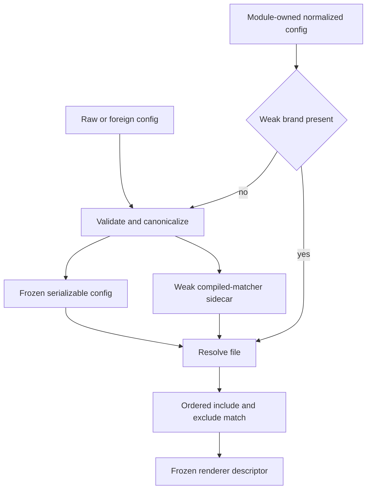

# Cache TSRX Renderer Matching - Plan

## Goal Capsule

- **Objective:** Octane compiler integrations classify many source modules faster while every file keeps the same renderer assignment and diagnostics.
- **Means:** Reuse validated renderer configuration and precompiled filename matchers through weak sidecar metadata (KTD1, KTD2).
- **Authority:** The user request and observable renderer-selection behavior outrank this plan; this plan outranks implementation convenience.
- **Execution profile:** Measure first, make the smallest compiler-owned change, and preserve raw-config validation and browser compatibility.
- **Stop conditions:** Do not ship this target if a same-environment baseline cannot show a repeatable improvement outside timing noise, if the parent implementation passes the new regression guard, or if renderer behavior changes. Remove abandoned code and return to TSRX performance target discovery instead.
- **Tail ownership:** The autonomous shipping pipeline owns review, commit, PR creation, and current-head CI.

---

## Product Contract

### Summary

Cache renderer-selection work that is invariant across files so compiler integrations stop rebuilding frozen config data and glob regular expressions for every TSRX module.

### Problem Frame

`OctaneBundlerCompiler` normalizes renderer configuration once when an integration is constructed, but `resolveRendererForFile` normalizes that already frozen configuration again for each file classification. The same call also expands braces and recompiles glob expressions while walking the ordered rules. Builds therefore repeat validation, sorting, freezing, signature serialization, allocation, and regular-expression construction even though the renderer configuration has not changed.

This path is separate from the recent compiler performance work on native-change analysis, conditional JSX return indexing, reachability propagation, component-hoist references, memo-witness propagation, nesting diagnostics, and generated-name allocation.

### Requirements

**Performance**

- R1. Renderer selection for a configuration normalized by this module must reuse its validation result and compiled rule matchers across file classifications.
- R2. A dedicated same-process benchmark must show the normalized reuse path is at least twice as fast as raw revalidation while both paths produce the same semantic checksum.
- R3. The benchmark guard must fail on the parent implementation and pass on the optimized implementation under the same quick-run policy.

**Compatibility**

- R4. Raw, mutable, cloned, or foreign normalized-looking configuration must continue through ordinary validation so edits and invalid values are never hidden by the cache.
- R5. Default selection, declaration-order precedence, exclusions, brace expansion, character classes, Windows separators, query suffixes, hash suffixes, renderer descriptors, and error timing must remain unchanged.
- R6. Normalized renderer configuration must remain frozen, deterministic, serializable data with the same public keys and signature version.
- R7. The dependency-free browser compiler subpath must remain free of Node-only imports and must compile successfully.

**Delivery**

- R8. The change must include an `octane` patch changeset, repository benchmark registration, targeted compiler tests, and current-head CI evidence.

### Success Criteria

- The dedicated quick benchmark reports identical semantic checksums for raw and normalized inputs and satisfies the R2 ratio on repeated same-process samples.
- Existing compiler-throughput and renderer-selection tests remain green with deep-equal renderer descriptors and unchanged diagnostics.
- The final diff contains no experiments from a rejected hypothesis and does not overlap the recent compiler performance PR surfaces listed in Sources & Research.

### Scope Boundaries

- Optimize only renderer configuration reuse and filename-rule matching in the TSRX compiler and its integrations.
- Do not cache mutable raw configuration by object identity.
- Do not change the renderer config schema, signature ABI, glob syntax, rule ordering, compiler output, runtime behavior, or bundler ownership policy.
- Do not fold adjacent `vite.js` metadata membership scans or other compiler audit findings into this change.

### Acceptance Examples

- AE1. Covers R1, R4, R5. Given one module-owned normalized config and many filenames, resolving each filename uses the same public rules and returns the same descriptors as resolving equivalent raw config.
- AE2. Covers R4, R5. Given a raw config that changes between calls, the next resolution observes the new rule or raises the new validation error instead of using stale metadata.
- AE3. Covers R4, R6. Given a JSON-cloned normalized config, resolution revalidates it and produces the same signature and renderer assignment without relying on non-serializable public fields.
- AE4. Covers R5. Given overlapping include and exclude patterns with brace expansion, the first non-excluded rule still wins for POSIX, Windows, query-suffixed, and hash-suffixed filenames.

---

## Planning Contract

### Key Technical Decisions

- KTD1. **Brand only module-owned normalized objects in a weak sidecar.** `resolveRendererForFile` may bypass normalization only for objects produced by the current module instance. Raw objects and normalized-looking objects from another module instance take the existing validation path, which protects R4 without exposing a public brand.
- KTD2. **Keep compiled glob matchers in weak sidecar metadata.** Normalization continues to publish string patterns, frozen registry data, and the existing signature. Private regular expressions live beside the normalized object and share its lifetime, which protects R5-R7.
- KTD3. **Compile matchers during eager pattern validation.** The normalization pass remains the point where malformed braces and character classes fail. It retains the compiled result instead of reconstructing it during every file match.
- KTD4. **Use a same-run public-API ratio guard.** The benchmark compares repeated resolution with one normalized config against equivalent raw revalidation, verifies a shared semantic checksum, and records baseline and candidate results before setting the final guard within the R2 ceiling.

### Assumptions

- Bundler, Volar, TypeScript, Rspack, and Rsbuild integrations retain one normalized renderer config for at least one classification generation, as current constructors and option normalization show.
- Weak sidecars match configuration lifetime and cannot retain configuration after its consumer releases it.
- Renderer selection is measurable in isolation with enough rules and filenames to exceed timer noise without turning the benchmark into a synthetic behavior unlike integration use.
- External research is not load-bearing because the repository owns the glob grammar, config ABI, compiler integrations, and benchmark conventions.

### High-Level Technical Design

The public configuration remains data-only. The weak brand selects the fast path, and the weak matcher sidecar supplies only derived private state. Missing sidecar metadata always falls back to validation rather than guessing that an object is safe.

### Sequencing

Establish a parent-commit baseline and semantic checksum before changing compiler code. Implement the weak metadata path only after the benchmark proves it can detect the redundant work. Finish with integration, browser-bundle, and repository-wide verification.

### System-Wide Impact

The hot path is shared by bundler transforms, client-reference classification, CSS-module proof discovery, Volar compilation, TypeScript projects, and Rspack/Rsbuild option normalization. The optimization changes compiler CPU and allocation only. It must not change emitted programs, renderer ownership, server/client selection, runtime state, or published configuration data.

### Risks & Dependencies

- **False branding:** Treating structurally similar external data as trusted could hide mutations or invalid values. The brand therefore uses module-owned weak identity only.
- **Missing matcher metadata:** A normalized object may cross a serialization or module-copy boundary. The resolver must revalidate when private metadata is absent.
- **Benchmark overfitting:** A benchmark with only non-matching rules could reward a path unlike real projects. The corpus must include early matches, late matches, exclusions, defaults, and varied filename suffixes, with one semantic checksum across both inputs.
- **Timing noise:** The harness must warm up both cases, interleave or balance sample order, and use enough classifications for the R2 ratio to remain stable in quick mode.
- **Browser compatibility:** `renderers.js` is imported by browser consumers. The implementation may use standard weak collections and regular expressions but no Node APIs.

### Sources & Research

- `packages/octane/src/compiler/renderers.js` owns normalization, glob parsing, filename normalization, and renderer resolution.
- `packages/octane/src/compiler/bundler.js` normalizes once in `OctaneBundlerCompiler` and resolves the retained config in several per-file paths.
- `packages/octane/src/compiler/volar.js` also normalizes before resolving, proving the redundant normalized-input path is not bundler-only.
- `packages/octane/tests/compiler/renderer-config.test.ts` defines config, glob, and descriptor behavior; `packages/octane/tests/compiler/browser-compiler-bundle.test.ts` protects the dependency-free browser entry.
- `benchmarks/bench.mjs`, `benchmarks/baselines/ratios.json`, and `benchmarks/tsrx-nesting-diagnostics/` provide the benchmark registration, same-process sampling, semantic-control, baseline, and ratio-guard patterns.
- Recent non-overlapping compiler performance PRs: [#883](https://github.com/octanejs/octane/pull/883), [#875](https://github.com/octanejs/octane/pull/875), [#872](https://github.com/octanejs/octane/pull/872), [#863](https://github.com/octanejs/octane/pull/863), [#859](https://github.com/octanejs/octane/pull/859), [#857](https://github.com/octanejs/octane/pull/857), and [#850](https://github.com/octanejs/octane/pull/850).

---

## Implementation Units

### U1. Prove normalized renderer-selection waste

- **Goal:** Add a deterministic benchmark that isolates repeated renderer selection and records a trustworthy parent baseline.
- **Requirements:** R2, R3, R5.
- **Dependencies:** None.
- **Files:** `benchmarks/tsrx-renderer-selection/run.mjs`, `benchmarks/tsrx-renderer-selection/README.md`, `benchmarks/bench.mjs`, `benchmarks/README.md`, `benchmarks/baselines/local/tsrx-renderer-selection.json`, `benchmarks/baselines/ratios.json`, `packages/octane-mcp-server/src/index.js`, `packages/octane-mcp-server/README.md`.
- **Approach:**
  1. Exercise `normalizeRendererConfig` and `resolveRendererForFile` through the public compiler subpath with a realistic ordered rule set containing early matches, late matches, exclusions, defaults, brace expansions, and filename suffix normalization.
  2. Measure repeated resolution of one normalized config against equivalent raw revalidation in the same process and compute one renderer-ID checksum for each target.
  3. Capture the parent-commit result before production edits. Add the ratio guard only after the old path is shown to fail and repeated candidate samples fit within R2.
  4. Register and document the suite through the same runner and MCP surfaces as the neighboring TSRX compiler benchmarks.
- **Execution note:** Record the baseline before editing `renderers.js`. If the normalized path is not repeatably faster outside noise, remove this benchmark attempt and return to TSRX target discovery.
- **Patterns to follow:** `benchmarks/tsrx-nesting-diagnostics/run.mjs`, `benchmarks/bench.mjs`, `benchmarks/baselines/ratios.json`, `packages/octane-mcp-server/src/index.js`.
- **Test scenarios:**
  - Resolve a balanced corpus with raw and normalized config; assert both targets produce the same deterministic renderer-ID checksum before timing is accepted.
  - Run quick samples repeatedly; assert the parent implementation fails the planned normalized-to-raw ratio and the candidate stays below the R2 ceiling.
  - Corrupt the corpus or expected classification count; assert the benchmark fails instead of reporting a performance result with a broken semantic control.
- **Verification:** The suite is listed by the benchmark runner and MCP registry, writes a committed local baseline, reports passing semantic metadata, and catches the parent implementation through its ratio guard.

### U2. Reuse validated config and compiled matchers

- **Goal:** Remove per-file normalization and glob compilation for module-owned normalized config without weakening validation or changing renderer results.
- **Requirements:** R1, R4-R7.
- **Dependencies:** U1.
- **Files:** `packages/octane/src/compiler/renderers.js`, `packages/octane/tests/compiler/renderer-config.test.ts`, `packages/octane/tests/compiler/browser-compiler-bundle.test.ts`.
- **Approach:**
  1. Attach a weak identity brand and weak compiled-rule metadata when normalization succeeds, while keeping the returned object frozen and data-only per KTD1-KTD3.
  2. Let the resolver use the sidecar only for module-owned normalized objects. Send every other input through the current validation and canonicalization path.
  3. Match precompiled regular expressions in existing declaration order and preserve the current include-then-exclude behavior and descriptor construction.
  4. Keep malformed-pattern errors eager and keep the browser entry dependency-free.
- **Execution note:** Implement against the established benchmark signal, then rerun the parent/candidate comparison before accepting cleanup or abstraction beyond the sidecar.
- **Patterns to follow:** Existing frozen normalization in `packages/octane/src/compiler/renderers.js`; cache lifetime and invalidation guidance in `.agents/memories/core-engineering.md`; observation-boundary rules in `.agents/memories/testing.md`.
- **Test scenarios:**
  - Covers AE1. Resolve early, late, excluded, and default matches from one normalized config and compare the full descriptors with raw-config resolution.
  - Covers AE2. Mutate a raw rule between resolutions and verify the next call observes it; replace it with a malformed pattern and verify eager validation still throws.
  - Covers AE3. JSON-clone a normalized config and verify resolution revalidates the clone, preserves its signature, and returns the same renderer without public cache fields.
  - Covers AE4. Resolve brace-expanded and character-class patterns for POSIX, Windows, query-suffixed, and hash-suffixed names; verify first-match precedence and exclusions remain unchanged.
  - Bundle the browser compiler entry and verify no Node builtin or non-browser dependency becomes reachable.
- **Verification:** Focused compiler tests pass, normalized config remains deeply frozen and serializable, raw mutation remains visible, invalid patterns fail at normalization, and renderer descriptors are unchanged.

### U3. Validate the compiler integration and release surface

- **Goal:** Demonstrate the optimization in representative compiler workflows and prepare the user-facing package change for release.
- **Requirements:** R2, R3, R7, R8.
- **Dependencies:** U1, U2.
- **Files:** `.changeset/cache-tsrx-renderer-matching.md`, generated files produced by `pnpm sync` if any.
- **Approach:**
  1. Add an `octane` patch changeset that describes faster renderer selection without promising unsupported end-to-end build percentages.
  2. Run the dedicated ratio suite, the existing compiler-throughput quick suite, focused renderer and bundler tests, browser-bundle coverage, scoped typecheck, formatting, and sync.
  3. Run the full repository test and typecheck gates before push, then rely on current-head CI for the complete supported matrix.
- **Patterns to follow:** Recent compiler performance changesets and the verification commands in the repository instructions.
- **Test scenarios:**
  - Classify the same renderer corpus through direct resolver and bundler-owned normalized config paths; verify the renderer sequence is identical.
  - Run the existing quick compiler-throughput suite and verify every target retains its semantic pass marker and executable non-empty output.
  - Run `pnpm sync` and verify generated inventories and benchmark registries are clean after regeneration.
- **Verification:** The changeset describes the measured scope, targeted and full local gates pass, generated changes are committed, and the PR reaches green current-head CI.

---

## Verification Contract

| Gate | Command | Required outcome |
| --- | --- | --- |
| Renderer performance | `node benchmarks/bench.mjs --quick --ratios tsrx-renderer-selection` | Semantic checksums match; the normalized-to-raw ratio satisfies R2 and the parent control fails R3. |
| Renderer behavior | `./node_modules/.bin/vitest run packages/octane/tests/compiler/renderer-config.test.ts packages/octane/tests/compiler/bundler-renderer-boundaries.test.ts packages/octane/tests/compiler/browser-compiler-bundle.test.ts --reporter=verbose` | Raw, normalized, cloned, glob, descriptor, bundler, and browser-entry scenarios pass. |
| General compiler signal | `node benchmarks/bench.mjs --quick compiler-throughput` | All compiler targets report semantic success and non-empty executable output. |
| Scoped static checks | `pnpm typecheck:files packages/octane/src/compiler/renderers.js packages/octane/tests/compiler/renderer-config.test.ts benchmarks/tsrx-renderer-selection` | Changed compiler, test, and benchmark sources typecheck. |
| Scoped formatting | `pnpm format:files:check packages/octane/src/compiler/renderers.js packages/octane/tests/compiler/renderer-config.test.ts benchmarks/tsrx-renderer-selection benchmarks/bench.mjs benchmarks/README.md packages/octane-mcp-server/src/index.js packages/octane-mcp-server/README.md .changeset` | All changed authored files match repository formatting. |
| Generated state | `pnpm sync` | Required generated artifacts are updated and the second run is clean. |
| Repository gates | `pnpm test` and `pnpm typecheck` | Full local suites pass before push, or any environment-only failure is isolated with concrete evidence and CI remains authoritative. |
| Diff hygiene | `git diff --check` | No whitespace errors or abandoned experiment remain. |

---

## Definition of Done

- U1 is complete when the benchmark proves semantic parity, records a parent baseline, and the parent fails a stable ratio guard that the optimized path passes.
- U2 is complete when module-owned normalized configs reuse weak sidecars, all untrusted inputs retain eager validation, and public renderer data and results stay unchanged.
- U3 is complete when the patch changeset, benchmark registration, generated state, local verification, PR, and current-head CI are complete.
- The final PR does not modify the recent performance areas named in Sources & Research.
- The measured claim is limited to renderer selection and is supported by reproducible baseline and candidate evidence.
- Any failed hypothesis code, benchmark variant, cache, helper, or test is removed before completion.
